# 时间序列数据介绍:

> 原文：<https://towardsdatascience.com/time-series-data-introduction-ad2114cfdfa3?source=collection_archive---------17----------------------->

## 数据属性、属性验证和常见数据准备步骤


纽约中央公园[法比奥·菲斯塔罗尔](https://unsplash.com/@fabiofistarol)在 [Unsplash](https://unsplash.com/)

从天气预报到股市预测或医疗诊断，解决许多世界上最大的挑战依赖于对时间序列数据建模的能力。时间序列可以被定义为随机变量的集合，这些随机变量按照它们在时间上获得的顺序进行索引。建模的目标是了解产生观测数据的基础结构，同时考虑其独特的时间依赖性和特征。

## 那么…我们如何开始？

最重要的一步是**用**常用文献术语**定义**研究数据属性。使用准确的术语在**文献检查**中非常有帮助，并允许你检索过去的类似作品和相关方法来应对你的挑战。识别数据特征对于**模型选择**非常重要，因为一些模型在用于某些数据类型时表现出更大的成功。此外，一些模型对需要**数据准备**的数据做出**假设**。

在接下来的章节中，我将使用 1800-2020 年间在纽约中央公园测得的天气数据来演示这些概念。**全码&数据**在这里[可用。让我们开始吧！](https://github.com/inbaroz/TimeSeriesIntroduction/blob/post_branch/ts_data_introduction.ipynb)

# 时间序列数据属性术语:

## 数据**是单变量/多变量**吗？

单变量时间序列由在时间增量上记录的单个观察序列组成。多元时间序列数据有多个时间相关序列。

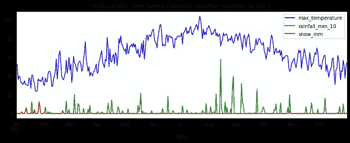

## 时间条目的采样频率是多少？

时间序列是否包含每年的值？月份？第二？

例如，温度是一个**连续** **信号**，因此温度测量可以每小时、每分钟、每秒钟或更长时间采样一次。如果数据是**多元**，它也可以具有**多频**结构，这意味着每个时间序列可以以不同的时间频率进行采样。多频数据在特征工程中需要特别注意，这将在下面解释。

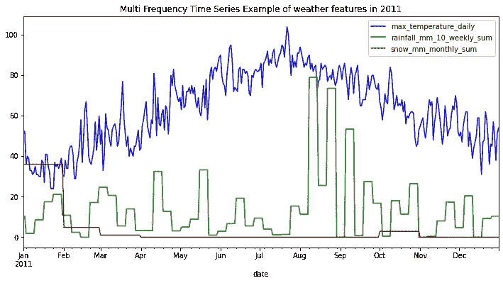

## 数据**是否静止**？

在平稳的时间序列中，序列汇总统计数据(如平均值)不会随时间发生显著变化。当执行统计时间序列建模时，我们通常会想要近似序列汇总统计数据，例如期望值、方差以及历史值与下一个值之间的相关性。通过处理平稳序列，我们可以利用汇总统计数据不会随时间而改变，并假设它们不会在预测序列值处改变。因此，需要近似的模型参数更少，使得静态数据更容易分析和预测。

为了[检查**平稳性**](/stationarity-in-time-series-analysis-90c94f27322) ，我们可以计算不同时间间隔的序列值的均值和方差等统计量，并确保随着时间的推移结果之间没有显著差异。

我们可以用一个**统计检验**来检验数据是否平稳，比如 **ADF 检验** (Augmented Dickey-Fuller 检验)。
零假设:数据不是平稳的。另一个假设:数据是稳定的。在检验最大温度系列时，收到的 p 值在 0.05 以上，所以我们不能拒绝零假设，这意味着我们不能假设数据是平稳的。

## 这些数据有季节性模式吗？

季节性是指以特定的固定时间间隔(如每周、每月或更长时间)发生的变化。

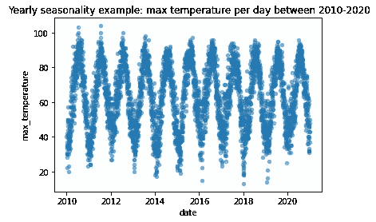

**如何检测数列的** [**季节性模式**](https://www.sciencedirect.com/science/article/pii/089571779390126J) **？**

我们可以检查自相关性，即一个序列与其自身滞后版本的线性相关性，作为它们之间时间滞后的函数。

可以计算一系列滞后的 **ACF** (自相关函数)值，具有极端自相关值的滞后定义了季节性模式。非线性自相关可以通过其他系列相关性测试来检验，如 Durbin-Watson 测试。在下面的 **ACF 图**中，我们可以看到，最高的相关性是通过滞后 1 实现的，这意味着时间 t 的观察结果主要由时间 t-1 的观察结果来解释。我们还可以看到每年的高相关性，表明每年的天气季节性，以及半年的负相关模式，表明季节的变化。

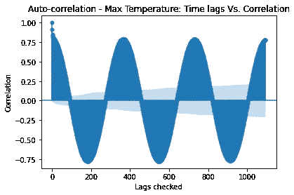

## 是否有**缺失值**？

在我们了解信号采样频率后，一些时间条目可能会丢失。例如，由于记录系统的临时故障，一系列每小时的温度测量可能不包括一些记录。

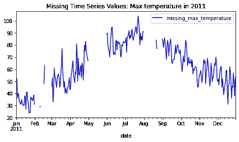

## 时间序列有辅助特征吗？

辅助特征是提供整个时间序列的附加信息的任何属性。例如，对于连续血液测试结果的时间序列，辅助特征可以是患者的性别、年龄和体重。在此气象数据中，我们可以看到一个辅助要素的示例—气象站的位置。

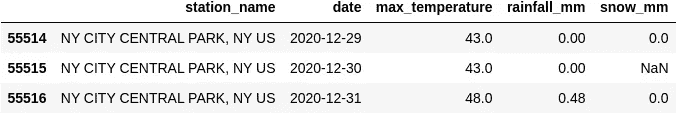

*等等，我想使用的模型假设了某些输入属性，而这些属性在我当前的数据中并不存在。我能怎么做呢？*

# 数据准备:

有些模型需要几个数据准备步骤，最常见的如下所述。

## 如何让数据静止？

为了使数据稳定，我们的主要目标是清除趋势和季节性(如果存在的话)。

**1。差分序列值:**差分是指对于一个时间序列 X，值差分生成一个新的序列 Z，其中 z( *k) = x(* t)-x(t-1)。可以进行多个差分步骤，第一个差分步骤去除线性趋势，第二个差分步骤去除二次趋势，等等。

```
data['max_temperature_roll_by_1'] = np.roll(data.max_temperature, 1)
data['diff_max_temperature'] = data.max_temperature - data.max_temperature_roll_by_1
```

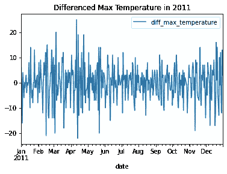

现在让我们再次运行 **ADF 平稳性测试**:现在接收到的 P 值小于 0.05，这表明差分序列是平稳的！

**2。差异时间条目:**我们可以将某个**特定时间场合**的时间条目进行差异，并接收一个与该事件成比例的新序列。

例如，如果我们在检测到网络攻击后对一系列警报进行建模，我们可能希望将警报时间与检测时间进行比较，因为这种转换将使我们能够对不同网络攻击事件的反应时间进行比较。

**3。移除趋势:**移除趋势可以通过**拟合线性回归**来建模趋势并继续建模残差来完成，残差现在没有趋势。正如我们所看到的，日最高温度系列有增加的趋势:

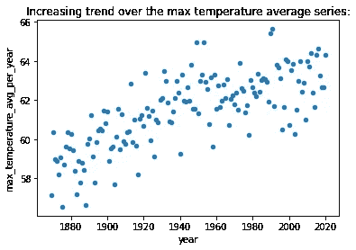

拟合 LR 模型后，在残差序列处**没有观察到**趋势:

```
reg = LinearRegression().fit(data[['jul_date']], data['max_temperature'])
data['reg_pred'] = reg.predict(data[['jul_date']])
data['LR_residuals'] = data.max_temperature - data.reg_pred
```

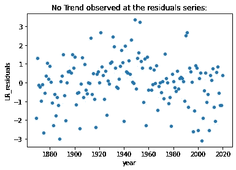

**4。去除季节性:**

**4.1。**一旦检测到季节性滞后，我们可以通过创建一个新的序列 Z 来使用它来区分时间序列值，其中:

z(*k)= x(*t)-x(t-季节性 _ 滞后)

```
data['max_temperature_roll_by_year'] = np.roll(data.max_temperature, 365)
data['max_temperature_removed_seasonality'] = data.max_temperature - data.max_temperature_roll_by_year
```

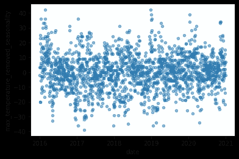

**4.2。**我们也可以使用检测到的季节性模式并计算平均模式值。例如，我们可以计算一年中每天的平均最高温度(范围:[1，365])，并创建一个新系列:

z(*t)= x(*t)-x avg _ of _ day ofyear

```
avg_by_dayofyear = data.groupby('dayofyear').max_temperature.mean().reset_index().rename(
    columns = {'max_temperature':'avg_max_temperature'})
data = data.merge(avg_by_dayofyear, on=['dayofyear'],how = 'left').set_index(data.index)
data['max_temperature_removed_avg'] = data.max_temperature - data.avg_max_temperature
```

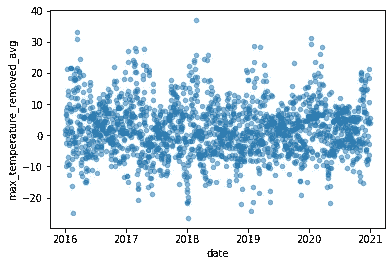

## 5.进行对数或指数变换:

这种变换有助于稳定时间序列的方差。

# 如何看待时间序列中的缺失值？

有些模型有一个内置的机制，但其他模型需要完整的时间序列输入。为了[处理](https://www.kaggle.com/juejuewang/handle-missing-values-in-time-series-for-beginners)时间序列缺失值，可以:

**1。估算**缺失条目:

*   通过**将曲线**(例如，通过使用线性回归)拟合到每个时间序列来插入缺失的数据，并通过计算曲线值来完成缺失的时间条目。
*   **样条插值:**可以用多条曲线来拟合系列的子集，而不是拟合一条高维曲线。
*   通过 **ML 模型**估算缺失值。在多元数据中，模型可能会使用其他要素来估算某个要素的缺失值。

2.**删除**缺少信息的样本或特征

3.**让模型来处理** —有些模型只需要声明缺失的条目索引，并以对模型优化的方式克服缺失的信息。

**请记住:**常用的利用汇总统计填充缺失值的插值技术，在时间序列数据中可能效果不好。

## 完成缺失值示例:

使用**线性插值**完成缺失值:

```
data['interpolate_max_temperature_linear'] = pd.DataFrame.interpolate(data.missing_max_temperature, method = 'linear')
```

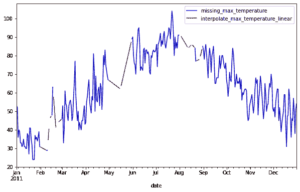

使用**下一个有效观察值**完成缺失值:

```
data['backfill_max_temperature'] = data.missing_max_temperature.fillna(value=None, method='backfill', axis=None, limit=None, downcast=None)
```

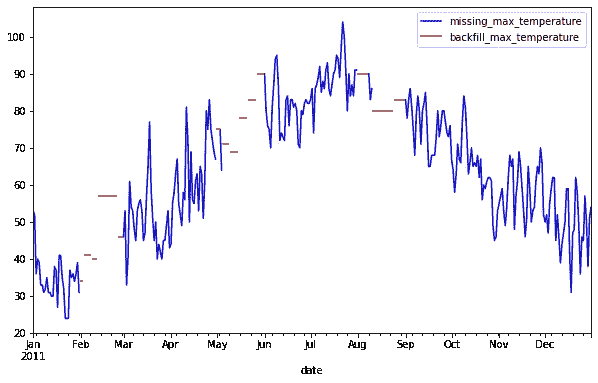

# 多频数据如何转换成单频数据？

当处理多元时间序列时，它可能包含比其他序列频率更高的序列。例如，低频序列可以描述一件毛衣每天的价格，高频序列可以描述每小时的温度。一些模型假设所有时间序列数据遵循相同的频率。为此，我们可以选择:

**低频工作**:对最高频率系列进行汇总，得到新的低频系列。例如，计算每天的平均温度。这种方法的主要缺点是，由于分辨率降低，我们丢失了信息。

**高频工作**:将低频系列扩展到高频。例如，通过将每日价格复制 24 次，将每日价格序列扩展为每小时价格序列。这种方法的主要缺点是，提高的分辨率可能是对高频实际观测的误导性描述。在前面的例子中，温度在一天中是变化的，在一段时间内没有恒定值。

# 太好了！我们的数据现在可以进行建模和评估了。

## 待后续帖子讨论，敬请期待！