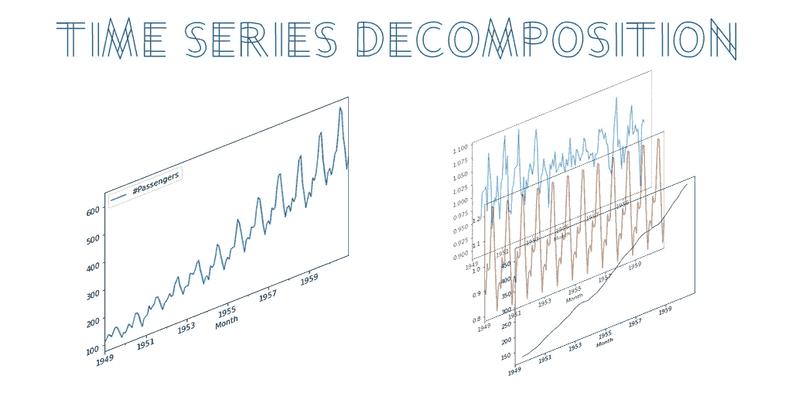
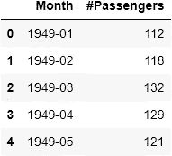
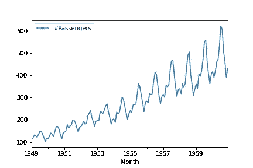
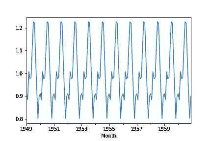
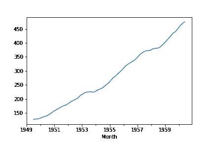
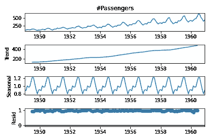

# Python 中的时间序列分解

> 原文：<https://towardsdatascience.com/time-series-decomposition-in-python-8acac385a5b2?source=collection_archive---------1----------------------->

## 时间序列分析变得简单



作者图片

时间序列分解是一种将时间序列分成几个部分的技术，每个部分代表一个潜在的模式类别，**趋势，季节性，**和**噪声**。在本教程中，我们将向您展示如何用 Python 自动分解时间序列。

首先，让我们谈一谈时间序列的组成部分:

**季节性**:描述你的时间序列中的周期性信号。
**趋势**:描述时间序列是递减、不变还是随时间递增。
**噪声**:描述了从时间序列中分离出季节性和趋势后的剩余部分。换句话说，模型无法解释数据的可变性。

对于这个例子，我们将使用来自 Kaggle 的[航空乘客数据。](https://www.kaggle.com/rakannimer/air-passengers?select=AirPassengers.csv)

```
import pandas as pd
import numpy as np
from statsmodels.tsa.seasonal import seasonal_decompose

#[https://www.kaggle.com/rakannimer/air-passengers](https://www.kaggle.com/rakannimer/air-passengers)
df=pd.read_csv(‘AirPassengers.csv’)

df.head()
```



作者图片

首先，我们需要将 Month 列设置为索引，并将其转换为 Datetime 对象。

```
df.set_index('Month',inplace=True)
df.index=pd.to_datetime(df.index)#drop null values
df.dropna(inplace=True)
df.plot()
```



作者图片

# 分解

我们将使用 python**stats models**函数[季节性分解](https://www.statsmodels.org/stable/generated/statsmodels.tsa.seasonal.seasonal_decompose.html)。

`result**=**seasonal_decompose(df['#Passengers'], model**=**'multiplicable', period=12)`

在季节性分解中，我们必须设置模型。我们可以将模型设置为**加法**或**乘法**。选择正确模型的经验法则是在我们的图中查看趋势和季节变化是否随时间相对恒定，换句话说，是否是线性的。如果是，那么我们将选择**添加剂**型号。否则，如果趋势和季节变化随时间增加或减少，那么我们使用**乘**模型。

我们这里的数据是按月汇总的。我们要分析的周期是按年计算的，所以我们将周期设置为 12。

我们可以得到每个组件如下:

`result.seasonal.plot()`



作者图片

`result.trend.plot()`



作者图片

此外，我们可以一次绘制每个组件

`result.plot()`



作者图片

# 包扎

通常，当查看时间序列数据时，很难手动提取趋势或识别季节性。幸运的是，我们可以自动分解时间序列，并帮助我们更清楚地了解各个组成部分，因为如果我们从数据中移除季节性，则更容易分析趋势，反之亦然。

想从我这里得到更多？:
[在媒体](https://medium.com/@billybonaros) 上关注我在
中链接的[上添加我通过使用](https://www.linkedin.com/in/billybonaros/) [**我的推荐链接**](https://billybonaros.medium.com/membership) 注册媒体来支持我。

*最初发表于*[*https://predictivehacks.com。*](https://predictivehacks.com/time-series-decomposition/)