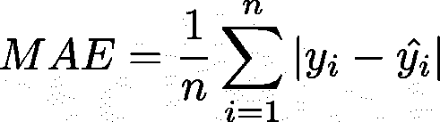
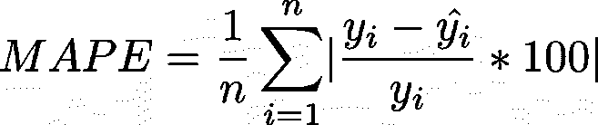

# 你应该知道的时间序列预测误差指标

> 原文：<https://towardsdatascience.com/time-series-forecast-error-metrics-you-should-know-cc88b8c67f27?source=collection_archive---------2----------------------->

## [实践教程](https://towardsdatascience.com/tagged/hands-on-tutorials)

## 最常见误差指标的概述和介绍。

由 [Ksenia Chernaya](https://www.pexels.com/de-de/@kseniachernaya?utm_content=attributionCopyText&utm_medium=referral&utm_source=pexels) 在 [Pexels](https://www.pexels.com/de-de/foto/metall-linse-innen-weiss-5752309/?utm_content=attributionCopyText&utm_medium=referral&utm_source=pexels) 拍摄的照片。

在您的数据科学项目中使用正确的误差指标至关重要。一个**错误的误差度量****不仅会**影响**你的**模型的优化**(损失函数)，还可能**扭曲你对模型的判断**。**

**除了像平均绝对误差这样的经典误差度量之外，越来越多的新的误差度量被定期开发和发布。**

**这篇文章的目的不仅是为你提供一个最常用的方法的概述，也是向你展示它们是如何计算的以及它们的优缺点。**

**在我们开始之前，请记住**没有灵丹妙药**，**没有单一的最佳误差指标**。**的基本挑战**是，每个统计测量**都将大量数据浓缩为单个值**，因此它只提供一个模型误差投影，强调模型性能误差特征的某个方面(Chai 和 Draxler，2014)。**

**因此，最好有一个**更实际和实用的视图**，并使用适合您的用例或项目的**度量标准选择**。**

**为了确定最常用或最常见的误差指标，我筛选了超过 12 个时间序列预测框架或库(即 kats、sktime、darts ),并检查了它们提供的误差指标。在这 12 个指标中，我确定了前 8 个**最常见的预测误差指标**，并将它们分为 Hyndman 和 Koehler (2006)提出的**四个类别**(见图 1)。**

****

****图 1** 。时间序列预测误差指标概述(图片由作者提供)。**

# **规模相关指标**

**许多流行的指标被称为**尺度依赖** (Hyndman，2006)。比例相关意味着误差指标以单位表示**(即美元、英寸等)。)的底层数据。****

**与规模相关的指标的主要优势在于，它们通常容易计算(T2 )( T3)和解释(T4 )( T5)。然而，它们**不能用于比较** **不同系列**，因为它们**的规模依赖** (Hyndman，2006)。**

**请注意，Hyndman (2006)将均方误差纳入了一个尺度相关组(声称误差“与数据处于同一尺度”)。然而，均方误差具有平方标度/单位的维度。为了将 MSE 转化为数据的单位，我们需要计算平方根，这导致了另一个度量，RMSE。(谢尔巴科夫等人，2013 年)**

## ****平均绝对误差(MAE)****

****

**平均绝对误差(MAE)通过取实际值(也称为 y)和预测值(y_hat)之间的绝对差的平均值来计算。**

**很简单，不是吗？这是它的主要优势。**很容易理解**(即使是商业用户)和**计算**。建议**评估单个系列的准确性** (Hyndman，2006)。然而如果你想比较不同的系列(不同的单位)，这是不合适的。此外，如果你想让**惩罚离群值**，就不要使用**。****

## ******均方误差******

********

****如果你想把更多的注意力放在异常值上，你可以考虑均方差。顾名思义，它采用误差平方的平均值(y 和 y_hat 之间的差值)。由于其平方，它**比小错误**更重视大错误，这在某些情况下可能是**的缺点**。因此，MSE 适用于您**确实想关注大错误**的情况。还要记住，由于其平方，度量**失去了单位**。****

## ******均方根误差(RMSE)******

********

****为了**避免** MSE 的**损失它的单位**我们可以取它的平方根。结果是一个新的误差指标，称为均方根误差(RMSE)。****

****它和它的兄弟姐妹 MAE 和 MSE 有着同样的优势。然而，和 MSE 一样，它也对异常值敏感**。******

****一些作者，如 Willmott 和 Matsuura (2005)认为，RMSE 是一个不适当的和被误解的平均误差的衡量标准，并推荐 MAE 而不是 RMSE。****

****然而，Chai 和 Drexler (2014)部分反驳了他们的论点，并**推荐 RMSE 优于 MAE 用于您的模型优化**以及**评估不同的模型** **，其中误差分布预计为高斯分布**。****

# ****百分比误差度量****

****从上一章我们知道，**尺度相关指标** **不适合**用于**比较** **不同时间序列**。****

****百分比误差度量解决了这个问题。它们与**尺度无关**，用于**比较不同时间序列**之间的预测性能。然而，它们的**弱点是时间序列**中的零值。然后它们变得**无限或未定义**，这使得它们**不可解释** (Hyndman 2006)。****

## ******平均绝对百分比误差(MAPE)******

********

****平均绝对百分比误差(MAPE)是时间序列预测中最常用的误差度量之一。计算方法是将实际值和预测值之间的绝对差值的平均值除以实际值。****

> ****请注意，一些 MAPE 公式不会将结果乘以 100。然而，MAPE 是以百分比单位表示的，所以我加上了乘法。****

****MAPE 的**优势**是它的**规模独立性**和**易解释性**。如开头所说，百分比误差度量可以用来比较不同尺度的多个时间序列模型的结果。****

****然而，MAPE 也有一些缺点。首先，**对零或接近零的实际值生成无限或未定义的值** (Kim 和 Kim 2016)。****

****其次，它还对负的 **施加了比正的**更重的**惩罚，这导致了**不对称** (Hyndman 2014)。******

**最后但同样重要的是，当使用百分比没有意义时，MAPE **不能使用** **。例如，测量温度时就是这种情况。单位华氏或摄氏标度有相对任意的零点，谈论百分比是没有意义的(Hyndman 和 Koehler，2006)。****

## **对称平均绝对百分比误差**

**为了避免 MAPE 的不对称性，提出了一种新的误差度量。对称平均绝对百分比误差(sMAPE)。sMAPE 可能是**最有争议的**误差度量之一，因为不仅存在不同的定义或公式，而且批评家声称这个度量**如其名称所示是不对称的**(Goodwin 和 Lawton，1999)。**

**阿姆斯特朗(1985 年)提出了“T6”调整 MAPE 的最初想法。**然而**根据他的定义，**误差度量可以是负的或无穷大的**，因为分母**中的值不是绝对的**(这在遵循他的定义的一些文章中被正确地称为缺点)。**

****

**Makridakis (1993)提出了一个类似的度量，并将其称为 SMAPE。他的公式如下图所示**，通过将分母中的值设为绝对值，避免了阿姆斯特朗公式**存在的问题(Hyndman，2014)。**

****

> **注:Makridakis (1993 年)在他的论文“准确性测量:理论和实践问题”中提出了上述公式。后来在他的出版物(Makridakis 和 Hibbon，2000 年)“M3 竞赛:结果、结论和影响”中，他使用了 Armstrong 公式(Hyndman，2014 年)。这个事实可能也导致了 SMAPE 不同定义的混乱。**

**sAMPE 是给定时间范围内所有预测的平均值。它的**优点**在于**避免了当 y 值接近零时的大误差**的 MAPE 问题，以及当 y 大于 y-hat 时绝对百分比误差之间的大差异，反之亦然。与没有限制的 MAPE 不同，**它在 0%和 200%之间波动** (Makridakis 和 Hibon，2000)。**

**为了便于解释，SMAPE 也有一个略微**的修改版本，即**确保**指标的结果**始终在 0%和 100%之间**:****

****

**下面的代码片段包含 Makridakis (1993)提出的 sMAPE 度量及其修改版本。**

**如开头所述，围绕 sMAPE 有**的争议。而**他们是真的**。Goodwin 和 Lawton (1999)指出，sMAPE **对低估**的处罚多于高估**(Chen et al .，2017)。Cánovas (2009)用一个简单的例子**证明了这个事实。****

****

****表 1** 。对称形状的例子。**

****

****表 2** 。不对称形状的例子。**

**从**表 1** 开始，我们有两种情况。在**案例 1** 中，我们的实际值 **y** 是 **100** 而预测值**y _ hat**150。这导致 sMAPE 值为 20 %。**案例二**则相反。这里我们有一个 **150** 的实际值 **y** 和一个 **100** 的预测值 **y_hat** 。这也导致了 20 %的 sMAPE。到目前为止，似乎对称是给定的…**

**现在让我们看看**表 2** 。这里还有两种情况，正如您已经看到的，sMAPE 值**不再相同**。第二种情况**导致不同的 SMAPE 值**为 33 %。**

****在保持固定实际值**和**绝对偏差的同时修改预测**和**不会产生相同的 sMAPE 值**。**简单地对模型进行偏置而不提高其准确性，永远不会产生不同的误差值** (Cánovas，2009)。**

# **相对误差度量**

**与之前解释的误差度量相比，**相对误差度量将您的模型的性能**(因此是误差)**与基线或基准模型的性能**进行比较。**

**最常见的基准模型是*朴素*、*朴素*和所有观测值的*均值*。**

**在一个*天真的*或*随机漫步模型*中，预测****就是** **正好等于先前的观察**。****

****如果你有**季节数据**，那么**选择*季节* *方法*** 就很有用。 *snaive* *方法*将每个预测设置为**等于一年**同一季节的最后观察值(例如，前一年的同一个月)。其定义如下:****

********

****其中 *m* 为季节周期， *k* 为 *(h-1)/m* 的整数部分(即 T+h 时刻之前的预测周期完整年数)。**对于月度数据**，这意味着**对所有未来 10 月值的预测**等于 **上一次观察到的 10 月值** (Hyndman 和 Athanasopoulos，2018)****

****由于其**尺度独立性**，这些指标**在 Armstrong 和 Collopy (1992)以及 Fildes (1992)的研究中被推荐**用于评估多个系列的预测准确性。**然而**，当**计算误差**很小时，使用*朴素方法*作为基准**不再可能**，因为它会导致**被零除** (Hyndman，2006)。****

## ******中位数相对绝对误差(MdRAE)******

********

****其中，𝑏𝑖是基准预测结果，𝑀是我们时间序列中的季节周期。****

****正如本节介绍中提到的，**相对误差度量** **将**我们的**模型的性能**(预测)与**基准方法**(即*随机行走*)进行比较。中位数相对绝对误差(MdRAE)计算我们的预测的绝对误差与基准模型的绝对误差之间的差值的中位数。****

****如果我们模型的预测值**等于基准的预测值，那么结果就是 1** 。如果基准预测**比我们的**好，那么结果将是**高于> 1** 。如果**我们的比 1** 下面的**好**。****

****由于我们正在计算中值，MdRAE 对于离群值比其他误差指标**更加稳健。然而，MdRAE 对**除以零**有问题。为了避免这个困难，Armstrong 和 Collopy (1992)建议对**极值进行修整**；**然而**，这增加了**的复杂性**和**计算的任意性**，因为切边量**必须指定**。(金和金，2016)。******

**与之前的误差指标相比，相对误差指标在计算和解释时更加**复杂** **。让我们举个例子来加强理解。****

****

****表 3** 。MdRAE 计算示例(图片由作者提供)。**

****表 3** 显示了我们的实际值 y、我们的模型 y_hat 的预测以及来自 *naive* 基准模型 y_bnchmrk 的预测，该模型使用我们的训练数据集(参见上面的代码)的最后一点作为预测。当然，也有其他选项来计算基准的预测(例如，包括季节性、漂移或仅取训练数据的平均值)。**

**MdRAE 然后取我们的预测的绝对误差(y-y_hat)除以我们的基准模型的绝对误差(y-y_bnchmrk)之差的中间值。**

**结果是 0.15，明显比 1 小**，所以**我们的预测比基准模型**的预测要好。****

## ****几何平均相对绝对误差****

****

**其中，𝑏𝑖是基准预测结果，𝑀是我们的时间序列中的季节周期。**

**像 MdRAE 一样，几何平均相对绝对误差(GMRAE) **将我们预测** **的**误差与**定义的基线模型**的误差进行比较。然而，**GMRAE 顾名思义，不是计算中位数**，而是计算我们相对误差的**几何均值**。**

**高于 **1 的 GMRAE 表示基准更好**，低于 1 的**结果表示**我们的模型预测表现更好**。****

**取对数标度误差比的算术平均值(见替代表示)使 GMRAE **更能抵抗异常值**。**然而**，GMRAE**仍然对异常值**敏感。它既可以由一个**单个大异常值**支配，也可以由一个**接近于零的极小误差**支配。这是因为 GMRAE (Chen and Twycross，2017)计算的对数标度误差比既没有上界也没有下界。如果基准方法的**误差为**零**，则返回**大值**。****

# **无标度误差度量**

**相关措施试图通过**比较**预测和**从一些基准** ( *幼稚*)方法中获得的数据来**去除数据的标度**。**然而**、**他们有问题**。**相对误差**具有**未定义均值和无限方差**的统计分布。只有在**相同系列**上有**多个预测**时才能计算它们，因此**不能用于测量单个预测范围**的样本外预测精度(Hyndman and Koehler，2006)。**

**为了解决这个问题，Hyndman 和 Koehler (2006)提出了一种新的度量标准——T2 无标度误差度量标准。他们的想法是**根据简单的** ( *随机漫步*)预测方法的样本内平均误差来缩小误差。**

## ****平均绝对标度误差(MASE)****

****

**MASE 的计算方法是取 MAE 并除以样本内的 MAE(基于我们的训练数据) *naive* 基准测试。**

**平均而言，MASE 值大于 1 表明预测比来自简单模型的样本内一步预测更差(Hyndman 和 Koehler，2006)。**

**由于它是一个**无标度的度量**，人们能够**比较不同时间序列**之间的 **模型的精确度。与相对误差度量不同，它**不会给出未定义或无穷大的值**，这使得它成为适用于带有零的时间序列数据**的**度量。在**唯一的情况**下，微波激射将是无限的或未定义的是**当所有历史观测值相等时**或**在**采样周期内所有实际值**为零** (Kim 和 Kim，2016)。****

**然而**也有一些**批判的声音**。达维登科和菲尔德斯(2013)认为，由于**算术平均**，MASE **引入了高估基准预测性能**的偏差，并且由于**除以小基准 MAE** 值，MASE**易受异常值**的影响。此外，由于分母中的 MAE 使用了**样本内数据**这一事实，向业务用户解释这一指标可能会更加复杂**因为它是其他(更简单)的指标。**

# C̶o̶n̶f̶u̶s̶i̶o̶n̶结论

如您所见，没有**银弹**，**没有单一最佳误差指标**。每个类别或指标都有其**优势**和**劣势**。所以它**总是取决于你个人的用例**或**用途**和**你的底层数据**。重要的是**在评估模型性能时，不要只看一个单一的误差指标**。文献提出了以下建议。

如果所有系列**都在相同的尺度**上，则执行**数据预处理程序**(数据清理、异常检测)并且任务是**评估预测性能**，那么 **MAE 可能是首选**，因为它更易于解释(Hyndman 和 Koehler，2006；Shcherbakov 等人，2013 年)

Chai 和 Draxler (2014)建议**当误差分布**预期为高斯分布**时，更倾向于使用 RMSE 而不是 MAE** 。

如果数据**包含异常值**，建议应用类似 **MASE** 的标度测量。在这种情况下，**层位应该足够大**，**不应该有相同的值**，归一化因子**不应该等于零** (Shcherbakov 等人，2013)。

引入的误差指标可能是常见的**，但这并不意味着它们最适合您的用例**。正如我提到的**一样，新的误差指标**如平均相对平均误差(AvgRelMAE)或无标度平均有界相对绝对误差(UMBRAE)正在被频繁开发和发布。**因此，看一看这些指标**、**它们试图改进什么**(例如变得更加健壮或对称)以及**它们如何适合您的项目**绝对是值得的。

# 文献学

阿姆斯特朗、j .斯科特和弗雷德.科洛比。1992."预测方法一般化的误差度量:经验比较."*国际预测杂志*第 8 卷第 1 期。doi:[10.1016/0169–2070(92)90008-W](https://doi.org/10.1016/0169-2070(92)90008-W)。

t .柴和 R. R .德拉克斯勒。2014.“均方根误差(RMSE)还是平均绝对误差(MAE)？——反对在文学中回避 RMSE 的论点。”*地学模型开发* 7(3)。doi:[10.5194/gmd-7–1247–2014](https://doi.org/10.5194/gmd-7-1247-2014)。

陈、Chao、Jamie Twycross 和 Jonathan M. Garibaldi。2017."一种新的基于有界相对误差的时间序列预测精度度量方法." *PLOS 一* 12(3)。doi:[10.1371/journal . pone . 0174202](https://doi.org/10.1371/journal.pone.0174202)。

古德温、保罗和理查德·劳顿。1999."关于对称 MAPE 的不对称性."《国际预测杂志》15(4):405–8。doi:[https://doi . org/10.1016/s 0169-2070(99)00007-2](https://doi.org/10.1016/S0169-2070(99)00007-2)。

海曼，罗伯。2006."从另一个角度看间歇性需求的预测准确性指标."*远见:国际应用预测杂志*4:43–46。

海德曼，罗布 j .和安妮 b .克勒。2006."从另一个角度看预测准确性的衡量标准."*国际预测杂志* 22 卷 4 期。doi:[10.1016/j . ijforecast . 2006 . 03 . 001](https://doi.org/10.1016/j.ijforecast.2006.03.001)。

海曼、罗宾·约翰和乔治·阿萨纳索普洛斯。2018.预测:原理与实践。第二版。OTexts。

金成日和金熙英。2016."间歇需求预测的绝对百分比误差的新度量."国际预测杂志 32(3):669–79。https://doi.org/10.1016/j.ijforecast.2015.12.003。

马克里达基斯、斯皮罗斯和米歇尔·希邦。2000." M3 竞赛:结果、结论和意义."国际预测杂志 16(4):451–76。doi:[https://doi . org/10.1016/s 0169-2070(00)00057-1](https://doi.org/10.1016/S0169-2070(00)00057-1)。

谢尔巴科夫、马克西姆·v、阿德里安·布雷贝尔斯、安东·秋科夫、铁木尔·雅诺夫斯基和瓦列里·阿纳托尔。2013."预测误差测量综述."

威尔莫特，C. J .和 k .松浦。2005.“在评估平均模型性能时，平均绝对误差(MAE)优于均方根误差(RMSE)。”气候研究。doi: [10.3354/cr030079](https://doi.org/10.3354/cr030079) 。