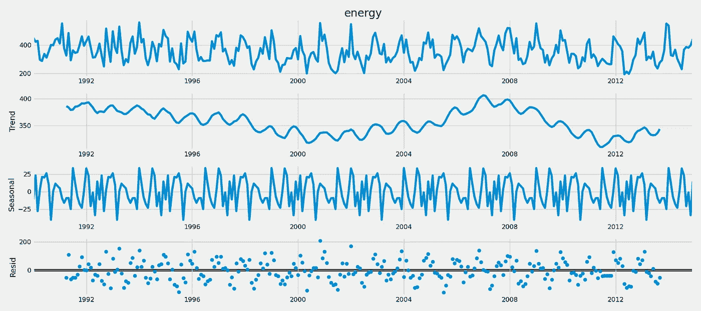
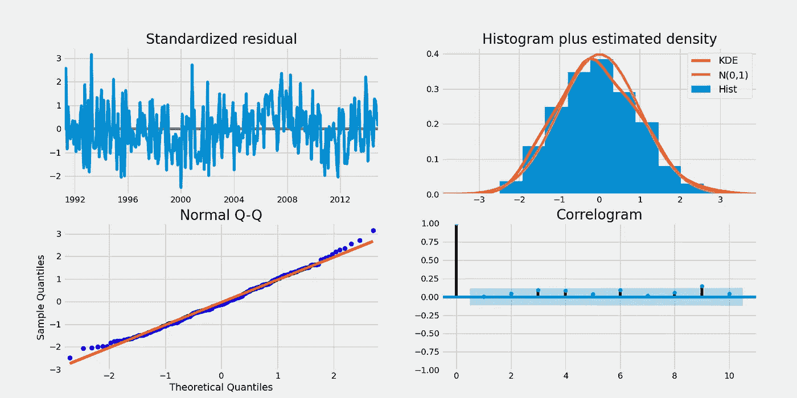
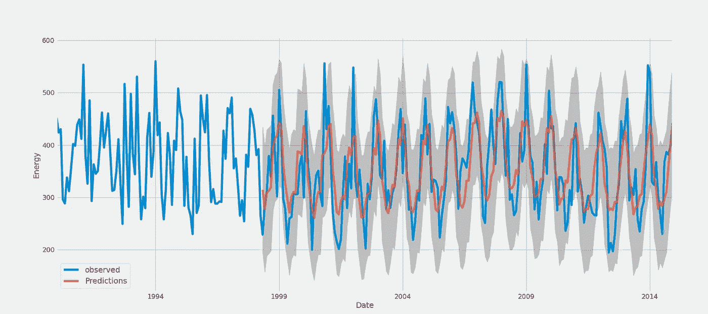
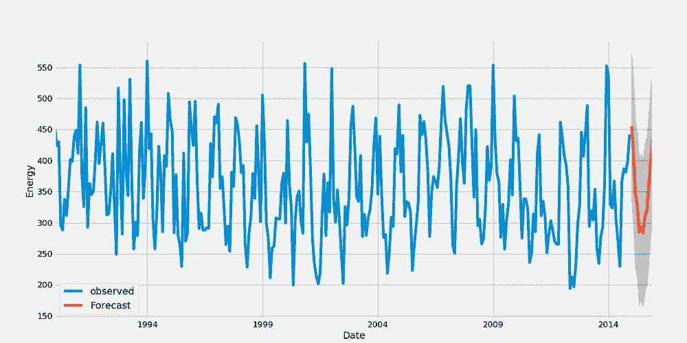
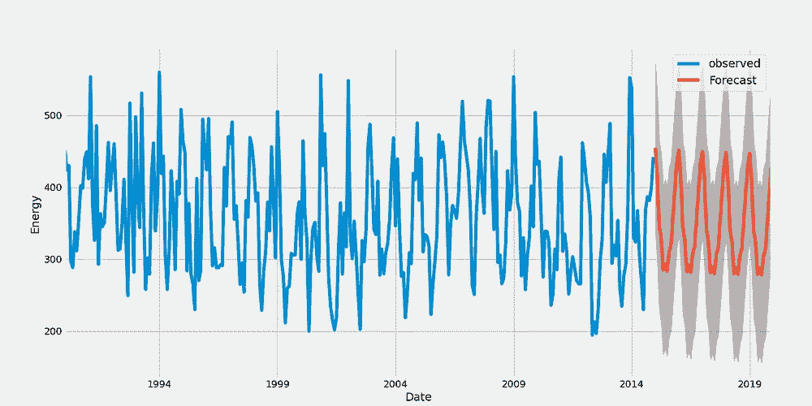
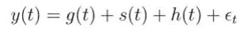
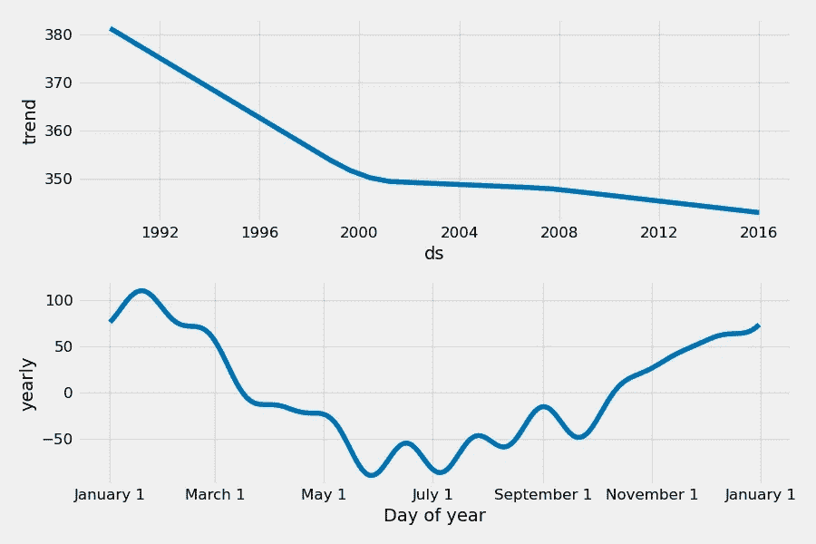
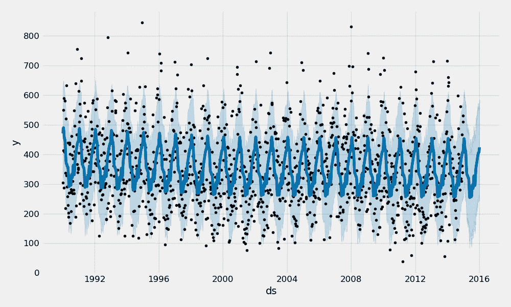
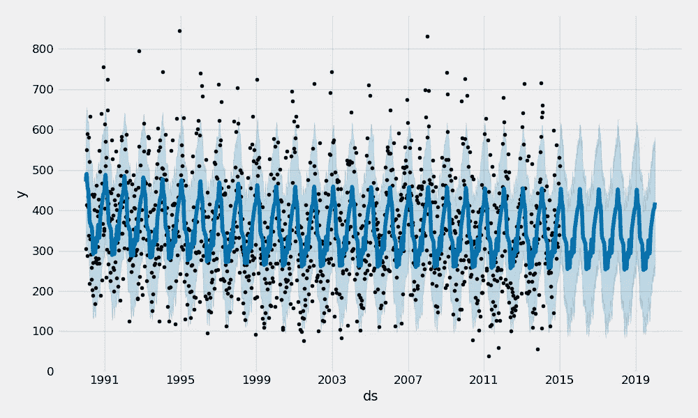

# Python 中使用 SARIMAX 和 PROPHET 进行时间序列预测

> 原文：<https://towardsdatascience.com/time-series-forecast-in-python-using-sarimax-and-prophet-c970e6056b5b?source=collection_archive---------4----------------------->

## 如何在 Python 中执行时间序列预测的分步指南

你有大量的时间序列数据，你想知道是否可以用这些数据来预测未来？

如果你的答案是肯定的，那么你来对地方了…

感谢来自 unsplash.com 的[约书亚·索蒂诺](https://medium.com/u/48f6f8f78911?source=post_page-----c970e6056b5b--------------------------------)

在这个故事中，我将向您介绍两种易于实现的方法来预测时间序列数据集中的未来时间点。对于这两种技术，出于演示目的，我们将在麻省理工学院许可下使用相同的[能源数据集](https://github.com/quaesito/time-series-forecast-sarimax-prophet/blob/master/A4.xlsx)

# 探索性数据分析

在开始任何数据科学或人工智能相关的任务之前，执行探索性数据分析(EDA)是一个好的做法。在整个 EDA 过程中，你将获得有价值的见解，这些见解可能会极大地影响你即将到来的建模策略。如果你不熟悉 EDA，我推荐你看一看我的另一个故事，我在其中执行了一个示例 EDA。

 [## 使用 SQL 和 Seaborn (SNS)在 Python 中进行探索性数据分析(EDA)

### 探索性数据分析(EDA)是一种分析数据集以总结其主要特征的方法，通常…

towardsdatascience.com](/exploratory-data-analysis-eda-in-python-using-sql-and-seaborn-sns-d1f3bfcc78af) 

然而，在处理时间序列数据时，需要执行额外的步骤。更具体地说，数据需要“分解”成趋势、季节和残差。为此，我们可以使用 *statsmodel* 库在 1 行代码内执行任务！

数据分解(图片由作者提供)

您可以将数据分解视为预处理步骤，这可以让您了解数据是由什么组成的。分解的主要目的之一是估计季节效应，这种效应可用于创建和表示季节调整值。

这是至关重要的，因为在验证了时间序列数据显著依赖于季节性之后，我确认了我拟合 SARIMAX 模型的选择。如果这不是真的，SARIMAX 将不会是最好的方法，ARIMA 可能是一个更好的选择。

现在，让我告诉你为什么…

# 1) SARIMAX

## 什么是 SARIMAX？

在时间序列预测的最“老练”的技术中，有一种是 ARIMA，它是一个平均值的缩写。尽管 ARIMA 已经展示了公平工作的证据，但它的主要缺陷是无法应对季节性。

> SARIMAX 代表“S**S**季节 **A** uto **R** 过度 **I** 积分 **M** 移动 **A** 平均值与 e **X** ogenus 因子”

因此，SARIMAX 代表了成熟的 ARIMA 模型的“升级”。简而言之，这种升级是为了增加季节性和外部因素。

在这里，模型背后的理论没有被恰当地描述。鼓励读者自行阅读和理解更多关于 [ARIMA](https://otexts.com/fpp2/arima.html) 和[萨里马克斯](https://link.springer.com/chapter/10.1007/978-1-4842-7150-6_8)背后的数学知识，因为这将极大地促进对以下所述程序的理解。

为了拟合 SARIMAX，我们需要定义参数 p、d 和 q 的值，其中:

*   **p** 是自回归项的个数
*   d 是平稳性所需的非季节性差异的数量
*   **q** 是预测方程中滞后预测误差的数量

以上三个参数没有考虑季节性。进行单独的估算以评估季节性 p、d、q。

拟合 SARIMAX 需要反复搜索非季节性 p、d、q 和季节性 p、d、q 的“最佳组合”。在我们的案例中，我们依次采取以下三个步骤:

*   定义 p、d 和 q 参数，取 0 到 2 之间的任何值
*   生成 p、q 和 q 三元组的所有不同组合
*   定义 p、d、q 函数中的季节性 p、d、q 参数，最大值为 12。
*   生成季节性 p、q 和 q 三胞胎的所有不同组合

然后，一旦生成了 p、d、q 和季节性 p、d、q 的所有可能值，我们需要找到非季节性和季节性参数的“最佳组合”

最后，我们可以根据获得的输出调整模型，并绘制一些诊断图

SARIMAX 模型诊断(图片由作者提供)

在验证中，我们将观察到的行为与预测进行了比较，正如您所看到的，该模型似乎已经达到了合理的性能。

SARIMAX 模型验证(图片由作者提供)

使用相同的逻辑，我们可以创建 1 年和 5 年的时间序列预测…

1 年和 5 年的时间序列预测(图片由作者提供)

# 2)先知

如果从这个技术的名字来看，你可能认为*预言家*会神奇地向你揭示你的时间序列的未来，那么我坦率地告诉你，不幸的是，情况不会是这样的！英雄联盟

来自 unsplash.com 的@grstocks 积分

> 这里没有魔法，只有数学！

PROPHET 是脸书发布的开源库，它基于可分解的(*趋势+季节性+假日*)模型。

 [## GitHub——Facebook/prophet:为时间序列数据生成高质量预测的工具，具有…

### 工具，用于对具有线性或非线性多重季节性的时间序列数据进行高质量预测…

github.com](https://github.com/facebook/prophet) 

它使用户能够使用简单直观的参数创建具有良好准确性的时间序列预测，并支持包括自定义季节性和节假日的影响。

因此，简而言之，PROPHET 使用了一个可分解的时间序列模型，该模型有三个主要部分:趋势、季节性和假期。

这些分量在下面的等式中合并:

使用:

*   **g(t)** :分段线性或逻辑增长曲线，用于模拟时间序列中的非周期性变化
*   **s(t)** :周期性变化(如每周/每年的季节性)
*   **h(t)** :节假日(用户提供)不定时的影响
*   **ε_t** :误差项说明模型不能适应的任何异常变化

使用时间作为回归变量，PROPHET 模型试图将时间的线性和非线性函数作为上述方程的组成部分进行拟合。事实上，预测问题是作为曲线拟合练习来解决的，而不是明确地看时间序列中每个观测值的时间相关性。

同样，在这个故事中，我们不会进一步挖掘模型背后的数学本质，但是我鼓励你去阅读和研究模型是如何工作的。您的背景研究将有助于理解以下步骤，并提高您的模型性能。

现在我们已经在模型上构建了一些基础，是时候动手了…

如前所述，使用 PROPHET 创建预测非常简单和直观，以下是如何在 10 行代码内拟合模型、创建预测和绘制模型组件！

1 年的数据分解和时间序列预测(图片由作者提供)

该脚本可以轻松更新，以适应更长的预测，比如说 5 年…

5 年时间序列预测(图片由作者提供)

## 讨论

总的来说，使用这两种方法获得了几乎相同的匹配。这是非常可取的，因为它证实了所获得的结果是非常合理的。然而，需要注意的是，这两种技术都将季节性作为进行预测的主要因素。季节性较弱的时间序列会有较大的方差。或者，不考虑季节性的其他方法可能更可取。

你有什么看法？

如果你喜欢我的故事，并想跳到代码和完整的数据集，我已经在我个人的 [git](https://github.com/quaesito) 上的[回购](https://github.com/quaesito/time-series-forecast-sarimax-prophet)中发布了它。

给回购打个星，上 [linkedin](https://www.linkedin.com/in/micheledefilippo/) 和 [twitter](https://twitter.com/quaesito) 和我联系！
干杯:)