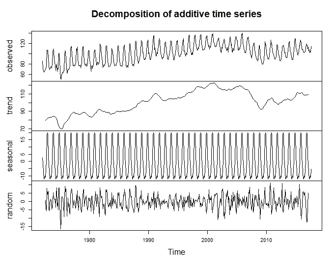
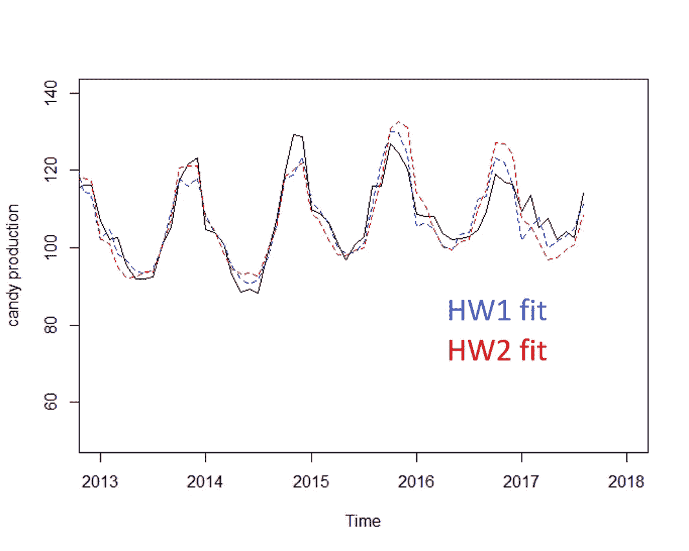
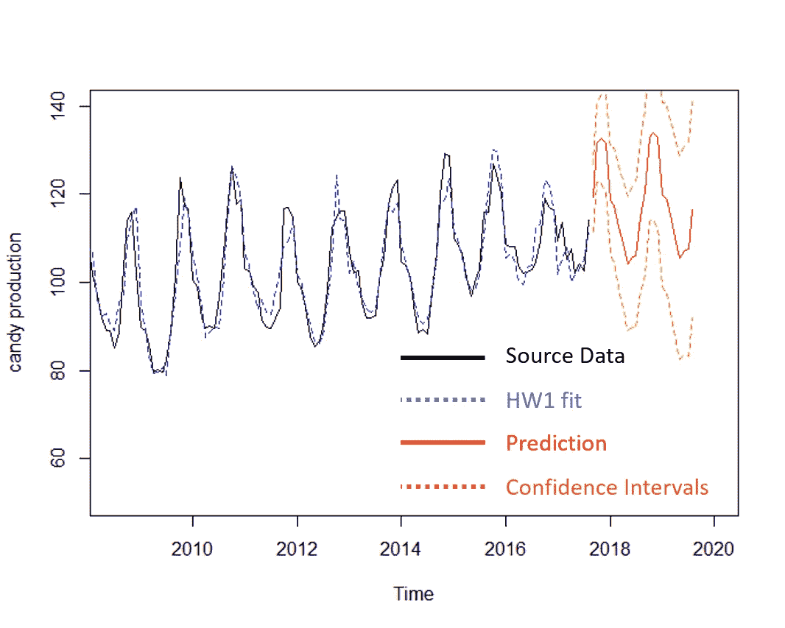
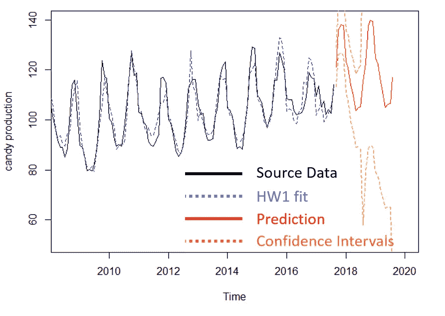
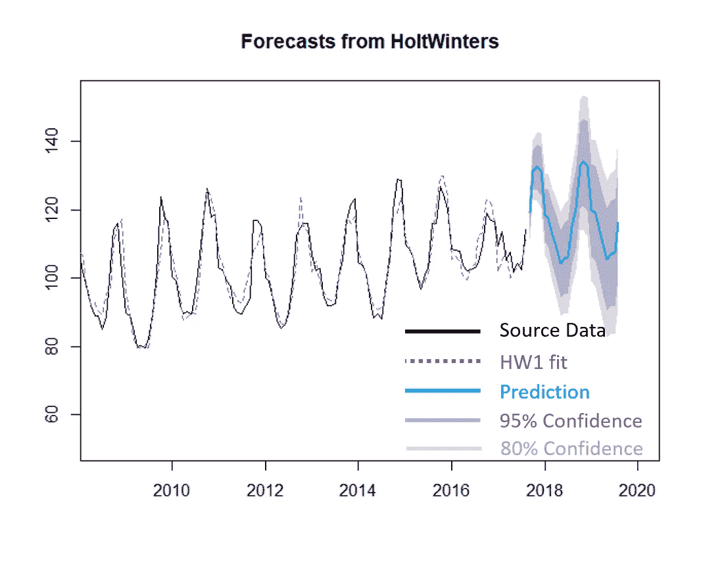
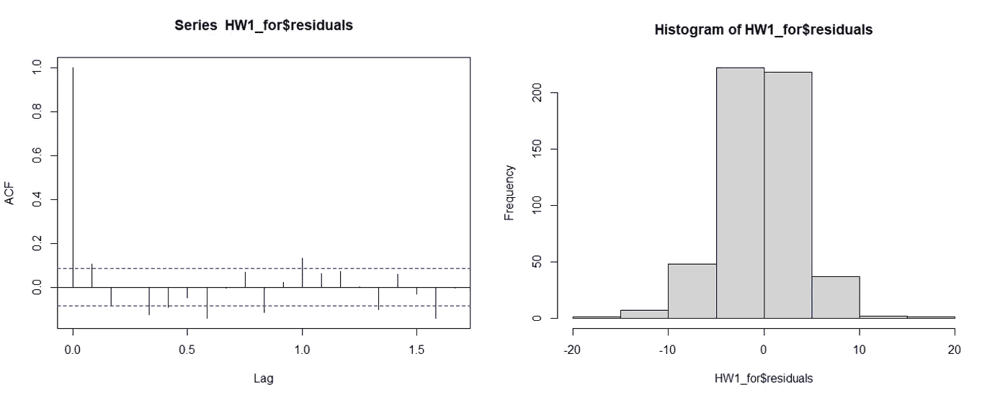

# 霍尔特-温特斯 R 时间序列预测

> 原文：<https://towardsdatascience.com/time-series-forecasting-in-r-with-holt-winters-16ef9ebdb6c0?source=collection_archive---------2----------------------->

## [实践教程](https://towardsdatascience.com/tagged/hands-on-tutorials)

## 季节性预测的模板


照片由[克里斯·劳顿](https://unsplash.com/@chrislawton?utm_source=medium&utm_medium=referral)在 [Unsplash](https://unsplash.com?utm_source=medium&utm_medium=referral) 拍摄

当我们只有历史数据来指导我们时，时间序列预测是预测未来事件的一个很好的方法。我们可以用它来预测天气、股票市场，甚至是冰淇淋的消费量。在本文中，我将指导您使用无处不在的 Holt-Winters 预测来设置时间序列、创建数据拟合、预测未来和模型评估。

对于这个例子，我们将使用一个按月跟踪美国糖果产量的数据集，可在 [kaggle](https://www.kaggle.com/rtatman/us-candy-production-by-month) 上获得。随着年底万圣节和圣诞节的临近，紧随其后的是那些新年决心，糖果的消费和生产会有很强的季节性就不足为奇了。然而，这里显示的时间序列预测的妙处在于，它可以隔离季节性成分，以揭示逐年趋势，这些趋势可以指示年增长率等指标。

## 数据设置

首先，让我们导入这个数据集，快速查看一下我们有什么:

```
df <- read.csv('Data/candy_production.csv', header=TRUE)
head(df)
```

这里我们看到两列——我们有一个“类似日期的”`observation_date`,其值类似于`1972-01-01`,第二列是糖果生产值。很简单。因为我们实际上没有日期类型的列，所以添加一个也不失为一个好主意(尽管对于执行时间序列不是必需的！！).如果我们想要过滤或子集化数据，这无疑会让生活变得容易得多。为此，我们查看日期值以提取其格式。在这种情况下，它是年-月-日(YYYY-MM-DD)。这里有一个快速转换的备忘单，这样你就不用在网上搜索了:

```
#Symbol  Meaning                Example
# %d      day as a number (0-31)  01-31
# %a      abbreviated weekday     Mon
# %A      abbreviated weekday     Monday
# %m      month (00-12)          00-12
# %b      abbreviated month       Jan
# %B      unabbreviated month     January
# %y      2-digit year            07
# %Y      4-digit year            2007
```

对于我们来说，让我们创建一个类型为“Date”的新列，如下所示:

```
df$Date <- as.Date(df$observation_date, "%Y-%m-%d")
```

如果我们的时间序列使用小时/分钟/秒或时区，我们需要转换成一个 [POSIXct](https://www.rdocumentation.org/packages/tis/versions/1.38/topics/POSIXct) ，但是这里不需要。

## 转换为时间序列

这是非常简单的一步，但也是最容易忘记的一步。在我们做任何关于预测的事情之前，我们需要告诉 R 这个数据是一个时间序列。为此，我们创建一个时间序列对象。我们必须给出函数的两个关键输入— **频率**和**启动**。

首先，我们应该承认创建时间序列对象的函数并不智能。尽管我们的数据集有非常可读的类似日期的值，但我们需要手动告诉它我们读取的**频率**——也就是说，你一年有多少行数据。在这种情况下，我们每个月有一个数据点，所以`frequency=12`。对于 **start** ，如果我们不想在结果中附加具体日期，那么我们可以只输入“1”，但是因为我们通常这样做，所以我们将第一个数据点的年份和月份表示为`start=c(1972,1)`。

```
dfts <- ts(df$IPG3113N, frequency=12, start=c(1972,1))
dfts
```

检查`dfts`显示数据现在是如何以年和月堆叠的。

## 分解

我们可以立即“分解”时间序列，这意味着分离出构成时间序列的 3 个主要部分:

*   趋势:数据的长期趋势
*   季节性:重复的季节性信号加法器
*   随机:季节性或趋势性成分中不期望的“剩余”成分。

我们可以很容易地提取这些成分，并绘制成图:

```
components_dfts <- decompose(dfts)
plot(components_dfts)
```



当我们查看分解组件时，我们可以直观地看到它们是如何累加到我们的“观察”值(我们的真实值)的。考察每一部分的尺度，看哪一部分更占优势，也是非常重要的。例如，如果“随机”的范围明显大于季节性或趋势性的范围，该数据将很难在以后准确预测。

## 霍尔特-温特斯拟合

在预测未来值之前，我们需要对数据进行拟合。在最基本的方法中，我们可以简单地调用 Holt-Winters 函数，让 R 自己计算出调整参数。我们还有机会通过设置调整变量来手动调整拟合:

*   `alpha`:“基础值”。alpha 越高，最近的观察就越重要。
*   `beta`:趋势值。贝塔系数越高，意味着趋势斜率越依赖于最近的趋势斜率。
*   `gamma`:“季节性成分”。较高的 gamma 会对最近的季节性周期赋予更多权重。

在这里，我们可以进行两次拟合，并将它们与原始数据进行对比，以查看拟合的质量。我强烈推荐使用`alpha`、`beta`和`gamma`值来看看拟合度是如何变化的。

```
HW1 <- HoltWinters(dfts)# Custom HoltWinters fitting
HW2 <- HoltWinters(dfts, alpha=0.2, beta=0.1, gamma=0.1)#Visually evaluate the fits
plot(dfts, ylab="candy production", xlim=c(2013,2018))
lines(HW1$fitted[,1], lty=2, col="blue")
lines(HW2$fitted[,1], lty=2, col="red")
```



霍尔特温特斯符合我们的数据

## 预言

这两种拟合看起来都很好地遵循了我们的数据，所以现在是时候看看他们如何预测未来的糖果产量了。使用`predict`函数，我们需要指定我们预测未来的数据点数量。这里，我们将使用值 24 来预测未来 2 年(记住，这是一个*月度*时间序列)。我们还想了解一些与预测相关的“误差线”的概念，以便了解我们的预测可信度。为此，我们将`prediction.interval=TRUE`和`level`设置为[置信区间](https://www.simplypsychology.org/confidence-interval.html)(此处选择 0.95)。我们将再次绘制现有数据和新预测的尾部:

```
HW1.pred <- predict(HW1, 24, prediction.interval = TRUE, level=0.95)#Visually evaluate the prediction
plot(dfts, ylab="candy production", xlim=c(2008.5,2020))
lines(HW1$fitted[,1], lty=2, col="blue")
lines(HW1.pred[,1], col="red")
lines(HW1.pred[,2], lty=2, col="orange")
lines(HW1.pred[,3], lty=2, col="orange")
```



对 HW1 季节性附加拟合的预测

## 季节性调整

当我们进行拟合时，我们还可以选择调整季节性因素的行为。标准的 Holt-Winters 拟合使用一个**加性**季节性——它假设任何季节性成分的幅度在整个序列中相对恒定。然而，如果我们使用**乘**季节性，我们允许季节性变化(幅度)随着数据的总体水平而增长。为了了解这在我们的糖果生产案例中是如何工作的，我们将创建一个新的拟合，预测未来，并与我们的`HW1`的**添加剂**拟合进行比较。

```
HW3 <- HoltWinters(dfts, seasonal = "multiplicative")
HW3.pred <- predict(HW3, 24, prediction.interval = TRUE, level=0.95)
plot(dfts, ylab="candy production", xlim=c(2008.5,2020))
lines(HW3$fitted[,1], lty=2, col="blue")
lines(HW3.pred[,1], col="red")
lines(HW3.pred[,2], lty=2, col="orange")
lines(HW3.pred[,3], lty=2, col="orange")
```



HW3 季节性倍增拟合的预测

正如我们所看到的，预测看起来与我们的`HW1`结果非常相似，但是置信区间向外扩散得很大。对于这个数据集，**乘法**拟合似乎并不可行。

# 预测库

那些不熟悉时间序列预测的人可能会发现，在网上看到使用`forecast`而不是`predict`来模拟未来值的例子是很常见的。那么有什么区别呢？简而言之，forecast 是 predict 的包装器，它允许更多的置信区间，使绘制更容易，并为我们提供了评估预测质量的工具。使用我们之前的`HW1`霍尔特-温特斯拟合，我们可以使用`forecast`进行新的预测，并包括 80%和 95%的置信区间。我们是这样做的:

```
library(forecast)
HW1_for <- forecast(HW1, h=24, level=c(80,95))#visualize our predictions:
plot(HW1_for, xlim=c(2008.5, 2020))
lines(HW1_for$fitted, lty=2, col="purple")
```



## 预测评估

`forecast`还通过编辑观察值减去每个数据点的预测值来计算我们预测的质量。这些被添加到我们的预测模型中作为`$residuals`。为了更好地评估我们在模型中使用的平滑函数，我们希望检查预测误差之间是否存在相关性。简而言之，如果我们拟合中的相邻点以类似的方式连续错过观察值，我们的主拟合线对数据的变化不够敏感。为了捕捉这一点，我们使用`acf`函数来评估时间序列(lag)中不同时间间隔的点之间的拟合残差的相关性。理想情况下，对于非零滞后，ACF 条在下图所示的蓝色范围内。使用`na.action=na.pass`很重要，因为$residuals 的最后一个值总是 NA，否则函数会出错。

容格盒试验也可以表明这些相关性的存在。只要我们的 p 值> 0.05，残差就有 95%的可能性是独立的。最后，检查残差的直方图以确保正态分布非常有用。如果残差严重偏斜，那么我们的模型可能会在一个方向上持续超调。

```
acf(HW1_for$residuals, lag.max=20, na.action=na.pass)
Box.test(HW1_for$residuals, lag=20, type="Ljung-Box")
hist(HW1_for$residuals)
```



评估$残差

## 结论

如您所见，Holt-Winters 预测是预测时间序列中未来数据的强大工具。存在许多其他时间序列预测模型(ARIMA、TBATS 等)，但几乎都遵循相同的基本代码序列。

您可能还注意到，本文中嵌入的代码为预测任何数据提供了一个很好的模板——只要在转换成时间序列时留意一下`frequency`和`start`,您就可以万事俱备了！为了节省您的时间和麻烦，源代码可以在我的 github 上找到:

[](https://github.com/bamattis/Blog/tree/main/R/TimeSeries) [## 主 bamattis 的博客/R/时间系列/博客

### 博客帖子。在 GitHub 上创建一个帐户，为 ba mattis/博客的发展做出贡献。

github.com](https://github.com/bamattis/Blog/tree/main/R/TimeSeries) 

如果你觉得这个有用，请跟我来！ 欢呼一声，快乐的编码出来了。