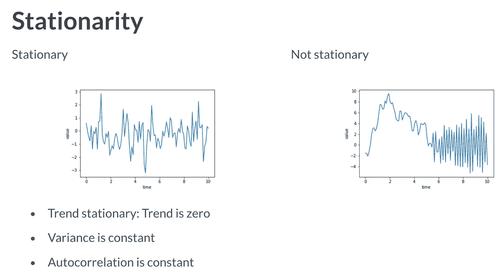
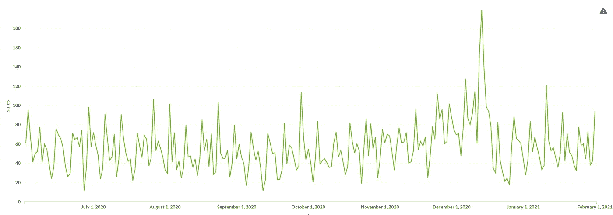
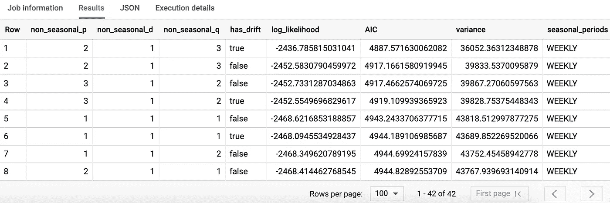
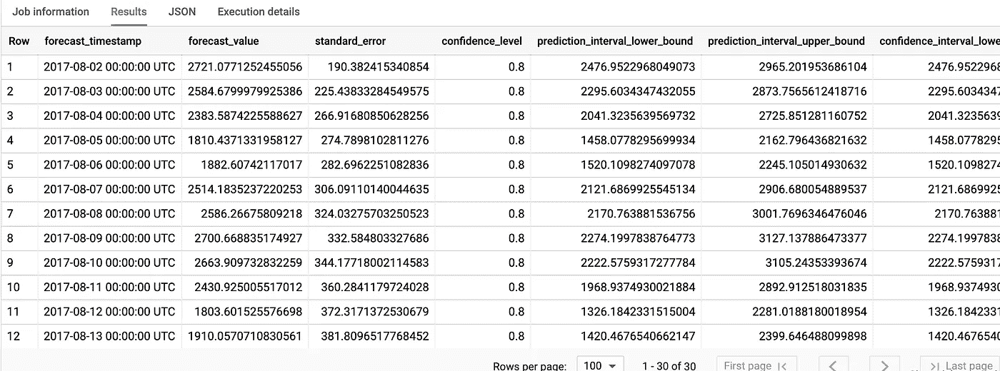
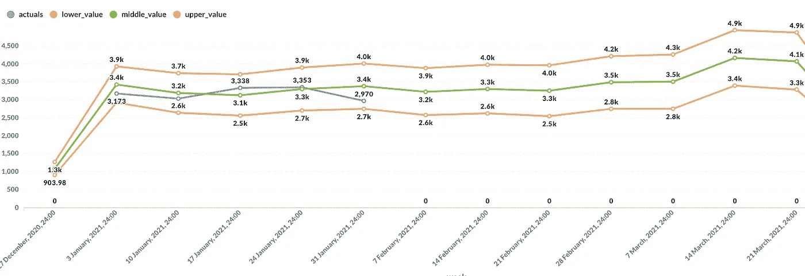
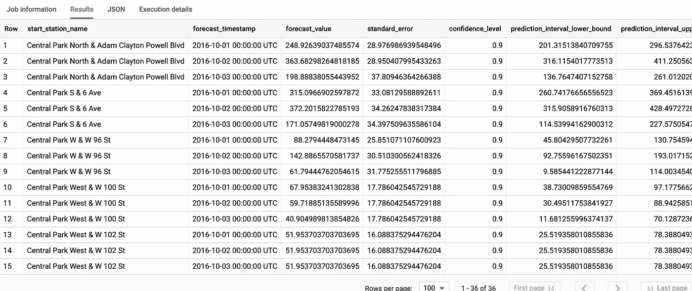

# 基于 Google BigQuery ML 的时间序列预测

> 原文：<https://towardsdatascience.com/time-series-forecasting-with-google-bigquery-ml-2064a29f6b98?source=collection_archive---------10----------------------->

## 基于 ARIMA 模型的时间序列预测


在 [Unsplash](https://unsplash.com?utm_source=medium&utm_medium=referral) 上由 [Austin Distel](https://unsplash.com/@austindistel?utm_source=medium&utm_medium=referral) 拍摄的照片

如果你曾经使用过任何一种预测模型，你就会知道它有时是多么的费力，尤其是在试图预测多个变量的时候。从识别时间序列是否平稳，到估计和最终的模型评估，这个过程是非常耗时的。例如，在使用 Python 中的 [ARIMA 方法](https://en.wikipedia.org/wiki/Autoregressive_integrated_moving_average)开始时间序列预测之前，您必须遵循以下步骤:

# 传统预测流程

*   **识别/数据准备**:通过可视化数据和/或应用统计平稳性测试方法之一，测试时间序列是否[平稳](https://www.kdnuggets.com/2019/08/stationarity-time-series-data.html)； [**迪基-富勒**](https://en.wikipedia.org/wiki/Dickey%E2%80%93Fuller_test) 测试或 [**KPSS**](https://en.wikipedia.org/wiki/KPSS_test) 测试。你也可以使用 [ACF 图](https://otexts.com/fpp2/stationarity.html)来识别非平稳时间序列数据。



[来源](https://www.datacamp.com/courses/forecasting-using-arima-models-in-python)。平稳时间序列是指其属性(均值、方差和协方差)不随时间变化的序列。对于被归类为平稳的序列，它不应该显示趋势。

*   **差异**:差异可以通过消除时间序列水平的变化来帮助稳定时间序列的平均值，从而消除(或减少)趋势和季节性。根据上一步的测试结果，这将决定您将使用哪种差异方法。例子；滞后差分、差分变换、对数变换等(更多信息请参见底部的参考链接)。
*   **参数估计**:为了创建您的 ARIMA 模型，您将通过查看 ACF 和 PACF 图找到每个 ARIMA 系数“p”、“q”和“d”的顺序，以便选择正确的模型进行预测。它基本上意味着找到模型系数的值，这些值提供了与数据的最佳拟合。您可以使用 AIC —阿凯克信息准则或 BIC — [贝叶斯信息准则](https://en.wikipedia.org/wiki/Bayesian_information_criterion)作为选择准则。
*   **诊断**:包括测试模型的假设，以识别模型不完善的地方。如果发现模型不合适，则有必要返回到步骤 2，并尝试确定更好的模型。如果你的模型足够，你可以进行最后一步…
*   预测/生产:你现在可以使用你的模型进行预测了。

遵循这个被称为 [Box-Jenkins 方法](https://robjhyndman.com/papers/BoxJenkins.pdf)的必要过程，可能需要一段时间才能找到合适的模型。谢天谢地，谷歌已经将许多机器学习模型整合到 BigQuery 中，ARIMA 的时间序列预测就是其中之一。这意味着您现在可以使用简单的旧 SQL 来设计复杂的 ML 模型，并且只需很少的时间，而 Google 会负责模型选择和幕后的预测过程！

# 使用 BigQuery ML 进行预测

在本文中，我将向您展示如何使用 BigQuery ML 的时间序列模型对未来 90 天进行预测。

*   预测单个变量
*   预测多个变量
*   评估模型

# **步骤 1 —训练数据**

与任何机器学习问题一样，收集正确的训练数据是获得良好预测的关键。所以根据我的经验，你的时间序列数据越广泛，你就越有可能得到好的预测。我试图在我的训练数据中捕捉尽可能多的季节模式。

对于一家电子商务公司来说，在历史数据中捕捉至少一个假日期间非常重要，这样您的模型就可以了解这些期间的高峰和低谷。在我们的例子中，我们正在查看 8 个月的历史视图。我更喜欢看更长的历史窗口，但我们现在将坚持这一点。

```
#standardSQL
SELECT
 FORMAT_DATE(“%Y-%m-%d”, DATE(orderDate)) AS day,
 SUM(quantity) AS sales
FROM   `myproject.mydataset.mytable`
WHERE orderDate > CAST(date_add(DATE_TRUNC((DATE_SUB(CURRENT_DATE, INTERVAL 8 MONTH)), MONTH), INTERVAL 1 day) AS TIMESTAMP)
GROUP BY day
ORDER BY day, sales DESC
```



每日销售—培训数据

从这张图表中，我们可以看到全年反复出现的模式和 12 月左右的销售高峰。

# **步骤 2 —创建&训练模型**

在这一步中，我们将创建一个名为

```
mydataset.sales_forecast
```

`[CREATE MODEL](https://cloud.google.com/bigquery-ml/docs/reference/standard-sql/bigqueryml-syntax-create-time-series)`子句为单个时间序列创建和训练模型。

```
CREATE OR REPLACE MODEL mydataset.sales_forecastOPTIONS(model_type=’ARIMA’,time_series_data_col=’sales’,time_series_timestamp_col=’day’,data_frequency=’DAILY’holiday_region=’US’) ASSELECT
 FORMAT_DATE(“%Y-%m-%d”, DATE(orderDate) as day,
 SUM(quantity) AS sales
FROM   `myproject.mydataset.mytable`
WHERE orderDate > cast(date_add(DATE_TRUNC((DATE_SUB(CURRENT_DATE, INTERVAL 8 MONTH)), MONTH), INTERVAL 1 day) as TIMESTAMP)
GROUP BY day
ORDER BY day, sales DESC
```

> BigQuery ML 在模型创建过程中自动将您的训练数据划分为 train/test。

`OPTIONS(model_type='ARIMA', time_series_timestamp_col='date', ...)`条款是最神奇的地方。

*   **model_type** :表示您正在创建一个基于 [ARIMA](https://en.wikipedia.org/wiki/Autoregressive_integrated_moving_average) 的时间序列模型。
*   **time_series_data_col** :表示我们将要预测的列
*   **时间序列时间戳列**:表示时间序列时间戳列
*   **data_frequency** :告诉模型你的输入数据是什么格式。这通常是自动推断出来的，但明确定义它有时会很方便
*   **holiday_region(可选)**:表示建模中应用假日效果的地理区域。默认情况下，假日效果建模处于禁用状态，但启用它可以为时间序列中的假日点建立更准确的模型。

# **步骤 3 —模型评估**

在创建模型之后，您可以使用`ML.EVALUATE`功能来查看过程中评估的所有候选模型的评估指标，因为许多 ARIMA 模型是并行运行的。

> BigQuery 选择性能最佳的模型，并在调用 ML 时使用它。预测方法(下一步)。如果你对结果不满意，你可以摆弄时间序列的训练数据。例如，查看每周数据而不是每天数据。

```
#standardSQL
SELECT
 *
FROM
 ML.EVALUATE(MODEL mydataset.sales_forecast)
```



评估结果— [来源](https://cloud.google.com/bigquery-ml/docs/arima-single-time-series-forecasting-tutorial#step_four_inspect_the_evaluation_metrics_of_all_evaluated_models)

# **步骤 4 —预测**

关键步骤在下面的查询中。打电话给军情六处。预测函数，下面的模型预测未来 90 天，预测间隔为 80%。

```
#standardSQL
SELECT 
 *
 FROM ML.FORECAST(MODEL `mydataset.sales_forecast`, STRUCT(90 AS horizon, 0.8 AS confidence_level))
```

就像这样，我们有未来 90 天的销售预测！



[预测结果](https://cloud.google.com/bigquery-ml/docs/arima-single-time-series-forecasting-tutorial#step_four_inspect_the_evaluation_metrics_of_all_evaluated_models)

现在，我们可以将预测与实际数据合并，以查看我们的预测随着时间的推移表现如何。我们按周对结果进行分组，以获得更全面的了解。

```
WITH actuals AS (SELECT 
 DATE_TRUNC(DATE(orderDate), WEEK) AS week, 
SUM(quantity) AS sales
 FROM `myproject.mydataset.mytable`
WHERE orderDate > "2020-12-25"
GROUP BY week)

 SELECT 
 DATE_TRUNC(date(forecast_timestamp), WEEK) AS week,
 SUM(sales) AS actuals,
 SUM(prediction_interval_lower_bound) AS lower_value,
 SUM(forecast_value) AS middle_value,
 SUM(prediction_interval_upper_bound) AS upper_value
 FROM ML.FORECAST(MODEL `mydataset.sales_forecast`, STRUCT(90 AS horizon, 0.9 AS confidence_level)) as ML
 LEFT JOIN actuals AS ac 
 ON DATE_TRUNC(date(forecast_timestamp), WEEK) = ac.week
 GROUP BY 1
```



预测截图

如你所见，我们的预测相当不错，我们的实际值也在预测值之内。

# 奖金-预测多个时间序列

要预测多个时间序列，你所要做的就是包含一个名为***time _ series _ id _ col****的新选项。*指定使用哪一列来标识不同的时间序列。看一下上面的例子，如果我们想预测不同商店位置 90 天的销售额，我们只需要在模型创建中添加***time _ series _ id _ col****，并在训练数据中包含一个新列。*

```
*CREATE OR REPLACE MODEL mydataset.sales_forecastOPTIONS(model_type=’ARIMA’,time_series_data_col=’sales’,time_series_timestamp_col=’day’,***time_series_id_col=*’location’**data_frequency=’DAILY’holiday_region=’US’) ASSELECT
 FORMAT_DATE(“%Y-%m-%d”, DATE(orderDate) as day,**location**,SUM(quantity) AS sales
FROM   `myproject.mydataset.mytable`
WHERE orderDate > cast(date_add(DATE_TRUNC((DATE_SUB(CURRENT_DATE, INTERVAL 8 MONTH)), MONTH), INTERVAL 1 day) as TIMESTAMP)
GROUP BY day, **location**
ORDER BY day, sales DESC*
```

*现在当你运行 **ML 时。预测**像以前一样，您可以获得商店中每个单独位置的 90 天销售预测。*

```
*#standardSQL
SELECT 
 *
 FROM ML.FORECAST(MODEL `mydataset.sales_forecast`, STRUCT(90 AS horizon, 0.8 AS confidence_level))*
```

**

*这是一个可能的输出示例*

*确保在你的下一个时序项目中尝试一下。*

*请随意分享您对如何改进这里的方法的任何建议。*

> **可以* [*成为中等会员*](https://medium.com/@tobisam/membership) *享受更多这样的故事。**

***参考文献***

*   *[8.1 平稳性和差分|预测:原则和实践(otexts.com)](https://otexts.com/fpp2/stationarity.html)*
*   *[检测时间序列数据中的平稳性— KDnuggets](https://www.kdnuggets.com/2019/08/stationarity-time-series-data.html)*
*   *[如何在 Python(machinelearningmastery.com)中使用差异变换移除趋势和季节性](https://machinelearningmastery.com/remove-trends-seasonality-difference-transform-python/)*
*   *[BoxJenkins.pdf(robjhyndman.com)](https://robjhyndman.com/papers/BoxJenkins.pdf)*