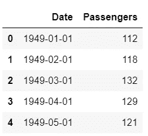
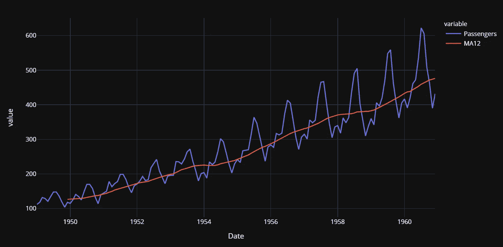
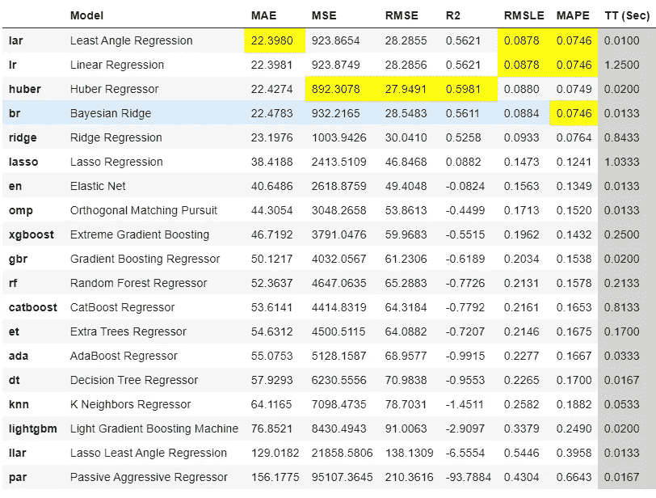
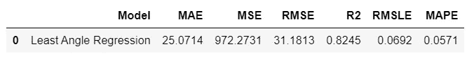
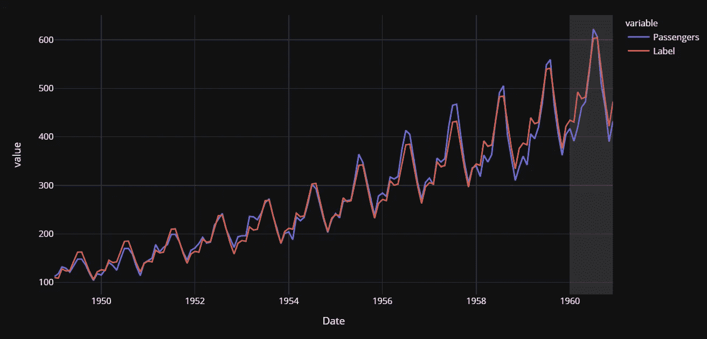
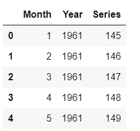
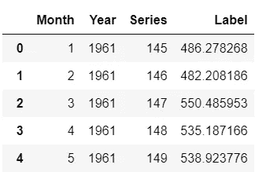
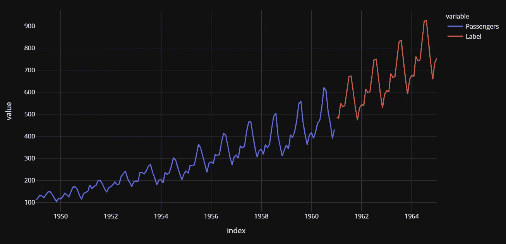

# 用 PyCaret 回归模块进行时间序列预测

> 原文：<https://towardsdatascience.com/time-series-forecasting-with-pycaret-regression-module-237b703a0c63?source=collection_archive---------4----------------------->


卢卡斯·布拉塞克在 [Unsplash](https://unsplash.com?utm_source=medium&utm_medium=referral) 上的照片

# PyCaret

PyCaret 是一个开源的低代码机器学习库和端到端的模型管理工具，内置于 Python 中，用于自动化机器学习工作流。它因其易用性、简单性以及快速有效地构建和部署端到端 ML 原型的能力而广受欢迎。

PyCaret 是一个替代的低代码库，可以用来用几行代码替换数百行代码。这使得实验周期成倍地快速和有效。

py caret**简单** **好用**。PyCaret 中执行的所有操作都顺序存储在一个**管道**中，该管道对于**部署是完全自动化的。**无论是输入缺失值、一键编码、转换分类数据、特征工程，甚至是超参数调整，PyCaret 都能实现自动化。要了解 PyCaret 的更多信息，请观看这段 1 分钟的视频。

py caret——Python 中的开源、低代码机器学习库

本教程假设您对 PyCaret 有一定的了解和经验。如果您以前没有使用过，没关系，您可以通过这些教程快速入门:

*   [PyCaret 2.2 已经发布——新功能](/pycaret-2-2-is-here-whats-new-ad7612ca63b)
*   [宣布 PyCaret 2.0](/announcing-pycaret-2-0-39c11014540e)
*   关于 PyCaret 你不知道的五件事

# 正在安装 PyCaret

安装 PyCaret 非常容易，只需要几分钟。我们强烈建议使用虚拟环境来避免与其他库的潜在冲突。

PyCaret 的默认安装是 pycaret 的精简版本，它只安装这里列出的[硬依赖项](https://github.com/pycaret/pycaret/blob/master/requirements.txt)。

```
**# install slim version (default)** pip install pycaret**# install the full version**
pip install pycaret[full]
```

当你安装 pycaret 的完整版本时，这里列出的所有可选依赖项也会被安装。

# 👉PyCaret 回归模块

PyCaret **回归模块**是一个受监督的机器学习模块，用于估计一个**因变量**(通常称为“结果变量”，或“目标”)和一个或多个**自变量**(通常称为“特征”，或“预测器”)之间的关系。

回归的目标是预测连续值，如销售额、数量、温度、客户数量等。PyCaret 中的所有模块都提供了许多[预处理](https://www.pycaret.org/preprocessing)功能，通过[设置](https://www.pycaret.org/setup)功能为建模准备数据。它有超过 25 个现成的算法和几个图来分析训练模型的性能。

# 👉具有 PyCaret 回归模块的时间序列

时间序列预测可以大致分为以下几类:

*   **经典/统计模型** —移动平均、指数平滑、ARIMA、萨里玛、TBATS
*   **机器学习** —线性回归、XGBoost、随机森林或任何具有归约方法的 ML 模型
*   **深度学习**—LSTM RNN

本教程主要关注第二类，即*机器学习*。

PyCaret 的回归模块默认设置对于时序数据来说并不理想，因为它涉及的数据准备步骤很少，而这些步骤对于有序数据(*数据和时序数据*等序列)是无效的。

例如，将数据集分成训练集和测试集是随机进行的。这对于时间序列数据没有意义，因为您不希望最近的日期包含在训练集中，而历史日期是测试集的一部分。

时间序列数据也需要不同类型的交叉验证，因为它需要考虑日期的顺序。评估模型时，PyCaret 回归模块默认使用 k 倍随机交叉验证。默认的交叉验证设置不适用于时序数据。

本教程的下一节将演示如何轻松更改 PyCaret 回归模块中的默认设置，使其适用于时间序列数据。

# 👉资料组

出于本教程的目的，我使用了美国航空公司的乘客数据集。你可以从 [Kaggle](https://www.kaggle.com/chirag19/air-passengers) 下载数据集。

```
**# read csv file** import pandas as pd
data = pd.read_csv('AirPassengers.csv')
data['Date'] = pd.to_datetime(data['Date'])
data.head()
```



样本行

```
**# create 12 month moving average** data['MA12'] = data['Passengers'].rolling(12).mean()**# plot the data and MA** import plotly.express as px
fig = px.line(data, x="Date", y=["Passengers", "MA12"], template = 'plotly_dark')
fig.show()
```



美国航空公司乘客数据集时间序列图，移动平均值= 12

由于算法不能直接处理日期，所以让我们从日期(如月和年)中提取一些简单的特征，并删除原始的日期列。

```
**# extract month and year from dates**
data['Month'] = [i.month for i in data['Date']]
data['Year'] = [i.year for i in data['Date']]**# create a sequence of numbers** data['Series'] = np.arange(1,len(data)+1)**# drop unnecessary columns and re-arrange** data.drop(['Date', 'MA12'], axis=1, inplace=True)
data = data[['Series', 'Year', 'Month', 'Passengers']] **# check the head of the dataset**
data.head()
```


提取要素后的样本行

```
**# split data into train-test set** train = data[data['Year'] < 1960]
test = data[data['Year'] >= 1960]**# check shape** train.shape, test.shape
>>> ((132, 4), (12, 4))
```

在初始化`setup`之前，我已经手动分割了数据集。另一种方法是将整个数据集传递给 PyCaret，让它处理拆分，在这种情况下，您必须在`setup`函数中传递`data_split_shuffle = False`，以避免在拆分前打乱数据集。

# 👉**初始化设置**

现在是初始化`setup`函数的时候了，在这里我们将使用`fold_strategy`参数显式地传递训练数据、测试数据和交叉验证策略。

```
**# import the regression module**
from pycaret.regression import ***# initialize setup**
s = setup(data = train, test_data = test, target = 'Passengers', fold_strategy = 'timeseries', numeric_features = ['Year', 'Series'], fold = 3, transform_target = True, session_id = 123)
```

# 👉**培训和评估所有模型**

```
best = compare_models(sort = 'MAE')
```



比较模型的结果

基于交叉验证的 MAE 的最佳模型是**最小角度回归** (MAE: 22.3)。让我们检查一下测试集上的分数。

```
prediction_holdout = predict_model(best);
```



预测模型(最佳)函数的结果

测试集上的 MAE 比交叉验证的 MAE 高 12%。不太好，但我们会努力的。让我们画出实际的和预测的线来可视化拟合。

```
**# generate predictions on the original dataset**
predictions = predict_model(best, data=data)**# add a date column in the dataset**
predictions['Date'] = pd.date_range(start='1949-01-01', end = '1960-12-01', freq = 'MS')**# line plot**
fig = px.line(predictions, x='Date', y=["Passengers", "Label"], template = 'plotly_dark')**# add a vertical rectange for test-set separation**
fig.add_vrect(x0="1960-01-01", x1="1960-12-01", fillcolor="grey", opacity=0.25, line_width=0)fig.show()
```



实际和预测的美国航空乘客(1949-1960)

接近尾声的灰色背景是测试期(即 1960 年)。现在让我们最终确定模型，即在整个数据集(这次包括测试集)上训练最佳模型，即*最小角度回归*。

```
final_best = finalize_model(best)
```

# 👉创建未来评分数据集

现在，我们已经在整个数据集(1949 年到 1960 年)上训练了我们的模型，让我们预测到 1964 年的未来五年。要使用我们的最终模型来生成未来预测，我们首先需要创建一个数据集，该数据集由未来日期的月、年、系列列组成。

```
future_dates = pd.date_range(start = '1961-01-01', end = '1965-01-01', freq = 'MS')future_df = pd.DataFrame()future_df['Month'] = [i.month for i in future_dates]
future_df['Year'] = [i.year for i in future_dates]    
future_df['Series'] = np.arange(145,(145+len(future_dates)))future_df.head()
```



future_df 中的示例行

现在，让我们使用`future_df`来评分并生成预测。

```
predictions_future = predict_model(final_best, data=future_df)
predictions_future.head()
```



预测中的样本行 _ 未来

我们来画一下。

```
concat_df = pd.concat([data,predictions_future], axis=0)
concat_df_i = pd.date_range(start='1949-01-01', end = '1965-01-01', freq = 'MS')
concat_df.set_index(concat_df_i, inplace=True)fig = px.line(concat_df, x=concat_df.index, y=["Passengers", "Label"], template = 'plotly_dark')
fig.show()
```



实际(1949-1960 年)和预测(1961-1964 年)美国航空乘客

那不是很容易吗？

使用 Python 中的这个轻量级工作流自动化库，您可以实现的目标是无限的。如果你觉得这很有用，请不要忘记给我们 GitHub 库上的⭐️。

要了解更多关于 PyCaret 的信息，请关注我们的 LinkedIn 和 Youtube。

加入我们的休闲频道。此处邀请链接[。](https://join.slack.com/t/pycaret/shared_invite/zt-p7aaexnl-EqdTfZ9U~mF0CwNcltffHg)

# 您可能还对以下内容感兴趣:

[使用 PyCaret 2.0](/build-your-own-automl-in-power-bi-using-pycaret-8291b64181d)
[在 Power BI 中构建您自己的 AutoML 使用 Docker](/deploy-machine-learning-pipeline-on-cloud-using-docker-container-bec64458dc01)
[在 Azure 上部署机器学习管道在 Google Kubernetes 引擎上部署机器学习管道](/deploy-machine-learning-model-on-google-kubernetes-engine-94daac85108b)
[在 AWS Fargate 上部署机器学习管道](/deploy-machine-learning-pipeline-on-aws-fargate-eb6e1c50507)
[构建和部署您的第一个机器学习 web 应用](/build-and-deploy-your-first-machine-learning-web-app-e020db344a99)
[使用 AWS Fargate 无服务器](/deploy-pycaret-and-streamlit-app-using-aws-fargate-serverless-infrastructure-8b7d7c0584c2)
[构建和部署机器](/build-and-deploy-machine-learning-web-app-using-pycaret-and-streamlit-28883a569104)

# 重要链接

[文档](https://pycaret.readthedocs.io/en/latest/installation.html)
[博客](https://medium.com/@moez_62905)
[GitHub](http://www.github.com/pycaret/pycaret)
[stack overflow](https://stackoverflow.com/questions/tagged/pycaret)
[安装 PyCaret](https://pycaret.readthedocs.io/en/latest/installation.html) [笔记本教程](https://pycaret.readthedocs.io/en/latest/tutorials.html) [投稿于 PyCaret](https://pycaret.readthedocs.io/en/latest/contribute.html)

# 想了解某个特定模块？

单击下面的链接查看文档和工作示例。

[分类](https://pycaret.readthedocs.io/en/latest/api/classification.html) 回归 聚类
[异常检测](https://pycaret.readthedocs.io/en/latest/api/anomaly.html)
[自然语言处理](https://pycaret.readthedocs.io/en/latest/api/nlp.html) [关联规则挖掘](https://pycaret.readthedocs.io/en/latest/api/arules.html)