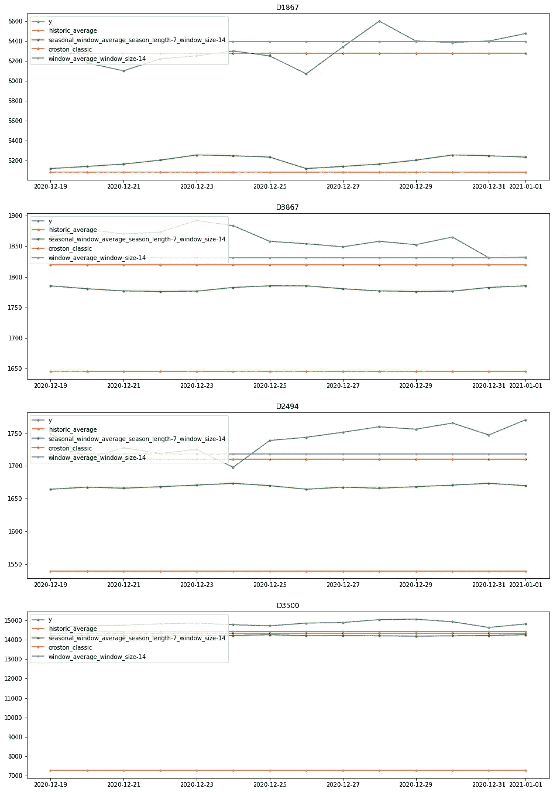

# 基于统计模型的时间序列预测

> 原文：<https://towardsdatascience.com/time-series-forecasting-with-statistical-models-f08dcd1d24d1?source=collection_archive---------16----------------------->

## statsforecast 使使用统计模型进行预测变得快速而简单

*由* [*尼克斯特拉团队*](http://github.com/Nixtla) *。* [*费德·加尔萨·拉米雷斯*](https://medium.com/u/2855bd3e0293?source=post_page-----f08dcd1d24d1--------------------------------) ，[马克斯·梅根塔尔](https://medium.com/u/76b639655285?source=post_page-----f08dcd1d24d1--------------------------------)

> TL；速度三角形定位法(dead reckoning)
> 
> 在这篇文章中，我们将介绍[**stats forecast**](http://github.com/nixtla/statsforecast)，这是一个开源框架，它使得在预测任务中实现统计模型变得快速而简单。statsforecast 能够处理成千上万的时间序列，在时间和内存方面都很高效。有了这个库，你可以很容易地创建基准来构建更复杂的模型；它还允许您以并行方式运行自己的模型。在本帖中，我们还提供了如何使用“预测附加值”对不同模型进行基准测试和评估竞争模型的指南。

## 介绍

在本帖中，我们将讨论在预测任务中使用统计模型。我们特别介绍 **statsforecast** 。这个 Python 库允许以简单且计算高效的方式对数十万个时间序列拟合统计模型，以便您可以快速地对自己的模型进行基准测试。在这篇文章中，我们将展示如何使用这个库来计算一些模型相对于基准模型的预测附加值。这种方法允许我们在各种模型中选择最佳模型。

## 动机

深度学习和机器学习模型在时间序列预测任务中表现出了最先进的性能。然而，有一组更简单的模型来测试和验证这些模型所增加的价值是很有帮助的。

在业务问题中，预测增值(FVA)等指标通常用于比较更复杂的模型与更简单的技术的增值，以便实施并向决策者解释。FVA 的计算方法是从更复杂模型的损失中减去基准模型的损失。在接下来的例子的[中，拟合了三个模型:简单模型、统计模型和覆盖模型。第一列显示了这三个模型的平均百分比误差(MAPE)。`FVA vs. Naive`列在第二行显示天真的 MAPE 和统计的 MAPE 之间的差值，该差值为正；这意味着统计增加了过程的价值。同样，第三行显示了天真者的 MAPE 和覆盖者的 MAPE 之间的差异；结果是负的，所以模型覆盖不会增加任何值。](https://www.sas.com/content/dam/SAS/en_us/doc/whitepaper1/forecast-value-added-analysis-106186.pdf)

图片来自 [SaaS](https://www.sas.com/content/dam/SAS/en_us/doc/whitepaper1/forecast-value-added-analysis-106186.pdf)

*statsforecast* 中包含了广泛的统计基础模型，可用于决策或作为实施更完整模型的基准。还包括用于特定任务的模型，如预测稀疏(或间歇)时间序列，即零值百分比高的时间序列，如销售额。这些模型存在于 R 编程语言的实现中，但不存在于 Python 中。

## 统计预测

为了使基准测试更容易，我们创建了 [statsforecast](https://github.com/Nixtla/statsforecast) ，这是一个帮助您使用统计模型预测时间序列的框架。你只需要给它一个你想要使用的模型，然后让 *statsforecast* 去做剩下的事情。

## 包括的型号

*   **ADIDA** :时间聚合用于减少零观测值的出现，从而减轻间隔中观测到的方差的不良影响。ADIDA 使用相同大小的时段来执行非重叠的时间聚合，并预测预先指定的提前期内的需求。时段被设置为等于平均需求间间隔。SES 用于获得预测。
*   **Croston Classic**:Croston 提出的预测显示间歇性需求的序列的方法。该方法将原始序列分解为非零需求规模和需求间间隔，并使用带有预定义参数的简单指数平滑对其建模。
*   **克罗斯顿 SBA** : SBA 代表 Syntetos-Boylan 近似。利用去偏因子的克罗斯顿方法的一种变体。
*   **克罗斯顿优化**:与克罗斯顿类似，但该模型优化了非零需求规模和需求间隔的简单指数平滑。
*   **历史平均值**:时间序列的简单平均值。
*   **iMAPA** : iMAPA 代表间歇多重聚集预测算法。在需求预测中实现时间聚合的另一种方法。然而，与考虑单个聚合级别的 ADIDA 不同，iMAPA 考虑多个聚合级别，旨在捕捉数据的不同动态。因此，iMAPA 通过对使用 SES 生成的导出点预测进行平均来进行处理。
*   **Naive** :使用时间序列的最后一个值作为预测。时间序列预测的最简单模型。
*   **带漂移的随机游走**:从上一次观察值预测历史趋势。
*   **季节性指数平滑**:调整每个季节周期的简单指数平滑模型。
*   **季节性天真**:类似天真，但这次模型的预测等于同一时期的最后已知观测值，以便捕捉可能的每周季节性变化。
*   **季节性窗口平均值**:使用最后一个窗口(由用户定义)计算每个季节性周期的平均值。
*   SES : SES 代表简单指数平滑。该模型递归加权时间序列中的最新观测值。对于没有趋势的时间序列很有用。
*   TSB:TSB 代表着特纳-辛特托斯-巴拜。对 Croston 方法的一种修改，用需求概率代替需求间隔时间。
*   **窗口平均值**:使用最后一个窗口(由用户定义)计算平均值。

## 使用

为了创建一组足够多的基准，您可以安装 **statsforecast** ，它可以在 [PyPI](https://pypi.org/project/statsforecast/) ( `pip install statsforecast`)中获得。

## 图书馆

## 数据

在这个例子中，我们使用了 M4 时间序列竞赛数据。竞赛的目的是验证不同频率和季节性数据的模型。数据集最初是公开发布的，它是带着[完全开放访问许可](https://github.com/Mcompetitions/M4-methods/issues/16)发布的。为了下载数据，我们使用了 [nixtlats](https://github.com/Nixtla/nixtlats) 。在这个例子中，我们使用每日时间序列。

最初，数据不包含每个观察的实际日期，所以下面的代码行为每个时间序列创建一个日期戳。

函数`M4.load`返回训练+测试数据，所以我们需要把它们分开。

这是必需的输入格式。

*   一个名为 **unique_id** 的索引，用于标识每个时间序列。在这个例子中，我们有 4，227 个时间序列。
*   带有日期的 **ds** 栏。
*   一个带有数值的 **y** 列。

## 培养

我们现在定义我们将使用的统计模型。我们必须定义一个函数列表。如果模型除了预测展望期之外还有其他参数，则必须将其作为一个元组包含在模型和其他参数中。

现在我们定义我们的训练器`StatsForecast`，在这里我们定义我们想要使用的模型、数据的频率以及用于并行化训练作业的内核数量。

这样，调整这些模型并生成预测就像下面几行代码一样简单。主班是`StatsForecast`；它接收四个参数:

*   `df`:长格式时间序列的熊猫数据帧。
*   `models`:适合每个时间序列的模型列表。
*   `freq`:时间序列的频率。
*   `n_jobs`:装配过程中使用的型芯数量。默认值为 1 个作业。要并行计算流程，您可以使用`multiprocessing`中的`cpu_count()`函数。

## 预测附加值

在这个例子中，我们将使用`historic_average`模型作为基准；这是拟合模型中较为简单的一个模型(它只采用时间序列的平均值作为预测)。

如表所示，对于大多数型号而言，相对于`historic_average`型号的预测附加值为正值。

## 形象化

在本节中，我们将展示生成的预测的可视化示例。

作者图片

## 创建您自己的模型

此外，您可以使用`StatsForecast`的全部功能来并行化您自己的模型。您只需要定义一个带有强制参数`y`、目标时间序列和`h`、预测范围的函数；此外，您可以添加更多可选参数。该函数的输出必须是大小为`h`的 numpy 数组。在下面的例子中，我们将对时间进行线性回归；这是一个非常基本的模型，但它有助于解释如何充分发挥`statsforecast`的潜力。

具有额外参数的更复杂的例子是如下的套索回归，

不需要传递模型，只需要传递一个带有函数和要使用的参数的元组，

最后，您可以训练两个模型和一个`historic_average`模型(用于基准测试),同时定义模型列表如下:

现在，我们可以根据历史平均模型计算线性和套索回归的 FVA。

因此，该表显示了两种模型的正 FVA；我们还可以看到，岭回归提供的正则化改进了 FVA。

## 结论

在这篇文章中，我们将介绍 **statsforecast** ，这是一个用 python 编写的库，用于快速拟合统计模型。正如我们所见，在时间序列预测的实践中，首先拟合一个简单的模型作为基准是非常有用的。该基准模型允许构建更复杂的模型，并通过 FVA 展示其复杂性给流程带来的价值。

Statsforecast 允许您以简单的方式创建基准模型；此外，它允许您通过并行拟合来高效地拟合您自己的模型。

## WIP 和后续步骤

统计预测是一项正在进行的工作。在下一个版本中，我们计划包括:

*   自动化回溯测试。
*   合奏(如 [fforma](https://github.com/FedericoGarza/fforma) )。
*   更多带有外生变量的统计模型。

如果您感兴趣，可以从以下资源中了解更多信息:

*   GitHub 回购:[https://github.com/Nixtla/statsforecast](https://github.com/Nixtla/statsforecast)
*   文档:[https://nixtla.github.io/statsforecast/](https://nixtla.github.io/statsforecast/)