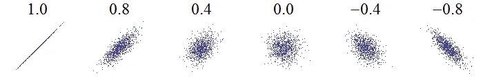
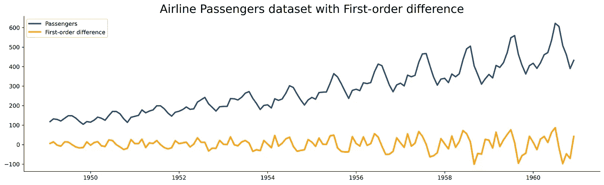
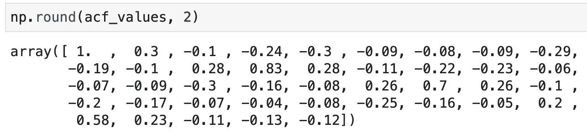
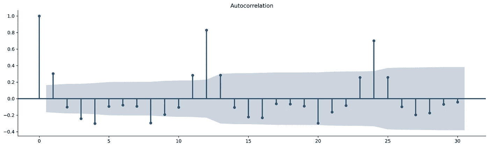
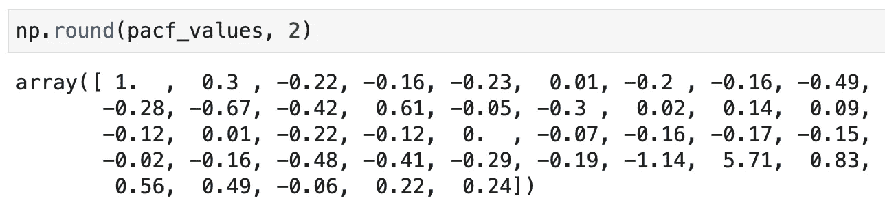
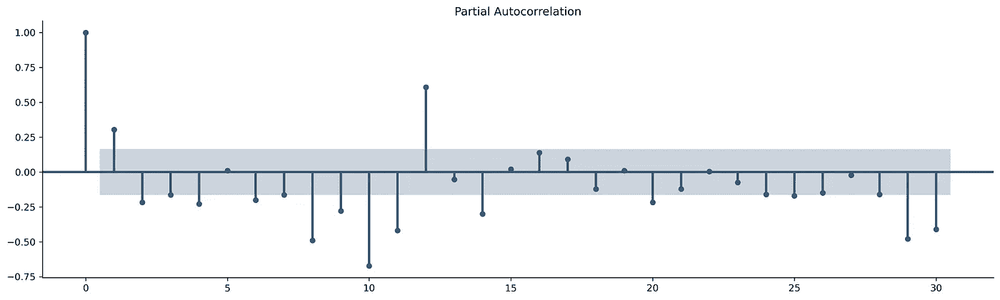

# 从零开始的时间序列——解释自相关和偏自相关

> 原文：<https://towardsdatascience.com/time-series-from-scratch-autocorrelation-and-partial-autocorrelation-explained-1dd641e3076f?source=collection_archive---------4----------------------->

## [时间序列从无到有](https://towardsdatascience.com/tagged/time-series-from-scratch)

## 《从零开始的时间序列》系列的第 5 部分——了解 ACF 和 PACF 的所有信息——从理论、实施到解释。

[阿梅恩·法赫米](https://unsplash.com/@ameenfahmy?utm_source=unsplash&utm_medium=referral&utm_content=creditCopyText)在 [Unsplash](https://unsplash.com/s/photos/dark-abstract?utm_source=unsplash&utm_medium=referral&utm_content=creditCopyText) 上的照片

今天你将学习两个用于分析时间序列和选择模型参数的函数——自相关函数(ACF)和部分自相关函数(PACF)。两者都是基于*相关性*，一个来自统计学的简单概念，所以你先来回顾一下。

这篇文章的结构如下:

*   从相关到自相关
*   自相关——理论与实现
*   偏自相关——理论与实现
*   如何解读 ACF 和 PACF 剧情
*   结论

# 从相关到自相关

这两个术语紧密相连。相关性衡量两个序列之间线性关系的强度:

*   相关性越接近+1，正线性关系越强
*   相关性越接近-1，负线性关系越强
*   相关性越接近 0，线性关系越弱。

下图完美地总结了这个概念:

图 1——相关示例(来源:[维基共享资源](https://commons.wikimedia.org/wiki/File:Correlation_examples_1.png))

自相关是相同的，但有一点不同，您将计算自身滞后一定时间单位的序列之间的相关性。如果您没有完全理解它，请不要担心，因为我们将在接下来探索它。

在本文中，您将使用[航班乘客](https://raw.githubusercontent.com/jbrownlee/Datasets/master/airline-passengers.csv)数据集。以下是如何导入库、加载和绘制数据集:

这是数据集的样子:

图片 2-航空乘客数据集(图片由作者提供)

接下来是自相关。

# 自相关——理论与实现

如前所述，自相关显示的是一个序列与其自身滞后一定时间单位的相关性。一旦作图，X 轴显示滞后数，Y 轴显示该序列与该滞后序列的相关性。y 轴的范围从-1 到 1。

这里有一个例子。

航空乘客数据集显示了从 1949 年到 1960 年每月的乘客数量。自相关回答以下问题:“本月的乘客数量与上个月的乘客数量的相关程度如何？”。这里，上个月表示滞后值为 1。

你可以换一种方式提问，询问本月的乘客数量与一年前的乘客数量有多大关联。那么，滞后值将是 12。这是一个很好的问题，因为从图表中可以看出每年的季节性。

有一点要记住*——你使用的滞后越多，相关性就越低*。最近的时期影响更大。

在计算自相关之前，**你应该让时间序列平稳**。我们还没有讨论平稳性的概念，但是我们将在下面的文章中讨论。简而言之，均值、方差和协方差不应随时间而变化。

使时间序列平稳的最简单方法是通过计算[一阶差](/time-series-from-scratch-introduction-to-time-series-with-pandas-347ac9c6b451)。这不是一种从统计上证明平稳性的方法，但现在不用担心这个问题。

一阶差分的计算方法如下:

以下是这两个系列的外观:

图片 3-航空乘客数据集-原始和差异(图片由作者提供)

差分系列看起来不是完全静止的，但现在适合。

您现在可以使用`statsmodels`中的`acf()`函数来计算自相关:

这些值是这样的，四舍五入到小数点后两位:

图片 4-航班乘客自相关值(图片由作者提供)

第一个值是 1，因为计算了两个相同序列之间的相关性。但是看看第 12 期，自相关值是 0.83。这说明 12 个周期前的价值对今天的价值有很大的影响。

此外，您可以使用`plot_acf()`功能直观地检查自相关:

它看起来是这样的:

图 5 —航班乘客自相关图(图片由作者提供)

该图证实了我们关于滞后 12 的相关性的假设。在滞后 24 时也是如此，但相关性随着时间的推移而下降。12 个周期前的价值比 24 个周期前的价值对今天的价值有更大的影响。

另一个需要注意的是阴影区域。里面的任何东西都没有统计学意义。

# 偏自相关——理论与实现

这个有点难以理解。它的作用与常规自相关相同，即显示一个序列与其自身滞后一定时间单位的相关性。但是有一个转折。**只显示直接效果，去掉所有中间效果**。

例如，您想知道今天和 12 个月前的乘客数量之间的直接关系。你不在乎中间的任何事。

12 个月的乘客数量影响 11 个月前的乘客数量——整个链条一直重复，直到最近一段时间。这些间接影响在部分自相关计算中被忽略。

在计算之前，你也应该让时间序列**平稳**。

您可以使用`statsmodels`中的`pacf()`函数进行计算:

这些值如下所示:

图片 6-飞机乘客的部分自相关值(图片由作者提供)

滞后 12 时的相关值下降到 0.61，表明直接关系稍弱。让我们用图表来看一下结果，以确认这些仍然是重要的:

它看起来是这样的:

图 7-飞机乘客部分自相关图(图片由作者提供)

总结一下——滞后 12 年仍然很明显，但滞后 24 年就不明显了。12 之前的几个滞后与原始时间序列负相关。花点时间想想为什么。

还有一个重要的问题——你如何解释 ACF 和 PACF 预测图？接下来我们来回答这个问题。

# 如何解读 ACF 和 PACF 剧情

您将很快了解到的时间序列模型，如自动回归(AR)、移动平均(MA)或它们的组合(ARMA)，需要您指定一个或多个参数。这些可以通过观察 ACF 和 PACF 图得到。

简而言之:

*   如果 ACF 图逐渐下降，PACF 立即下降，使用自回归模型。
*   如果 ACF 图立即下降，PACF 逐渐下降，使用移动平均线模型。
*   如果 ACF 和 PACF 都逐渐下降，结合自回归和移动平均模型(ARMA)。
*   如果 ACF 和 PACF 都立即下降(没有明显的滞后)，很可能您将无法对时间序列建模。

尽管如此，阅读 ACF 和 PACF 图是有挑战性的，你最好使用网格搜索来找到最佳参数值。一个最佳的参数组合具有最低的误差(如 MAPE)或最低的一般质量估计(如 AIC)。我们将很快介绍时间序列评估指标，敬请关注。

# 结论

简单来说，就是自相关和偏自相关。函数和图都有助于分析时间序列数据，但我们将主要依靠蛮力参数查找方法进行预测。做网格搜索比看图表容易得多。

ACF 和 PACF 都需要平稳的时间序列。我们现在只简要介绍了平稳性，但是在下一篇文章中会有所改变。请继续关注，学习关于稳定性、稳定性测试和测试自动化的一切。

感谢阅读。

喜欢这篇文章吗？成为 [*中等会员*](https://medium.com/@radecicdario/membership) *继续无限制学习。如果你使用下面的链接，我会收到你的一部分会员费，不需要你额外付费。*

<https://medium.com/@radecicdario/membership>  

# 了解更多信息

*   [2021 年学习数据科学的前 5 本书](/top-5-books-to-learn-data-science-in-2020-f43153851f14)
*   [如何使用 Cron 调度 Python 脚本——您需要的唯一指南](/how-to-schedule-python-scripts-with-cron-the-only-guide-youll-ever-need-deea2df63b4e)
*   [Dask 延迟—如何轻松并行化您的 Python 代码](/dask-delayed-how-to-parallelize-your-python-code-with-ease-19382e159849)
*   [如何使用 Python 创建 PDF 报告—基本指南](/how-to-create-pdf-reports-with-python-the-essential-guide-c08dd3ebf2ee)
*   [即使没有大学文凭也要在 2021 年成为数据科学家](/become-a-data-scientist-in-2021-even-without-a-college-degree-e43fa934e55)

# 保持联系

*   关注我的 [Medium](https://medium.com/@radecicdario) 了解更多类似的故事
*   注册我的[简讯](https://mailchi.mp/46a3d2989d9b/bdssubscribe)
*   在 [LinkedIn](https://www.linkedin.com/in/darioradecic/) 上连接