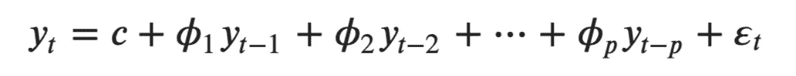
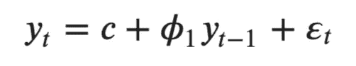
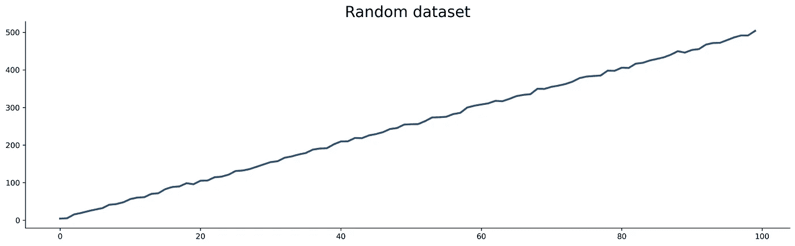
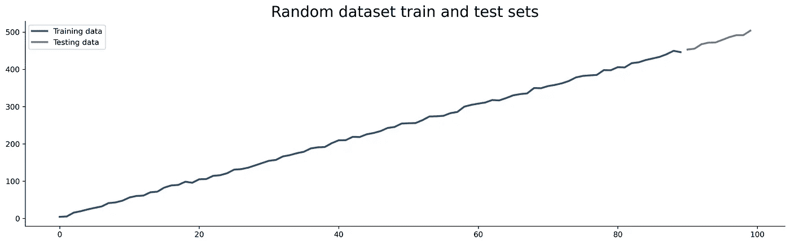
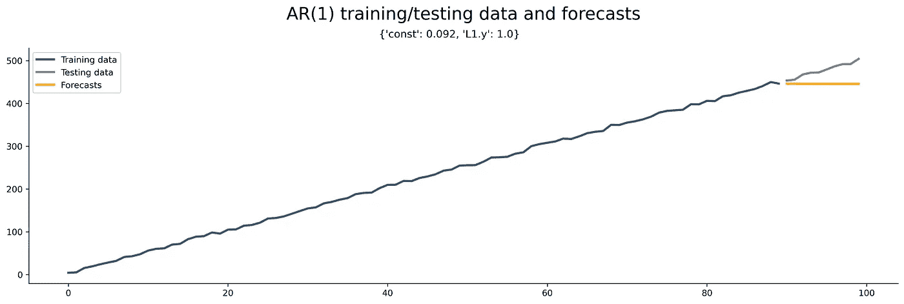
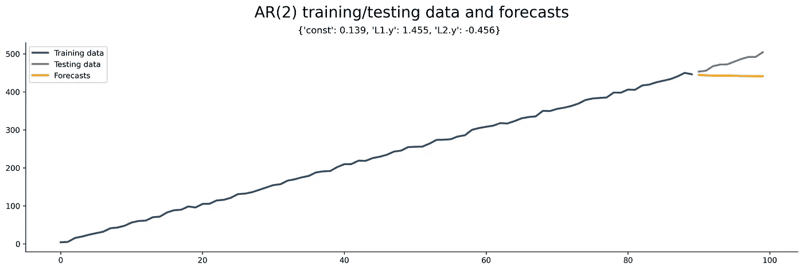
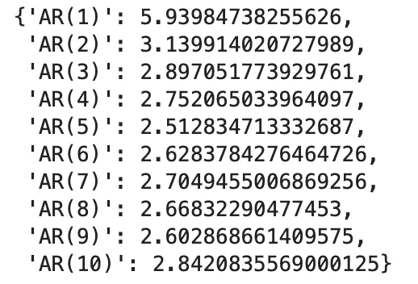
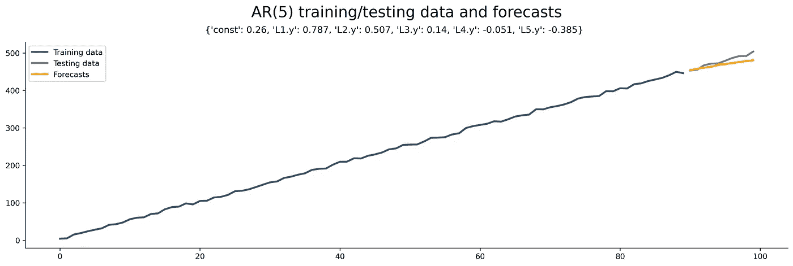

# 从零开始的时间序列——自回归理论与实现

> 原文：<https://towardsdatascience.com/time-series-from-scratch-autoregression-theory-and-implementation-f8c614f738f2?source=collection_archive---------8----------------------->

## [时间序列从无到有](https://towardsdatascience.com/tagged/time-series-from-scratch)

## 将回归应用于时间序列问题——如何做，值得这么麻烦吗？

Pawel Czerwinski 在 [Unsplash](https://unsplash.com/s/photos/abstract?utm_source=unsplash&utm_medium=referral&utm_content=creditCopyText) 上拍摄的照片

到目前为止，你知道所有关于移动平均线的东西——不管是简单的还是指数加权的。现在是时候介绍自回归了，这是更高级预测模型的一个基本主题。

我们将在实现之前讨论基础理论，包括直觉和一些数学知识。一般来说，您应该熟悉[时间序列](/time-series-analysis-from-scratch-seeing-the-big-picture-2d0f9d837329)，因此如果您对该主题不熟悉，请从头开始阅读该序列。前几篇文章的链接在这篇文章的末尾。

这篇文章的结构如下:

*   自回归—理论和数学
*   自回归 Python 中的实现
*   自回归-选择最佳参数值
*   结论

# 自回归—理论和数学

术语*自回归* (AR)与统计中的常规回归密切相关。唯一的问题是 AR 模型以滞后格式使用来自相同输入变量的数据——因此出现了*自回归*的*自动*部分。

自回归的预测能力有限，就像简单移动平均线 T21 一样。该算法使用过去值的线性组合来进行未来预测。

一般自回归模型用以下公式表示:

图片 1-通用自回归模型公式(作者图片)

其中`c`为常数，`phi`为达到`p`阶的滞后系数，`epsilon`为不可约误差(白噪声)。

使用 AR 模型时，您只需指定参数`p`的值。如果`p=1`，那么 AR 模型公式简化为:

图片 2 — AR(1)模型公式(图片由作者提供)

就这么简单！

更高阶的`p`往往会给出更好的预测结果，但仅限于某一点。稍后您将看到如何自动为`p`选择最佳值。但是首先，让我们看看如何用 Python 实现自回归。

# 自回归 Python 中的实现

今天，您将创建自己的数据集。这是一条简单的加了一点噪声的直线:

它看起来是这样的:

图片 3-随机直线数据集(图片由作者提供)

下一步是将数据集分成训练和测试子集。如果你不熟悉这个过程，请阅读这篇文章。您将使用最后 10 个数据点进行测试，其他数据点用于训练:

这是两个数据集的样子:

图 4 —训练集和测试集(图片由作者提供)

整洁！接下来，您将声明一个用于训练和可视化 AR 模型的函数— `train_and_plot(maxlag: int)`。这个函数是为了方便您避免一遍又一遍地复制粘贴几乎相同的代码。它在训练集上训练`AR(p=maxlag)`模型，并以图形方式比较预测和测试集。

该函数还在绘图副标题中打印模型系数，因此如果您愿意，可以将它们与前面讨论的数学公式联系起来。

代码如下:

您现在可以使用这个函数，通过在新的单元格中执行`train_and_plot(maxlag=1)`来训练一个简单的 AR(1)模型。它显示如下图:

图片 5 — AR(1)模型(图片由作者提供)

您可以将参数`p`更改为您想要的任何值。例如，AR(2)模型的结果如下所示(`train_and_plot(maxlag=2)`):

图片 6 — AR(2)模型(图片由作者提供)

问题依然存在— **这个数据集的最佳 AR 模型阶数是多少？让我们在下一部分回答这个问题。**

# 自回归-选择最佳参数值

用 AR(1)和 AR(2)得到的预测看起来并不乐观。你总是想优化`p`的值。一种方法是绘制自相关图和偏自相关图，并对其进行检查，但这工作量太大。

更好的方法是在一个循环中训练 AR(1)到 AR(n)模型，并跟踪测试集的性能。您可以使用 RMSE 或任何其他指标来实现这一点。

下面是一个简单的代码片段:

以下是 AR(1)至 AR(10)模型的误差:

图 7 — AR 模型在测试集上获得的错误(图片由作者提供)

看起来 AR(5)模型在测试集上产生了最低的误差。以下是数据集和预测在此模型顺序中的样子:

图 8 —优化的 AR 模型预测(图片由作者提供)

使用 AIC 度量进行评估也是很常见的，因为它更倾向于简单的模型而不是复杂的模型。这两个指标都表明 AR(5)是最好的模型。

# 最后的话

总之，您可以使用 AR 模型来预测简单的数据集。该算法与移动平均模型结合使用时效果最佳，这是我们将在下一篇文章中讨论的主题。

如果你决定对像*航空乘客*这样的数据集应用 AR 模型，不管模型顺序如何，你都不会得到好的预测结果。让数据集保持平稳可能会有所帮助，但预测仍然没有使用[指数平滑法](/time-series-from-scratch-exponential-smoothing-theory-and-implementation-6683eb271bad)预测的好。

我们将在下一篇文章中探讨将自回归和移动平均结合成一个单一模型(ARMA)是否会有所帮助。

*喜欢这篇文章吗？成为* [*中等会员*](https://medium.com/@radecicdario/membership) *继续无限制学习。如果您使用以下链接，我将收取您的部分会员费，无需您支付额外费用:*

 [## 通过我的推荐链接加入 Medium-Dario rade ci

### 作为一个媒体会员，你的会员费的一部分会给你阅读的作家，你可以完全接触到每一个故事…

medium.com](https://medium.com/@radecicdario/membership) 

# 阅读整个系列

1.  [纵观全局](/time-series-analysis-from-scratch-seeing-the-big-picture-2d0f9d837329)
2.  [熊猫时间序列介绍](/time-series-from-scratch-introduction-to-time-series-with-pandas-347ac9c6b451)
3.  [白噪声和随机游走](/time-series-from-scratch-white-noise-and-random-walk-5c96270514d3)
4.  [分解时间序列数据](/time-series-from-scratch-decomposing-time-series-data-7b7ad0c30fe7)
5.  [自相关和偏自相关](/time-series-from-scratch-autocorrelation-and-partial-autocorrelation-explained-1dd641e3076f)
6.  [稳定性测试和自动化](/time-series-from-scratch-stationarity-tests-and-automation-14b02fa5ca4d)
7.  [培训/测试分割和评估指标](/time-series-from-scratch-train-test-splits-and-evaluation-metrics-4fd654de1b37)
8.  [移动平均线(MA)理论与实现](/time-series-from-scratch-moving-averages-ma-theory-and-implementation-a01b97b60a18)
9.  [指数加权移动平均线(EWMA)理论及实现](/time-series-from-scratch-exponentially-weighted-moving-averages-ewma-theory-and-implementation-607661d574fe)
10.  [指数平滑理论及实现](/time-series-from-scratch-exponential-smoothing-theory-and-implementation-6683eb271bad)

# 保持联系

*   关注我在[媒体](https://medium.com/@radecicdario)上的更多类似的故事
*   注册我的[简讯](https://mailchi.mp/46a3d2989d9b/bdssubscribe)
*   在 [LinkedIn](https://www.linkedin.com/in/darioradecic/) 上连接