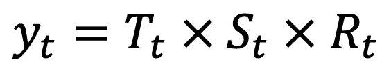

# 从头开始的时间序列-分解时间序列数据

> 原文：<https://towardsdatascience.com/time-series-from-scratch-decomposing-time-series-data-7b7ad0c30fe7?source=collection_archive---------1----------------------->

## [时间序列从无到有](https://towardsdatascience.com/tagged/time-series-from-scratch)

## 从零开始的时间序列系列的第 4 部分—了解如何将时间序列分解为趋势、季节和残差部分。

由[帕韦尔·切尔文斯基](https://unsplash.com/@pawel_czerwinski?utm_source=unsplash&utm_medium=referral&utm_content=creditCopyText)在 [Unsplash](https://unsplash.com/s/photos/dark-abstract?utm_source=unsplash&utm_medium=referral&utm_content=creditCopyText) 上拍摄的照片

到目前为止，你了解了时间序列分析背后的[大图](/time-series-analysis-from-scratch-seeing-the-big-picture-2d0f9d837329)，知道了用熊猫进行[时间序列数据操作的基本知识，并对](/time-series-from-scratch-introduction-to-time-series-with-pandas-347ac9c6b451)[白噪声和随机游走](/time-series-from-scratch-white-noise-and-random-walk-5c96270514d3)的话题驾轻就熟。今天你将学习一些实用的东西——如何将时间序列分解成*趋势*、*季节*和*残差*成分——并理解为什么以及何时应该这样做。

这篇文章的结构如下:

*   什么是时间序列分解？
*   加法与乘法时间序列成分
*   动作分解
*   结论

# 什么是时间序列分解？

简而言之，时间序列分解是将时间序列分解为以下部分的过程:

*   **趋势** —一段时间内的总体运动
*   **季节性** —在个别季节捕捉到的行为
*   **残差**——趋势和季节成分未捕捉到的一切

这种技术最常用于分析历史时间序列数据。它有时也用于预测。一次建模趋势和季节性可能是一个太困难的任务，所以单独处理组件可能是一个更好的方法。

今天的文章只着重分析。我们将在其他时间离开预测。导入以下库以便跟进:

分解时间序列需要您指定建模类型。简而言之，这告诉 Python 应该如何组合组件来产生原始的时间序列。您将了解两种方法— *加法*(将组件相加)和*乘法*(将组件相乘)。

# 加法与乘法时间序列成分

有两种组合时间序列组件的技术:

*   添加剂
*   增加的

我们关心这些，因为时间序列分解需要您为季节性组件指定一个模型类型。默认值是`additive`，但是您可以很容易地更改它。

术语*加法*是指将单个成分(趋势、季节性和残差)加在一起:

图片 1-加法时间序列公式(图片由作者提供)

加性趋势表示线性趋势，加性季节性表示季节性周期的频率(宽度)和幅度(高度)相同。

术语*乘法*是指单个成分(趋势、季节性和残差)相乘:

图片 2-乘法时间序列公式(图片由作者提供)

倍增趋势表示非线性趋势(曲线趋势线)，倍增季节性表示季节性周期的频率(宽度)和/或幅度(高度)增加/减少。

趋势和季节性可以是相加或相乘的，这意味着有四种方法可以将它们结合起来:

*   附加趋势和附加季节性
*   加法趋势和乘法季节性
*   乘法趋势和加法季节性
*   倍增趋势和倍增季节性

## 附加趋势和附加季节性

*相加趋势*表示趋势是线性的(直线)，而*相加季节性*表示季节周期的宽度或高度不会随时间发生任何变化。

以下代码片段创建了一个长达 10 年的虚拟月度采样时间序列，用于模拟累加趋势和季节性:

它看起来是这样的:

图 3-附加趋势和附加季节性时间序列(图片由作者提供)

如您所见，时间序列显示了线性趋势和季节性，不会随时间而改变。这不是看起来最典型的时间序列，因为最有可能的是，一个季节周期的幅度将随着趋势的增加而变化。

## 加法趋势和乘法季节性

*相加趋势*表示趋势是线性的(直线)，而*倍增季节性*表示季节性周期的宽度或高度会随着时间的推移而发生变化。

以下代码片段创建了一个长达 10 年的虚拟月度采样时间序列，用于模拟加法趋势和乘法季节性:

它看起来是这样的:

图 4-加法趋势和乘法季节性时间序列(图片由作者提供)

同样，趋势是线性的，但季节周期的高度随着时间的推移而增加。由于显而易见的原因，这种行为对于许多时间序列来说是典型的——更多的交易量(y 轴上的总体增长)在单个季节中引入了更多的波动性。

## 乘法趋势和加法季节性

*乘法趋势*表示趋势不是线性的(曲线)，而*加法季节性*表示季节周期的宽度或高度不会随时间发生任何变化。

以下代码片段创建了一个长达 10 年的虚拟月度采样时间序列，用于模拟乘法趋势和加法季节性:

它看起来是这样的:

图片 5-乘法趋势和加法季节性时间序列(图片由作者提供)

你可以看到趋势是稍微弯曲的。我没有见过太多像这样的时间序列，因为随着 y 轴值的增加，季节周期的幅度往往会有所不同。但是，这仍然是一种可能的情况。

## 倍增趋势和倍增季节性

*倍增趋势*表示趋势不是线性的(曲线)，而*倍增季节性*表示季节性周期的宽度或高度会随着时间的推移而发生变化。

以下代码片段创建了一个模拟倍增趋势和倍增季节性的虚拟 10 年月度采样时间序列:

它看起来是这样的:

图片 6-倍增趋势和倍增季节性时间序列(图片由作者提供)

这是时间序列数据中另一种广泛存在的模式。你会经常在销售数据中看到这一点，例如，当对特定产品/服务的需求随着时间的推移而增加时，但大多数销售是在夏季进行的(想想飞机票)。

现在，您知道了在分解时间序列之前应该寻找的不同类型的模式。接下来，您将学习如何将时间序列分解为趋势、季节和残差部分。

# 动作分解

`statsmodels`中的`seasonal_decompose()`函数至少包含两个参数:

*   `x: array` —你的时间序列。
*   `model: str` —季节性成分的类型，可以是*加法*或*乘法*。默认值为*相加*。

记住这一点，让我们来分解我们的`df_aa`——一个既有加性趋势又有季节性的时间序列:

结果如下:

图 7-使用加法模型的加法趋势和季节性分解(图片由作者提供)

至少可以说，趋势和季节性因素都被很好地捕捉到了。由于数据是合成的，我们知道趋势总是在上升，季节性因素看起来也应该如此。残差应该以零为中心，呈正态分布。此外，在残差中应该看不到明显的模式。这种说法在大部分时间序列中都成立。

接下来，让我们看看如果对`df_mm`应用加法分解模型会发生什么——一个既有乘法趋势又有季节性的时间序列:

结果如下:

图 8-使用加法模型的乘法趋势和季节性分解(图片由作者提供)

看看这些残差就知道了。它们以-200 左右为中心，具有巨大的标准差，并且还显示出一种加性模型没有捕捉到的独特模式。

让我们为同一个`df_mm`数据集拟合一个乘法分解模型，看看会发生什么:

结果如下:

图片 9-使用乘法模型的乘法趋势和季节性分解(图片由作者提供)

残差现在以 1 为中心，并且具有更低的范围和标准偏差。

# 结论

这就是你要做的——简而言之，时间序列分解。在分析历史数据或对单个时间序列组件建模时，这是一个很好的工具。在应用分解算法之前，一定要知道你的时间序列遵循的模式。

我已经多次使用分解来自动确定一个季节循环中的周期数。通过计算季节性分解组件的唯一元素的数量，也可以做到这一点。然后，如果季节性成分的范围很大，你知道你应该使用捕捉季节性的模型。

你会学到季节模特的一切，所以现在还不要担心。下一篇文章将讨论自相关和偏自相关函数、绘图和解释。敬请关注。

*喜欢这篇文章吗？成为* [*中等会员*](https://medium.com/@radecicdario/membership) *继续无限制学习。如果你使用下面的链接，我会收到你的一部分会员费，不需要你额外付费。*

<https://medium.com/@radecicdario/membership>  

# 了解更多信息

*   [2021 年学习数据科学的前 5 本书](/top-5-books-to-learn-data-science-in-2020-f43153851f14)
*   [如何使用 Cron 调度 Python 脚本——您需要的唯一指南](/how-to-schedule-python-scripts-with-cron-the-only-guide-youll-ever-need-deea2df63b4e)
*   [Dask 延迟——如何轻松并行化您的 Python 代码](/dask-delayed-how-to-parallelize-your-python-code-with-ease-19382e159849)
*   [如何使用 Python 创建 PDF 报告—基本指南](/how-to-create-pdf-reports-with-python-the-essential-guide-c08dd3ebf2ee)
*   [即使没有大学文凭也要在 2021 年成为数据科学家](/become-a-data-scientist-in-2021-even-without-a-college-degree-e43fa934e55)

# 保持联系

*   关注我的[媒体](https://medium.com/@radecicdario)以获取更多类似的故事
*   注册我的[简讯](https://mailchi.mp/46a3d2989d9b/bdssubscribe)
*   在 [LinkedIn](https://www.linkedin.com/in/darioradecic/) 上连接