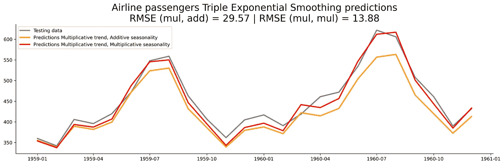

# 从零开始的时间序列——指数平滑理论与实现

> 原文：<https://towardsdatascience.com/time-series-from-scratch-exponential-smoothing-theory-and-implementation-6683eb271bad?source=collection_archive---------6----------------------->

## [时间序列从无到有](https://towardsdatascience.com/tagged/time-series-from-scratch)

## 单指数平滑、双指数平滑或三指数平滑——本文已经介绍过了。了解这些简单而有效的预测算法的来龙去脉。

照片由[尼基塔·辛哈尔](https://unsplash.com/@nikhita?utm_source=unsplash&utm_medium=referral&utm_content=creditCopyText)在 [Unsplash](https://unsplash.com/s/photos/dark-abstract?utm_source=unsplash&utm_medium=referral&utm_content=creditCopyText) 上拍摄

到目前为止，你已经对均线有所了解，也知道为什么给均线分配权重是个好主意。但是故事还没完。在本系列的第 10 篇文章中，您将最终获得一组不错的未来预测——这都要归功于指数平滑法。

今天，您将了解三种算法——简单指数平滑、双倍指数平滑和三倍指数平滑。预测的准确性通常会随着算法的复杂性而增加。一会儿你就会明白为什么了。

这篇文章的结构如下:

*   数据集加载和准备
*   简单指数平滑
*   双指数平滑
*   三重指数平滑
*   结论

# 数据集加载和准备

您将使用[航班乘客](https://raw.githubusercontent.com/jbrownlee/Datasets/master/airline-passengers.csv)数据集。下面是如何将其加载到 Python 中并可视化显示的方法:

你注意到那个`df.index.freq`呼叫了吗？使用指数平滑算法时，需要为数据集分配一个频率。默认值是 MS(月初)，但并不总是如此。所以最好每次都手动申报。

以下是数据集的外观:

图片 1-航班乘客数据集(图片由作者提供)

您还应该[将数据集](/time-series-from-scratch-train-test-splits-and-evaluation-metrics-4fd654de1b37)分成训练和测试子集。下面的代码片段可以做到这一点——最后两年的时间用于测试:

今天，您将在蓝色子集上训练所有模型，并在灰色子集上进行评估:

图片 2 —航空客运列车和测试集(图片由作者提供)

这就是你需要做的。现在开始预测。

# 简单指数平滑

信不信由你，你已经知道了很多关于简单指数平滑的知识。它是指数加权移动平均线的同义词，这个话题在[之前的文章](/time-series-from-scratch-exponentially-weighted-moving-averages-ewma-theory-and-implementation-607661d574fe)中有所涉及。

简单的指数平滑不关心趋势或季节性。如果你的数据集展示了这些，那就太糟糕了。航空公司的乘客数据有，所以预测应该是没用的。该算法只有一个平滑参数，即 alpha，它说明了色阶。预测是一条平坦的线。

数学上，简单的指数平滑可以用以下公式表示:

图 3-简单的指数平滑公式(图片由作者提供)

您不必从头实现它，因为 Statsmodels 库中的`SimpleExpSmoothing`类会为您实现。您所要做的就是指定`smoothing_level`，或者 alpha 参数。你知道如何根据跨度计算 alpha，如果不知道，请阅读[上一篇文章](/time-series-from-scratch-exponentially-weighted-moving-averages-ewma-theory-and-implementation-607661d574fe)。

以下是如何在 Python 中实现简单的指数平滑:

很感谢 [Eryk Lewinson](https://medium.com/u/44bc27317e6b?source=post_page-----6683eb271bad--------------------------------) 和 [Lubomir Franko](https://medium.com/u/357745cbddc8?source=post_page-----6683eb271bad--------------------------------) ，因为我不知道`scikit-learn`可以直接算 RMSE。

以下是数据集和预测的样子:

图 4 —使用简单指数平滑法进行预测(图片由作者提供)

这些预测一点也不令人印象深刻。简单的指数平滑法只关心水平，完全忽略了趋势和季节因素。这就是为什么预测是一条平坦的线。

双指数平滑应该更好，因为它既考虑了水平又考虑了趋势。

# 双指数平滑

这种方法也被称为霍尔特方法，以查尔斯·c·霍尔特 1957 年的论文命名。

它被称为*双*指数平滑，因为它基于两个平滑参数——Alpha(代表水平)和 Beta(代表趋势)。该算法解决了简单指数平滑的主要问题，因为现在预测可以考虑历史数据中的趋势。

说到趋势，它可以是加法也可以是乘法:

*   **相加趋势** —趋势随时间线性增长。
*   **乘法趋势** —趋势不是线性增长，而是显示出一种曲率——即使是轻微的曲率。

Statsmodels 库中的`ExponentialSmoothing`类接受一个`trend`参数，可能的值是`add`和`mul`。如果您不能确定数据中存在哪种类型的趋势，请对两种趋势进行测试，看看哪种趋势产生的误差最小。

如果你预测一个长的数据周期，考虑在初始化模型时添加`damped=True`。这样做将减少趋势的影响，当趋势不会以当前速度无限增长时，这很有帮助。

数学上，双指数平滑可以用以下公式表示:

图 5-双指数平滑公式(图片由作者提供)

其中`n`代表未来的时间步数。α和β是平滑参数。

以下是如何在 Python 中实现双指数平滑的方法，适用于加法和乘法趋势:

以下是历史数据和预测的直观显示:

图 6 —使用双指数平滑法进行预测(图片由作者提供)

我们的主张被证实了！双指数平滑法成功地解决了水平和趋势问题。乘法模型在测试集上产生了较低的误差，所以我们将在下一节中使用它。

尽管如此，双指数平滑法无法解决航空乘客数据集的一个重要组成部分——季节性。这就是三重指数平滑的用武之地。

# 三重指数平滑

三年后(1960 年)，[彼得·r·温特斯](https://dl.acm.org/profile/99658713217)和[查尔斯。C. Holt](https://en.wikipedia.org/wiki/Charles_C._Holt) 扩展了最初的 Holt 方法，以解决季节性问题。该算法以他们两人的名字命名——霍尔特-温特斯法。

又增加了另一个参数——Gamma——来解决季节因素。该算法还要求您指定一个季节周期中的周期数。在大多数资源中用`L`表示。

就像趋势一样，季节性也可以是**加法**或**乘法**。

我们的航空乘客数据集显示了每年的季节性，这意味着在一个季度中有 12 个数据点。

Statsmodels 库的`ExponentialSmoothing`类接受`seasonal`和`seasonal_periods`参数。第一个可以是加法或乘法，第二个在我们的例子中是 12。

数学上，三重指数平滑可以用以下公式表示:

图 7——三重指数平滑公式(图片由作者提供)

其中`n`代表未来的时间步数。Alpha、Beta 和 Gamma 是平滑参数。

以下是如何在 Python 中实现三重指数平滑的方法——乘法趋势，适用于加法和乘法季节性:

以下是历史数据和预测的直观显示:

图 8 —使用三重指数平滑法进行预测(图片由作者提供)

预测有点难看，所以让我们去掉历史数据:

现在更容易看出区别了:

图 9-针对测试集的三重指数平滑预测(图片由作者提供)

具有倍增季节性的模型效果更好，因为季节性周期中的值的分布不是随时间线性变化的。大约 14 的 RMSE 值是如此令人印象深刻，以至于更复杂的算法将很难超越它。

# 最后的话

我在文章的开头向您承诺了一组不错的预测。三重指数平滑兑现了这一承诺。当数据集和时间都有限，或者解决方案必须在[数据库](/time-series-forecasting-with-sql-its-easier-than-you-think-1f5b362d0c81)中实现时，这是我的首选算法之一。

你会惊讶于像指数平滑这样简单的东西比神经网络好多少倍。当然，这完全取决于可用的数据量以及从中能提取出什么。

下一篇文章将涉及自回归(AR)，之后的一篇文章将自回归与移动平均线(ARMA)的概念联系起来，敬请关注。

*喜欢这篇文章吗？成为* [*中等会员*](https://medium.com/@radecicdario/membership) *继续无限制学习。如果你使用下面的链接，我会收到你的一部分会员费，不需要你额外付费。*

<https://medium.com/@radecicdario/membership>  

# 阅读整个系列

1.  [纵观全局](/time-series-analysis-from-scratch-seeing-the-big-picture-2d0f9d837329)
2.  [熊猫时间序列介绍](/time-series-from-scratch-introduction-to-time-series-with-pandas-347ac9c6b451)
3.  [白噪声和随机游走](/time-series-from-scratch-white-noise-and-random-walk-5c96270514d3)
4.  [分解时间序列数据](/time-series-from-scratch-decomposing-time-series-data-7b7ad0c30fe7)
5.  [自相关和偏自相关](/time-series-from-scratch-autocorrelation-and-partial-autocorrelation-explained-1dd641e3076f)
6.  [稳定性测试和自动化](/time-series-from-scratch-stationarity-tests-and-automation-14b02fa5ca4d)
7.  [培训/测试拆分和评估指标](/time-series-from-scratch-train-test-splits-and-evaluation-metrics-4fd654de1b37)
8.  [移动平均线(MA)理论与实现](/time-series-from-scratch-moving-averages-ma-theory-and-implementation-a01b97b60a18)
9.  [指数加权移动平均线(EWMA)理论及实现](/time-series-from-scratch-exponentially-weighted-moving-averages-ewma-theory-and-implementation-607661d574fe)

# 保持联系

*   在[媒体](https://medium.com/@radecicdario)上关注我，了解更多类似的故事
*   注册我的[简讯](https://mailchi.mp/46a3d2989d9b/bdssubscribe)
*   在 [LinkedIn](https://www.linkedin.com/in/darioradecic/) 上连接