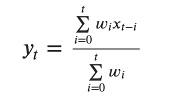
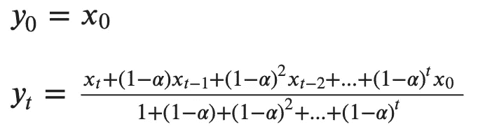
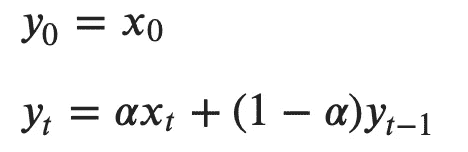
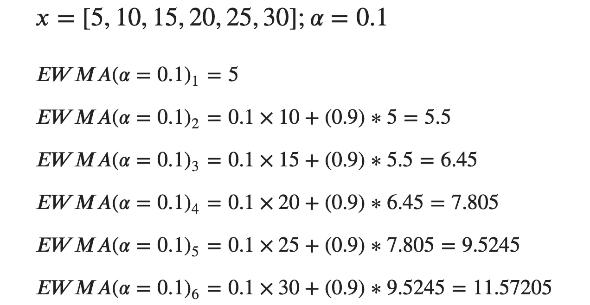
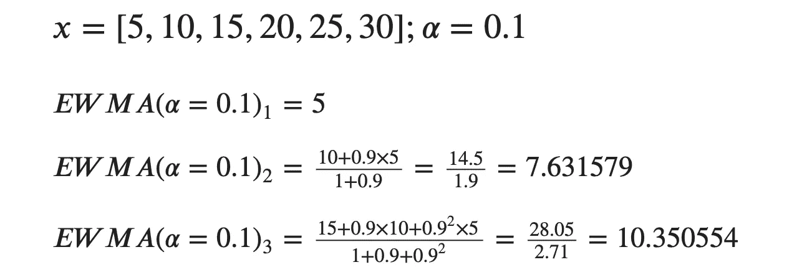
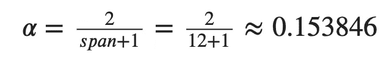
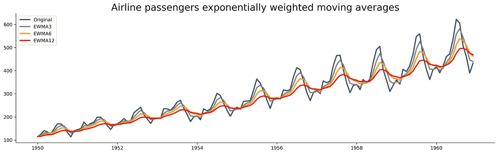
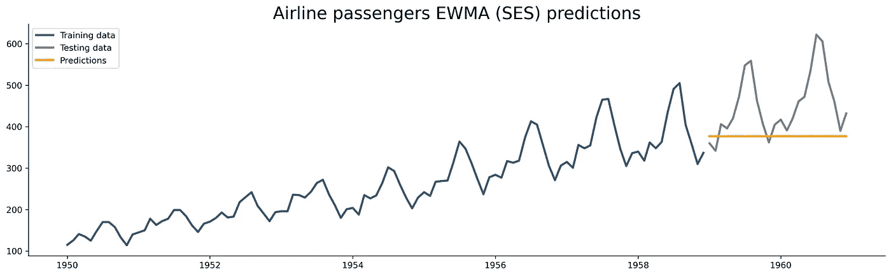

# 从零开始的时间序列——指数加权移动平均(EWMA)理论和实现

> 原文：<https://towardsdatascience.com/time-series-from-scratch-exponentially-weighted-moving-averages-ewma-theory-and-implementation-607661d574fe?source=collection_archive---------4----------------------->

## [时间序列从无到有](https://towardsdatascience.com/tagged/time-series-from-scratch)

## EWMA 是对简单移动平均线的改进。但是对于准确的预测来说，这就足够了吗？

照片由[瑞安·斯通](https://unsplash.com/@rstone_design?utm_source=unsplash&utm_medium=referral&utm_content=creditCopyText)在 [Unsplash](https://unsplash.com/?utm_source=unsplash&utm_medium=referral&utm_content=creditCopyText) 上拍摄

上一篇文章提供了简单移动平均线的理论和实践介绍。今天我们将使用它的兄弟——指数加权移动平均线来增加趣味。

今天的文章结构相同，所以应该不难理解。但是，如果您不熟悉时间序列的概念，这篇文章并不是一个好的起点。这是本系列的第 9 篇文章，从头开始阅读本系列是一个更好的方法。所有以前文章的链接都在这篇文章的末尾。

这篇文章的结构如下:

*   指数加权移动平均线——理论和数学
*   指数加权移动平均法——在熊猫中的应用
*   指数加权移动平均线—预测
*   结论

# 指数加权移动平均线——理论和数学

就像它的笨兄弟(马)一样，经常不被用来预测。然而，EWMA 是一阶指数平滑的同义词，或者简单指数平滑。指数平滑家族中更复杂的成员可以很好地进行预测，因此有必要先了解 EWMA。

简而言之，EWMA 将权重应用于时间序列的值。更多的权重应用于最近的数据点，使它们与未来的预测更相关。这是简单移动平均线最显著的改进。

这是最通用的 EWMA 公式:

图片 1 —通用 EWMA 公式(图片由作者提供)

`w`表示施加的重量，`x`是输入值，`y`是输出值。

如何定义权重项取决于参数`adjust`的值。当设置为`True`时，通过除以开始阶段的衰减调整系数来计算权重，以说明相对权重的不平衡([源](https://pandas.pydata.org/docs/reference/api/pandas.DataFrame.ewm.html))。该参数默认为`True`，如果保持不变，则通过以下公式计算重量:

图 adjust = True 时的 EWMA 权重计算(图片由作者提供)

这里唯一的新参数是 *alpha* ，它表示平滑因子的值。

当`adjust=False`时，计算重量的公式就简单多了:

图 3-当 adjust=False 时的 EWMA 权重计算(图片由作者提供)

还有其他方法来进行计算，例如通过*质心*、*跨度*和*半衰期*参数，但是为了简单起见，我们将直接传递平滑因子值。

让我们看一个例子。`x`表示没有时间信息的样本时间序列，`alpha`是平滑因子。我们将计算调整前后的 EWMA 值。

以下是未经过调整的**计算结果:**

图 4-EWMA 逐步计算，无调整(图片由作者提供)

正如您所看到的，第一个数据点被复制，其余的通过前面讨论的简单公式计算。

下面是经过调整的计算结果**:**

图 5-EWMA 带调整的逐步计算(图片由作者提供)

并非所有值都被计算出来，因为计算时间随着时间步长的增加而变长。尽管如此，仅仅这几个就应该能让情况明朗起来。

但是有一个好消息——**你不需要担心阿尔法参数！**如果您为`span`参数提供一个值，Pandas 可以自动计算它——它被解释为 n 天移动平均值。

如果使用月度数据，您可能希望选择一年(12 个周期)作为跨度值。然后，alpha 计算如下:

图 6-通过跨度计算 Alpha 参数(图片由作者提供)

总而言之，这是一个避免猜测最佳平滑参数值的好方法。

接下来让我们看看如何用 Python 实现所有这些。

# 指数加权移动平均法——在熊猫中的应用

您将使用[航班乘客](https://raw.githubusercontent.com/jbrownlee/Datasets/master/airline-passengers.csv)数据集。以下是如何将其加载到 Python 中并可视化的方法:

以下是数据集的外观:

图 7-航空乘客数据集(图片由作者提供)

可以使用 Pandas 中的`ewm()`函数来计算指数加权移动平均线。您可以直接通过`alpha`传递平滑值，或者通过`span`参数让您的生活更轻松。这两者现在听起来应该都很熟悉。

下面的代码片段计算跨度值为 3、6 和 12 的未调整指数加权移动平均值，并直观地显示它们:

以下是所有时间序列的样子:

图 8——熊猫的指数加权移动平均线(图片由作者提供)

如你所见，并没有像马一样遭遇到的滞后问题。尽管如此，它并不是最好的预测算法，你很快就会看到。你不能用熊猫来预测未来。Statsmodels 是你的朋友。

接下来让我们来看看预测。

# 指数加权移动平均线—预测

这里有一个简短的回顾。EWMA 比移动平均法有所改进，但仍不是最好的预测算法。EWMA 和 SES(简单指数平滑)是同义词，整个指数平滑算法家族对于预测来说是相当不错的。事实是，你需要不止一个平滑参数(alpha)来捕捉趋势和季节性。

`SimpleExpSmoothing`算法内置于 statsmodels 库中。我们将用它来做预测。但在此之前，我们将[将数据集](/time-series-from-scratch-train-test-splits-and-evaluation-metrics-4fd654de1b37)分成训练和测试子集。最后两年(24 行)用于测试。训练后的结果是可视化的:

这是视觉效果:

图 9-指数加权移动平均预测(图片由作者提供)

*什么给了？如前所述，EWMA 不是最好的预测算法。一个参数(alpha)不足以捕捉趋势和季节性。这些预测仍然比简单移动平均模型给出的预测更加合理。*

你可以试着使序列稳定，然后重新训练模型，但是你不会得到更好的结果。

双重和三重指数平滑算法将提供更精确的预测，您将在下一篇文章中了解这些。

# 最后的话

总的来说，加权数据点确实比简单的移动平均线有所改进，但单个模型参数不足以进行准确的预测，尤其是在数据同时显示趋势和季节性的情况下。

高阶指数平滑算法是合乎逻辑的下一步，您将在下一篇文章中了解它们的来龙去脉，敬请关注。

感谢阅读。

喜欢这篇文章吗？成为 [*中等会员*](https://medium.com/@radecicdario/membership) *继续无限制学习。如果你使用下面的链接，我会收到你的一部分会员费，不需要你额外付费。*

 [## 通过我的推荐链接加入 Medium-Dario rade ci

### 作为一个媒体会员，你的会员费的一部分会给你阅读的作家，你可以完全接触到每一个故事…

medium.com](https://medium.com/@radecicdario/membership) 

# 阅读整个系列

1.  [看清大局](/time-series-analysis-from-scratch-seeing-the-big-picture-2d0f9d837329)
2.  [熊猫时间序列介绍](/time-series-from-scratch-introduction-to-time-series-with-pandas-347ac9c6b451)
3.  [白噪声和随机游走](/time-series-from-scratch-white-noise-and-random-walk-5c96270514d3)
4.  [分解时间序列数据](/time-series-from-scratch-decomposing-time-series-data-7b7ad0c30fe7)
5.  [自相关和偏自相关](/time-series-from-scratch-autocorrelation-and-partial-autocorrelation-explained-1dd641e3076f)
6.  [稳定性测试和自动化](/time-series-from-scratch-stationarity-tests-and-automation-14b02fa5ca4d)
7.  [培训/测试分割和评估指标](/time-series-from-scratch-train-test-splits-and-evaluation-metrics-4fd654de1b37)
8.  [移动平均线(MA)理论与实现](/time-series-from-scratch-moving-averages-ma-theory-and-implementation-a01b97b60a18)

# 保持联系

*   关注我的媒体，了解更多类似的故事
*   注册我的[简讯](https://mailchi.mp/46a3d2989d9b/bdssubscribe)
*   在 [LinkedIn](https://www.linkedin.com/in/darioradecic/) 上连接