# 从零开始的时间序列—熊猫时间序列简介

> 原文：<https://towardsdatascience.com/time-series-from-scratch-introduction-to-time-series-with-pandas-347ac9c6b451?source=collection_archive---------3----------------------->

## [时间序列从无到有](https://towardsdatascience.com/tagged/time-series-from-scratch)

## 时间序列从头开始系列的第 2 部分-了解如何使用日期时间、如何应用基本的时间序列操作以及可视化时间序列数据的详细信息。

科林·卡特在 [Unsplash](https://unsplash.com/s/photos/abstract?utm_source=unsplash&utm_medium=referral&utm_content=creditCopyText) 上的照片

处理时间序列数据比看起来更难。如果你是一个完全的初学者，这是开始的地方。唯一的假设是，你看到了时间序列分析的全貌，知道为什么它对企业有用。如果你对时间序列一无所知，[从这里开始](/time-series-analysis-from-scratch-seeing-the-big-picture-2d0f9d837329)。

我们今天将涉及很多领域。阅读后，您将了解如何使用 Python 和 Numpy DateTimes、Pandas DateTimeIndex，如何在所有库中创建日期范围，如何重采样、移位、差分以及创建时间序列的滚动平均值。此外，您将了解到可视化时间序列数据是多么容易。

让我们马上开始吧。这篇文章的结构如下:

*   约会时间简介
*   使用日期范围
*   时间序列重采样、移位、滚动和差分
*   可视化时间序列数据
*   结论

# 约会时间简介

所有时间序列数据集都有一个共同点——时间。这就是为什么知道日期和时间对象在 Python 中如何工作是非常重要的。好消息是——这比你想象的要容易。

内置库`datetime`带有几个有用的子模块— `datetime`和`timedelta`。我们将使用它们来获得:

*   一个任意的日期——比如说 2021 年 5 月 15 日
*   任意日期和时间—假设 2021 年 5 月 15 日 7 小时 23 分 44 秒
*   当前日期和时间值
*   昨天的日期和时间值(当前—一天)

下面是代码片段:

以下是打印的结果:

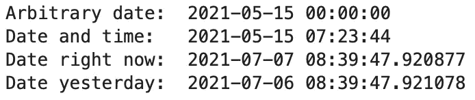

图片 Python 的日期时间基础知识(图片由作者提供)

那很容易，不是吗？一旦日期时间被声明并存储到变量中，您还可以提取关于该日期时间的特定信息。以下是提取年、月、日、小时、分钟和秒的方法:

你所需要知道的，或多或少。处理单个日期是必须知道的，但是在时间序列分析中，您将主要处理日期范围。接下来我们来介绍一下。

# 使用日期范围

谈到日期范围，您可以使用纯 Python、Numpy 或 Pandas。最后一个选项是最简单的，您很快就会看到。

## 纯 Python

没有理由在纯 Python 中处理日期范围。实现很草率，没有给你很多选择。例如，下面是如何创建一个包含每天三个日期的列表:

结果看起来像这样:

图片 2-纯 Python 中的日期范围(图片由作者提供)

看起来像你期望的那样，但是熊猫和熊猫更适合这个任务。

## Numpy

Numpy 允许您将日期范围指定为字符串数组，后跟数据类型规范— `datetime64`。这里有一个例子:

这段代码产生的日期范围与纯 Python 相同，但是实现起来没有那么繁琐。下面是`date_list`的样子:

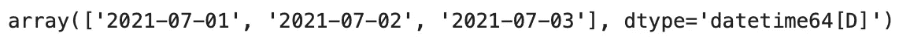

图 3-以 Numpy (1)表示的日期范围(图片由作者提供)

数据类型规范中的大写字母`D`表示日期是以日间隔(或日精度)存储的。你可以在声明时更改。以下代码片段将添加小时、分钟和秒的默认值:

结果如下:

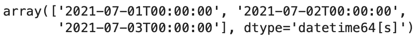

图 4-以 Numpy (2)表示的日期范围(图片由作者提供)

另一方面，指定年精度会完全删除月和日的值:

结果是:

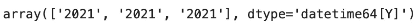

图 5-以 Numpy (3)表示的日期范围(图片由作者提供)

但让 Numpy 眼前一亮的是`arange()`功能。您可以使用它来指定日期范围。这里有一个例子:

上述代码产生以下日期范围:

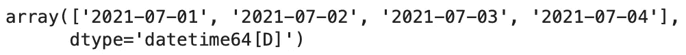

图 6-以数字(4)表示的日期范围(图片由作者提供)

简而言之，您只需指定数据类型以及起点和终点。Numpy 做剩下的。

这个功能在 Pandas 中得到了扩展，所以我们接下来将讨论它。

## 熊猫

熊猫有一个`date_range()`功能，允许你以多种方式构建日期范围。

第一种，也是最常见的一种，是指定起止日期，让熊猫自己解决其他事情:

结果如下:

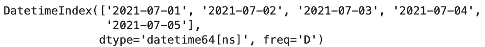

图片 7-熊猫的日期范围(1)(图片由作者提供)

另一种方法是只指定开始日期。这种方法需要两个附加参数:

*   `periods: int` —日期范围应该有多少个周期，包括起始值。
*   `freq: str` —指定间隔级别。

以下是如何声明 10 天的每日日期范围:

它看起来是这样的:

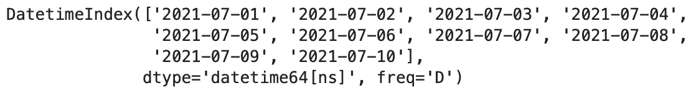

图片 8-熊猫的日期范围(2)(图片由作者提供)

熊猫的另一个很酷的地方是能够直接在日期范围上使用像`min()`和`max()`这样的函数。这里有一个例子:

结果是:

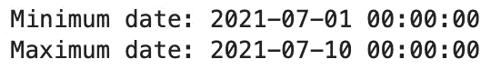

图片 9-熊猫的日期范围(3)(图片由作者提供)

这对于基本的日期范围来说已经足够了。下一节将介绍几个基本的时间序列运算。

# 时间序列重采样、移位、滚动和差分

有时时间序列数据集不会是您需要的格式。也许数据是按每天的时间间隔存储的，但是您需要每月的总数来进行分析。或者数列不是平稳的(这个术语你以后会学到)，你想用差分使它平稳。所有这些以及更多的事情都可以通过熊猫轻松完成。

对于这一部分，我们将使用来自[弗雷德](https://fred.stlouisfed.org/series/LTOTALNSA)的轻型汽车销售数据集。以下是你如何装载熊猫的方法:

下面是前几行的样子:

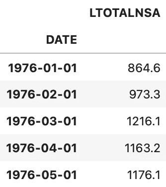

图 10 —轻型汽车销售数据集的前 5 行(图片由作者提供)

让我们从重采样开始。

## 重采样

简而言之，重采样允许您更改时间序列的聚合级别。如果您每小时收集一次数据，但需要每天的总量来进行分析，那么重采样是一种不错的方法。

以下代码片段将我们的月度数据集重新采样为年度总数:

结果如下:

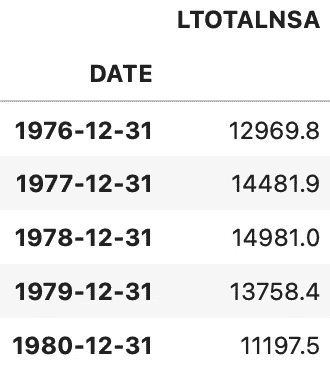

图片 11-时间序列重采样(1)(图片由作者提供)

您可以自由使用 Pandas 提供的任何聚合函数。例如，您还可以汇总以显示季度平均值:

这是数据集:

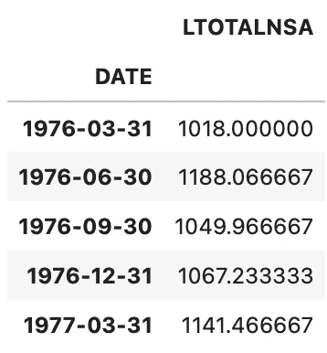

图片 12-时间序列重采样(2)(图片由作者提供)

简而言之，这就是重采样。请记住，从月度数据到年度数据很容易，但反过来是不可能的。

## 改变

`shift()`函数是 Pandas，用于将整个系列上下移动所需的周期数。

下面的代码片段将整个系列下移一个又两个句点。移位后的版本存储为附加列:

结果如下:

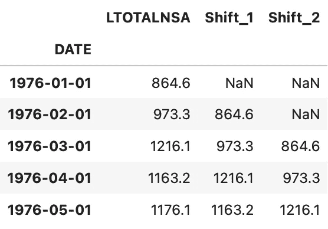

图 13-时间序列转换(1)(图片由作者提供)

请注意前一/两行是如何丢失的，因为没有 1976 年 1 月 1 日之前的记录。

在数据集的另一端也可以做同样的事情。没有 *unshift* 函数，所以你必须将序列移动一个负值:

数据集现在看起来像这样:

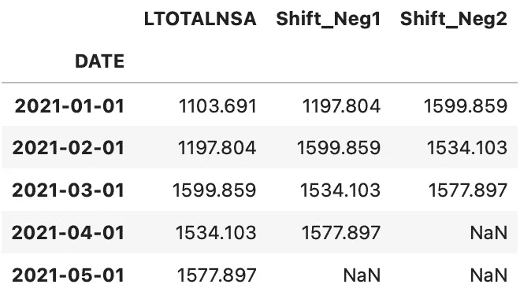

图 14 —时间序列转换(2)(图片由作者提供)

注意同样的事情是如何发生的，但是是从相反的方面。

## 旋转

原始格式的时间序列数据可能非常不稳定，尤其是在较小的汇总级别上。*滚动*或*移动平均值*的概念是平滑时间序列数据的一种有用技术。实际上，你可以用移动平均线做预测，但是以后再做更多的预测。

以下是如何从原始序列计算季度和年度移动平均值:

结果如下:

图 15 —时间序列滚动(作者提供的图片)

如您所见，滚动操作会消耗一些数据，具体取决于窗口大小。但是在计算移动平均线后，您可以看到这些值是如何更加相似的。

## 区别

最后，让我们探讨一下差异的概念。这是处理金融数据(例如股票价格)时的一项基本技术，并且您希望计算回报率。

一般来说，差分是用来使序列*平稳*。这一术语将在后续文章中介绍，但对于构建预测模型是必不可少的。

下面是如何计算一阶和二阶差，并在注释中给出了解释:

这是差异数据集:

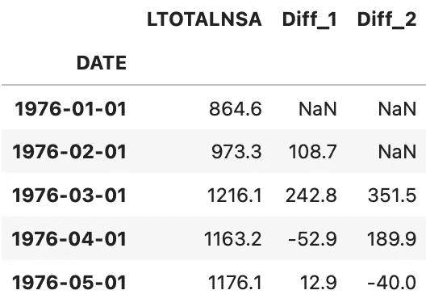

图 16-时间序列差异(图片由作者提供)

如果您要绘制这些新列，它们可能看起来是固定的，这意味着它们具有恒定的均值、方差和协方差，但我们将在另一个时间讨论这个问题。

# 可视化时间序列数据

最后，让我们探索一下时间序列数据的可视化过程。这可以直接用 Pandas 或任何其他可视化库来完成。我们将使用 Matplolib，但是您可以使用 Seaborn、Plotly、Altair 或其他任何软件。

首先，我们来写一些基本的导入和配置。这些将使图表更好看，而不需要投入太多的工作:

太好了！让我们用熊猫做一个基本的线图。这是可视化时间序列数据的最简单方法，因为它通常只需要一行代码:

结果如下:

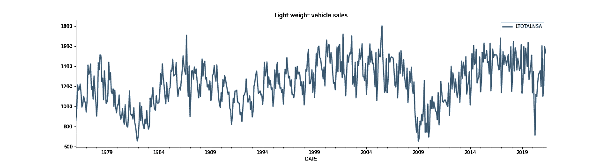

图 17-熊猫基本折线图(图片由作者提供)

只用熊猫做可视化没什么不好，但是我更习惯 Matplotlib 语法。以下是如何使用它来制作相同的可视化效果，但标题更大，并添加了轴标签:

这是视觉效果:

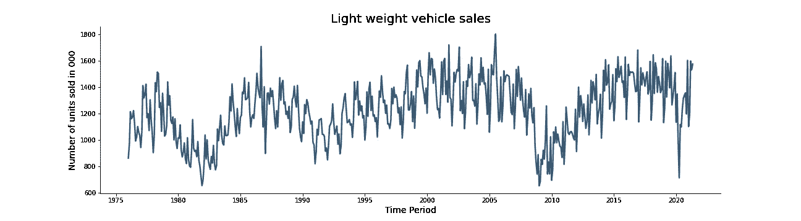

图 18-使用 Matplotlib 可视化时间序列(1)(图片由作者提供)

厉害！但是如果您只想可视化一个特定的子集呢？好吧，既然您正在处理日期时间索引，那么您可以使用 Python 的切片符号。下面的代码片段将只显示 1990 年到 2005 年的数据:

结果如下:

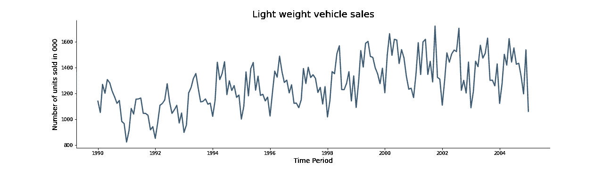

图 19-使用 Matplotlib 可视化时间序列(2)(图片由作者提供)

如果您不想使用切片符号，还有一个替代方法。您可以使用 Matplilib 的`xlim()`和`ylim()`函数来设置 X 轴和 Y 轴的范围:

这是视觉效果:

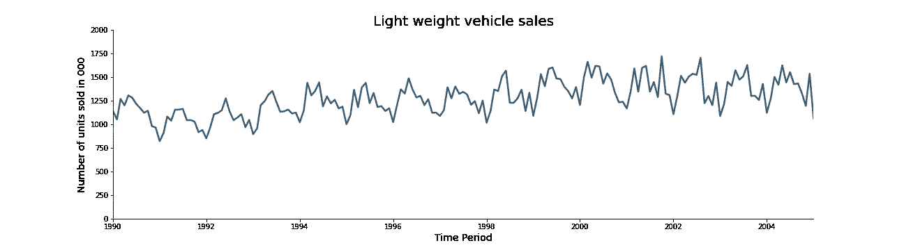

图片 20 —使用 Matplotlib 可视化时间序列(3)(图片由作者提供)

这就是时间序列的可视化。99%的情况下你不会做任何更复杂的事情。只要记住如何制作基本的折线图，就万事大吉了。

# 结论

今天走了很多路。好消息是——你已经学会了基本时间序列分析的所有先决条件！在你自己的数据集上练习今天学到的概念，让这些新概念变得牢固。

在下一篇文章中，您将学习一些更复杂的时间序列主题——白噪声和随机游走。请继续关注博客，因为整个时间序列分析系列即将推出。

感谢阅读。

喜欢这篇文章吗？成为 [*中等会员*](https://medium.com/@radecicdario/membership) *继续无限制学习。如果你使用下面的链接，我会收到你的一部分会员费，不需要你额外付费。*

 [## 通过我的推荐链接加入 Medium-Dario rade ci

### 作为一个媒体会员，你的会员费的一部分会给你阅读的作家，你可以完全接触到每一个故事…

medium.com](https://medium.com/@radecicdario/membership) 

# 了解更多信息

*   [2021 年学习数据科学的前 5 本书](/top-5-books-to-learn-data-science-in-2020-f43153851f14)
*   [如何使用 Cron 调度 Python 脚本——您需要的唯一指南](/how-to-schedule-python-scripts-with-cron-the-only-guide-youll-ever-need-deea2df63b4e)
*   [Dask 延迟—如何轻松并行化您的 Python 代码](/dask-delayed-how-to-parallelize-your-python-code-with-ease-19382e159849)
*   [如何使用 Python 创建 PDF 报告—基本指南](/how-to-create-pdf-reports-with-python-the-essential-guide-c08dd3ebf2ee)
*   [即使没有大学文凭也要在 2021 年成为数据科学家](/become-a-data-scientist-in-2021-even-without-a-college-degree-e43fa934e55)

# 保持联系

*   关注我的 [Medium](https://medium.com/@radecicdario) 了解更多类似的故事
*   注册我的[简讯](https://mailchi.mp/46a3d2989d9b/bdssubscribe)
*   在 [LinkedIn](https://www.linkedin.com/in/darioradecic/) 上连接