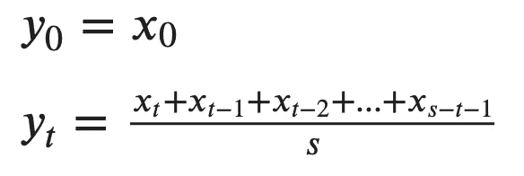
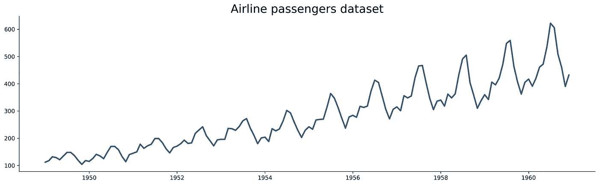

# 从零开始的时间序列——移动平均线(MA)理论与实现

> 原文：<https://towardsdatascience.com/time-series-from-scratch-moving-averages-ma-theory-and-implementation-a01b97b60a18?source=collection_archive---------3----------------------->

## [时间序列从无到有](https://towardsdatascience.com/tagged/time-series-from-scratch)

## 时间序列从零开始系列的第 8 部分—了解理论并使用 MA 模型预测未来

照片由 [Rodion Kutsaev](https://unsplash.com/@frostroomhead?utm_source=unsplash&utm_medium=referral&utm_content=creditCopyText) 在 [Unsplash](https://unsplash.com/s/photos/dark-abstract?utm_source=unsplash&utm_medium=referral&utm_content=creditCopyText) 上拍摄

最终探索最基本的时间序列预测模型——简单移动平均线(MA)的时候到了。

我们将在实现之前讨论基础理论，包括直觉和一些数学知识。一般来说，您应该熟悉[时间序列](/time-series-analysis-from-scratch-seeing-the-big-picture-2d0f9d837329)，因此如果您对该主题不熟悉，请从头开始阅读该序列。前几篇文章的链接在这篇文章的末尾。

这篇文章的结构如下:

*   移动平均线——理论和数学
*   移动平均线——在熊猫中的实施
*   移动平均线—预测
*   结论

# 移动平均线——理论和数学

单单移动平均线对预测没那么有用。相反，它们主要用于分析。例如，移动平均线通过平滑不断变化的价格的波动来帮助股票投资者进行技术分析。这种方式减少了短期波动，投资者可以得到一个更一般化的画面。

从数学角度来说，简单的移动平均线非常容易实现:

图片 1-简单移动平均公式(图片由作者提供)

其中`t`表示时间段，`s`表示滑动窗口的大小。

让我们看一个例子。`x`将表示一个没有时间信息的样本时间序列，我们将计算滑动窗口大小 2 和 3 的移动平均值。

下面是马②的计算:

图片 2 — MA(2)计算(图片由作者提供)

如您所见，第一个数据点被复制，因为在它之前没有数据点来计算平均值。Pandas 默认不会复制值，而是返回`NaN`。您可以在`rolling()`函数中指定`min_periods=1`来避免这种行为。

下面是马③的计算:

图片 3 — MA(3)计算(图片由作者提供)

计算再一次非常简单。第一个值被复制，但第二个值被计算为马立克(2)，因为没有足够的数据进行完整的计算。

太好了！您现在知道了移动平均线背后的基本思想，所以让我们看看如何用 Python 实现它们。

# 移动平均线——在熊猫中的实施

您将使用[航空公司的乘客](https://raw.githubusercontent.com/jbrownlee/Datasets/master/airline-passengers.csv)数据集。以下是如何将其加载到 Python 中并可视化的方法:

以下是数据集的外观:

图片 4-航空乘客数据集(图片由作者提供)

可以用熊猫里的`rolling()`函数计算简单移动平均线。您现在应该关心的唯一参数是`window`，因为它指定了滑动窗口的大小。如果你不知道前面的部分代表什么，请再读一遍。

打电话给`rolling()`本身不会有任何作用。您仍然需要一个聚合函数。由于这些是移动的*平均值*，所以将`.mean()`坚持到通话结束就可以了。

下面的代码片段计算滑动窗口大小为 3、6 和 12 的移动平均值，并直观地显示它们:

以下是所有时间序列的样子:

图 5——熊猫的移动平均线(图片由作者提供)

观察上面的图像，可以发现简单移动平均线的几个问题:

*   **滞后** —移动平均时间序列总是滞后于原始时间序列。看看峰值来验证这一说法。
*   **噪音** —太小的滑动窗口大小无法从原始数据中移除所有噪音。
*   **平均问题** —由于平均，平均数据永远不会捕捉到原始序列的低点和高点。
*   **加权** —所有数据点的权重相同。这可能是一个问题，因为最近的值通常对未来有更大的影响。

雪上加霜的是，你不能用熊猫来预测未来。相反，您需要使用 Statsmodels 来完成这项任务。接下来看看如何。

# 移动平均线—预测

我再重复一遍——你不能用熊猫来做预测！即使是 statsmodels 实现也很可能不值得，因为您不会对结果满意。尽管如此，它还是来了。

你必须训练一个 ARMA 模型。它由自回归和移动平均成分构成。完全忽略自回归成分意味着我们正在建立一个移动平均模型。

我们将[把数据集](/time-series-from-scratch-train-test-splits-and-evaluation-metrics-4fd654de1b37)分成训练和测试子集。最后两年(24 行)用于测试。训练后的结果是可视化的:

这是视觉效果:

图 6 —使用移动平均模型进行预测(图片由作者提供)

那么，这是怎么回事呢？简单的移动平均线不是最好的预测模型。至少对于既显示趋势性又显示季节性的数据来说不是这样。

那么，让我们试着对序列进行差分，这样做会移除趋势成分，使序列(在某种程度上)保持平稳:

这是视觉效果:

图 7 —使用移动平均模型对差异数据进行预测(图片由作者提供)

结果仍然没有用，但它们看起来不像来自不同的数据集。

# 最后的话

这就是你要的——一个简单移动平均线模型的来龙去脉。大多数情况下，您可以将它用作基线，但仅此而已。指数加权移动平均线效果更好，因为它们给最近的观察值增加了更多的权重。

尽管如此，在使用高阶指数平滑法(例如霍尔特-温特斯)之前，你不会得到令人满意的预测结果。

我们将在下一篇文章中讨论 EWMA 和指数平滑，敬请关注。

*喜欢这篇文章吗？成为* [*中等会员*](https://medium.com/@radecicdario/membership) *继续无限制学习。如果你使用下面的链接，我会收到你的一部分会员费，不需要你额外付费。*

<https://medium.com/@radecicdario/membership>  

# 阅读整个系列

1.  [看清大局](/time-series-analysis-from-scratch-seeing-the-big-picture-2d0f9d837329)
2.  [熊猫时间序列介绍](/time-series-from-scratch-introduction-to-time-series-with-pandas-347ac9c6b451)
3.  [白噪声和随机游走](/time-series-from-scratch-white-noise-and-random-walk-5c96270514d3)
4.  [分解时间序列数据](/time-series-from-scratch-decomposing-time-series-data-7b7ad0c30fe7)
5.  [自相关和偏自相关](/time-series-from-scratch-autocorrelation-and-partial-autocorrelation-explained-1dd641e3076f)
6.  [稳定性测试和自动化](/time-series-from-scratch-stationarity-tests-and-automation-14b02fa5ca4d)
7.  [培训/测试分割和评估指标](/time-series-from-scratch-train-test-splits-and-evaluation-metrics-4fd654de1b37)

# 保持联系

*   关注我的媒体，了解更多类似的故事
*   注册我的[简讯](https://mailchi.mp/46a3d2989d9b/bdssubscribe)
*   在 [LinkedIn](https://www.linkedin.com/in/darioradecic/) 上连接