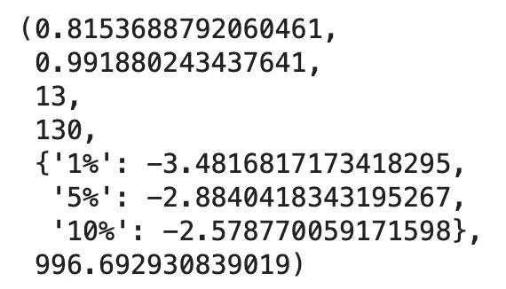
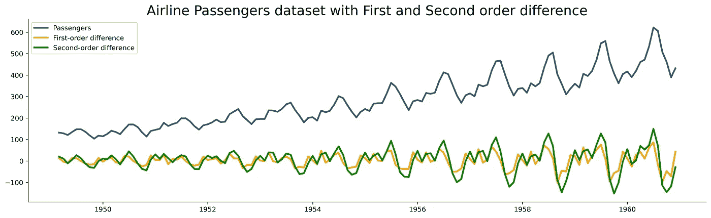
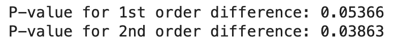
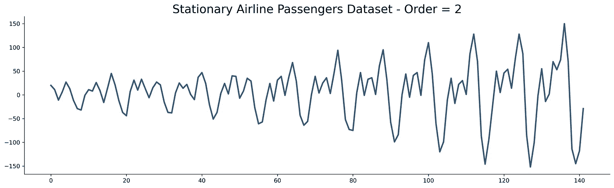
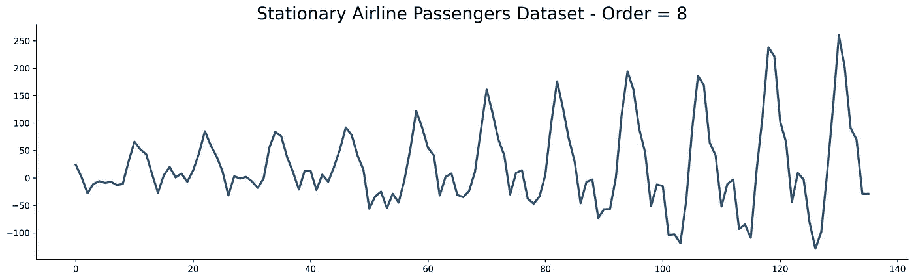

# 从零开始的时间序列——平稳性测试和自动化

> 原文：<https://towardsdatascience.com/time-series-from-scratch-stationarity-tests-and-automation-14b02fa5ca4d?source=collection_archive---------5----------------------->

## [时间序列从无到有](https://towardsdatascience.com/tagged/time-series-from-scratch)

## 《从零开始的时间序列》系列的第 6 部分——了解关于平稳性的所有内容，为什么它对于预测是必不可少的，以及如何用一个函数来自动化它。

在 [Unsplash](https://unsplash.com/s/photos/dark-abstract?utm_source=unsplash&utm_medium=referral&utm_content=creditCopyText) 上由 [Pawel Czerwinski](https://unsplash.com/@pawel_czerwinski?utm_source=unsplash&utm_medium=referral&utm_content=creditCopyText) 拍摄的照片

今天你将学习时间序列中最重要的概念之一——平稳性。您将了解如何判断数据集是否是静态的，如何测试平稳性以及如何自动化测试过程。

这篇文章的结构如下:

*   平稳性介绍
*   ADF 测试—如何测试平稳性
*   自动化稳定性测试
*   结论

# 平稳性介绍

在[系列](https://towardsdatascience.com/tagged/time-series-from-scratch)中的前一篇文章简单地提到了平稳性的概念。今天你会学到这个话题的所有内容。让我们从检查一个正式定义开始:

> 平稳过程是一种随机过程，其无条件联合概率分布随时间推移不发生变化。因此，平均值和方差等参数也不会随时间而改变。(来源:[维基百科](https://en.wikipedia.org/wiki/Stationary_process))

上面的定义告诉你什么是*弱形式平稳性*。这是时间序列分析中唯一需要关注的形式。

另一种形式是*严格平稳性*。这意味着相同大小的样本具有相同的分布。它的限制性很强，所以你在实践中不会经常看到。

时间序列必须满足以下条件才能被认为是平稳的:

*   **恒定平均值** —平均值不随时间变化。
*   **恒定方差** —方差不随时间变化。
*   **恒定协方差** —相同长度的周期之间的协方差不随时间变化。

您可以使用统计测试来测试平稳性，但有时绘制时间序列可以给你一个粗略的估计。下图显示了平稳序列与非平稳序列:

图 1-平稳与非平稳时间序列(来源:[维基共享](https://commons.wikimedia.org/wiki/File:Stationarycomparison.png)

平稳序列以某个值为中心，没有太多的尖峰和意外变化，也没有从一部分到另一部分的剧烈行为变化。

出于两个原因，您应该关心平稳性:

*   平稳过程更容易分析。
*   大多数预测算法都假设序列是平稳的。

你现在知道弱形式平稳性背后的基本理论。接下来让我们讨论测试。

# ADF 测试—如何测试平稳性

不久前，大卫·迪基和 T2·韦恩·富勒开发了一个平稳性测试——**迪基-富勒测试**。后来对其进行了改进，并更名为增强迪基-富勒测验，或简称为 ADF 测验。

这可以归结为一个简单的假设检验:

*   **零假设(H0)** —时间序列不是平稳的。
*   **替代假设(H1)** —时间序列是平稳的。

在 Python 中，ADF 测试返回以下内容:

*   检验统计量
*   p 值
*   使用的滞后数
*   1%、5%和 10%临界值
*   最大化信息标准的估计(不用担心)

如果返回的 P 值高于 0.05，则时间序列不是稳定的。0.05 是标准阈值，但您可以自由更改。

接下来让我们实现 ADF 测试。我们将从库导入、数据集加载以及[航班乘客](https://raw.githubusercontent.com/jbrownlee/Datasets/master/airline-passengers.csv)数据集的可视化开始:

以下是数据集的外观:

图片 2-航空乘客数据集(图片由作者提供)

它看起来一点也不稳定，但让我们通过测试来验证这一点:

结果如下:

图 3-航空乘客 ADF 测试结果(图片由作者提供)

P 值刚刚超过 0.99，有力地证明了数据集不是静止的。在之前的文章中，您已经学习了[差异](/time-series-from-scratch-introduction-to-time-series-with-pandas-347ac9c6b451)的概念。现在你将使用它来计算 N 阶差分。下面是寻找第一个和第二个订单的过程:

这是视觉效果:

图 4——与众不同的航班乘客(图片由作者提供)

差异序列看起来比原始数据更有希望，但是让我们使用 ADF 测试来验证这一说法:

以下是输出结果:

图 5 —对一阶和二阶差异进行 ADF 测试的 P 值(图片由作者提供)

一阶差没有使时间序列平稳，至少在通常的显著性水平上没有。二阶差分成功了。

您可以看到手动测试不同的差异顺序是多么的乏味。这就是为什么接下来您将编写一个自动化函数。

# 自动化稳定性测试

自动化功能将接受以下参数:

*   `data: pd.Series` —时间序列值，无日期时间信息
*   `alpha: float = 0.05` —显著性水平，默认设置为 0.05
*   `max_diff_order: int = 10` —允许对时间序列进行差分的最大时间

返回 Python 字典，包含`differencing_order`和`time_series`键。第一个是不言自明的，第二个包含差分时间序列。

该函数将首先检查序列是否已经稳定。如果是这种情况，它将按原样返回。否则，对每个差分订单执行 ADF 测试，直到`max_diff_order`。该函数跟踪 P 值，并返回低于显著性水平`alpha`的具有最低差分阶数的值。

下面是整个函数:

现在让我们用它来使航班乘客数据集保持不变:

这是视觉效果:

图 alpha = 0.05 时的静态航空乘客数据集(图片由作者提供)

就像以前一样，需要二阶差分来使数据集保持稳定。但是如果你决定一个不同的显著性水平呢？好吧，你自己看看:

这是图表:

图 alpha = 0.01 时的固定航班乘客数据集(图片由作者提供)

对于 0.01 的显著性水平，您必须对数据集进行八次差分。这将是一场噩梦，所以你应该坚持更高的重要性水平。

# 结论

这就是你应该知道的关于平稳性的一切。当您开始建模和预测时，整个概念将在两篇文章中变得更加清晰。现在，记住平稳过程更容易分析，并且是大多数预测模型所需要的。

在预测之前，还有几件事要做。这些包括训练/测试分割、度量和评估。所有这些都将在下一篇文章中讨论，敬请关注。

喜欢这篇文章吗？成为 [*中等会员*](https://medium.com/@radecicdario/membership) *继续无限制学习。如果你使用下面的链接，我会收到你的一部分会员费，不需要你额外付费。*

<https://medium.com/@radecicdario/membership>  

# 了解更多信息

*   [2021 年学习数据科学的前 5 本书](/top-5-books-to-learn-data-science-in-2020-f43153851f14)
*   [如何用 Cron 调度 Python 脚本——你需要的唯一指南](/how-to-schedule-python-scripts-with-cron-the-only-guide-youll-ever-need-deea2df63b4e)
*   [Dask 延迟—如何轻松并行化您的 Python 代码](/dask-delayed-how-to-parallelize-your-python-code-with-ease-19382e159849)
*   [如何使用 Python 创建 PDF 报告—基本指南](/how-to-create-pdf-reports-with-python-the-essential-guide-c08dd3ebf2ee)
*   [即使没有大学文凭也能在 2021 年成为数据科学家](/become-a-data-scientist-in-2021-even-without-a-college-degree-e43fa934e55)

# 保持联系

*   在[媒体](https://medium.com/@radecicdario)上关注我，了解更多类似的故事
*   注册我的[简讯](https://mailchi.mp/46a3d2989d9b/bdssubscribe)
*   在 [LinkedIn](https://www.linkedin.com/in/darioradecic/) 上连接