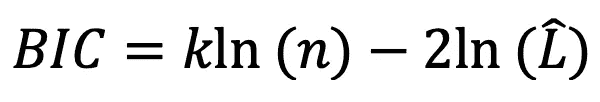
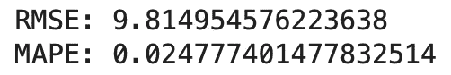

# 从头开始的时间序列—训练/测试分割和评估指标

> 原文：<https://towardsdatascience.com/time-series-from-scratch-train-test-splits-and-evaluation-metrics-4fd654de1b37?source=collection_archive---------1----------------------->

## [时间序列从无到有](https://towardsdatascience.com/tagged/time-series-from-scratch)

## 时间序列从零开始系列的第 7 部分—在对时间序列数据建模之前您需要知道的一切。了解如何分割和评估时间序列数据集。

由[维克多·塔拉舒克](https://unsplash.com/@viktortalashuk?utm_source=unsplash&utm_medium=referral&utm_content=creditCopyText)在 [Unsplash](https://unsplash.com/?utm_source=unsplash&utm_medium=referral&utm_content=creditCopyText) 上拍摄的照片

今天，您将学习时间序列预测所需的最后一点理论知识——训练/测试分割和评估指标。这些工作方式不同于常规的机器学习。请继续阅读，看看是如何做到的。

这篇文章的结构如下:

*   时间序列中的训练/测试分割
*   时间序列中的评价指标
*   结论

# 时间序列中的训练/测试分割

在机器学习中，训练/测试分割随机分割数据，因为从一个观察到另一个观察没有依赖性。时间序列数据就不是这样了。在这里，您将希望使用数据集后面的值进行测试，而其他的都用于训练。

例如，如果您每月有 144 条记录(12 年)，一个好的方法是保留前 120 条记录(10 年)用于训练，保留后 24 条记录(2 年)用于测试。

让我们来看看实际情况。首先，您将导入库和数据集— [航空乘客](https://raw.githubusercontent.com/jbrownlee/Datasets/master/airline-passengers.csv):

以下是数据集的外观:

图片 1-航班乘客数据集(图片由作者提供)

假设你想用最后两年的时间进行测试，其他时间都用来训练。您可以使用 Python 的*切片*符号来分割数据集:

这是两组图像:

图 2-航空乘客培训和测试数据集(图片由作者提供)

这就是训练/测试劈叉的全部内容。**请记住**——永远不要随机分割时间序列数据。

# 评估指标

评估时间序列模型时，您可以选择相对模型性能指标或一般回归指标。

## 相对模型性能指标

在选择时间序列模型时，你会经常听到两个首字母缩略词——AIC 和 BIC。

AIC，或者说*阿凯克信息标准*，向你展示一个模型相对于其他模型有多好。AIC 为了简单的模型而惩罚复杂的模型。例如，如果两个模型具有相同的预测性能，但第二个模型有 10 个以上的参数，AIC 将倾向于第一个模型。

模型的 AIC 值通过以下公式计算:

图片 3 — AIC 公式(图片由作者提供)

其中 *k* 是模型中参数的个数， *L-hat* 是模型的似然函数的最大值， *ln* 是自然对数。

BIC，或者说*贝叶斯信息准则*，类似于 AIC。它是在 ceratin Bayesian 设置下对模型为真的后验概率函数的估计([来源](https://www.methodology.psu.edu/resources/AIC-vs-BIC/))。同样，值越低，模型越好。

模型的 BIC 值通过以下公式计算:

图片 4 — BIC 公式(图片由作者提供)

其中 *k* 是模型中参数的个数， *L-hat* 是模型的似然函数的最大值， *n* 是数据点的个数(样本大小)，而 *ln* 是自然对数。

我们今天不会讨论 AIC 和 BIC 的 Python 实现，因为那需要训练多个预测模型。您将在以后的文章中看到这些是如何工作的。

记住，AIC 和 BIC 都是相对指标，所以你不能直接比较不同数据集的模型。而是选择分数最低的型号。

# 一般回归度量

您可以使用任何回归评估指标，如 MAE、MSE 或 RMSE 来评估时间序列预测。我们今天将讨论其中的两个:

*   **RMSE** —均方根误差
*   **MAPE** —平均绝对百分比误差

RMSE 会告诉你你的模型平均有多少单位是错的。在我们的航空乘客示例中，RMSE 将告诉您在每次预测中您预计模型会错过多少乘客。

MAPE 告诉你，你的预测在百分比上是多么的错误。我喜欢它是因为，在某种程度上，它相当于分类问题中的*精度度量*。例如，MAPE 值 0.02 意味着您的预测 98%准确。

Scikit-learn 包没有 RMSE 的官方实现，所以我们必须手动计算 MSE 值的平方根。

让我们用代码来实现这两者——我们将把“rmse”声明为 lambda 函数，生成任意的实际和预测数据，并计算误差指标:

结果如下:

图片 5——RMSE 和 MAPE 价值观(图片由作者提供)

简而言之——平均每个月，预测会有 10 个乘客单位(数千)的误差，或者 2.5%左右。你应该知道的就这些。

# 结论

这就是你要做的——在对时间序列数据建模之前，你需要的最后一点理论知识。现在，您知道了如何分离用于训练和测试的数据，以及如何评估模型和原始预测。

在下一篇文章中，您将构建您的第一个预测模型——使用简单和指数移动平均线。这些通常是更精细模型的基线，但是你会发现它们在一些问题上非常有效。

感谢阅读。

喜欢这篇文章吗？成为 [*中等会员*](https://medium.com/@radecicdario/membership) *继续无限制学习。如果你使用下面的链接，我会收到你的一部分会员费，不需要你额外付费。*

 [## 通过我的推荐链接加入 Medium-Dario rade ci

### 作为一个媒体会员，你的会员费的一部分会给你阅读的作家，你可以完全接触到每一个故事…

medium.com](https://medium.com/@radecicdario/membership) 

# 从零开始的时间序列

1.  [看清大局](/time-series-analysis-from-scratch-seeing-the-big-picture-2d0f9d837329)
2.  [熊猫时间序列介绍](/time-series-from-scratch-introduction-to-time-series-with-pandas-347ac9c6b451)
3.  [白噪声和随机游走](/time-series-from-scratch-white-noise-and-random-walk-5c96270514d3)
4.  [分解时间序列数据](/time-series-from-scratch-decomposing-time-series-data-7b7ad0c30fe7)
5.  [自相关和偏自相关](/time-series-from-scratch-autocorrelation-and-partial-autocorrelation-explained-1dd641e3076f)
6.  [稳定性测试和自动化](/time-series-from-scratch-stationarity-tests-and-automation-14b02fa5ca4d)

# 保持联系

*   关注我在[媒体](https://medium.com/@radecicdario)上的更多类似的故事
*   注册我的[简讯](https://mailchi.mp/46a3d2989d9b/bdssubscribe)
*   在 [LinkedIn](https://www.linkedin.com/in/darioradecic/) 上连接