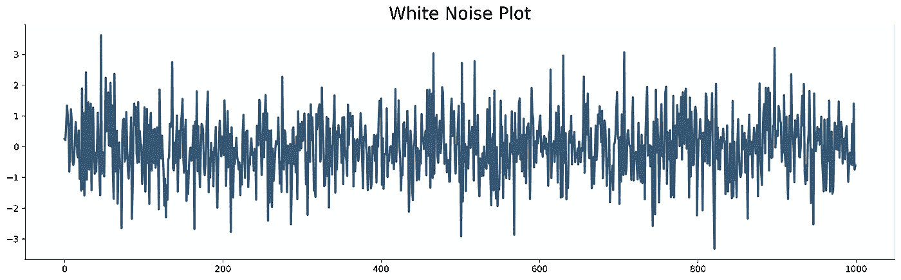
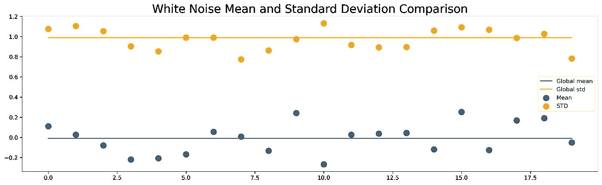
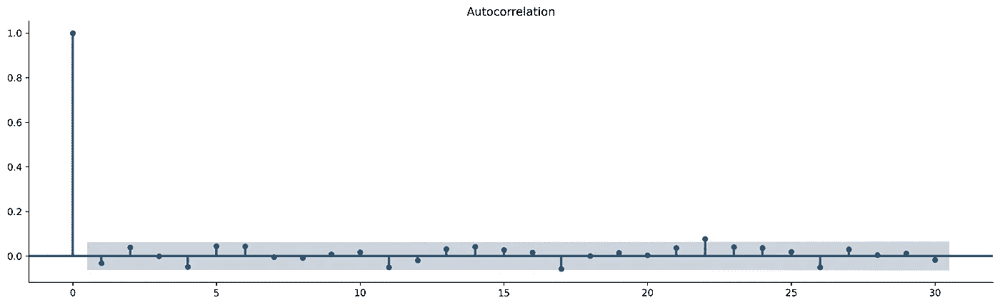
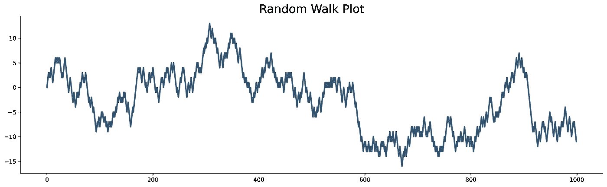
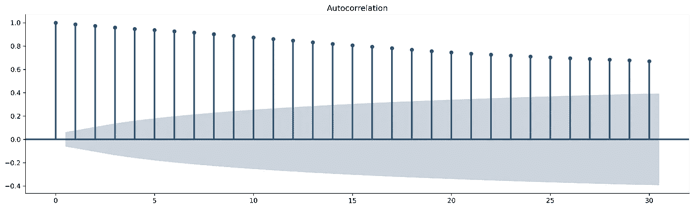
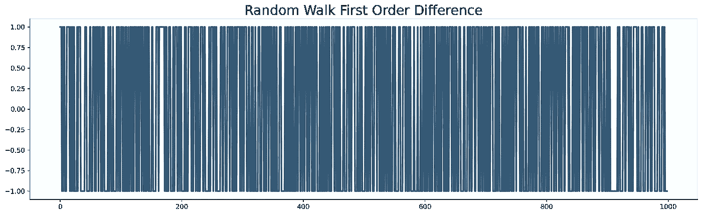
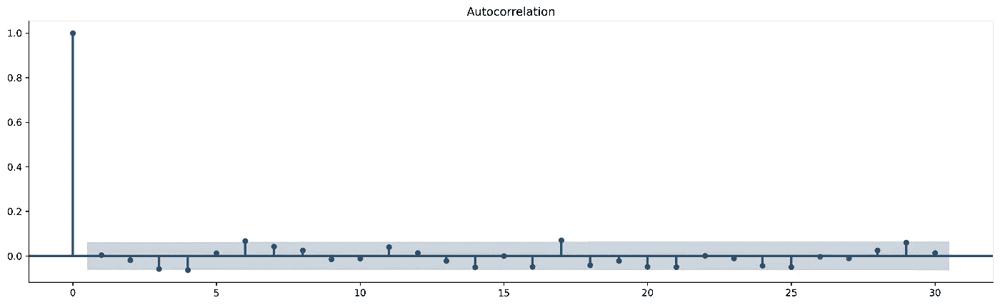

# 从零开始的时间序列——白噪声和随机游走

> 原文：<https://towardsdatascience.com/time-series-from-scratch-white-noise-and-random-walk-5c96270514d3?source=collection_archive---------7----------------------->

## [时间序列从无到有](https://towardsdatascience.com/tagged/time-series-from-scratch)

## 从零开始的时间序列系列的第 3 部分—了解关于白噪声和随机游走的一切，以及它们在时间序列预测中的重要性

[凯·达姆斯](https://unsplash.com/@dilucidus?utm_source=unsplash&utm_medium=referral&utm_content=creditCopyText)在 [Unsplash](https://unsplash.com/s/photos/abstract-dark?utm_source=unsplash&utm_medium=referral&utm_content=creditCopyText) 上的照片

预测时间序列数据可能是一项具有挑战性的任务。在你开始之前，先问自己以下问题— *这值得吗？好吧，如果你的数据看起来像白噪声或随机游走，答案很简单——不是。*

今天你将学习时间序列分析中这两个基本主题背后的思想。我们将回顾一些理论，并看看 Python 中的实现。

这篇文章的结构如下:

*   白噪声:理论与实现
*   随机漫步:理论与实现
*   结论

# 白噪声:理论与实现

白噪声的概念是时间序列分析和预测的基础。用最简单的话来说，白噪声告诉你是否应该进一步优化模型。

让我解释一下。

白噪声是一个不可预测的序列，因为它是一个随机数序列。如果你建立了一个模型，而它的残差(预测值和实际值之差)看起来像白噪声，那么你知道你已经尽了一切努力使模型尽可能好。另一方面，如果残差中有可见的模式，则数据集的模型会更好。

要将时间序列归类为白噪声，必须满足以下条件:

*   平均值为零
*   标准差是常数，不会随时间而改变
*   时间序列与其滞后版本之间的相关性不显著

最后一点可能很难理解，因为我们还没有研究自相关，但这个概念很简单。您希望确定当前时间序列和移动了 N 个周期的同一时间序列之间是否存在显著的相关性。

有三种(简单的)方法可以测试时间序列是否类似白噪声:

*   通过绘制时间序列
*   通过比较一段时间内的平均值和标准偏差
*   通过检查自相关图

## 方法 1 —绘制时间序列

这是迄今为止最简单的方法。目标是绘制整个系列，并直观地确认平均值为零，标准偏差随时间保持不变，并且看不到明显的模式。

让我们从导入库开始。我们需要一些常见的疑点，以及一些 Matplotlib 样式的调整:

稍后将使用`plot_acf`导入来绘制自相关函数，所以现在不用担心。

接下来，我们可以通过从标准正态分布中抽取 N 个值的样本来创建一个白噪声序列。以下是您可以声明和绘制系列的方法:

以下是白噪音系列的外观:

图 1 —白噪声图(图片由作者提供)

请记住——由于随机效应，你的可能看起来有点不同。

目测之后，我们可以得出结论，均值和标准差不会随时间而改变。偶尔会有一些峰值，但不严重。此外，在系列中没有可见的模式。

## 方法 2 —比较一段时间内的平均值和标准偏差

如果我们假设均值和标准差不随时间变化，那么对于任何两个子集，这两个值应该大致相同。

这里的目的是将白噪声序列分成任意数量的块(假设 20 个，每个块有 50 个项目),并计算每个块的平均值和标准偏差。您可以将结果可视化，以便于解释。

下面是执行此操作的 Python 代码:

这是视觉效果:

图 2 —一段时间内的平均值/标准偏差比较(图片由作者提供)

确实有轻微的变化，但是没有一个子集显示出与平均值的显著差异。

## 方法 3 —检查自相关图

在本系列的后面，您将了解到自相关和自相关图的所有内容，因此我们在这里不会深入讨论太多细节。你所需要知道的是，自相关图显示了一个时间序列与它自身之间的相关性，滞后于特定的周期数。

自相关图还包括代表置信区间的阴影区域。阴影区域内的任何东西都意味着该点的相关性在统计上不显著。滞后 0 处的自相关将具有值 1，因为相关是在两个相同的时间序列之间计算的。

您可以使用`statsmodels`中的`plot_acf()`函数获得该图:

这是视觉效果:

图 3 —白噪声的自相关图(图片由作者提供)

如您所见，所有滞后都在阴影区域内——除了滞后 22，它只是稍微在阴影区域之外。

本文的白噪音部分到此结束。您已经学习了背后的理论以及如何测试白噪声。让我们继续随机漫步。

# 随机漫步:理论与实现

就像白噪音一样，随机漫步系列也是不可预测的。与白噪声不同的是，这些值不是一系列随机数字。当前值取决于前一个值。

要创建虚拟随机漫步系列，您必须:

*   从一个任意值开始——假设为零
*   下一个值是前一个值加上添加的随机变化

您可以根据需要多次重复添加附加值的过程。让我们来看看实际情况—我们将从零开始，添加 999 个其他元素(要么是-1，要么是 1，取决于随机值):

下面是随机漫步系列的样子:

图片 4——随机漫步系列(图片由作者提供)

它看起来很像股票价格，不是吗？让那个想法深入人心。

由于当前和先前的观测值之间存在相关性，自相关图看起来与白噪声不同:

剧情是这样的:

图 5 —随机游走自相关图(图片由作者提供)

正如你所看到的，前 30 个滞后都很明显。那么这意味着随机漫步可以被建模和预测？不会。大多数预测算法需要稳定的数据(恒定均值、方差和协方差)，而随机游走不是稳定的。

我们今天不会深入研究平稳性测试和这个概念背后的逻辑。根据经验，您可以通过计算一阶差来使时间序列平稳:

差异的概念在[之前的文章](/time-series-from-scratch-introduction-to-time-series-with-pandas-347ac9c6b451)中有解释，所以在继续之前请务必阅读。总之，差分随机漫步看起来像这样:

图 6——差异随机漫步(图片由作者提供)

这些值的范围从-1 到 1，因为它们是随机化过程中的增量移动值。如果运动值是随机的，差分随机游走看起来就像白噪声。

为了证实这一说法，让我们画出不同随机游走值的自相关图。如果它们与白噪声中的相似，我们的说法就成立了:

剧情是这样的:

图 7——差分随机游走序列的自相关图(图片由作者提供)

现在你知道了——一旦序列是稳定的，在随机行走中就找不到可学习的模式。简而言之，连预测都不用费心。

# 结论

熟悉白噪声和随机游走的概念对任何时间序列任务都是至关重要的。如果数据看起来像白噪音或随机漫步，不要费心预测，因为它不会让你去任何地方。但是，如果您绝对需要预测，请将预测的 N 个期间设置为等于该系列的最后一个值。它看起来并不吸引人，但会使误差最小化。

另一方面，如果模型残差类似于白噪声，那么你做了一件好事。你不太可能进一步改进这个模型。如果残差中有一个模式，或者均值/标准差不是常数，那么你的工作还没有完成。你应该知道的就这些。

感谢您的阅读，请继续关注下一部分，我们将探讨时间序列分解的概念。

喜欢这篇文章吗？成为 [*中等会员*](https://medium.com/@radecicdario/membership) *继续无限制学习。如果你使用下面的链接，我会收到你的一部分会员费，不需要你额外付费。*

 [## 通过我的推荐链接加入 Medium-Dario rade ci

### 作为一个媒体会员，你的会员费的一部分会给你阅读的作家，你可以完全接触到每一个故事…

medium.com](https://medium.com/@radecicdario/membership) 

# 了解更多信息

*   [2021 年学习数据科学的前 5 本书](/top-5-books-to-learn-data-science-in-2020-f43153851f14)
*   [如何使用 Cron 调度 Python 脚本——您需要的唯一指南](/how-to-schedule-python-scripts-with-cron-the-only-guide-youll-ever-need-deea2df63b4e)
*   [Dask 延迟—如何轻松并行化您的 Python 代码](/dask-delayed-how-to-parallelize-your-python-code-with-ease-19382e159849)
*   [如何使用 Python 创建 PDF 报告—基本指南](/how-to-create-pdf-reports-with-python-the-essential-guide-c08dd3ebf2ee)
*   [即使没有大学文凭也要在 2021 年成为数据科学家](/become-a-data-scientist-in-2021-even-without-a-college-degree-e43fa934e55)

# 保持联系

*   关注我的 [Medium](https://medium.com/@radecicdario) 了解更多类似的故事
*   注册我的[简讯](https://mailchi.mp/46a3d2989d9b/bdssubscribe)
*   在 [LinkedIn](https://www.linkedin.com/in/darioradecic/) 上连接