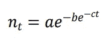
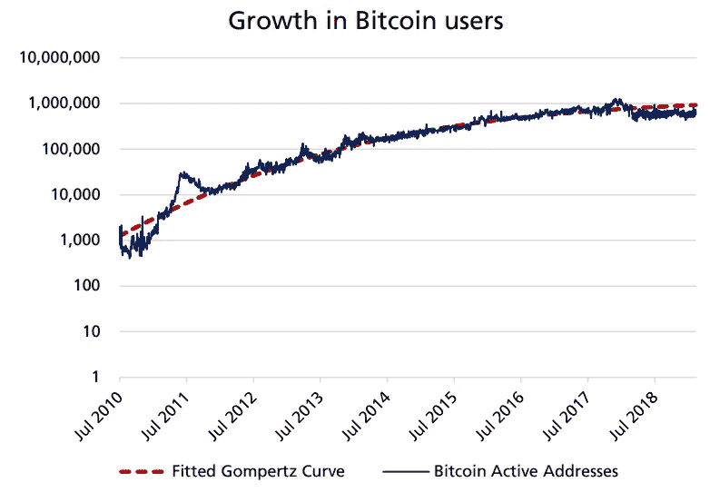
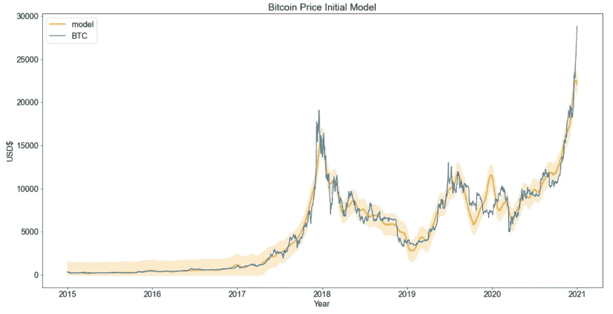
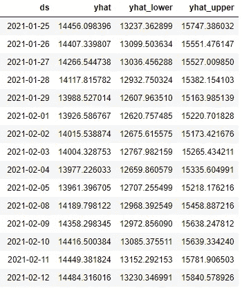
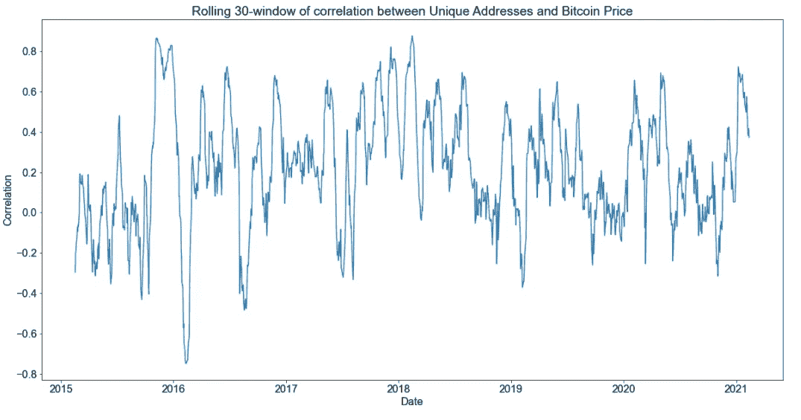
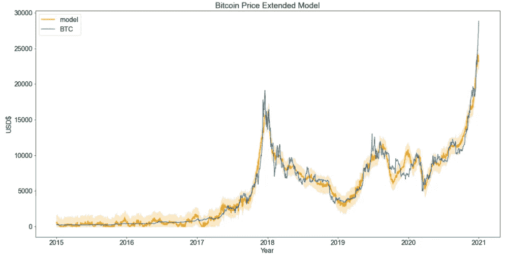
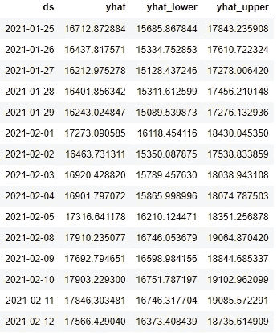
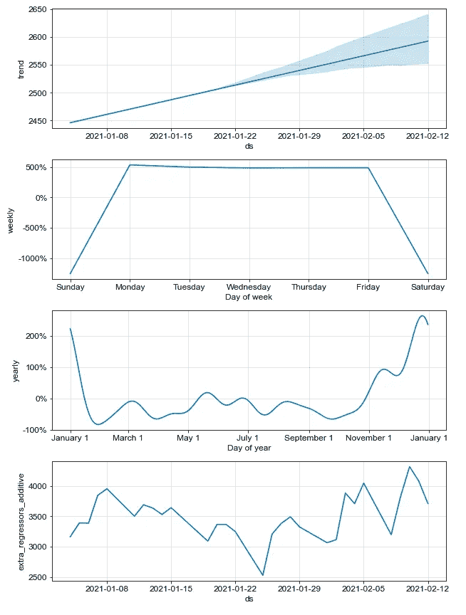
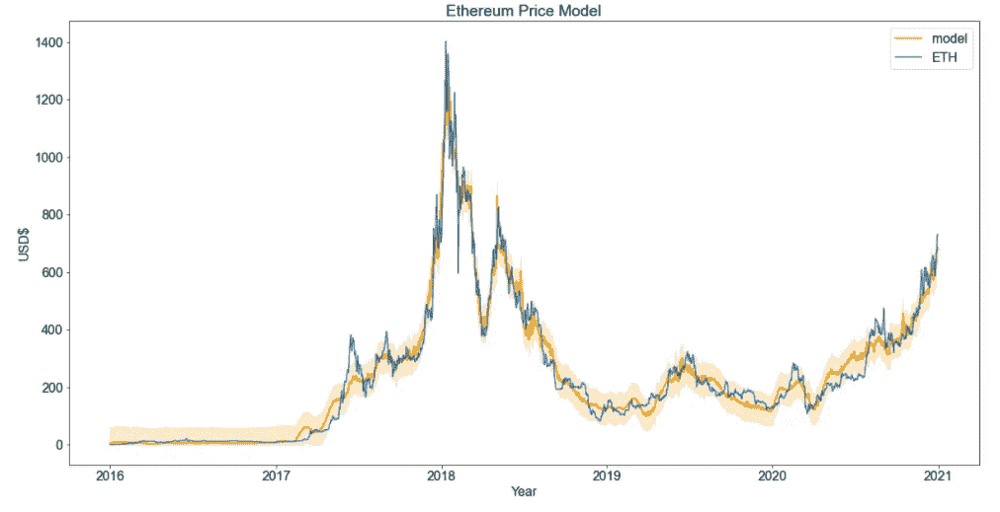

# 比特币价格的时间序列建模

> 原文：<https://towardsdatascience.com/time-series-modeling-of-bitcoin-prices-5133edfec30b?source=collection_archive---------5----------------------->

## 比特币

## 如何使用脸书的多数据源先知工具来尝试预测比特币的价格


[Bermix 工作室](https://unsplash.com/@bermixstudio?utm_source=unsplash&utm_medium=referral&utm_content=creditCopyText)在 [Unsplash](https://unsplash.com/s/photos/bitcoin?utm_source=unsplash&utm_medium=referral&utm_content=creditCopyText) 拍摄的照片

当 2020 年的世界还在(现在仍然是)疫情的掌控之中时，比特币已经有了一段辉煌的历史。从 2018 年引人注目的崩盘和 2019 年相对平静的一年，到本文写作时，它以 8000 美元的价格开始了 2020 年的 50000 美元的全新历史新高。这大约超过了 600%的回报率！这是 2020 年最成功的投资之一。

然而，至少可以说，比特币是有争议的。

首先，学者们无法决定它是一种可以用于交易的货币，还是一种像黄金一样的价值储存手段，或者仅仅是一种收藏品。一些人以此为例，从根本上质疑货币本身的本质。

比特币的支持者有充分的理由相信，比特币和其他加密货币是货币的未来。我们已经看到，在去年新冠肺炎疫情爆发后，世界各国政府通过刺激计划印钞变得轻而易举。考虑到这一点，比特币的支持者将比特币内在的稀缺性视为克服其贬值的一种方式，因为挖掘新比特币的难度越来越大。比特币的通缩性质使其作为价值储存手段颇具吸引力。它可以以完全分散的方式用于交易，这使得它对于绕过通常被认为是银行的中间人是有吸引力的。

各家公司对其潜力看法不一。Square 是首批购买价值 5000 万美元的比特币用于交易的大公司之一，紧随其后的是 T2 Paypal T3。[特斯拉](https://www.cnbc.com/2021/02/08/tesla-buys-1point5-billion-in-bitcoin.html)最近宣布，该公司将大举投资比特币，购买价值约 15 亿美元的比特币。

知名投资者对比特币是否是一种投资有不同的看法。[沃伦·巴菲特说](https://www.youtube.com/watch?v=d6yqrwOZVjY)

> 加密货币基本上没有价值，也不产生任何东西。他们不繁殖，他们不能给你寄支票，他们什么都不能做，你所希望的是以后有人会出现并为他们付给你更多的钱，但是那个人有问题。就价值而言:零。

一些公众认为比特币是海盗和罪犯的货币。一些人越来越担心它的能源消耗，这比整个阿根廷的电力消耗还要高。许多人仍然不明白它是什么，以及它的底层技术，区块链是如何工作的。一些人购买加密货币仅仅是因为害怕错过！

无论你对此事的立场是什么，比特币肯定已经产生了不少意见。现在重要的是，我们可以通过学习一些时间序列建模来提高我们的数据科学技能。

在本文中，我们使用脸书非常有用的预测工具 [Prophet](https://facebook.github.io/prophet/) 学习价格预测和时间序列建模。我们还将学习如何将多种数据来源考虑在内，以改进我们的价格估计。本文中显示的所有代码都可以在这里找到[。](https://github.com/ptuls/bitcoin_price_forecasting)

在我们开始之前，一个免责声明。*本文绝不是准确确定比特币价格的方法，纯粹出于教育目的。请在购买比特币或任何其他金融资产之前了解金融风险。*

# 比特币价格模型

由于潜在的巨大收益，比特币自然受到了公众的关注。因此，人们努力开发比特币和各种加密货币的价格预测模型也就不足为奇了。我们将在这里提供两个模型的概述。

一个模型依赖于[梅特卡夫定律](https://en.wikipedia.org/wiki/Metcalfe%27s_law)，简单来说就是

> 网络的价值与网络中用户数量的平方成正比

蒂莫西·皮特森提出的[模型](https://papers.ssrn.com/sol3/papers.cfm?abstract_id=3078248)和[后续论文](https://papers.ssrn.com/sol3/papers.cfm?abstract_id=3356098)将梅特卡夫定律应用于比特币。由于比特币的价值是由用户数量驱动的，我们必须对比特币用户的增长进行建模。该模型使用 [Gompertz 函数](https://en.wikipedia.org/wiki/Gompertz_function)代替逻辑函数来模拟增长。作为参考，在时间 *t* 用户数量的增长由下式给出



这个函数是根据活跃比特币地址的数量拟合的，如下图所示。该预测随后成为比特币估值的基础。



预测比特币用户的增长(来源:[论文](https://papers.ssrn.com/sol3/papers.cfm?abstract_id=3356098)

化名为[的 PlanB](https://twitter.com/100trillionUSD) 的[比特币](https://medium.com/@100trillionUSD/modeling-bitcoins-value-with-scarcity-91fa0fc03e25) (S2F)的存量到流量模型。它被认为是一个有争议的模型，因为它的假设是:比特币是稀缺的，因此，价值是由流通中的硬币数量(存量)和已经生产的硬币数量(流量)决定的。


股票转流量模型近期图表(来源: [LookIntoBitcoin](https://www.lookintobitcoin.com/charts/stock-to-flow-model/) )

PlanB 的一篇[后续文章提出了一个新的交叉资产定价的存量到流量模型。该模型仍然与最初的 S2F 模型基本相似。然而，这个模型将比特币表述为像水一样经历不同的阶段。四个不同的阶段是](https://medium.com/@100trillionUSD/bitcoin-stock-to-flow-cross-asset-model-50d260feed12)

*   概念验证阶段
*   付款阶段
*   电子黄金阶段
*   金融资产阶段

这些聚类是使用遗传搜索算法发现的，价格预测来自前面提到的 S2F 模型。

有人反对 S2F 模式(见[此处](https://www.coindesk.com/why-the-stock-to-flow-bitcoin-valuation-model-is-wrong))。该模型被指责为“变色龙”，这种模型没有现实基础，但听起来似乎有理。无论如何，该模型的价格预测在整个 2020 年到现在都是准确的

正如我们所见，像任何新技术一样，比特币和加密货币通常很难估值，因为没有人能确切知道未来会发生什么。我们预计围绕定价会有很多不确定性，围绕比特币的定价预测的巨大差异反映了这种不确定性。

# 什么是先知？

Prophet 是由脸书大学的 Sean J. Taylor 和 Benjamin Letham 开发的用于大规模时间序列预测的工具。它的开发是为了解决商业中遇到的时间序列数据。基础模型考虑了长期趋势、季节性(每日、每月和每年)和节假日。正如我们将看到的，一旦进行了拟合，这允许我们可视化建模时间序列的分解。

# 方法学

为简单起见，我们使用市场开盘时的比特币价格。我们将开始日期定为 2016 年 1 月 1 日。训练数据集的结束日期设置为 2020 年 12 月 31 日。测试集设置为从 2021 年 1 月 1 日到 2021 年 2 月 12 日。

我们的目标是测试在有和没有附加信息的情况下，Prophet 对比特币价格的拟合程度。

# 初始预测模型

我们最初的模型只使用比特币过去的价格行为来确定其未来的价格。我们将使用 Prophet 的 Python API。Prophet 很容易使用，但是它要求你的熊猫数据帧是用一个`Date`和`y`列格式化的。在这种情况下，`y`栏是比特币的美元价格。

我们用`init_model`来表示我们的模型。我明确地将每日季节性设置为`False`，因为我们的数据是以天为单位的，我们没有更好的时间尺度来模拟一天中的波动。

另一个重要的设置是要有`seasonality_mode="multiplicative"`。原因是比特币的季节性波动逐年增加，这符合乘法模型，而不是加法模型。

```
init_model = Prophet(
    daily_seasonality=**False**, 
    seasonality_mode="multiplicative",
)
init_model.fit(input_df)
```

没有尝试优化 Prophet 的参数。这个预测与这里[所做的预测](https://medium.com/@joshua_e_k/forecasting-bitcoin-prices-using-facebooks-prophet-library-9cfce74e414c)不一样，因为那里的预测使用了**加性**季节性模式。我还设置了一个硬约束，即价格至少为 0 美元。另一个可供探索的选择是拟合比特币价格的对数，这将确保价格约束得到满足。



初始模型预测

在 Prophet 中对预测的限制仍在进行中，所以我们现在只能将就了。

在训练场上，配合非常好。该模型在训练集上的 **R2 得分**为 0.96。**均方根误差(RMSE)** 为 946。然而，不幸的是，该模型不能预测最近的价格上涨，但趋势仍在上升。



初始模型从 1 月 25 日到 2 月 12 日的价格预测

Prophet 为预测`yhat`提供了下限和上限预测(分别由`yhat_lower`和`yhat_upper`给出)。与比特币目前的价格(截至本文撰写之时，比特币的价格超过了 50，000 美元)相比，这些预测大大低估了 1 月底的价格。

# 利用辅助信息改进预测

我们可以做得更好。

比特币网络本身拥有丰富的信息。其中包括唯一地址的数量、交易量、目前流通的比特币总数，以及通过哈希率挖掘的难度逐渐增大。这些信息是最新的，可从 [Quandl](https://www.quandl.com/data/BCHAIN-Blockchain) 获得。

此外，宏观经济因素确实在决定价格方面发挥了作用。总市值可以通过标准普尔(S&P) 500 指数获得。美国国债利率反映了当前的利率，从而提供了投资者对高风险资产偏好的指标。我们可以从雅虎获得这些信息。财务。

最后，考虑到比特币的热潮，我们可以添加来自[谷歌趋势](https://trends.google.com/trends/)的搜索趋势信息。

我们可以看到在 30 天的滚动窗口中，唯一地址与比特币价格之间的相关性。我们可以看到它通常是积极的，所以这将为我们的价格预测提供额外的信息。



唯一比特币地址数量和比特币价格之间的滚动 30 天相关性窗口

我们可以通过调用`add_regressor`方法轻松添加回归量，如下所示:

```
extended_model = Prophet(
    daily_seasonality=**False**, 
    seasonality_mode="multiplicative",
)  
**for** col **in** input_df.columns:     
    **if** col **not** **in** ["ds", "y"]: 
        extended_model.add_regressor(col, mode="additive")  extended_model.fit(input_df)
```

我选择的回归变量是**加性的**。我已经用乘法回归测试过了，但是拟合度要差得多。



具有附加数据源的预测模型

飞度略好于之前的型号，R2 得分为 0.97，RMSE 为 822。

这个模型给出的价格预测仍然大大低于实际价格。



新款车型从 1 月 25 日到 2 月 12 日的价格预测

与实际价格的偏离可能意味着我们缺少额外的信息，这是模型所不能解释的。例如，我们没有添加来自社交媒体或新闻媒体的情感数据。一个很好的例子就是比特币价格的上涨，当时[埃隆·马斯克宣布特斯拉已经购买了 15 亿美元的比特币](https://www.cnbc.com/2021/02/08/tesla-buys-1point5-billion-in-bitcoin.html)，因为特斯拉现在将接受比特币支付。

需要注意的是，只有在能够获得回归变量的良好预测时，回归变量才有用**。例如，我们可以假设唯一地址的数量会像 Gompertz 曲线预测的那样增长，就像 Peterson 的 Metcalfe 基于法律的模型一样。因此，在实践中，找到稳定且易于预测的回归变量非常重要。**

# 模型组件

回想一下，Prophet 的模型假设存在长期趋势、季节性和假日效应。我们现在将这些组件可视化。

我们可以通过一个简单的方法调用来查看预测的分解

```
fig = extended_model.plot_components(forecast)
```

这产生了



我们可以看到，根据模型，价格只会在长期内呈上升趋势。有趣的是，周末的价格比平日低。此外，价格在年底到次年年初的涨幅也高于其他时期。我们还可以在添加的额外回归变量中看到季节性。

# 奖励:预测以太坊的价格

我们还可以将 Prophet 应用于[以太坊](https://en.wikipedia.org/wiki/Ethereum)，这是一个具有智能合约功能的区块链网络。在这里，我使用网络中的活跃地址数和谷歌的搜索趋势情绪。



以太坊价格预测

更多细节可以在提供的代码中找到。

# 那么所有这些意味着什么呢？

著名的物理学家尼尔斯·玻尔据说说过

> 很难做出预测，尤其是对未来的预测

预测比特币价格也没什么不同。谁会想到比特币会起源于一个匿名作者写的一份晦涩的白皮书，到今天市值近万亿美元？然而，和所有事情一样，我们可以从这个练习中得到一些教训。

第一，每个预测模型都有一套**假设**。这些假设可以是隐含的，也可以是明确的，但它们确实存在。

彼得森的模型假设*比特币是一个遵循梅特卡夫定律*的网络。PlanB 的模型假设*稀缺性将最终成为比特币价值*的决定因素。在 Prophet 中，底层模型有一个明确的结构:它有*趋势、季节性和虚假(假日)成分*。深度学习模型有其他假设，但由于其非参数化的性质，它们可以是*隐式的*。

具有显式结构的模型的优势在于更容易执行[敏感性分析](https://en.wikipedia.org/wiki/Sensitivity_analysis)来测试模型在各种场景下的稳健性。这在金融模型中尤其重要，因为如果做出过于乐观的预测，这可能会带来灾难。

第二，预测本身只是任务的一半。通常预测与决策密切相关。在这种情况下，这将是一个购买、持有或出售比特币的决定。明智的做法是让模型产生一个范围和**不确定性界限**。通过这种方式，当不确定性非常高时，分散化程度越高，配置就越低，从而降低投资组合的整体风险。一些方法如[强化学习](https://medium.com/@SmartLabAI/reinforcement-learning-algorithms-an-intuitive-overview-904e2dff5bbc)同时学习预测和决策，但那是另一天的话题。

# 最后

Prophet 是一个非常有用的时间序列预测工具，但是像其他模型一样，工具的使用者必须检查她的数据是否与模型的假设相匹配。我希望这篇文章展示了如何给 Prophet 添加额外的信息，使它更加强大。

# 放弃

本文表达的想法和观点仅是我个人的，并不反映[对数据科学](http://towardsdatascience.com/)的看法。本文旨在提供教育，不应被理解为个人投资建议，也不应被理解为购买、出售或持有任何证券或采取任何投资策略的建议。

***来自《走向数据科学》编辑的提示:*** *虽然我们允许独立作者根据我们的* [*规则和指导方针*](/questions-96667b06af5) *发表文章，但我们不认可每个作者的贡献。你不应该在没有寻求专业建议的情况下依赖一个作者的作品。详见我们的* [*读者术语*](/readers-terms-b5d780a700a4) *。*