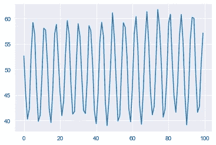
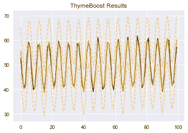
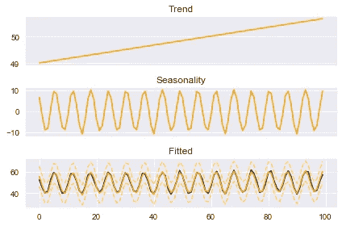
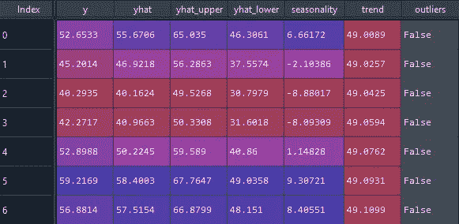
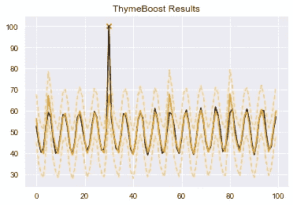
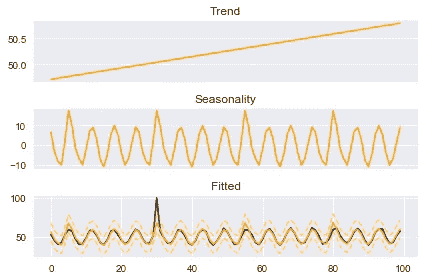
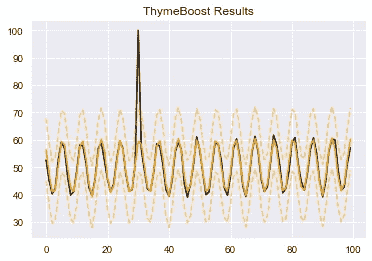
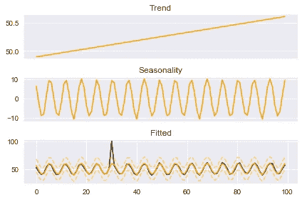
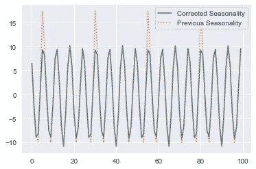
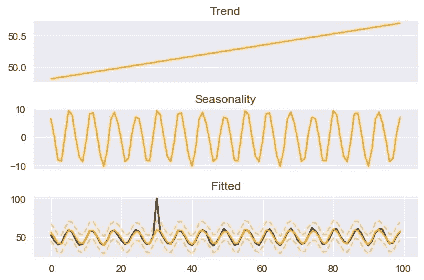

# 基于 ThymeBoost 的时间序列异常检测

> 原文：<https://towardsdatascience.com/time-series-outlier-detection-with-thymeboost-ec2046e17458?source=collection_archive---------11----------------------->

## 用增压缩小极端点的影响


图像由[上的](http://www.istockphoto.com)[环境](https://www.istockphoto.com/portfolio/enviromantic)完成

所有代码都在这里:百里香增强 [Github](https://github.com/tblume1992/ThymeBoost)

# **简介**

处理时间序列数据的一个常见任务是识别和处理异常值。了解这些数据点非常重要，因为它们对任何分析都有很大的影响。有许多方法可以识别和处理这些数据点，但今天我们将看看如何使用百里香增强来管理它们。

如果这是你第一次听说百里香，我建议你看看以前的文章[中的框架。在鸟瞰图中，百里香增强采用传统的时间序列分解，并将其与梯度增强相结合。它试图从每种方法中获取尽可能多的*正面*，同时留下许多*负面*方面。](/thymeboost-a0529353bf34)

这个包还在不断的开发中，所以即使你已经安装了它，pip 上也有 100%的机会会有一个新版本！

在我们开始异常值处理之前，一个简短的声明:百里香增强仍然处于开发的早期，所以使用时风险自担！此外，离群点检测并不是 ThymeBoost 的主要焦点，它只是一个不错的功能。存在许多用于异常值检测和处理的更健壮的方法。

就这样，让我们来看看这个例子…

# 简单的例子

我们将模拟一个由趋势、季节性和少量噪声组成的简单序列:

```
import numpy as np
import matplotlib.pyplot as plt
import seaborn as sns
sns.set_style('darkgrid')#Here we will just create a random series with seasonality and a slight trend
seasonality = ((np.cos(np.arange(1, 101))*10 + 50))
np.random.seed(100)
true = np.linspace(-1, 1, 100)
noise = np.random.normal(0, 1, 100)
y = true + seasonality + noise
plt.plot(y)
plt.show()
```



作者图片

添加的噪声给了几个点更多的尖峰，但总体来说没有什么太突出。让我们把这些数据交给百里香，看看它对这个系列的看法。

```
from ThymeBoost import ThymeBoost as tb
boosted_model = tb.ThymeBoost()
output = boosted_model.detect_outliers(y,
                                       trend_estimator='linear',
                                       seasonal_estimator='fourier',
                                       seasonal_period=25,
                                       global_cost='maicc',
                                       fit_type='global')
boosted_model.plot_results(output)
boosted_model.plot_components(output)
```



作者图片



作者图片

这里我们使用“检测异常值”方法，而不是标准拟合。该方法的作用与“拟合”方法相同，只是它将测试位于误差范围之外的点。这些误差界限仅对简单的线性趋势估计量是一致的。如果你要通过一个像“ses”(简单指数平滑)这样的平滑器作为趋势，那么这些界限将会很不可靠！由于我们使用的是简单的线性趋势，我们可以放心地继续下去，并查看该方法添加到输出数据框架中的“异常值”列:



作者图片

百里香似乎同意我们之前的观察:这个系列表现很好，没有异常值。再加一个吧！

```
y[30] = 100plt.plot(y)
plt.show()
```


作者图片

现在我们有了一个明确的异常值，让我们看看当我们把它给百里香增强时会发生什么。

```
boosted_model = tb.ThymeBoost()
output = boosted_model.detect_outliers(y,
                                       trend_estimator='linear',
                                       seasonal_estimator='fourier',
                                       seasonal_period=25,
                                       global_cost='maicc',
                                       fit_type='global')
boosted_model.plot_results(output)
boosted_model.plot_components(output)
```



作者图片



作者图片

首先要注意的是,“plot_results”图现在在异常值处有一个红色的“X”。如果您的输出包含异常值列，则该列将用于绘图。下一个主要的观察结果是，我们的季节成分被这个异常值的存在显著地改变了。问题是:

我们现在该怎么办？

如前所述，有许多方法可以进行。您可能希望用序列的平均值或拟合值的上限来替换异常值，或者什么也不做！让我们看看百里香可以处理它的一些自然方法。

## 使用异常值列处理异常值

我们将每个观察值列为异常值或非异常值。让我们用它来修正我们的季节性:

```
weights = np.invert(output['outliers'].values) * 1
```

我们在这里所做的就是把我们的序列转换成一个数组，用“invert”翻转布尔值，然后乘以 1，从真/假转换成 0/1 整数。结果是一个数组，其中异常数据点为 0，所有其他点为 1。有了这些，我们可以进行正常的拟合，但是将这个数组作为“季节性 _ 权重”参数传递，这样在计算季节性时会产生异常值 0 的影响。**注意:**这些权重必须作为一个数组传递，并与“傅立叶”季节性一起使用。

```
output = boosted_model.fit(y,
                           trend_estimator='linear',
                           seasonal_estimator='fourier',
                           seasonal_period=25,
                           global_cost='maicc',
                           fit_type='global',
                           seasonality_weights=weights)
boosted_model.plot_results(output)
boosted_model.plot_components(output)
```



作者图片



作者图片

请注意，红色的“X”现在消失了，因为我们刚刚使用了标准拟合方法，但现在我们的季节性因素似乎是固定的。我们拟合的季节性中的大尖峰，这是异常值的一个假象，已经被抹去了。当我们看一下这些季节性因素时，这一点就更加明显了:



作者图片

我们将权重作为 0/1 传递，但是我们可以使用任何我们想要的权重。**但是，**这些权重仍然是任意的。如果我们想要根据它们与“正常”的距离动态分配权重，会怎么样？

这可能吗？

是的，我们来看看。

## 使用正则化参数处理异常值

除了传递权重数组，我们还可以传递一个字符串:“regularize”。百里香增强现在将使用一个加权方案，这将惩罚较高的误差数据点时，近似季节性。这种加权与多轮增强相结合，提供了与传统的加权平方方法类似的处理方式。

```
output = boosted_model.fit(y,
                           trend_estimator='linear',
                           seasonal_estimator='fourier',
                           seasonal_period=25,
                           global_cost='maicc',
                           fit_type='global',
                           seasonality_weights='regularize')
boosted_model.plot_components(output)
```



作者图片

我们再一次看到，峰值已经从我们近似的季节成分中被清除了。这种方法会扣分**太多**。事实上，如果我们仔细观察这个季节性因素，就会发现这种情况确实发生了。

# 结论

根据异常值对我们分析的影响，百里香增强可以检测并自然地处理异常值。在本例中，异常值的唯一实际影响是季节成分被改变，这可以通过直接处理季节成分来解决。如前所述，还有其他更健壮的方法来检测和处理异常值。您甚至可能不想对异常值做任何事情！真的没有简单的答案，但希望百里香可以提供有用的见解。

**另一个免责声明**:这个包还在早期开发中。大量可能的配置使得调试成为一个复杂的过程，所以使用时风险自担。但是，请大家在 GitHub 上讨论并公开遇到的任何问题！