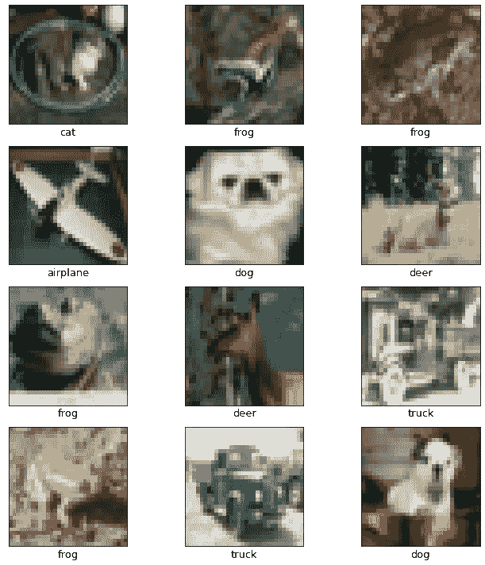
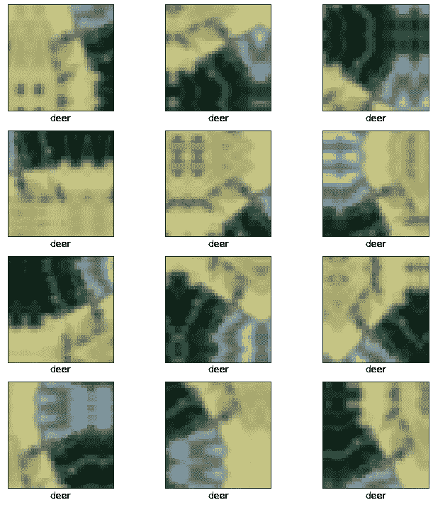
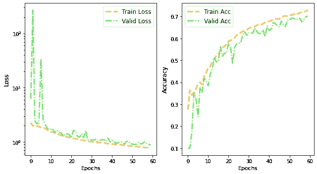
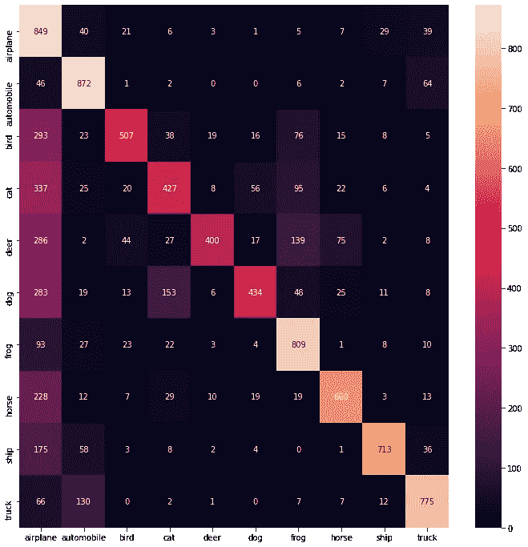

# 是时候选择 TensorFlow 数据而不是 ImageDataGenerator 了

> 原文：<https://towardsdatascience.com/time-to-choose-tensorflow-data-over-imagedatagenerator-215e594f2435?source=collection_archive---------14----------------------->

## 使用 tf.data 构建更好更快的图像管道


建一条像这条河一样干净的数据管道(来源:[作者](https://www.flickr.com/photos/suvob/51391307017/in/dateposted-public/))

在训练一个神经网络时，使用`ImageDataGenerator`类生成具有实时数据扩充的批量张量图像数据是很常见的。然而，在这篇文章中，我将讨论`[tf.data](https://www.tensorflow.org/guide/data)` [API](https://www.tensorflow.org/guide/data) ，使用它我们可以用可重用的片段构建一个更快的输入数据管道。正如 TensorFlow 文档中提到的—

> `[tf.data](https://www.tensorflow.org/api_docs/python/tf/data)` API 使得处理大量数据、读取不同的数据格式以及执行复杂的转换成为可能。

这篇文章将简短明了，包括一个使用`tf.data`的工作示例；所以，让我们毫不迟疑地开始吧。这里使用的代码可以在我的笔记本中找到，链接在帖子的末尾。

## tf.data.Datset:

我们将在这里用来构建高效管道的 tf.data 的主要组件是 [tf.data.Dataset API](https://www.tensorflow.org/api_docs/python/tf/data/Dataset) 。它可用于以下工作—

1.  从输入数据创建“数据集”对象。
2.  应用数据集转换进行预处理。
3.  以流的方式迭代数据集并处理元素。

我们将通过一个例子来理解和实现`tf.data`的每一个步骤。首先，我们将使用`from_tensor_slices`方法创建“数据集”对象。

## 什么是`**from_tensor_slices ?**`

为了理解`[from_tensor_slices](https://www.tensorflow.org/api_docs/python/tf/data/Dataset#from_tensor_slices)`方法是如何工作的，让我们从加载 [CIFAR-10 数据](https://www.cs.toronto.edu/~kriz/cifar.html)开始。

```
import matplotlib.pyplot as pltimport numpy as np
import timeimport tensorflow as tf
from tensorflow.keras.datasets import cifar10(x_train, y_train), (x_test, y_test) = cifar10.load_data()print ('check shapes: ', x_train.shape, y_train.shape, x_test.shape, y_test.shape)>>> check shapes:  (50000, 32, 32, 3) (50000, 1) (10000, 32, 32, 3) (10000, 1)
```

我们通过使用`[to_categorical](https://www.tensorflow.org/api_docs/python/tf/keras/utils/to_categorical)`将标签转换为分类表示

```
train_lab_categorical = tf.keras.utils.to_categorical(y_train, num_classes=10, dtype=’uint8')test_lab_categorical = tf.keras.utils.to_categorical(y_test, num_classes=10, dtype=’uint8')from sklearn.model_selection import train_test_splittrain_im, valid_im, train_lab, valid_lab = train_test_split(x_train, train_lab_categorical, test_size=0.20, stratify=train_lab_categorical,random_state=40, shuffle = True)print ("validation labels shape: ", valid_lab.shape)>>> validation labels shape:  (10000, 10)
```

我们现在将结合图像和标签来创建“数据集”对象，如下所示—

```
training_data = tf.data.Dataset.from_tensor_slices((train_im, train_lab))validation_data = tf.data.Dataset.from_tensor_slices((valid_im, valid_lab))test_data = tf.data.Dataset.from_tensor_slices((x_test, test_lab_categorical))print (‘check types; '\n' ‘, type(training_data)) >>> check types;  
<class 'tensorflow.python.data.ops.dataset_ops.TensorSliceDataset'>
```

从`type`我们不能得到太多，但让我们试着弄清楚这些“数据集”对象是什么，以及我们如何使用它们。首先，我们使用`element.spec()`检查这个数据集的一个元素的类型规范。

```
print (training_data.element_spec)>>> (TensorSpec(shape=(32, 32, 3), dtype=tf.float64, name=None), TensorSpec(shape=(10,), dtype=tf.uint8, name=None))
```

这样更好理解。我们看到`from_tensor_slices`保持了输入张量的结构。该数据集的一个元素由图像(形状:32，32，3)和相应的标签(形状:10)组成。我们的下一个问题应该是如何访问“数据集”对象中的元素？我们可以创建一个迭代器对象，并使用下面的`next`来访问元素

```
train_iter_im, train_iter_label = next(iter(training_data))print (train_iter_im.numpy().shape, train_iter_label.numpy().shape)>>> (32, 32, 3) (10,)
```

代替`next`、`iter`和`.numpy()`，我们可以返回一个迭代器，它将数据集的所有元素转换成 numpy 数组，如下所示

```
train_iter_im1, train_iter_label1 = next(training_data.as_numpy_iterator())print (train_iter_im1.shape, train_iter_label1.shape)>>> (32, 32, 3) (10,)
```

让我们将一些训练图像和相应的标签可视化如下—

```
class_types = [‘airplane’, ‘automobile’, ‘bird’, ‘cat’, ‘deer’,‘dog’, ‘frog’, ‘horse’, ‘ship’, ‘truck’] # from cifar-10 websitecheck_list = list(training_data.as_numpy_iterator()) fig = plt.figure(figsize=(10,10))for i in range(12): plt.subplot(4,3,i+1) plt.xticks([]) plt.yticks([]) plt.grid(False) plt.imshow(check_list[i][0], cmap='gray') plt.xlabel(class_types [np.argmax(check_list[i][1])], fontsize=13)plt.tight_layout()plt.show()
```



使用上述代码的 CIFAR-10 示例图像。(来源: [CIFAR-10 数据](https://www.cs.toronto.edu/~kriz/cifar.html))

## tf.data 相比 ImageDataGenerator 有多快？

使用 tf.data 生成训练和验证批比 ImageDataGenerator 快得多。我们来对比一下；首先，我们使用 ImageDataGenerator，没有使用任何增强功能—

```
from tensorflow.keras.preprocessing.image import ImageDataGeneratorst1 = time.time()train_datagen = ImageDataGenerator().flow(x=train_im, y=train_lab, batch_size=128, shuffle=True,)et1 = time.time()print (‘time taken: ‘, et1-st1)>>> time taken:  0.2080059051513672
```

现在我们将使用 tf.data —

```
autotune = tf.data.AUTOTUNEst2 = time.time()train_datagen_tfdata = training_data.shuffle(buffer_size=40000).batch(128).prefetch(buffer_size=autotune)et2 = time.time()print (‘time taken: ‘, et2-st2) >>> time taken:  0.006140947341918945
```

因此 **tf.data 比 ImageDataGenerator 快大约 34 倍，其中一个主要原因是一种称为“预取”的技术**。我们在通过`prefetch(buffer_size=tf.data.AUTOTUNE)`使用 tf.data 生成批处理时应用这个预取。在 [TensorFlow 文档](https://www.tensorflow.org/guide/data_performance)中，给出了一系列示例，并给出了很好的解释，但在此简要说明发生了什么。数据管道可以被认为是“生产者”(生成批次)和“消费者”(用于训练神经网络的批次)的组合，只要有机会将“生产者”的工作与“消费者”的工作重叠，预取转换就会带来好处。

## 用 tf.data 扩充数据

由于我们没有使用 ImageDataGenerator，我们将使用 [Keras 预处理层](https://keras.io/guides/preprocessing_layers/)来增强图像。除了一般的增强，我们还可以重新缩放图像(像素值在 0 和 1 之间)，这是解决手头问题的必要步骤。这个想法是——我们将使用`keras.sequential` ,就好像我们正在建立一个深度 conv 网络，而不是卷积或池层，我们将使用增强层。最后，我们将可视化一个增强图像的例子，下面是代码块。更多示例在 [TensorFlow 文档](https://www.tensorflow.org/tutorials/images/data_augmentation#augment_a_dataset_and_train_a_model_with_it)中给出。



使用 Keras 序列的数据扩充

## 用 tf.data 构建深度神经网络模型:

我们将使用`Sequential`中的增强层作为我们模型中的一个层。**这也有助于更快地训练模型，因为数据扩充现在正在 GPU 中进行，而不是在 CPU 中进行**。此外，为了保持简单，我们将使用预先训练的 ResNet 和 ImageNet 数据，而不是从头开始构建模型。我在另一篇文章[中描述了从零开始构建 ResNet。对于像 CIFAR-10 这样的多类问题，我们的损失函数将是分类交叉熵。下面的代码块将所有这些结合在一起。让我们看看—](/understand-and-implement-resnet-50-with-tensorflow-2-0-1190b9b52691)

通过 60 个时期，我获得了如下的训练和验证图—



训练和验证曲线:损失(左)和准确性(右)。(来源:作者)

我们还可以绘制测试数据的混淆矩阵，下面是图表—



测试数据的混淆矩阵(来源:作者)

最后，我们通过一个例子来说明如何使用 tf.data 来创建一个更快速、清晰和可重用的管道，对于现实世界中的模型部署，这通常是比 ImageDataGenerator 更好的选择。ImageDataGenerator 是一个很好的入门选项，但是，tf.data 可以根据硬件/实验设计同时自动调优生成批处理和训练的过程，整个过程要快得多。

保持坚强，干杯！！

这里使用的代码来自我的笔记本。

CIFAR-10 数据来源和引用:

[1]“从微小图像中学习多层特征”:Alex Krizhevsky2009.[CIFAR-10 的来源](https://www.cs.toronto.edu/%7Ekriz/cifar.html)。