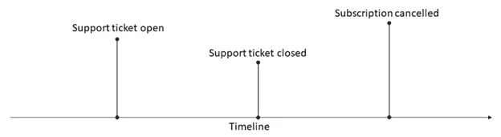

# 时间表

> 原文：<https://towardsdatascience.com/timelines-4f3216c0a1d0?source=collection_archive---------30----------------------->

## [行业笔记](https://towardsdatascience.com/tagged/notes-from-industry)

## 一个通用的时间轴视图帮助我们理解用户与系统的各种交互。


由[彼得·斯顿夫](https://unsplash.com/@peter_s?utm_source=medium&utm_medium=referral)在 [Unsplash](https://unsplash.com?utm_source=medium&utm_medium=referral) 上拍摄的照片

这是我的书《Azure 上的数据工程》的摘录。本文中的代码示例使用 Azure Data Explorer。如果你想运行它们，创建一个 [Azure Data Explorer 集群和数据库](https://azure.microsoft.com/en-us/services/data-explorer/)。一旦设置完成，您就可以使用 [Data Explorer web UI](https://dataexplorer.azure.com/) 连接到您的集群和数据库并运行代码示例。Azure Data Explorer 使用 KQL，Kusto 查询语言。如果不熟悉，可以查看[快速参考](https://docs.microsoft.com/en-us/azure/data-explorer/kql-quick-reference)。这本书更深入地介绍了 Azure Data Explorer，但是这篇文章是独立的。

# 时间表

在我的上一篇文章[身份密匙环](/identity-keyrings-201d17295954)中，我们看到了身份密匙环如何帮助我们连接整个企业的数据集。另一个有用的视图是显示我们系统中发生的所有事件的视图——时间线。

一个通用的时间轴视图帮助我们理解用户与系统的各种交互。比方说，我们正试图了解客户支持问题与用户保持率之间的关系。为此，我们需要查看支持票证何时打开和关闭，以及用户何时取消订阅。这些数据点同样来自不同的团队:客户成功团队处理支持票据，支付团队知道用户何时取消订阅。图 1 显示了如何在时间线上绘制。



图 1:多个事件的时间线视图:支持票证何时打开和关闭以及订阅何时取消。

# 构建时间线视图

我们可以为这些事件定义一个公共模式，用一个`Timestamp`列来捕获事件发生的时间，用`KeyType`和`KeyValue`列来捕获与事件相关联的身份的类型和值，用一个`EventType`列和一个动态`EventProperties`列来捕获特定于事件的属性。我们将利用半结构化数据来封装不同类型的属性，因为各种事件类型都有自己的关联属性。下一个清单创建了这个表。

```
.create table Timeline (Timestamp: datetime,
  KeyType: string, KeyValue: string, 
  EventType: string, EvenProperties: dynamic)
```

现在让我们假设我们想要从客户成功团队获取一个`SupportTickets`表，从我们的支付团队获取一个`SubscriptionOrders`表，用于捕获新的和取消的订阅。下面的清单用一些示例数据填充了这些表:

```
.set SupportTickets <|
datatable (Timestamp: datetime, SupportCustomerId: int,
  TicketId: int, Status: string, Message: string) [
    datetime(2020–07–01), 21, 5001, 'Opened', '...',
    datetime(2020–07–03), 21, 5002, 'Opened', '...',
    datetime(2020–07–04), 21, 5001, 'Updated', '...',
    datetime(2020–07–05), 21, 5001, 'Closed', '...',
    datetime(2020–07–19), 21, 5002, 'Closed', '...',
].set SubscriptionOrders <|
datatable (Timestamp: datetime, CustomerId: int,
  SubscriptionId: guid, Order: string) [
    datetime(2020–06–01), 1001,
      'fd10b613–8378–4d37-b8e7-bb665999d122', 'Create',
    datetime(2020–07–19), 1001,
      'fd10b613–8378–4d37-b8e7-bb665999d122', 'Cancel'
]
```

下面的清单显示了我们如何将这些表格纳入我们的时间表:

```
.append Timeline <| SupportTickets
| where Status == 'Opened'
| project Timestamp, KeyType='SupportCustomerId',
    KeyValue=tostring(SupportCustomerId),
    EventType='SupportTicketOpened',
    EventProperties=pack("Message", Message).append Timeline <| SupportTickets
| where Status == 'Closed'
| project Timestamp, KeyType='SupportCustomerId',
    KeyValue=tostring(SupportCustomerId),
    EventType='SupportTicketClosed',
    EventProperties=pack("Message", Message).append Timeline <| SubscriptionOrders
| where Order == 'Create'
| project Timestamp, KeyType='CustomerId',
    KeyValue=tostring(CustomerId),
    EventType='SubscriptionCreate',
    EventProperties=pack("SubscriptionId", SubscriptionId).append Timeline <| SubscriptionOrders
| where Order == 'Cancel'
| project Timestamp, KeyType='CustomerId',
    KeyValue=tostring(CustomerId),
    EventType='SubscriptionClose',
    EventProperties=pack("SubscriptionId", SubscriptionId)
```

`pack()`从一组属性名和值中创建一个动态值，这使我们能够在`EventProperties` 列中存储不同形式的数据。

# 使用时间线

如果我们查询时间表，我们会得到如下结果:

时间表

我们有时间线上的各种事件，它们的特定属性在`EventProperties`列中捕获。将这一点与钥匙圈结合起来，我们就可以更好地了解我们的系统是如何被使用的。

对于下一个查询，您将需要在[上一篇文章](/identity-keyrings-201d17295954)中构建的密匙环表:

钥匙圈表

让我们回到我们的示例，我们希望将支持票证与订阅取消相关联。以下清单中的查询检索订阅被取消后 30 天内打开的所有支持票证。

```
Timeline
| where EventType == 'SubscriptionClose' // #1
| join kind=inner (Keyring
    | where KeyType == 'CustomerId') on KeyValue  // #2
| join kind=inner (Keyring
    | where KeyType == 'SupportCustomerId') on GroupId  // #3
| join kind=inner (Timeline
    | where EventType == 'SupportTicketOpened') on
      $left.KeyValue2 == $right.KeyValue  // #4
| project Delta=(Timestamp — Timestamp1), CustomerId=KeyValue,
  SupportCustomerId=KeyValue2    // #5
| where Delta < timespan(30d)    // #6
```

我们首先获取所有的`SubscriptionClose`事件(#1)。然后我们用`CustomerId`上的钥匙圈表连接得到`GroupId` (#2)。然后，我们再次连接`GroupId`上的密匙环表，以获得关联的`SupportCustomerId` (#3)。最后，我们再次加入`SupportCustomerId` ( `KeyValue`)上的时间表，寻找`SupportTicketOpened`事件(#4)。

我们现在已经有了所有需要的数据——我们将`SubscriptionClose`和`SupportTicketOpened`之间的时间差计算为`Delta`。我们有`CustomerId`和`SupportCustomerId` (#5)。最后，我们通过小于 30 天的时间差进行筛选(#6)。

这里的关键要点是，这些数据点(打开/关闭的支持票证、取消的订阅)来自我们企业的不同系统，并使用不同的 id 进行标识。使用身份密匙环和时间线，我们将它们聚合到一个公共模式中，从这个模式中我们可以生成我们的业务报告。

概括地说，钥匙圈和时间线都是通用的数据模型，我们可以在系统中可用的原始数据的基础上构建。这些有助于将这些点连接起来，并将原本分散的数据集整合到一个统一的视图中，以了解用户如何与我们的系统进行交互。建立和维护这样的模型是数据工程师的责任。