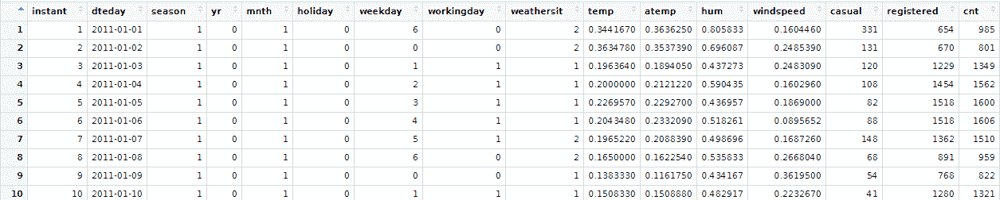
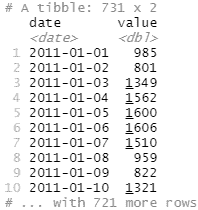
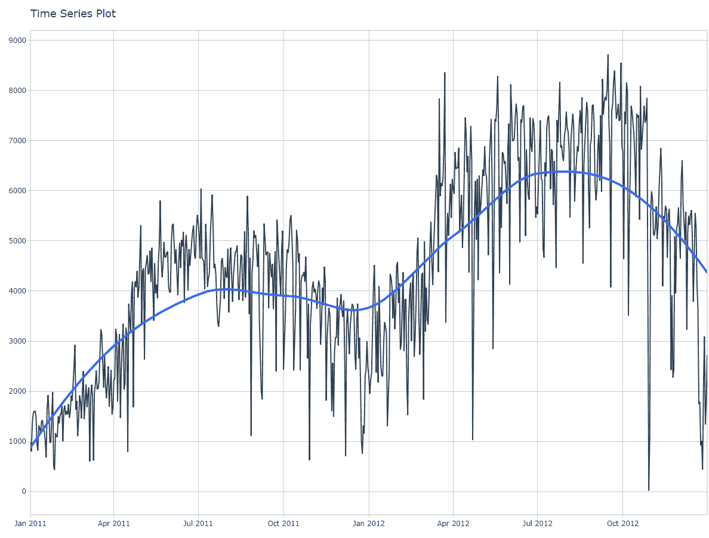
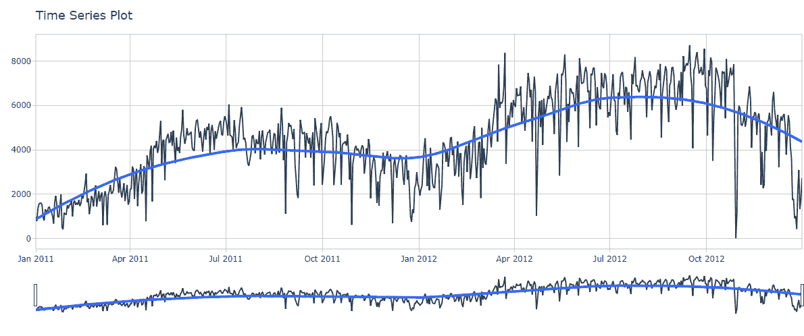
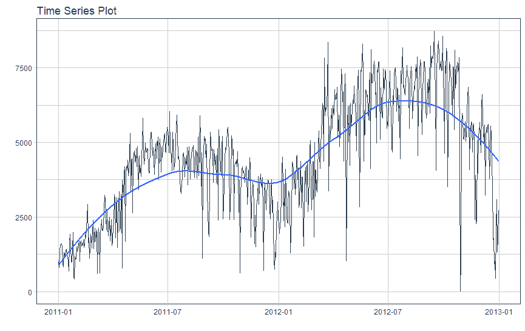
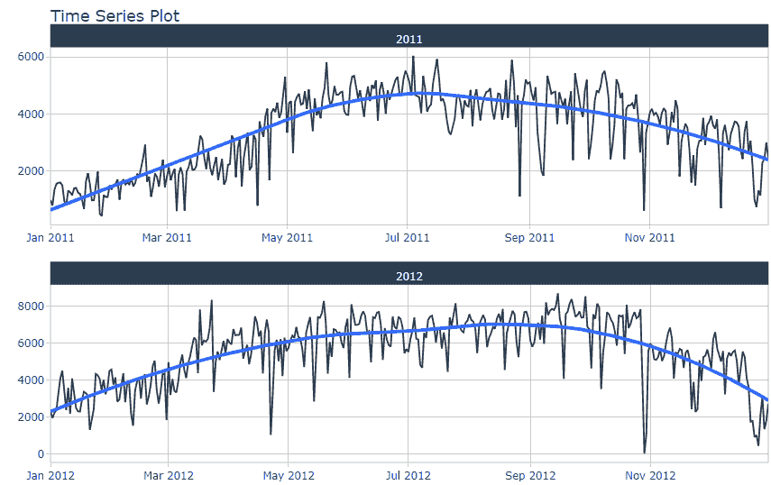
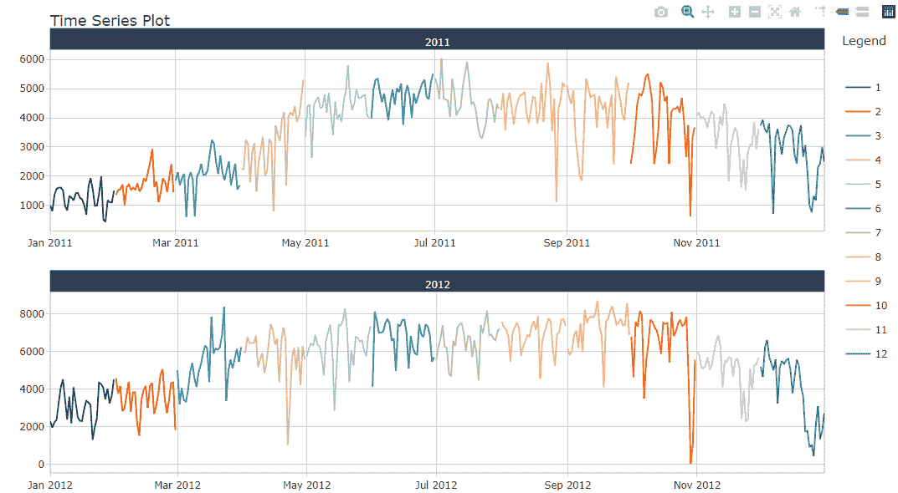
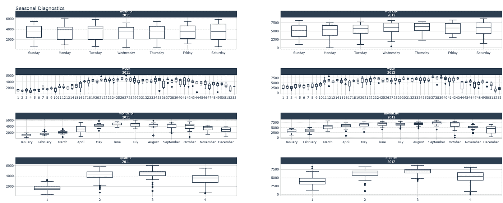
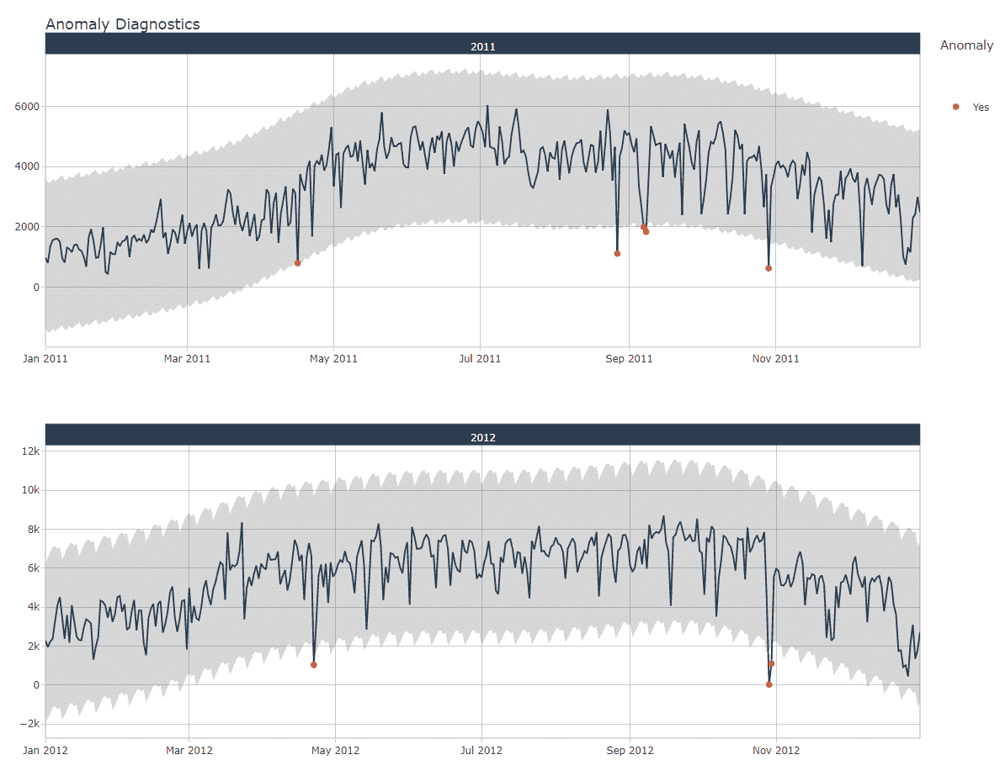
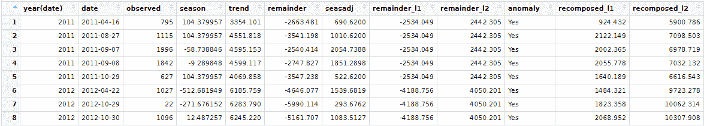

# Timetk:时间序列分析的 R 库

> 原文：<https://towardsdatascience.com/timetk-the-r-library-for-time-series-analysis-9822f7720318?source=collection_archive---------14----------------------->

## 您可以使用它来分析、操作和检测时序数据的异常。


尼古拉斯·卡佩罗在 [Unsplash](https://unsplash.com/s/photos/chart?utm_source=unsplash&utm_medium=referral&utm_content=creditCopyText) 上拍摄的照片

# 介绍

你见过像天气温度、股票价格或销售数字这样随时间变化的数据吗？我很确定你已经在现实生活中至少见过一次这些数据了。这些是时间序列数据。时间序列是随着时间变化的数据，无论是由其他因素还是时间本身引起的。

分析时间序列数据可能是一项具有挑战性的任务。例如，检测异常情况，甚至希望看到几个月或几周的季节性趋势。如果你想做到这一点，你需要做脚本和使用这么多的库。

现在谢天谢地，有一个 R 编程语言库可以帮助我们。它叫 timetk。Timetk 是由 Matt Dancho 和 Davis Vaughan 创建的库，用于分析和可视化时间序列数据。Timetk 很容易使用，如果你曾经和 tidyverse 一起玩，它会更容易。

在本文中，我将向您展示如何在 r 中使用 timetk。

没有进一步，让我们开始吧！

# 实施

## 安装并导入库

我们需要做的第一件事是安装库。在这种情况下，我们将安装 timetk 和 tidyverse。之后，我们可以导入库。下面是命令的样子，

```
install.packages("timetk")
install.packages("tidyverse")library(tidyverse)
library(lubridate)
library(timetk)
```

## 导入数据

导入库之后，现在让我们导入数据。在这种情况下，我们将使用来自 UCI 机器学习知识库(名为自行车共享数据集)的数据。该数据包含从 2011 年到 2012 年单日自行车用户数量的信息。

幸运的是，timetk 包含了数据，所以你不需要下载它。如果你还想使用原始数据，你可以在这里访问数据集[。](https://archive.ics.uci.edu/ml/datasets/bike+sharing+dataset)

要查看数据，您可以使用这里的命令，

```
View(bike_sharing_daily)
```

这是数据的预览，



正如您在上面看到的，数据中有几列。有关于时间、温度、湿度和骑自行车的人数的信息。在这种情况下，我们只使用 dteday 和 cnt 列，其中每一列都表示日期和自行车用户的数量。下面是检索数据的代码，

```
**# Get the data**
bike_sharing <- bike_sharing_daily %>%
 **# Get the columns**
 select(dteday, cnt) %>%
 **# Change the columns name**
 set_names(c("date", "value"))bike_sharing
```

这是数据的预览，



## 时间序列可视化

在我们得到数据后，现在让我们进入可视化。为了可视化时间序列，我们可以使用 timetk 库中的 plot_time_series 函数。下面是命令的样子，

```
bike_sharing %>%
  plot_time_series(date, value)
```

以下是该命令的结果，



正如您在上面看到的，该函数返回一个交互式可视化。这种可视化是基于一个名为 Plotly 的库。因此，您可以悬停以获取数据点，并缩放以查看可视化的详细信息。

还可以添加一个滑块来过滤数据观察值。plotly_slider 参数为 true。下面是命令的样子，

```
bike_sharing %>%
  plot_time_series(date, value, .interactive=TRUE, .plotly_slider=TRUE)
```

这是结果，



如果只需要静态可视化，可以将。交互式参数设置为 false。该函数将返回一个基于 ggplot 库的静态可视化。命令看起来像这样，

```
bike_sharing %>%
 plot_time_series(date, value, .interactive=FALSE)
```

这是结果，



就像其他可视化一样，您可以使用 timetk 库进行分组可视化。如你所见，数据范围从 2011 年到 2012 年。在这种情况下，我们将根据可视化发生的年份对其进行分组。下面是命令的样子，

```
bike_sharing %>%
  group_by(year(date)) %>%
  plot_time_series(date, value, .facet_scales="free")
```

结果看起来像这样，



为了使可视化更加引人注目，我们可以添加。color_var 参数根据数据发生的月份对数据进行着色。此外，我们将通过设置。将参数平滑为假。下面是命令的样子，

```
bike_sharing %>%
  group_by(year(date)) %>%
  plot_time_series(date, value, .facet_scales="free", .smooth=FALSE .color_var=month(date), .interactive=FALSE)
```

这是结果，



除此之外，我们还可以通过季节性来可视化时间序列，无论是以小时、天、周，甚至是月为单位。您可以通过使用 plot_seasonal_diagnostics 函数获得所有信息。下面是命令的样子，

```
bike_sharing %>%
  group_by(year(date)) %>%
  plot_seasonal_diagnostics(date, value, .x_lab='Date', .y_lab='# of users', .title='Bike Sharing Users')
```

这是结果，



## 异常检测

最后，我想向您展示这个库的一个主要特性。您可以只使用一个函数来检测异常。

异常检测是一项任务，旨在发现具有异常价值的数据。换句话说，数据是不同的。

在 timetk 中，我们可以为异常检测做两件事。你能做的第一件事是将数据中的异常可视化。在这种情况下，我们将可视化时间序列和异常。还有，我们按年份分。

我们可以使用 plot_anomaly_diagnostics 函数来可视化时间序列和异常，并按年份进行拆分。命令看起来像这样，

```
**# Get the data**
bike_sharing %>%
 **# Group the data by year**
  group_by(year(date)) %>%
 **# Visualize the result**
  plot_anomaly_diagnostics(date, value)
```

这是可视化的样子，



你能做的第二件事是收集有异常的数据。我们按年份对数据进行分组。此外，我们过滤数据，只包含有异常的数据。我们可以使用 tk_anomaly_diagnostics 函数来收集异常。下面是命令的样子，

```
anomaly_data <- bike_sharing %>%
  group_by(year(date)) %>%
  tk_anomaly_diagnostics(date, value) %>%
  filter(anomaly == 'Yes')View(anomaly_data)
```

这是数据的预览，



# 结束语

恭喜你！现在你已经学会了如何在 R 中使用 timetk 进行时间序列分析。有了 timetk，我们可以比以前更容易地分析时间序列数据。

我希望这篇文章对你有用。如果你想看更多这样的文章，可以关注我的媒介。如果你有任何问题或者想进行对话，你可以在 [LinkedIn](https://www.linkedin.com/in/alghaniirfan/) 上联系我。

谢谢你看我的文章！