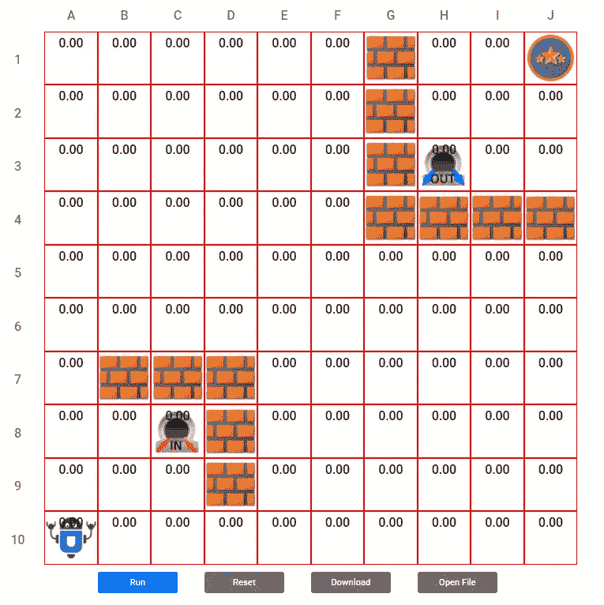
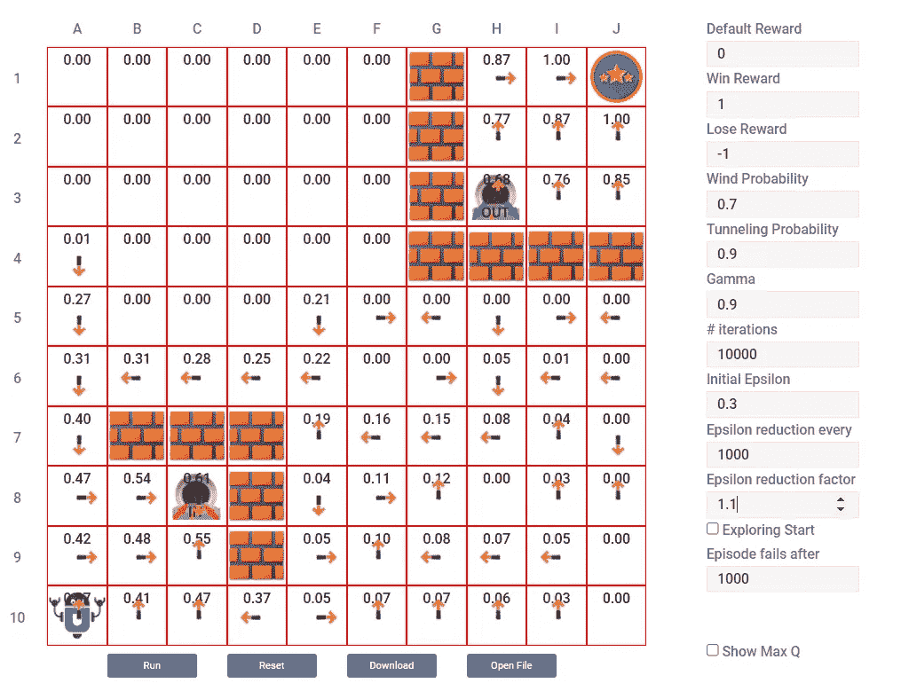
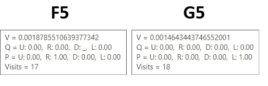
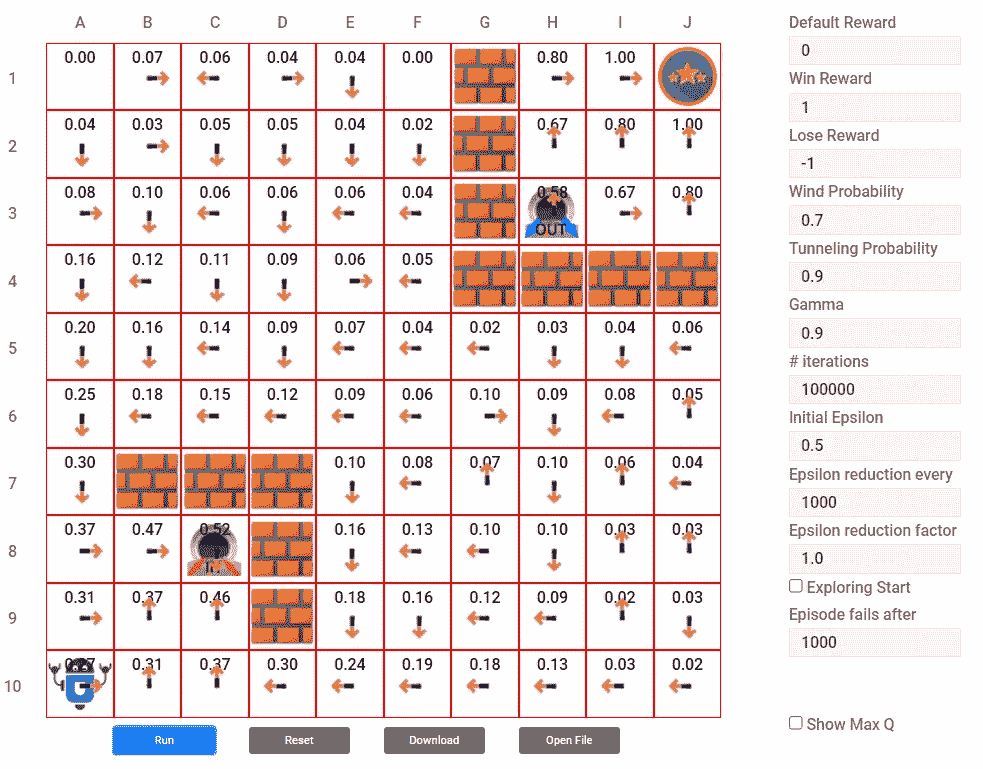
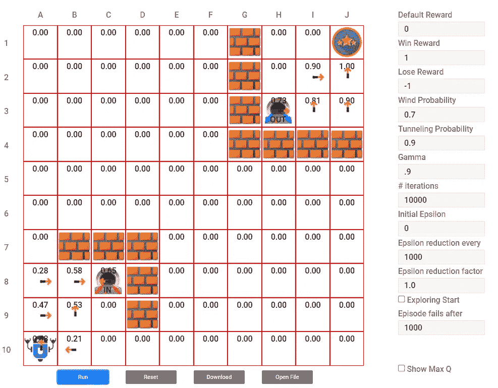
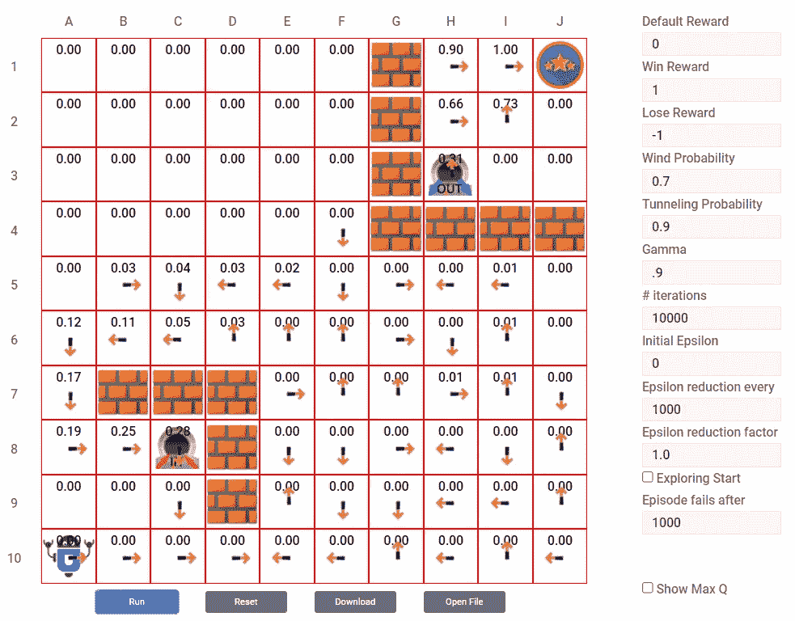
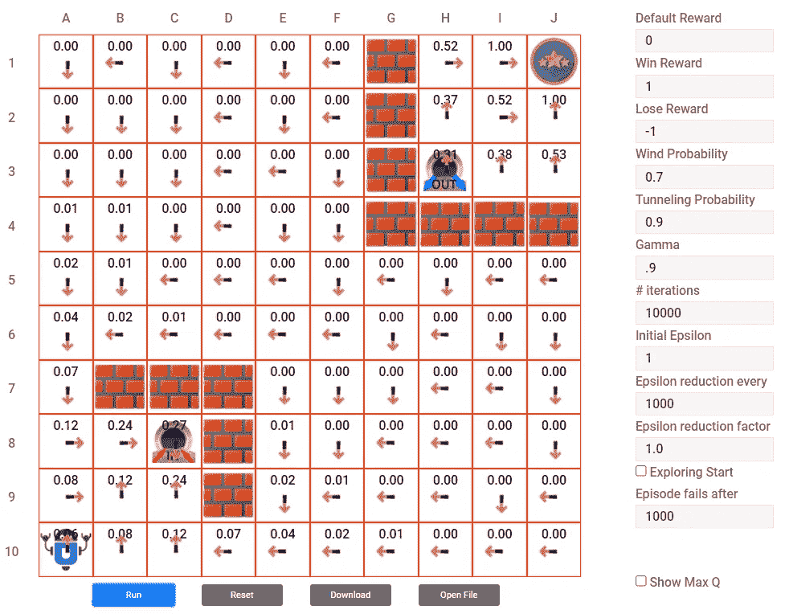
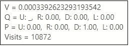
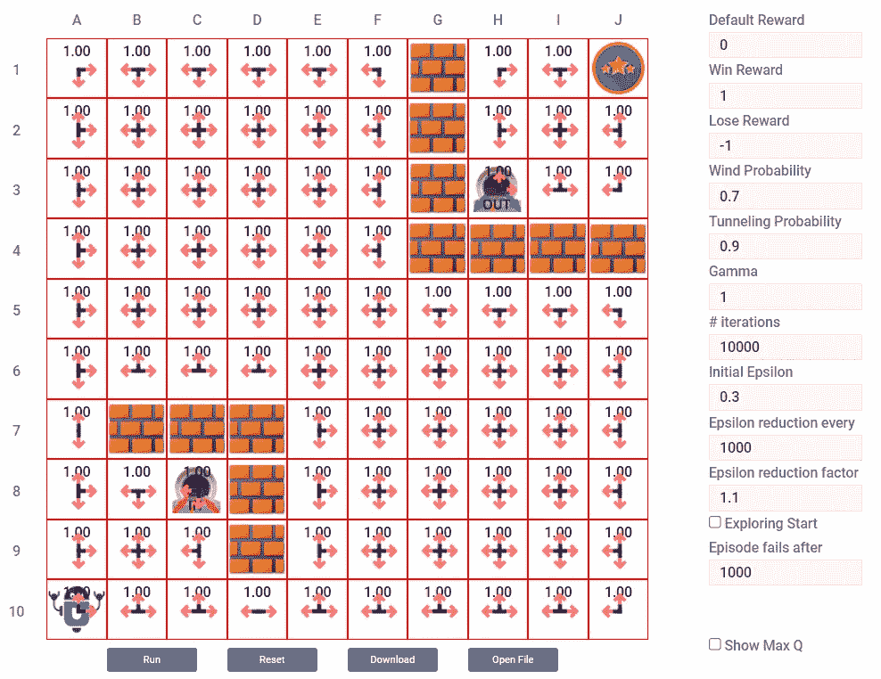

# 强化学习中蒙特卡罗方法的改进

> 原文：<https://towardsdatascience.com/tinkering-with-monte-carlo-method-in-reinforcement-learning-8b820b60a8f7?source=collection_archive---------12----------------------->

## 用特殊情况和实例推动 MC 方法的极限。

在 [Unsplash](https://unsplash.com?utm_source=medium&utm_medium=referral) 上由[猎人哈利](https://unsplash.com/@hnhmarketing?utm_source=medium&utm_medium=referral)拍摄的照片

蒙特卡罗和动态规划、时间差分是强化学习中对初学者的主要方法。

# 蒙特卡洛

首先，让我们简单提醒一下什么是蒙特卡罗方法。
蒙特卡罗(Monte Carlo)是一种基于当前策略生成路径(构成一集)的算法，当前策略通常在探索和开发之间分裂，就像 greedy 一样，直到路径到达终端状态。一旦达到这种状态，算法会再次返回该路径，并影响每个状态，即在情节中遇到的折扣奖励。
这些值(折扣和奖励)与那些州中碰巧包含的任何其他值进行平均。

# 环境

在接下来的示例中，我们将 GridWorld 作为环境，它具有以下设置:

有墙和隧道的 GridWorld 示例。(*图片作者*)

上面的 GridWorld 包含 100 个州，其中一些州有不可到达的墙，其他州有类似 C8(入口)和 H3(出口)中的单向隧道，因此当代理到达入口时，有一个概率(在这些示例中为 90%)会自动传输到 H3。然而，反过来是不可能的。
因此，在 A10 的代理的目的是在 J1 达到目标(终端)状态。

# 假设

在下面的例子中，我们假设我们不能无限期地等待一集结束，因为这不是一个现实的方法。特别是因为我们允许在同一集中多次访问相同的状态，这增加了循环和无限循环的风险。
为此，我们设置了一个名为‘剧集失败后’的参数，并赋予其 1k 步的值。这很公平，因为网格世界包含 100 个状态。因此，如果在 1000 步之后，代理找不到终端状态，该片段将被中止，并且对计算没有贡献。另一个开始了。

# 标准案例

在标准示例中，我们表明由于生成剧集的事实，无法保证我们可以探索 GridWorld 中的所有状态。

我们设置的参数是ε(勘探/开采比率)到 0.3，这意味着勘探是 30%的时间，而开采是 70%，我们将衰减添加到该比率(“N 集后的ε减少”和“ε减少因子”参数)。我们可以说，随着迭代的进行，没有必要保持高的探索率，并且代理对其环境了解得更多。

在下图中，您可以清楚地看到许多状态没有被浏览或访问，因为算法假设它已经找到了获胜的状态，并且随着时间的推移，越来越不需要任何进一步的浏览。

蒙特卡罗方法不能保证计算出所有的状态。该图显示了许多从未被访问过的国家。(*图片作者*)

您还可以看到，很少访问的状态不会显示有用的或逻辑的行为，例如，单元格 F5 和 G5 相互指向对方。

状态 F5 和 G5 被访问了 17 和 18 次，这使得计算不够精确，因此结果不符合逻辑。他们进入了一个无限循环。(*图片作者*)

这种无限循环的原因是，因为他们没有被访问足够的次数，以计算足够的 Q 和 V 值来代表现实。

## 如果我们增加迭代次数呢？

实际上，我们仍然不能保证每个状态都将被访问，甚至不能保证每个状态都将被充分访问，以使计算具有代表性。
在这个例子中，迭代次数是 100K，ε是 0.5，没有衰减率。但是，您可以注意到 A1 和 F1 州从未被访问过。其他如 B1、C1、D1、E1 的访问次数都不到 50 次，而 C8、H3 的访问次数为 10 万次。
这是因为一半的时间代理人在探索，去各个方向，而另一半时间代理人表现贪婪，直接去得分最高的州。

状态 A1 和 F1 从未被访问过，尽管迭代次数很高并且ε没有衰减。(*图片作者*)

# ε效应

改变 epsilon 的值对算法是否更喜欢利用的探索有很大的影响，反之亦然。这一点的影响可以清楚地看到，特别是像零和一这样的极端值。

## ε等于零

当 epsilon 为 0 时，代理根本不探索，而是开始利用。
然而，这种说法并不十分准确，因为，在开始时，没有什么可利用的。所以所有的行为都是平等的，代理会在其中随机选择，这相当于探索一段时间。

因为这种情况，没有真正的预测知道算法能做什么，所以我们最多可以描述为不稳定。

有些时候，由于纯粹的机会和风险，源于开始时的事实上的探索，代理可以到达终端状态，建立一个策略并不断地利用它，如下图所示。

Epsilon 等于 0，开始时成功的事实上的探索让代理利用这种成功，但是没有任何进一步的探索。(*作者图片*)

但也有其他时候，由于算法在ε= 0 时的不稳定性，事情变得模糊，结果变得不确定或不清楚，如下图所示。

有时当ε等于零时，在开始时仍会进行一些探索，但结果仍然是不确定的。(*图片作者*)

## ε等于 1

当ε为 1，并且没有衰减因子(ε缩减因子= 1)时，代理将继续探索，不管正在计算的策略是什么。这样做的副作用是所有的状态都被探索，类似于动态编程方法。

然而，这是非常重要的，代理正在做的事情和计算的策略之间是有区别的。当代理移动并最终到达终端时，算法将折回其路径，并以奖励的贴现值影响每个状态(PS 并将其与现有值平均…)。这本身就创造了这种指向最终状态的梯度，这就是下图所描绘的。

当ε为 1 时的行为。(*图片作者*)

正如你在下面看到的，在其他例子中，一个通常不太被探索的州的访问量非常高，超过了 10K。这可以通过以下事实来解释，即尽管处于非感兴趣状态，但算法并不将其排除在访问之外，如当ε小于 1 时。

E1 州立大学的房产，那里的访问量非常高。(*图片作者*)

# 伽玛的重要性

Gamma 是当代理人离开奖励状态时降低奖励效果的折扣因子。它的价值决定了这种影响降低的速度。奖励效应的减少产生了一个指向奖励状态的梯度，因此其他状态指向它的方向。

Gamma 的值可以在 0，1 之间(不含 0，1。
但是如果 Gamma 取这两个极值会怎么样呢？

## 伽玛等于一

当 Gamma 为 1 时，对于来自奖励州的州，奖励没有折扣。这意味着所有的州都有相同的 V！
正如您在下图中看到的，所有状态都是平等的，因为每个状态都被其他具有相同值的状态所包围，所以该状态下的所有操作都是等概率的。这会把我们引向一个陈腐的；代理将不能确定性地向终止状态移动。它所做的是随机行走，不能保证它会到达目的地。

伽玛为 1 时的行为。(*作者图片*)

## 伽玛等于零

当 Gamma 为 0 时，也会出现同样的现象。奖励效应的价值几乎立刻下降到零。所有状态都将具有相同的零值，结果是每个状态中的所有动作都是等概率的。所以智能体会在环境中随机游走。

伽玛为零时的行为。(*图片作者*)

# 注意

本文中的所有例子都可以在 RL-Lab 的[蒙特卡洛重复](https://rl-lab.com/gridworld-mc)

# 结论

最后，微调算法的参数，以及对算法的深入了解对于体验的成功至关重要。

# 相关文章

*   [动态编程在强化学习中的简便方法](https://zsalloum.medium.com/dynamic-programming-in-reinforcement-learning-the-easy-way-359c7791d0ac)
*   [蒙特卡洛强化学习，简单易行](https://medium.com/@zsalloum/monte-carlo-in-reinforcement-learning-the-easy-way-564c53010511)
*   [TD 中的强化学习，简单易行](/td-in-reinforcement-learning-the-easy-way-f92ecfa9f3ce)
*   [数学背后的强化学习，最简单的方法](https://medium.com/p/1b7ed0c030f4)
*   [面向开发人员的强化学习政策](https://medium.com/@zsalloum/revisiting-policy-in-reinforcement-learning-for-developers-43cd2b713182)
*   [Q vs V 在强化学习中，最简单的方法](https://medium.com/p/9350e1523031)