# 修补移动应用数据集

> 原文：<https://towardsdatascience.com/tinkering-with-the-mobile-apps-dataset-4286d2c6125b?source=collection_archive---------25----------------------->

## 单一模型的 EDA


詹姆斯·亚雷马在 [Unsplash](https://unsplash.com/s/photos/mobile-app?utm_source=unsplash&utm_medium=referral&utm_content=creditCopyText) 上的照片

# 介绍

我的主要工作是与移动广告相关的，有时我必须处理移动应用数据集。

我决定公开一些数据，供那些想练习构建模型或了解一些可以从公开来源收集的数据的人使用。我相信开源数据集总是有用的，因为它们可以让你学习和成长。收集数据通常是一项困难而枯燥的工作，并不是每个人都有能力去做。

在这个故事中，我将介绍一个数据集，并使用它的数据建立一个模型。除非另有说明，所有图片均为作者所有。

# 数据

数据集发布在 [Kaggle 网站](https://www.kaggle.com/sagol79/stemmed-description-tokens-and-application-genres)。

```
DOI: 10.34740/KAGGLE/DSV/2107675.
```

已经为 293392 个应用程序(最流行的)收集了词干描述令牌和应用程序数据。数据集中没有应用程序名称；唯一的 id 可以识别他们。在标记化之前，大部分描述都被翻译成了英文。

数据集由四个文件组成:

*   **bundles_desc.csv —** 仅包含描述；
*   **bundles _ desc _ 令牌. csv —** 包含令牌和流派；
*   **bundles_prop.csv，bundles_summary.csv** —包含其他应用程序特征和更新日期。

# 电子设计自动化(Electronic Design Automation)

首先，让我们看看数据是如何跨操作系统分布的。

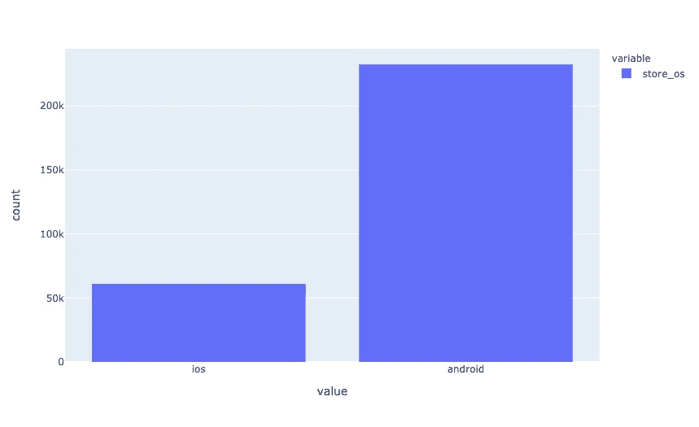

Android 应用在数据方面占据主导地位。最有可能的是，这是因为越来越多的 Android 应用程序正在被创建。

考虑到数据集只包含最流行的应用程序，了解发布日期是如何分布的是很有趣的。

```
histnorm='probability' # type of normalization
```

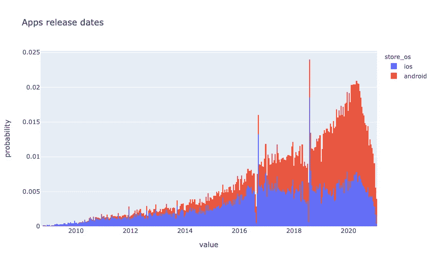

大多数应用程序都会定期更新，因为最近一次更新的日期就在不久之前。

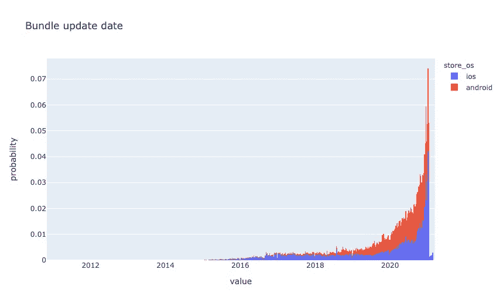

基本数据是在一月份的短时间内收集的。

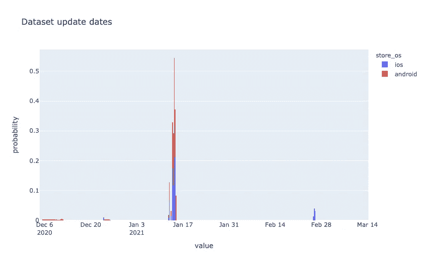

让我们添加一个新特性——发布日期和最后一次更新之间的月数。

```
df['bundle_update_period'] = \
    (pd.to_datetime(
        df['bundle_updated_at'], utc=True).dt.tz_convert(None).dt.to_period('M').astype('int') - 
     df['bundle_released_at'].dt.to_period('M').astype('int'))
```

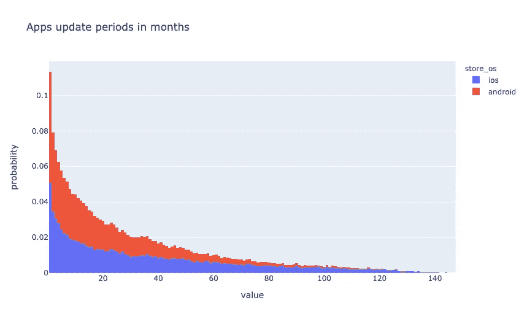

看看这些流派是如何分布的是很有趣的。考虑到*操作系统*的不平衡，我将归一化直方图的数据。

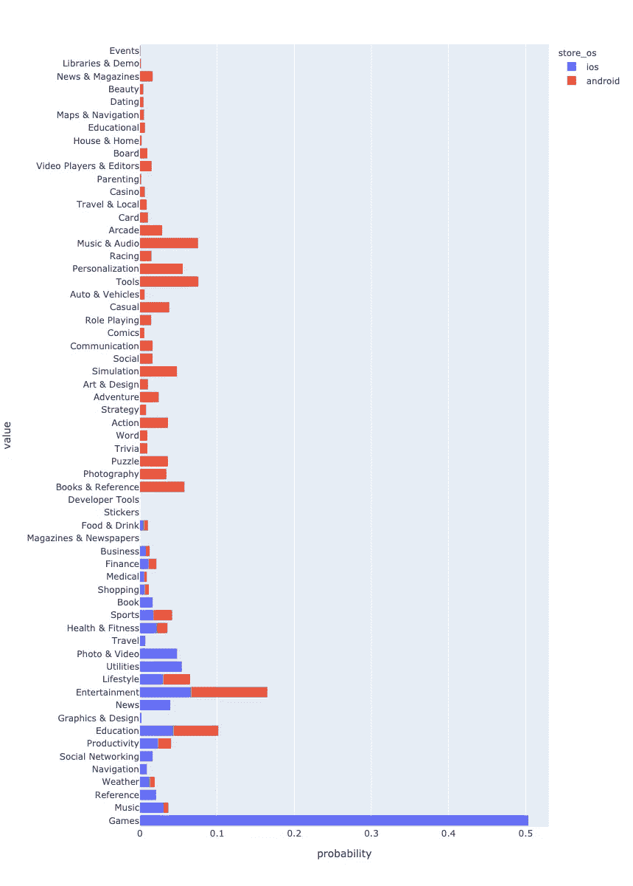

我们可以看到流派并没有完全重叠。这一点在游戏中尤其明显。我们能做些什么吗？最明显的是减少 Android 的流派数量，使其与 iOS 的形式相同。但是我认为这不是最好的选择，因为会有信息的丢失。让我们试着解决这个逆问题。为此，我需要建立一个可以预测 iOS 应用程序流派的模型。

# 模型

我使用描述长度和令牌数量创建了一些额外的特性。

```
def get_lengths(df, columns=['tokens', 'description']):
    lengths_df = pd.DataFrame()
    for i, c in enumerate(columns):
        lengths_df[f"{c}_len"] = df[c].apply(len)
        if i > 0:
            lengths_df[f"{c}_div"] = \
                lengths_df.iloc[:, i-1] / lengths_df.iloc[:, i]
            lengths_df[f"{c}_diff"] = \
                lengths_df.iloc[:, i-1] - lengths_df.iloc[:, i]
    return lengths_dfdf = pd.concat([df, get_lengths(df)], axis=1, sort=False, copy=False)
```

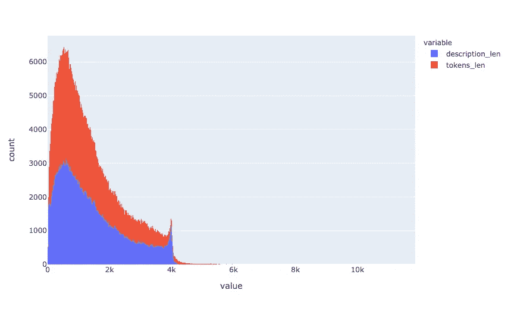

作为另一个特性，我记录了自应用程序发布以来已经过去的月数。这个想法是，市场上可能存在对游戏类型的偏好。

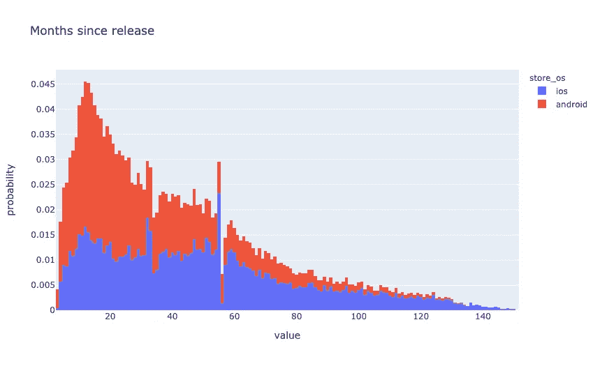

我使用 Android 应用程序的数据进行训练。

```
android_df = df[df['store_os']=='android']
ios_df = df[df['store_os']=='ios']
```

该模型的最终功能列表如下:

```
columns = [
    'genre', 'tokens', 'bundle_update_period', 'tokens_len',
    'description_len', 'description_div', 'description_diff',
    'description', 'rating', 'reviews', 'score',
    'released_at_month'
]
```

我将 android 应用的数据集分为两部分——训练和验证。请注意，将数据集分割成折叠应该是分层的。

```
train_df, test_df = train_test_split(
    android_df[columns], train_size=0.7, random_state=0, stratify=android_df['genre'])y_train, X_train = train_df['genre'], train_df.drop(['genre'], axis=1)
y_test, X_test = test_df['genre'], test_df.drop(['genre'], axis=1)
```

我选择了 [CatBoost](https://catboost.ai/) 作为模型的免费库。CatBoost 是一个高性能的开源库，用于决策树的梯度提升。从版本 0.19.1 开始，它支持在 GPU 上开箱即用的分类文本功能。主要优点是 CatBoost 可以在数据中包含分类函数和文本函数，而无需额外的预处理。

在[非常规情感分析:BERT vs. Catboost](/unconventional-sentiment-analysis-bert-vs-catboost-90645f2437a9) 中，我给出了一个 Catboost 如何处理文本的例子，并将其与 BERT 进行了比较。

```
!pip install catboost
```

当使用 CatBoost 时，我推荐使用[池](https://catboost.ai/docs/search/?query=Pool)。它是一个方便的包装器，结合了特性、标签和进一步的元数据，如分类和文本特性。

```
train_pool = Pool(
    data=X_train, 
    label=y_train,
    text_features=['tokens', 'description']
)test_pool = Pool(
    data=X_test, 
    label=y_test, 
    text_features=['tokens', 'description']
)
```

让我们写一个函数来初始化和训练模型。我没有选择最佳参数；让那成为你的另一个家庭作业。

```
def fit_model(train_pool, test_pool, **kwargs):
    model = CatBoostClassifier(
        random_seed=0,
        task_type='GPU',
        iterations=10000,
        learning_rate=0.1,
        eval_metric='Accuracy',
        od_type='Iter',
        od_wait=500,
        **kwargs
    )return model.fit(
        train_pool,
        eval_set=test_pool,
        verbose=1000,
        plot=True,
        use_best_model=True
    )
```

文本要素用于构建新的数字要素。但对于这一点，有必要向 CatBoost 解释一下，我们到底想从中获得什么。

**CatBoostClassifier** 有几个参数可用于参数化:

*   *记号赋予器—* 记号赋予器，用于在创建字典之前预处理文本类型特征列；
*   *字典—* 用于预处理文本类型特征列的字典；
*   *feature_calcers —* 用于基于预处理文本类型特征列计算新特征的特征计算器；
*   *text _ processing—**标记器、字典和特征计算器的 JSON 规范，它决定了如何将文本特征转换成浮点特征列表。*

*第四个参数取代了前三个参数，在我看来是最方便的，因为在一个地方，它清楚地指示了如何处理文本。*

```
*tpo = {
    'tokenizers': [
        {
            'tokenizer_id': 'Sense',
            'separator_type': 'BySense',
        }
    ],
    'dictionaries': [
        {
            'dictionary_id': 'Word',
            'token_level_type': 'Word',
            'occurrence_lower_bound': '10'
        },
        {
            'dictionary_id': 'Bigram',
            'token_level_type': 'Word',
            'gram_order': '2',
            'occurrence_lower_bound': '10'
        },
        {
            'dictionary_id': 'Trigram',
            'token_level_type': 'Word',
            'gram_order': '3',
            'occurrence_lower_bound': '10'
        },
    ],
    'feature_processing': {
        '0': [
            {
                'tokenizers_names': ['Sense'],
                'dictionaries_names': ['Word'],
                'feature_calcers': ['BoW']
            },
            {
                'tokenizers_names': ['Sense'],
                'dictionaries_names': ['Bigram', 'Trigram'],
                'feature_calcers': ['BoW']
            },
        ],
        '1': [
            {
                'tokenizers_names': ['Sense'],
                'dictionaries_names': ['Word'],
                'feature_calcers': ['BoW', 'BM25']
            },
            {
                'tokenizers_names': ['Sense'],
                'dictionaries_names': ['Bigram', 'Trigram'],
                'feature_calcers': ['BoW']
            },
        ]
    }
}*
```

*让我们训练模型:*

```
*model_catboost = fit_model(
    train_pool, test_pool,
    text_processing = tpo
)*
```

*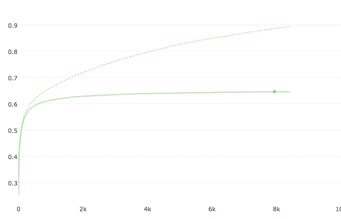*

*准确(性)*

*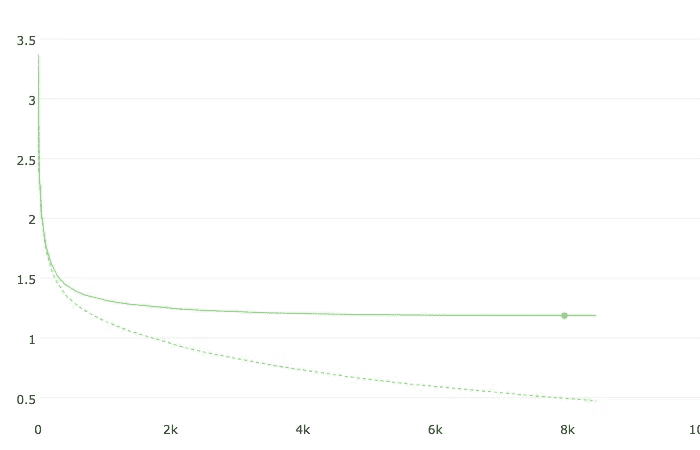*

*失败*

```
*bestTest = 0.6454657601*
```

**

*只有两个特征对模型有重大影响。最有可能的是，由于摘要功能，质量可以得到提高，但由于它在 iOS 应用程序中不可用，因此将无法快速应用它。如果你有一个能从描述中获取一小段文字的模型，那会很有帮助。我会把这个任务作为你的家庭作业。*

*从数字来看，质量不是很高。主要原因是应用程序通常很难归属于一个特定的类型，当指定类型时，开发人员会有偏见。需要一个更客观的特征来反映每个应用的几个最合适的类型。这种特征可以是概率向量，其中向量的每个元素对应于归属于一个或另一个流派的概率。*

*为了得到这样一个向量，我们需要使用 OOF (Out-of-Fold)预测来使这个过程复杂化。我们不会使用第三方库；让我们试着写一个简单的函数。*

```
*def get_oof(n_folds, x_train, y, x_test, text_features, seeds):

    ntrain = x_train.shape[0]
    ntest = x_test.shape[0]  

    oof_train = np.zeros((len(seeds), ntrain, 48))
    oof_test = np.zeros((ntest, 48))
    oof_test_skf = np.empty((len(seeds), n_folds, ntest, 48))
    test_pool = Pool(data=x_test, text_features=text_features) 
    models = {}
    for iseed, seed in enumerate(seeds):
        kf = StratifiedKFold(
            n_splits=n_folds,
            shuffle=True,
            random_state=seed)          
        for i, (tr_i, t_i) in enumerate(kf.split(x_train, y)):
            print(f'\nSeed {seed}, Fold {i}')
            x_tr = x_train.iloc[tr_i, :]
            y_tr = y[tr_i]
            x_te = x_train.iloc[t_i, :]
            y_te = y[t_i]
            train_pool = Pool(
                data=x_tr, label=y_tr, text_features=text_features)
            valid_pool = Pool(
                data=x_te, label=y_te, text_features=text_features)
            model = fit_model(
                train_pool, valid_pool,
                random_seed=seed,
                text_processing = tpo
            )
            x_te_pool = Pool(
                data=x_te, text_features=text_features)
            oof_train[iseed, t_i, :] = \
                model.predict_proba(x_te_pool)
            oof_test_skf[iseed, i, :, :] = \
                model.predict_proba(test_pool)
            models[(seed, i)] = model
    oof_test[:, :] = oof_test_skf.mean(axis=1).mean(axis=0)
    oof_train = oof_train.mean(axis=0)
    return oof_train, oof_test, models*
```

*这些计算非常耗时，但结果是，我得到了:*

*   *Android 应用的预测*
*   **OOF _ test—*OOF-iOS 应用的预测*
*   **模型* —褶皱和随机种子的所有 OOF 模型*

```
*from sklearn.metrics import accuracy_scoreaccuracy_score(
    android_df['genre'].values,
    np.take(models[(0,0)].classes_, oof_train.argmax(axis=1)))*
```

*由于折叠和平均几个随机种子，质量有所改善。*

```
*OOF accuracy: 0.6560790777135628*
```

*我创建了一个新特性， *android_genre_vec，*，我将 android 应用程序的 *oof_train* 和 iOS 应用程序的 *oof_test* 中的值复制到这个特性中。*

```
*idx = df[df['store_os']=='ios'].index
df.loc[df['store_os']=='ios', 'android_genre_vec'] = \
    pd.Series(list(oof_test), index=idx)
idx = df[df['store_os']=='android'].index
df.loc[df['store_os']=='android', 'android_genre_vec'] = \
    pd.Series(list(oof_train), index=idx)*
```

*另外， *android_genre* 也加了*，*我在里面放了概率最大的流派。*

```
*df.loc[df['store_os']=='ios', 'android_genre'] = \
    np.take(models[(0,0)].classes_, oof_test.argmax(axis=1))
df.loc[df['store_os']=='android', 'android_genre'] = \
    np.take(models[(0,0)].classes_, oof_train.argmax(axis=1))*
```

*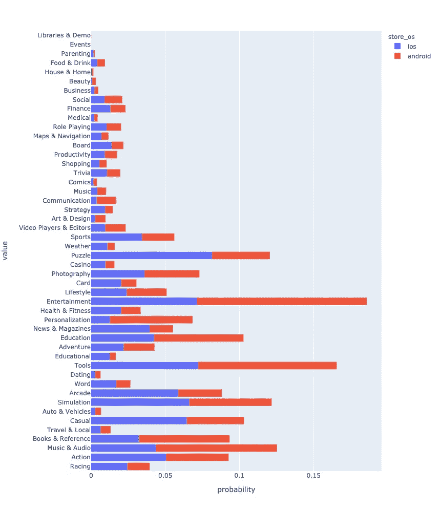*

# *摘要*

*在这个故事中，我:*

*   *引入了新的免费数据集；*
*   *做了探索性数据分析；*
*   *创造了几个新功能；*
*   *创建了一个模型，根据应用程序的描述来预测其类型。*

*我希望这个数据集对社区有用，并在模型和研究中使用。*

*文章中的代码可以在这里查看[。](https://github.com/sagol/bundles_desc_tokens/blob/main/EDA-apps.ipynb)*