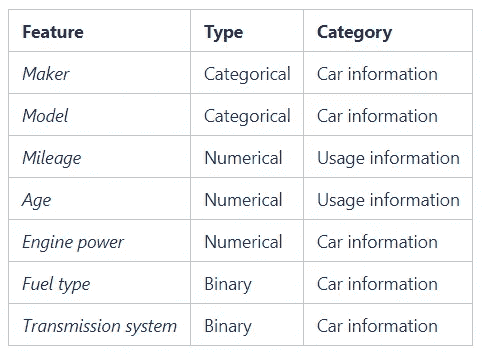
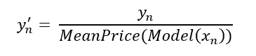
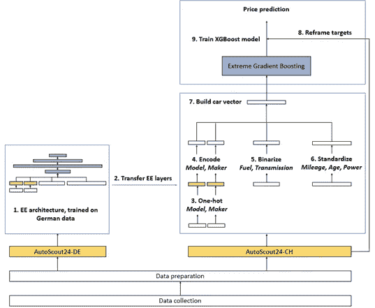
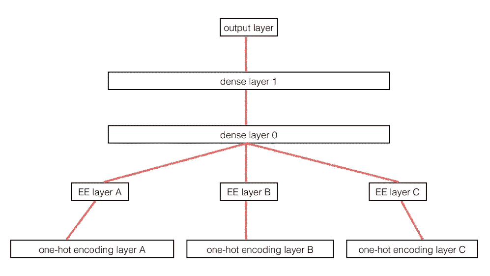
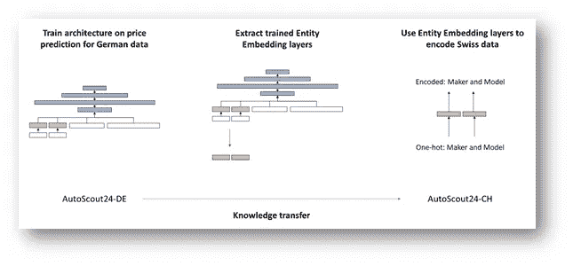
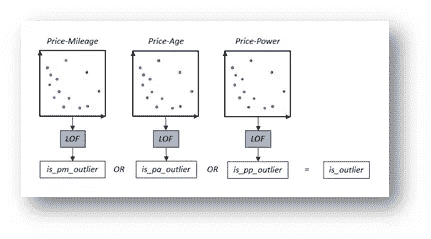
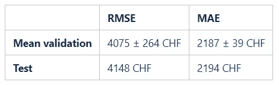

# 建立二手车价格评估模型的技巧和诀窍

> 原文：<https://towardsdatascience.com/tip-and-tricks-for-building-a-price-estimation-model-for-used-cars-ac0953e194c4?source=collection_archive---------22----------------------->

## 创建稳健的汽车价格机器学习预测模型的挑战和解决方案

照片由[坎贝尔](https://unsplash.com/@campful?utm_source=medium&utm_medium=referral)在 [Unsplash](https://unsplash.com?utm_source=medium&utm_medium=referral) 上拍摄

最近，我发表了一篇短篇 [Medium story](https://medium.com/elca-data-science/building-a-robust-price-prediction-model-for-used-cars-da1ce2643cbe) ，其中我介绍了促使 [ELCA](https://www.elca.ch/en?gclid=CjwKCAjw2bmLBhBREiwAZ6ugowuw0ITiAetPePNudMPfMl4RJRN8Z96E8W37wlcduKU7vlWcg_zXbRoCHnQQAvD_BwE) 数据科学团队开发机器学习(ML)模型以准确估计瑞士市场上二手车价格的动机、目标和挑战。价格预测任务一直受到机器学习社区的极大关注，各种二手物品在线市场的兴起增加了对自动化工具的需求，以准确预测合理的价格标签。

在本笔记中，我将简要介绍我们模型的架构，以及我们用来应对以下关键挑战的一些策略:

*   如何处理和编码**分类变量**在这个设置中，
*   如何弥补**汽车模型数据样本数量不足**
*   如何实现一种**异常值检测**方法来保护我们的训练过程免受噪声数据的影响。

特别是，我们的**跨市场实体嵌入解决方案**是一种*转移学习*方法，它将我们模型的预测精度提高了大约 **4.3%** 。

# 数据集和任务形式化

我们使用了三个不同的汽车数据集，这些数据集由来自不同的瑞士和欧洲数字市场的汽车销售公告组成。

*   [*autoscout 24-CH*](https://www.autoscout24.ch/fr)数据集包含 119’414 个公告，用于训练和验证目的。
*   *AutoScout24-DE* 是一套 558'295 德国销售公告(摘自[欧洲网站版本](https://www.autoscout24.com/))。这个更大的数据集用于我们的迁移学习方法。
*   第三个瑞士数据集( [*Comparis-CH*](https://www.comparis.ch/carfinder/default) ，111972 个样本)用作测试集，以评估模型的泛化能力

我们将自己限制在一组小而简单的汽车特征上，这些特征为普通大众所知，并且易于为大多数二手车收集。

我们作为汽车建模方法采用的一组特征。图片作者。

目标是使用这个特性集执行标准的*回归任务*，其中目标数量是汽车 *x_n* 的销售价格 *y_n* 以瑞士法郎(CHF)表示，除以训练集中相应汽车模型的平均价格。

这个简单的操作使目标成为一个相对量，并稳定了优化过程。以瑞士法郎计算的估计价格是通过简单地缩减预测得出的。*均方根误差* r ( **RMSE** )是选择的损失函数。出于可解释性的原因，我们报告了 CHF 中的原始目标。

# 模型架构

我们确定并验证了一个 **XGBoost** 回归器作为我们预测管道的最佳模型。 [XGBoost](https://xgboost.readthedocs.io/en/latest/index.html) 是一个流行且强大的框架，它实现了*梯度增强*技术。其核心是一种*集成方法*，它结合了弱决策树。所有的模型搜索和优化实验都是按照标准的机器学习程序进行的，在 *AutoScout24-CH* 数据集上使用 **10 重分层交叉验证**。下图显示了最终的预测管道。

我们的价格预测渠道。图片作者。

# 编码分类变量

制造商(*制造商*)和汽车型号(*型号*)特征编码了关于新车价格等级的大部分可用信息。数据集包含 37 个不同的汽车制造商和 211 个汽车型号。由于这些是**分类特征**(与连续特征相反)，我们需要*对它们进行编码，然后才能将它们与其余特征连接起来，并使用它们来训练模型。最简单的编码方法是标准的 *one-hot scheme* ，其中我们创建的二进制变量与每个字段中的类一样多。这种方法几乎相当于为每个类训练一个不同的回归模型。鉴于许多汽车模型的数据都很少，这种编码方案是不够的。将变量映射到单个连续空间的方法是更好的，因为它允许模型利用类之间的相似性。*

实现这一目标的一个简单的表示选择是用两个连续值来表示分类变量:训练数据中类的平均价格及其标准差。直观地说，这种编码方法用关于起始价格和折旧范围的近似信息丰富了汽车表示向量。然而，它不提供了解每种汽车类别折旧模式的更精细细节的可能性。

*实体嵌入* (EE)方法由 [C. Guo 和 F. Berkhan 于 2016 年](https://arxiv.org/abs/1604.06737)提出，并显示在下面的模式中，这是一种更复杂的方法，它使用一个小的**神经网络**来学习从每个变量的一个热点表示到一个潜在表示的映射。这种映射由每个变量的编码 *EE 层*表示，其权重与价格预测任务相关的模型的其余部分一起训练。

*实体嵌入层(EE)的图示，对应于每个独热编码输入之上的额外层。图像由* [*C .郭和*](https://arxiv.org/abs/1604.06737)*f . Berkahn 组成。*

这三种编码方法提供了以下平均验证性能。具有平均分类价格和标准偏差的变量替代略优于 EE 方法。

# 数据稀缺:知识转移拯救世界

一些汽车模型缺乏足够的数据样本可能解释了 EE 方法令人失望的结果。有些模型在 *AutoScout24-CH* 中出现不到 100 次，这不允许学习足够精确的映射。因此，我们在更大的 *AutoScout24-DE* 数据集上训练 EE 网络，因为德国汽车市场呈现出与瑞士相似的分布。因此，潜在 EE 空间中轿厢等级的相对距离应该是**可转移的**。

我们的跨市场实体嵌入方法克服了数据稀缺问题。EE 编码层在德国数据上训练，然后转移到我们的瑞士模型。图片作者。

这种跨市场迁移学习方法在瑞士 RMSE 上提供了大约 **4.3%** 的性能提升，使得 EE 方法优于其他编码方案:

# 可能的定价趋势培训:异常值检测

对数据集的进一步分析让我们认识到，销售公告可能并不总是价格的可靠依据。对标价的不准确性没有控制或限制，甚至更是如此，因为我们不考虑汽车配件和许多其他重要的汽车功能。很明显，我们需要“看穿噪音”,只根据符合每个汽车制造商/车型的**一般定价趋势**的样本来训练模型。

我们的解决方案是对每款车型分别应用一个相当激进的**异常值剔除程序**。我们在特征-目标空间的三个独立的二维子空间中执行基于密度的异常值检测:*价格-里程*、*价格-年龄、*和*价格-功率。*里程和车龄是我们的两个磨损水平指标，也是折旧的两个主要原因。我们还发现了一组不可忽略的样品，其价格相对于列出的功率等级异常高。如果样本在三个平面中的任何一个被检测为异常值，则将其从数据集中移除。我们使用[局部异常值因子(LOF)](https://www.dbs.ifi.lmu.de/Publikationen/Papers/LOF.pdf) 算法，通过测量异常数据点相对于邻居的局部密度偏差来发现异常数据点。以下模式阐明了这种方法:

所提出的离群点检测方法，基于局部离群因子(LOF)方法，适用于三个不同的特征目标子空间。图片作者。

我们移除了大约 **12.5%的训练数据**，并在新数据集上训练整个模型(包括德国 EE 层)。这极大地提高了性能:

# 成果和业绩

我们报告了在所有汽车模型上计算的 ML 模型的最终验证/测试 RMSE 和平均绝对误差。对于绝大多数汽车，平均估计误差小于训练数据中特定汽车型号价格可变性的 **20%。鉴于我们的汽车建模方法相对简单，我们的方法的性能非常令人满意。**

通过[这个演示界面](https://car-price-demo.azurewebsites.net/)可以查询我们的型号。用户可以插入汽车的特征，并从预测器获得价格估计，以及置信区间和关于模型在训练期间已经看到的相同模型汽车的数量的信息。我们希望这份关于我们在这项任务上的实验的**快速概述**以及我们采用的**成功解决方案**对于任何打算从机器学习角度解决类似问题的人来说都是一份有用的读物。

## 参考

*   【1】c .签名人:[价格合适吗？](https://www.semanticscholar.org/paper/Is-the-Price-Right-Bachelor-thesis-Signer/33d929141ace83bdf34ba0c77201fdd537d1a8d1) (2016)
*   [2] N. Pal 等人，[我的车值多少钱？使用 Random force](https://arxiv.org/abs/1711.)t(2017)预测二手车价格的方法
*   [3] K. Noor and S. Jan，[基于机器学习技术的车辆价格预测系统](https://www.semanticscholar.org/paper/Vehicle-Price-Prediction-System-using-Machine-Noor-Jan/fc87ead6754b188b1b8629db77badf361fd24a22) (2017)
*   [4] S. Pudaruth，[利用机器学习技术预测二手车价格](https://www.semanticscholar.org/paper/Predicting-the-Price-of-Used-Cars-using-Machine-Pudaruth/dc148913b7271b65d221d2c41f77a9e41750c867) (2014)
*   [5]郭，伯克翰，[分类变量的实体嵌入](https://arxiv.org/abs/1604.06737) (2016)
*   [6] M. Breunig， [LOF:识别基于密度的局部异常值](https://www.researchgate.net/publication/221214719_LOF_Identifying_Density-Based_Local_Outliers)，(2000)
*   [7] T. Albergoni，[瑞士市场二手车价格预测，演示界面](https://mojito.switzerlandnorth.cloudapp.azure.com/car-price/) (2020)