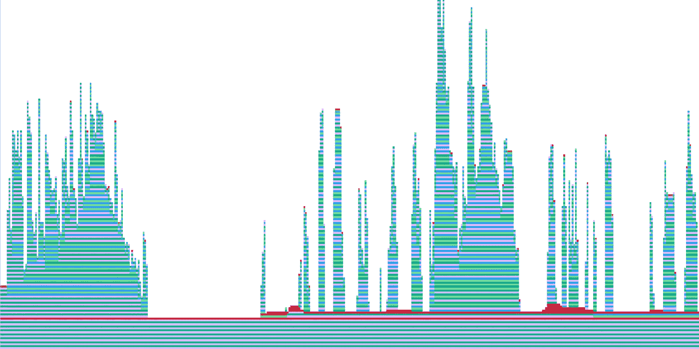

# 高性能计算的提示和技巧

> 原文：<https://towardsdatascience.com/tips-and-tricks-for-high-performance-computing-adeb78e96a4?source=collection_archive---------61----------------------->

jplenio 在 Unsplash 上拍摄的照片

## 充分利用您的计算能力。

无论您使用的是 Matlab 和 R 之类的脚本语言，还是 Python、Java 或 C++之类的高级语言，性能优化都是必须的。我们回顾了每个程序员都应该知道的加速程序的技巧。

# 1.并行化

并行化是增加程序吞吐量的最常见但经常被遗忘的方法之一。根据您的计算机拥有的内核或逻辑处理器的数量，并行化您的代码可以带来切实的计算节省。在 MATLAB 中，安装[并行计算工具箱](https://www.mathworks.com/products/parallel-computing.html),用于访问 GPU 阵列、池管理和并行 for 循环(parfor loops ),它们会自动充分利用您的内核。

# 2.预分配

预分配不仅提高了程序性能，还提高了程序的可读性。在 Python 和 MATLAB 这样的语言中，改变数组大小通常不利于获得良好的性能——事实上，当您的数组在每个循环中改变大小时，MATLAB 会发出警告。相反，应该为矩阵和数组这样的数据结构预先分配空间，因为它们**会占用内存中连续的空间块**。如果没有为数组预先分配空间，当数组变得太大时，您的程序可能会分配不足，并被迫寻找更大的空间。

# 3.…向量化…

当使用 NumPy 或 MATLAB 时，如果可能的话，在进行数组操作时避免 for 循环！由于底层线性代数的实现方式，矢量化有可能更快。事实上，许多 NumPy 运算都是用 C 实现的，它依靠**基本线性代数子程序** ( **BLAS** )来执行它的矩阵向量乘法。

# 4.稀疏内存分配

密集矩阵是笨重的对象。对它们的操作是昂贵的，所以只在必要时使用。当您事先知道您的矩阵将有许多零条目时，让您的程序知道您正在使用一个稀疏矩阵，要么通过实例化一个这样的矩阵，要么将矩阵转换为稀疏格式。稀疏矩阵运算的典型时间复杂度是 O(NNZ)的倍数，或者与矩阵中非零元素的数量成比例。如果 NNZ 为 N，那么你将会节省很多钱。

# 5.操作顺序

矩阵和向量的序列相乘？不要犯这种初学者的错误！回想一下，一个方阵乘以一个向量有二次成本，而一个矩阵乘以一个矩阵有三次成本。类似的推理适用于求解线性系统。在 Python 和 MATLAB 中，乘法是左关联的，因此经常需要在适当的位置插入括号，以实现所需的运行时。

# 6.压型

如果有疑问，请使用分析工具来确定哪些代码部分占用了所有的计算时间。考虑使用 Python 的 profile 模块、MATLAB tic 和 toc 命令，或者 Julia 的 [ProfileView.jl 包](https://github.com/timholy/ProfileView.jl)来计时代码，甚至生成调用图的可视化。

Julia 程序的调用堆栈。图片作者。

# 结论

调整代码通常会带来惊人的计算节省。第一次调优系统可以产生 10%到 300%的加速。如果你还没有，试试这些技巧，看看你的代码是否能得到健康的速度提升。无论是重新思考你的操作顺序还是让你的内核全力以赴，追求更高的性能水平都是对更有效代码的投资。