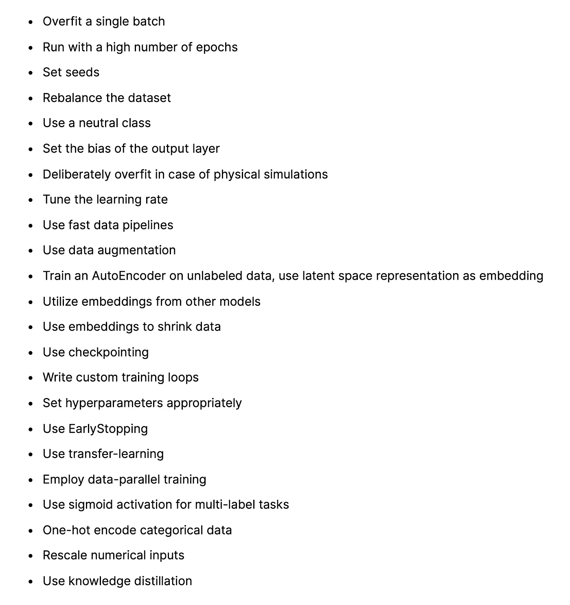
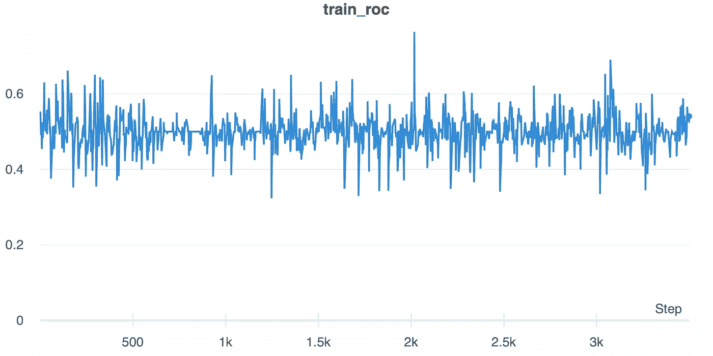
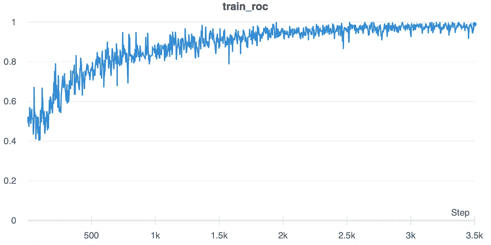

# 神经网络的提示和技巧

> 原文：<https://towardsdatascience.com/tips-and-tricks-for-neural-networks-63876e3aad1a?source=collection_archive---------16----------------------->

## 从增强到超参数选择

训练神经网络是一个复杂的过程。许多变量相互作用，通常不清楚什么起作用。

以下精选的建议旨在让你的事情变得更简单。这不是必做清单，但应该被视为一种激励。您知道手头的任务，因此可以从以下技术中进行最佳选择。它们涵盖了广泛的领域:从增强到选择超参数；许多话题都涉及到了。将这一选择作为未来研究的起点。

技术概述。该列表可在此处点击[查看。图片由作者提供。](https://phrasenmaeher.notion.site/Tips-for-Neural-Networks-02b022b1d6ca4620be74de38232bbab5)

## 一批装得过多

使用这种技术来测试网络的容量。首先，取一个数据批次，并确保它被正确标记(如果使用了标签)。然后，反复拟合这单批，直到损耗收敛。如果你没有达到完美的准确性(或类似的指标)，你应该看看你的数据。简单地使用更大的网络通常不是解决方案。

## 以一个显著的因子增加历元的数量

通常，您会从运行更多步骤的算法中受益。如果你能负担得起更长时间的训练，可以将周期数从 100 个增加到 500 个。如果你观察到较长训练时间的好处，你可以开始选择更明智的价值观。

## 播种

为了确保再现性，请设置任何随机数生成操作的种子。例如，如果您使用 TensorFlow，您可以利用以下代码片段:

## 重新平衡数据集

不平衡的数据集有一个或多个主要类，它们构成了数据集的很大一部分。反之，一个或多个辅修班只贡献几个样本。如果您正在处理具有相似特征的数据，请考虑重新平衡数据集。推荐的技术是对少数类进行过采样，对主要类进行下采样，采集额外的样本(如果可能)，以及生成具有增强功能的人工数据。

## 使用中性类

考虑以下情况:您有两个类的数据集，“生病”和“没生病”。这些样本由领域专家手工标记。如果他们中的一个不确定合适的标签，他可能不分配或分配很少的信心。在这种情况下，引入第三个中立的类是个好主意。这个额外的类代表了“我不确定”的标签。在培训过程中，您可以排除这些数据。之后，您可以让网络预先标记这些模糊的样本，并将它们展示给领域专家。

## 设置输出层的偏置

对于不平衡的数据集，网络的初始猜测不可避免地会失败。尽管网络学会了解释这一点，但在模型创建时设置更好的偏差可以减少训练时间。对于 sigmoid 层，偏差可以计算为(对于两类):

偏差=对数(正/负)

创建模型时，将该值设置为初始偏差。

## 为物理模拟过度拟合

为了模拟流体的运动，人们经常使用特殊的软件。在复杂的交互中(例如，水在不平的地面上流动)，可能需要很长时间才能看到结果。神经网络在这里可以有所帮助。因为模拟遵循物理定律，所以不可思议的事情发生的可能性为零——只需要努力计算结果。网络可以学习这种物理模拟。因为法律是明确定义的，我们“只”要求网络过度适应。我们不期待任何看不见的测试样本，因为它们必须遵循相同的规则。在这种情况下，过度拟合训练数据是有帮助的；通常，甚至不需要测试数据。一旦网络被训练，我们就用它来代替缓慢的模拟器。

## 调整学习率

如果您寻找任何要优化的超参数，那么主要关注学习率。下图显示了学习率设置过高的影响:

学习率设置得太高，模型不会收敛。图片由作者提供。

相比之下，使用不同的、较小的学习速率，发展是所期望的:

有了更合适的学习率，训练收敛。图片由作者提供。

## 使用快速数据管道

对于小项目，我经常使用定制的生成器。当我从事较大的项目时，我通常用专用的数据集机制来替换它们。对于 TensorFlow，这是 tf.data API。它包括所有必需的方法，如混洗、批处理和预取。依靠许多专家编写的代码，而不是定制的解决方案，让我有时间完成实际任务。

## 使用数据扩充

扩充您的训练数据以创建一个强大的网络、增加数据集大小或对小类进行过采样。这些好处是以增加训练时间为代价的，特别是如果增强是在 CPU 上完成的话。如果你能把它移到 GPU 上，你会更快地看到结果。

## 使用自动编码器提取嵌入

如果您的标注数据集相对较小，您仍然可以使用一些技巧。其中一个正在训练 sep 自动编码器。背景是收集未标记的数据比标记它们更容易。然后，使用具有足够大的潜在空间(例如，300 到 600 个条目)的自动编码器来实现合理的低重建损失。要获得实际数据的嵌入，您需要放弃解码器网络。然后，您可以使用剩余的编码器网络来生成嵌入。这是你的决定，如果你把这个解码器添加到你的主要网络或只使用它来提取嵌入。

## 使用来自其他模型的嵌入

您可以使用其他模型学习的嵌入，而不是从头开始学习数据的嵌入。这种方法与上面提出的技术相关。对于文本数据，通常下载预先训练好的嵌入。对于图像，您可以使用在 ImageNet 上训练的大型网络。选择一个足够的层，然后剪切所有的东西，并使用输出作为嵌入。

## 使用嵌入来缩小数据

让我们假设我们的数据点都有一个分类特征。开始时，它可以取两个可能的值，所以一个独热编码有两个索引。但是一旦这个值增加到 1000 或更多，稀疏的一个热点编码就不再有效了。因为它们可以在低维空间中表示这样的数据，所以嵌入在这里很有用。嵌入层获取分类值(在我们的例子中从 0 到 1000 ),并输出浮点向量，即嵌入。这种表示是在训练期间学习的，并作为后续网络层的输入。

## 使用检查点

没有什么比运行一个昂贵的训练算法无数个小时，然后看到它崩溃更令人沮丧的了。有时，这可能是硬件故障，但通常是代码问题——只有在培训结束时才能看到。虽然你永远不能期待完美的运行，但你仍然可以通过保存检查点来做准备。在它们的基本形式中，这些检查点存储模型每 *k* 步的权重。您还可以扩展它们来保存优化器状态、当前时期和任何其他重要信息。然后，在训练开始时，你检查任何失败的运行人工制品，并恢复所有必要的设置。这与定制的训练循环结合得非常好。

## 编写定制的训练循环

在大多数情况下，使用默认的训练例程，如 TensorFlow 中的 model.fit(…)就足够了。然而，我经常注意到的是有限的灵活性。一些小的改变可能很容易合并，但是大的修改很难实现。这也是我一般建议编写自定义算法的原因。

起初，这可能听起来令人生畏，但是大量的教程可以帮助您开始。最初几次你遵循这种方法，你可能会暂时慢下来。但是一旦你有了经验，你会得到更大的灵活性和理解。此外，这些知识允许你快速修改你的算法，整合你最新的想法。

有关定制训练循环的更多信息和代码，您可以在这里查看我的[模板](/a-template-for-custom-and-distributed-training-c24e17bd5d8d):

</a-template-for-custom-and-distributed-training-c24e17bd5d8d>  

## 适当设置超参数

现代 GPU 擅长矩阵运算，这也是它们被广泛用于训练大型网络的原因。通过适当地选择超参数，可以进一步提高算法的效率。对于 Nvidia GPUs(目前使用的主要加速器)，您可以使用以下准则:

*   选择可被 4 或 2 的更大倍数整除的批量
*   对于密集图层，将输入(来自前一图层)和输出设置为可被 64 整除或更大
*   对于卷积层，将输入和输出通道设置为可被 4 或 2 的更大倍数整除
*   为了 conv。图层，选择可被 64 及以上整除的输入和输出
*   从 3 (RGB)到 4 通道的 pad 图像输入
*   使用*批量尺寸 x 高度 x 宽度 x 通道*布局
*   对于重复出现的图层，将批次和隐藏大小设置为至少能被 4 整除，最好能被 64、128 或 256 整除
*   对于重复层，选择大批量

这些建议遵循了使数据分布更加均匀的思想。主要通过选择 2 的倍数来实现。这个数字设置得越大，硬件运行的效率就越高。你可以在这里找到更多信息[，在这里](https://docs.nvidia.com/deeplearning/performance/index.html)找到[，在这里](https://docs.nvidia.com/deeplearning/performance/dl-performance-fully-connected/index.html)[找到](https://docs.nvidia.com/deeplearning/performance/dl-performance-convolutional/index.html)。

## 使用提前停止

“我何时停止培训”这个问题很难回答。一个可能发生的现象是 [*深度双下降*](https://openai.com/blog/deep-double-descent/) :你的指标在稳步改善后开始恶化。然后，经过一些更新，分数再次提高，甚至比以前更好。为了不停止中间的运行，可以使用验证数据集。这个单独的数据集用于测量您的算法在新的、看不见的数据上的性能。如果在*耐心*步数内成绩没有提高，训练将自动停止。如果你选择好耐心参数，你可以克服暂时的停滞。一个好的起始值是 5 到 20 个历元。

## 使用迁移学习

迁移学习背后的想法是利用从业者在大规模数据集上训练的模型，并将它们应用于你的问题。理想情况下，你所使用的网络已经接受了相同数据类型(图像、文本、音频)的训练，并执行与你相似的任务(分类、翻译、检测)。有两种相关的方法:

**微调**

微调的任务是采用一个已经训练好的模型，并针对您的具体问题更新权重。通常，你冻结前几层，因为它们被训练来识别基本特征。剩下的图层会在你的数据集上进行*微调*。

**特征提取**

与微调相反，特征提取描述了一种方法，其中您使用经过训练的网络来*提取* *特征*。在预先训练好的模型之上，你添加自己的分类器，只有这部分网络被更新；基层被冻结了。您采用这种方法是因为最初的 top 是针对特定问题进行训练的，但是您的任务可能会有所不同。通过从头开始学习自定义顶部，您可以确保专注于数据集，同时保持大型基础模型的优势。

## 使用数据并行多 GPU 训练

如果您可以访问多个加速器，您可以通过在多个 GPU 上运行算法来加快训练速度。通常，这是以数据并行的方式完成的:网络在不同的设备上被复制，并且批处理被拆分和分发。然后对梯度进行平均并应用于每个网络副本。在 TensorFlow 中，关于分布式培训，您有多种选择。最简单的选择是使用 MirroredStrategy，但是还有更多策略。例如，如果你编写定制的训练循环，你可以遵循这些 [教程](https://www.tensorflow.org/tutorials/distribute/multi_worker_with_ctl)(正如我在上面某处提议的)。我注意到从一个 GPU 增加到两个 GPU 以及从两个 GPU 增加到三个 GPU 时速度提升最大。对于大型数据集，这是一种快速减少训练时间的方法。

## 使用 sigmoid 进行多标签设置

如果样品可能有多个标签，您可以使用 sigmoid 激活功能。与 softmax 函数不同，sigmoid 单独应用于每个神经元，这意味着多个神经元可以触发。输出值限制在 0 和 1 之间，使解释变得容易。该特性有助于例如将样本分类为多个类别或检测各种对象。

## 对分类数据使用一次性编码

因为我们需要一个数字表示，分类数据必须被编码成数字。例如，我们不能直接输入“bank”，而必须使用另一种表示法。一个诱人的选择是枚举所有可能的值。然而，这种方法意味着编码为 1 的“bank”和编码为 2 的“tree”之间的排序。这种排序很少出现，这就是为什么我们依赖于一个热点向量来编码数据。这种方法确保变量是独立的。

## 对索引使用一键编码

假设您正在尝试预测天气并对日期进行索引:1 代表星期一，2 代表星期二，等等。但是，因为它只是一个任意的索引，我们可以更好地使用一键编码。与前一个技巧类似，这个表示在索引之间没有建立任何关系。

## (重新)缩放数值

通过更新权重来训练网络，而优化器对此负责。通常，如果值在[-1，1]之间，它们会被调整到最佳性能。这是为什么呢？让我们考虑一个丘陵地貌，我们寻找最低点。区域越多，我们就要花越多的时间来寻找全局最小值。然而，如果我们可以改变景观的形状呢？这样我们就能更快地找到解决办法？

这就是我们通过重新调整数值所做的。当我们将值缩放到[-1，1]时，我们使曲率更加球形(更圆，更均匀)。如果我们用这个范围的数据训练我们的模型，我们会收敛得更快。

这是为什么呢？特征的大小(即值)会影响渐变的大小。并且较大的特征产生较大的梯度，这导致较大的权重更新。这些更新需要更多的步骤来融合，这减慢了训练。

更多信息，请看 TensorFlow 的教程[这里](https://www.tensorflow.org/tutorials/images/transfer_learning#rescale_pixel_values)。

## 运用知识——提炼

你肯定听说过伯特模型，是吗？这个转换器有几亿个参数，但我们可能无法在我们的 GPU 上训练它。这就是提炼知识的过程变得有用的地方。我们训练第二个模型来产生较大模型的输出。输入仍然是原始数据集，但标签是参考模型的输出，称为软输出。这项技术的目标是在小模型的帮助下复制大模型。

问题是:为什么不直接训练小模型？首先，训练较小的模型，尤其是在 NLP 领域，比训练较大的模型更复杂。其次，大模型对我们的问题来说可能是多余的:它足够强大，可以学习我们需要的东西，但它可以学习更多。另一方面，较小的模型很难训练，但足以存储所需的知识。因此，我们*将广泛的参考模型的知识提炼到我们的小型次级模型中。然后，我们受益于降低的复杂性，同时仍然接近原始质量。*

如果你想了解更多，可以看看 Hugginface 更详细的描述[这里](https://medium.com/huggingface/distilbert-8cf3380435b5)。