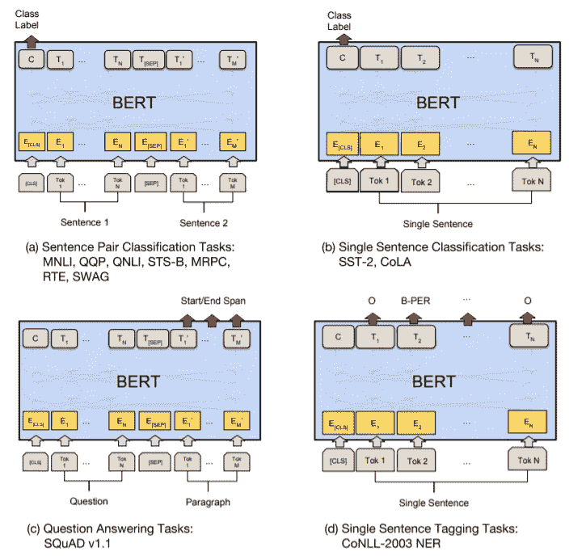
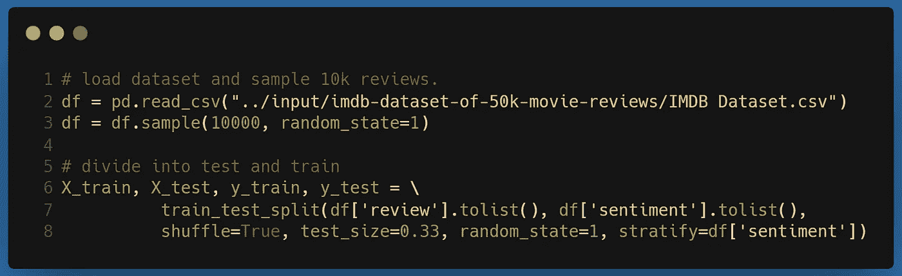
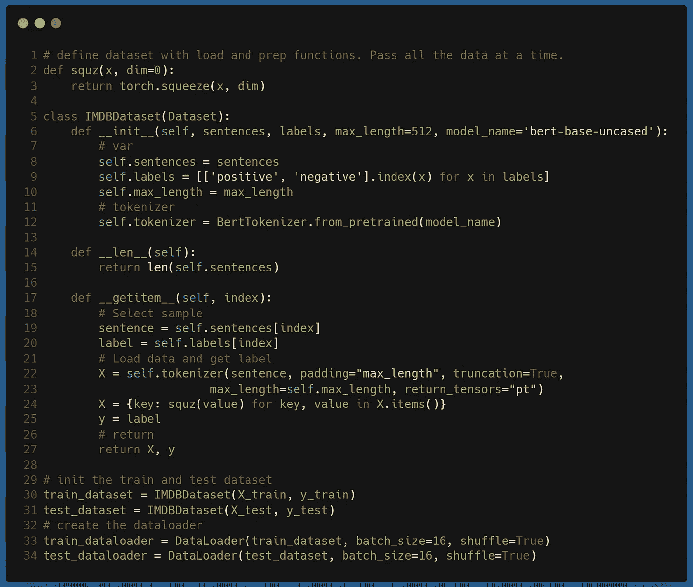
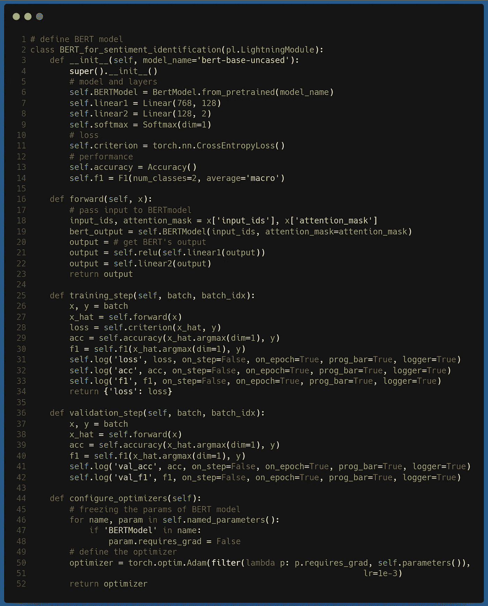
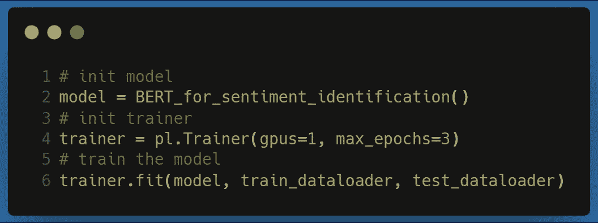
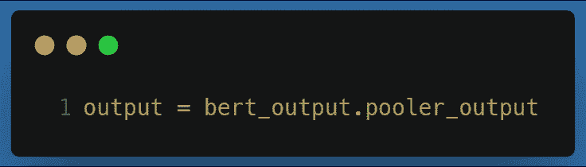
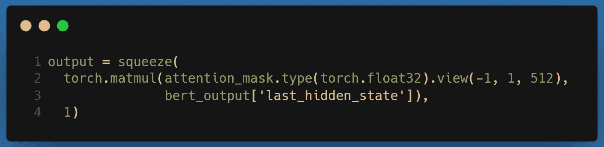
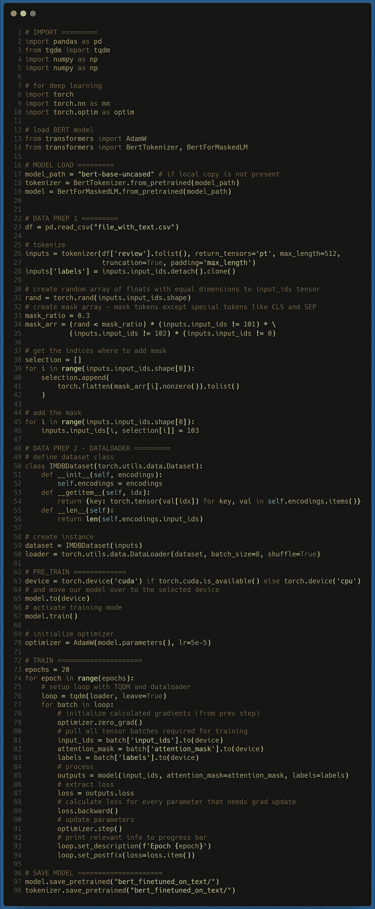
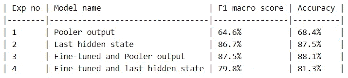

# 基于 BERT 的应用的技巧和诀窍

> 原文：<https://towardsdatascience.com/tips-and-tricks-for-your-bert-based-applications-359c6b697f8e?source=collection_archive---------5----------------------->

## 等一下，我们将学习使用 BERT 来完成 NLP 任务，稍后通过应用一些技巧来增加它的趣味，这些技巧可以显著提高整体性能。

苏珊·Q·尹在 [Unsplash](https://unsplash.com?utm_source=medium&utm_medium=referral) 上的照片

> 本文使用的代码可以在[这里找到](http://mohitmayank.com/a_lazy_data_science_guide/natural_language_processing/BERT.html#code)。更多此类文章，请访问我的网站或查看我最新的关于数据科学的书。也可以在 [LinkedIn](https://www.linkedin.com/in/imohitmayank/) 上联系我。

## 介绍

《变形金刚》席卷了 NLP 世界。最近的研究表明，变压器和基于它的其他架构(如 BERT、RoBERTa、XLNET)已被用于解决大量应用——无论是情感分类、欺诈检测、神经语言翻译还是问答系统。虽然所有这些都是真的，但仍有许多谜团和困惑围绕着它。一些最常见的问题是——(1)我应该只使用`CLS` token 还是所有 token 的输出来表示句子？(2)事先微调模型会增加精度吗？。如果你已经问过自己这些问题，或者刚刚开始使用 BERT，那么这篇文章正适合你。请跟随我们，首先介绍 BERT 模型，然后尝试通过实验解决这些问题。

## 伯特

**BERT** 代表 **B** 方向**E**n 编码器 **R** 代表来自 **T** 变压器。基本上，它是变形金刚的一个改型，我们只保留了编码器部分，而丢弃了解码器部分。在发布时，它在 11 个自然语言处理任务上获得了最先进的结果。BERT 背后的主要动机是处理现有语言模型的局限性，这些模型本质上是单向的。这意味着他们只考虑从左到右进行句子级推理的文本。另一方面，BERT 允许令牌在自我关注层兼顾双方。这是其高性能的主要原因之一。BERT 最吸引人的特点是，对于大量的 NLP 任务，它超级容易使用。其想法是采用预先训练的 BERT 模型，然后针对特定任务对其进行微调。预训练模型以无监督的方式在大型语料库上训练，因此该模型从大型文本语料库中学习表征的一般表示。这使得以后为任何其他 NLP 任务进行微调变得容易，因为该模型预先训练有关于语言、语法和语义表示的大上下文。

不同任务上微调 BERT 的插图。来源[1]

训练伯特本身就是一个有趣的范例。原始论文提出了两种无监督的训练方法，

1.  **屏蔽 LM (MLM)** :随机屏蔽一定百分比(15%)的输入标记，然后模型尝试预测这些屏蔽标记。他们为此创造了一个特殊的令牌`[MASK]`。
2.  **下一个句子预测(NSP)** :选择两个句子 A 和 B，使得 50%的时间 B 是跟随 A 的实际下一个句子(标记为`IsNext`)，而 50%的时间 B 是来自语料库的随机句子(标记为`NotNext`)。该模型被训练来预测第二个句子是否跟随第一个句子。

最后，我们应该知道的关于 BERT 的最后一件事是模型的输入和输出。因此，和通常的 NLP 模型一样，BERT 将句子(当然是在标记化之后)作为输入。因为它只使用转换器的编码器部分，所以它产生两个有趣的输出，

*   `pooler_output`是`[CLS]`特殊令牌的嵌入。在许多情况下，它被认为是完整句子的有效表示。
*   `last_hidden_state`包含来自最后一个隐藏状态的句子中所有标记的最终嵌入。我们可以应用排列不变的方法(如——最大值、平均值或总和)来将嵌入聚合成单个句子表示。

要了解更多的细节，我强烈推荐阅读最初的 BERT 论文[1]和变形金刚(注意)论文[2]。

## 实验设置

理论到此为止，现在让我们从有趣的部分开始，即代码。为了回答介绍部分提出的问题，我们将训练 4 个基于 BERT 的模型，并比较准确性，以确定您可以开始使用的最佳品种。对于两党公正的分析，我们将选择一个应用程序——情感识别，并对所有模型使用相同的数据集甚至相同的训练方法。我们的实验列表如下:

*   实验 1:无微调+带 Pooler 输出的 BERT 模型
*   实验 2:没有微调+具有最后隐藏输出的 BERT 模型
*   实验 3:微调+带 Pooler 输出的 BERT 模型
*   实验 4:微调+具有最后隐藏输出的 BERT 模型

至于这个任务，在情感识别中，我们给了一个文本，它的情感是要被推断的。通常，这是通过创建句子的潜在表示并将其用于分类来完成的。在我们的例子中，我们将在整个过程中使用 BERT 模型。

至于数据集，我们使用的是 [IMDB 50k 数据集](https://www.kaggle.com/lakshmi25npathi/imdb-dataset-of-50k-movie-reviews)，因此文本是电影评论，情感要么是正面的，要么是负面的。为了更快地执行，我们随机抽样了 10k 条评论(每种情感类型约 5k 条)，并执行了其余的分析。

## 先决条件代码

现在，在我们开始每个实验之前，让我们讨论一下将在所有实验中使用的公共代码。所以让我们从每个项目开始的地方开始——加载数据并将其分成测试和训练。

接下来，我们将创建一个 Pytorch `Dataset`类实例来加载和预处理数据。这包括创建继承了`Dataset`类的`IMDBDataset`类。这包括 3 个模块:

*   `__init__`:我们基本上是在这里存储数据和加载标记器。
*   `__len__` :返回整个数据集的长度。这是每个时期内步长计算所需要的。
*   `__getitem__` :我们获取一个数据，对其进行标记，然后将其返回。

现在，如果你注意到，我们的`IMDBDataset`类是非常通用的，因此我们可以用它来准备测试和训练数据集。这正是我们接下来要做的。最后，我们通过参数`batch_size` 和`shuffle`将`Dataset` 传递给`Dataloader` ，以创建一个可用于训练的生成器。

现在我们将编码伯特模型的框架。我们将使用 Pytorch lightning，它充当 Pytorch 之上的包装器，并提供许多高效的附加组件，最重要的是，它使编写 NN 代码变得超级容易:)我们从创建继承`pl.LightningModule`的模型类开始。现在，这个类包含以下子模块，

*   `__init__`:构造器，我们在其中定义层、损失、度量、激活函数并加载 BERT 模型。请注意，我们使用的是`bert-base-uncased`预训练的 BERT 模型(~ 1.25 亿个参数！)和 huggingface 加载这个模型的`transformer` 包。
*   这是我们定义定制模型逻辑的地方。首先，我们将标记化的输入句子传递给 BERT 模型。然后，我们希望使用 BERT 模型的输出(在下一节中会有更多的介绍)，来执行二进制分类。因此，我们最终应用只有 2 个节点的简单 MLP。
*   `training_step`:我们在这里定义培训是如何进行的。所以我们批量加载数据，并将其传递给`forward`模块。我们希望在`forward` 步骤的输出上计算`CrossEntropyLoss`。我们还定义了一些我们想要计算的额外指标。请注意，这些指标仅用于记录，因为它们仅在`self.log`语句中捕获。培训仅针对`loss`指标进行。
*   `validation_step`:与`training_step`基本相同，只是修改了`self.log`的名称。
*   `configure_optimizers`:这里我们定义了我们想要用于模型训练的优化器。我们正在使用`Adam`优化器。另外一点是，我们可能不想训练 BERT 模型的全部庞大的 1.25 亿个参数。因此，我们将冻结所有的 BERT 模型层，只训练我们作为 BERT 输出头添加的额外分类器层。

最后，既然我们已经定义了一切，训练模型就像，

哎呦，搞定了！让我们开始实验吧！

## 实验 1:无微调+带 Pooler 输出的 BERT 模型

为了使用 BERT 模型的 pooler 输出，我们可以从模型生成和返回的输出中提取相关的值。这可以通过在上面共享的训练代码的第 20 行使用下面的代码来完成。

是啊，就这么简单！在训练模型时，我们在验证数据集上获得了 **64.6%的 F1 宏**分数和 **68.4%的准确度**。对于基线(第一个实验)来说还不错，对吗？让我们去下一个。

## 实验 2:没有微调+具有最后隐藏输出的 BERT 模型

BERT 模型也返回最后的隐藏状态输出，但有一个问题是它的形状等于`(batch, no of tokens, token dimension)`。我们想要减少它，使得一批中的每个数据点只有一个向量表示，以便形状转换为`(batch, token dimension)`。一个简单的答案是取所有代币的平均值。如果不是因为我们在标记化期间添加的填充(用于处理较小的句子)，这将是一个很好的解决方案，因此简单的平均会给小句的句子嵌入添加很多噪声。因此，我们需要对标记进行某种形式的加权平均，这是通过使用 attention_mask 来执行的，attention _ mask 是一个向量，用于表示哪些标记是填充(0)，哪些不是(1)。这可以通过在第 20 行添加以下脚本来完成，

在训练模型时，我们在验证数据集上获得了 **86.7%的 F1 宏**分数和 **87.5%的准确度**。哇，仅仅改变一行代码，准确性就提高了 20%!！

## 先决条件(2):微调 BERT

现在剩下的实验大部分和以前一样，但是有一个主要的变化——我们将使用微调的模型。这意味着，我们将使用我们拥有的数据集，即 10k 电影评论数据，并使用它来使用原始的无监督训练方法之一调整基本 BERT 模型。然后，我们将使用这个修改后的模型进行剩余的一组实验。我强烈推荐观看 James Briggs 的视频，他精彩地解释了微调过程。代码可以在这里找到[。](http://mohitmayank.com/a_lazy_data_science_guide/natural_language_processing/BERT.html#fine-tuning-the-bert-model)

但是为了简单地讨论代码逻辑，它由以下部分组成，

*   **加载模型**:我们加载最基本的 BERT 模型，即`bert-base-uncased`，我们将对该模型进行微调。
*   **准备数据**:我们将加载 10k 数据集并解析文本，以所需的格式准备它。为此，我们将首先对其进行标记化，然后随机屏蔽一定比例的标记(通过用特殊的`[MASK]`标记替换其标记值)。在这种情况下，我用 30%的口罩进行了测试。平时也可以玩玩这个数字，效果更好！(我会建议把搜索限制在 10%到 40%。如果你做了，让我知道！).接下来是通常的`dataset` 和`dataloader` 部分。
*   **训练**:最后，我们对模型进行一定次数(这里是 20 次)的训练，并保存微调后的模型。

微调 BERT 模型的代码

## 实验 3:带有 Pooler 输出的微调+ BERT 模型，实验 4:带有最后隐藏输出的微调+ BERT 模型

最后两个实验的代码保持与之前相同，即实验 1 和 2。唯一的区别是，现在我们将使用微调模型，而不是使用基本的 BERT 模型。这可以通过将文件夹路径传递给前面实验代码中的`BertModel.from_pretrained(model_path)`脚本来实现。

对于实验 3，我们得到了 **87.5%的 F1 分数**和 **88.1%的准确率**。另一方面，对于实验 4，我们得到了 **79.8%的 F1 分数**和 **81.3%的准确率**。

## 结果

综合每个实验的结果，我们有

BERT 预训练(实验 1 和 2)和微调模型(实验 3 和 4)的综合实验结果

现在让我们试着回答我们在引言部分提出的问题，

1.  **句子表示应该只使用** `**CLS**` **token 还是所有 token 的输出？嗯，这要看情况。从实验来看，似乎如果你正在微调模型，使用 pooler 输出会更好。但是如果没有微调的话，最后的隐藏状态输出要好得多。就我个人而言，我更喜欢最后一个隐藏状态输出，因为它提供了比较结果，而无需任何额外的昂贵的计算微调。**
2.  **预先微调模型会增加准确性吗？一个明确的肯定！实验 3 和实验 4 报告了比实验 1 更高的分数。另一方面，Exp 2 的例子非常有趣，暗示了在进行微调之前尝试所有的东西。也就是说，如果你在寻找最好的结果(即使只有 1%的差距)，微调是最好的方法。因此，如果你有时间和资源(讽刺的是，通常情况下不是这样)，去微调！**

## 参考

1.  雅各布·德夫林、张明蔚、肯顿·李和克里斯蒂娜·图塔诺娃。Bert:用于语言理解的深度双向转换器的预训练。2019. [arXiv:1810.04805](https://arxiv.org/abs/1810.04805) 。
2.  Ashish Vaswani、Noam Shazeer、Niki Parmar、Jakob Uszkoreit、Llion Jones、Aidan N. Gomez、Lukasz Kaiser 和 Illia Polosukhin。你需要的只是关注。2017. [arXiv:1706.03762](https://arxiv.org/abs/1706.03762) 。
3.  詹姆斯·布里格斯的[视频](https://www.youtube.com/watch?v=R6hcxMMOrPE)使用 MLM 微调伯特模型

干杯。