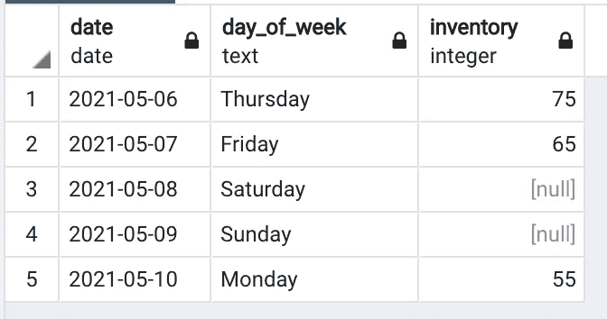
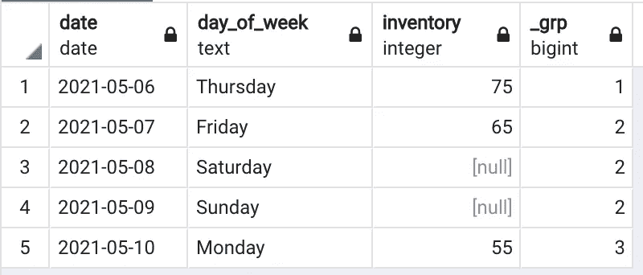
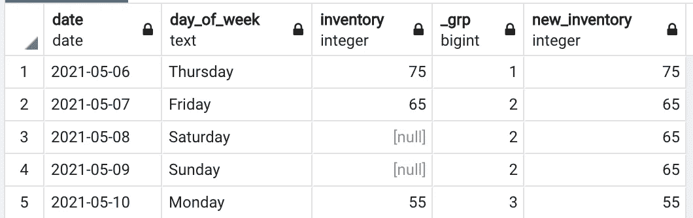
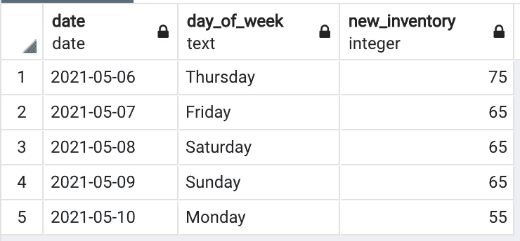

# 提示和技巧:如何在 SQL 中填充空值

> 原文：<https://towardsdatascience.com/tips-and-tricks-how-to-fill-null-values-in-sql-4fccb249df6f?source=collection_archive---------1----------------------->

## SQL 提示和技巧

## 如何利用嵌套表和窗口函数来填充空值


格伦·卡斯滕斯-彼得斯在 [Unsplash](https://unsplash.com?utm_source=medium&utm_medium=referral) 上的照片

当谈到数据分析时，你常常意识不到你错过了什么，直到你把它可视化。可视化中的巨大差距或向下的尖峰会向您显示数据缺失的确切位置，但这不是您想要向利益相关者传达的故事。

虽然一些可视化工具可以轻松地解决这些问题，但通常最好在数据源处处理，如果您需要在工具之外做进一步的分析，依靠 viz 工具来完成这项工作将不会派上用场。那么，我们如何在源代码中填充空值或缺失值呢？

## 向下填充:简要说明和示例

假设我们有一个类似于下面的表，名为`inventory_log`,它记录了贵公司在每个年末的库存中有多少小部件:



因为你的商店周末不营业，所以从周五到周一不会有库存变化，但这也意味着没有人计算库存并将该值输入到表中。

假设从周五到周一库存数量没有变化是安全的，因此周六和周日的正确值应该是周五的值。为了做到这一点，我们应用一个叫做 ***的工具向下填充*** 。向下填充就像它听起来的那样:只要有空值，我们就从它上面抓取最近的非空值来替换空值。

Python 中有许多特性(包括`pandas.DataFrame.ffill()`函数)可以实现这一点，但是它们几乎总是比直接在数据库服务器上执行操作要慢。

既然我们已经全面研究了这个问题，让我们来理解如何在 SQL 中实现它。

## 在 SQL 中向下填充

使用上面的表作为样本数据，我们可以利用嵌套查询和窗口函数来替换空值。

我们要做的第一件事是将具有 null 值的行分组，第一个非 null 值在它上面。我们可以利用一个窗口函数来计算日期中的`inventory`列:

```
select date,
       day_of_week,
       inventory,
       count(inventory) over (order by date) as _grp
from inventory_log
```

该查询将返回如下所示的表格:



好吧！这为我们提供了一个新的列，允许我们将 null 值与它们前面的第一个非 null 值组合在一起。现在下一步是为共享一个分组的每一行返回第一个值。幸运的是，`first_value`窗口函数允许我们这样做。

将这个函数应用到我们已经拥有的数据中，我们得到了这个查询:

```
with grouped_table as (
   select date,
          day_of_week,
          inventory,
          count(inventory) over (order by date) as _grp
   from inventory_log
)
select date,
       day_of_week,
       inventory,
       _grp,
       first_value() over (partition by _grp order by date) as filled_inventory
from grouped_table
```

如果你想深入研究`first_value`函数，你可以[查看这里的文档](https://docs.microsoft.com/en-us/sql/t-sql/functions/first-value-transact-sql?view=sql-server-ver15)，但是这个函数只是根据顺序返回分区的第一个值。

上面的查询给出了下表:



就是这样！我们现在有一个空值被前面的值替换的列。

因此，让我们将我们的查询放在一起:

```
with grouped_table as (
   select date,
          day_of_week,
          inventory,
          count(inventory) over (order by date) as _grp
   from inventory_log
), final_table as(
   select date,
          day_of_week,
          inventory,
          _grp,
          first_value() over (partition by _grp order by date) as
              new_inventory
    from grouped_table
)
select date,
       day_of_week,
       new_inventory
from final_table
```

输出:



注意:如果您有一个需要考虑多个维度/列的查询(在本例中可能是不同的商店位置)，只需将它们添加到`grouped_table`子查询的`count()`窗口函数的 partition 子句中。

编码快乐！

如果你想看其他数据科学的技巧和诀窍，请查看我的文章[如何将你的熊猫数据帧加载到你的数据库快 10 倍](/upload-your-pandas-dataframe-to-your-database-10x-faster-eb6dc6609ddf)。请在下面的评论中让我知道你在做什么！