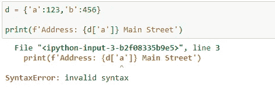
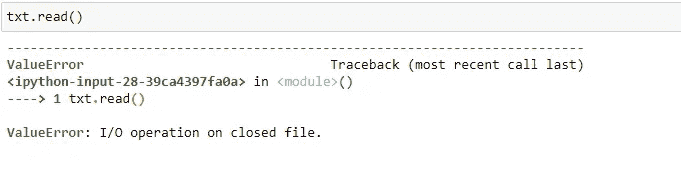

# 使用 Python 处理文本文件的技巧和诀窍(第 1 部分)

> 原文：<https://towardsdatascience.com/tips-and-tricks-to-work-with-text-files-in-python-89f14a755315?source=collection_archive---------3----------------------->


谢尔盖·莱昂特耶夫在 [Unsplash](https://unsplash.com?utm_source=medium&utm_medium=referral) 上拍摄的照片

## 使用文本文件并熟悉 Python 中令人惊叹的技术

计算机程序使我们的生活变得容易。在几行指令的帮助下，我们可以在一眨眼的时间内完成一项复杂的任务。在许多复杂的任务中，处理和操作文本是计算机完成的最重要的任务之一。今天，热门话题之一是自然语言处理(NLP)，其中文本处理是必须的。在这篇文章中，我们将讨论一些基本的和超级简单的语法来格式化和处理文本和文本文件。可以认为是用 python 学习自然语言处理(NLP)的第一步。在接下来的文章中，我们将逐步讨论 NLP。

是时候进入文章的主要议程了。我们将使用一些基本的编码示例，这些示例可能对我们有实际帮助。让我们开始吧……

*【文末给出 jupyter 笔记本完整链接】*

## A.格式化字符串文字(f 字符串)

**i. f-strings** 比旧的`.format()` string 方法有几个好处。
首先，你可以直接将外部变量带入字符串，而不是将它们作为关键字参数传递:

```
name = 'Zubair'# Using the old .format() method:
print('My name is {var}.'.format(var=name))# Using f-strings:
print(f'My name is {name}.')
```

代码生成以下*输出*


上述代码的输出

如果你想用字符串表示变量，只需在`{}.`中插入`!r`

```
print(f'My name is {name!r}')
```

输出将是— `My name is ‘Zubair’`

**二世。使用 f-string 和字典。**

```
d = {'a':123,'b':456}
print(f"Address: {d['a']} Main Street")
```

它将根据字典键`‘a’`显示字典元素。代码的输出是— `Address: 123 Main Street`。

***【注意:】*** *注意不要让替换字段中的引号与外层字符串中使用的引号冲突。*

**

*如果只使用`“”`或`‘’`，会导致如上错误。*

***iii。f 弦的最小宽度、对齐和填充***

*您可以在一组嵌套的花括号内传递参数，以设置字段的最小宽度、对齐方式甚至填充字符。考虑以下代码*

```
*library = [('Author', 'Topic', 'Pages'), ('Twain', 'Rafting', 601), ('Feynman', 'Physics', 95), ('Hamilton', 'Mythology', 144)]for book in library:
    print(f'{book[0]:{10}} {book[1]:{8}} {book[2]:{7}}')*
```

*输出:*

```
*Author     Topic    Pages  
Twain      Rafting      601
Feynman    Physics       95
Hamilton   Mythology     144*
```

*这里前三行对齐，除了`Pages`遵循默认的左对齐，而数字是右对齐的。同样，当`Mythology`超过`8`的最小字段宽度时，第四行的页码被推到右边。设置最小字段宽度时，请确保考虑最长的项目。*

*要设置对齐，使用字符`<`向左对齐，`^`居中，`>`向右对齐。
要设置填充，在对齐字符前加上填充字符(`-`和`.`是常用选项)。*

**我们来做一些调整:**

```
*for book in library:
    print(f'{book[0]:{10}} {book[1]:{10}} {book[2]:>{7}}') 
                                                  # here > was added*
```

*输出*

```
*Author     Topic        Pages
Twain      Rafting        601
Feynman    Physics         95
Hamilton   Mythology      144*
```

**居中第三列**

```
*for book in library:
    print(f'{book[0]:{10}} {book[1]:{10}} {book[2]:^{7}}') 
                                                  # here ^ was added*
```

*输出*

```
*Author     Topic       Pages 
Twain      Rafting      601  
Feynman    Physics      95   
Hamilton   Mythology    144*
```

**增加一些*和`*....*`*

```
*for book in library:
    print(f'{book[0]:{10}} {book[1]:{10}} {book[2]:.>{7}}') 
                                               # here .> was added*
```

*输出*

```
*Author     Topic      ..Pages
Twain      Rafting    ....601
Feynman    Physics    .....95
Hamilton   Mythology  ....144*
```

***四。使用 f 字符串进行日期格式化***

*您可以使用 f 字符串进行各种格式化。下面是一个例子。*

```
*from datetime import datetimetoday = datetime(year=2018, month=1, day=27)print(f'{today:%B %d, %Y}')*
```

*有关格式化字符串文字的更多信息，请访问[https://docs . python . org/3/reference/lexical _ analysis . html # f-strings](https://docs.python.org/3/reference/lexical_analysis.html#f-strings)*

## *B.使用文本文件*

***一、用 IPython 创建文件***

*这个功能是 jupyter 笔记本特有的！或者，快速创建一个简单的。txt 文件与崇高的文本编辑器。*

```
*%%writefile test.txt
Hello, this is a quick test file.
This is the second line of the file.*
```

*上面的代码将创建一个与 Jupyter 笔记本名称`test.txt`目录相同的`txt` 文件*

***二。Python 打开一个文件***

```
*# Open the text.txt file we created earlier
my_file = open('test.txt')*
```

*如果键入错误的文件名或提供错误的目录，您可能会收到一条错误消息。所以要小心。现在，阅读文件。*

```
*# We can now read the file
my_file.read()*
```

*输出*

```
*'Hello, this is a quick test file.\nThis is the second line of the file.'*
```

*但是如果你再次运行`my_file.read()`代码，它只会输出`‘’`。但是为什么呢？*

**发生这种情况是因为你可以想象在读完文件后，阅读“光标”在文件的末尾。所以没什么可看的了。我们可以这样重置“光标”:**

```
*# Seek to the start of file (index 0)
my_file.seek(0)*
```

*现在，光标被重置到文本文件的开头。如果我们再次运行`my_file.read()`代码，我们将得到输出`‘Hello, this is a quick test file.\nThis is the second line of the file.’`。*

***iii。逐行读取***

*您可以使用`.readlines()`方法逐行读取文件。使用大文件时要小心，因为所有内容都将保存在内存中。*

```
*# Readlines returns a list of the lines in the file
my_file.seek(0)
my_file.readlines()*
```

*输出*

```
*['Hello, this is a quick test file.\n', 'This is the second line of the file.'*
```

***四。写入文件***

*默认情况下，`open()`函数只允许我们读取文件。我们需要传递参数`'w'`来覆盖文件。例如:*

```
*# Add a second argument to the function, 'w' which stands for write.
# Passing 'w+' lets us read and write to the file
my_file = open('test.txt','w+')*
```

**打开带有“w”或“w+”*的文件会截断原始文件*，这意味着原始文件**中的任何内容都将被删除* *！**

```
*# Write to the file
my_file.write('This is a new first line')*
```

*上面的命令写`‘This is a new first line’`创建的文件。*

***v .追加到文件***

*传递参数`'a'`会打开文件并将指针放在末尾，因此写入的任何内容都会被追加。像`'w+'`，`'a+'`让我们读写一个文件。如果文件不存在，将创建一个。*

```
*my_file = open('test.txt','a+')
my_file.write('\nThis line is being appended to test.txt')
my_file.write('\nAnd another line here.')*
```

*上面的代码将文本追加到`test.txt`文件中现有文本的末尾。*

***六。别名和上下文管理器***

*您可以将临时变量名指定为别名，并使用上下文管理器自动管理文件的打开和关闭:*

```
*with open('test.txt','r') as txt:
    first_line = txt.readlines()[0]
print(first_line)*
```

*这段代码将打印 test.txt 文件的第一句话。此时输出为`This is a new first line`*

*[注意:在将第一行文本分配给 first_line 之后，`with ... as ...:`上下文管理器自动关闭了【T9:】*

*如果我们试图读取 test.txt，它会显示一条错误消息，因为该文件已被自动关闭*

**

***七。遍历文件***

```
*with open('test.txt','r') as txt:
    for line in txt:
        print(line, end='')  # the end='' argument removes extra linebreaks*
```

*输出*

```
*This is a new first line
This line is being appended to test.txt
And another line here.
This is more text being appended to test.txt
And another line here.*
```

**

*在 [Unsplash](https://unsplash.com/s/photos/end-mark?utm_source=unsplash&utm_medium=referral&utm_content=creditCopyText) 上 [Saksham Gangwar](https://unsplash.com/@saksham?utm_source=unsplash&utm_medium=referral&utm_content=creditCopyText) 拍摄的照片*

## *结论*

*语法很简单，但是非常有用。我们总是跳到复杂的学习材料上，但是有太多的小事可以让我们的生活变得简单。上面的文章解释了一些处理文本的有用技术，这些技术可能对文本格式化有帮助。但是，这些技术对自然语言处理会很有帮助。这些报道将继续，并朝着基本的 NLP 前进。*

*本文的完整 jupyter 笔记本可从这里获得。*

*一些精选的有趣文章供你进一步阅读*

*</write-a-few-lines-of-code-and-detect-faces-draw-landmarks-from-complex-images-mediapipe-932f07566d11>  </spread-of-covid-19-with-interactive-data-visualization-521ac471226e>  

# 祖贝尔·侯赛因

*   *如果你喜欢这篇文章，请关注我的* [***中型***](https://mzh706.medium.com/) *了解更多。*
*   *在*[***LinkedIn***](https://www.linkedin.com/in/zubair063/)*上连接我进行协作。**