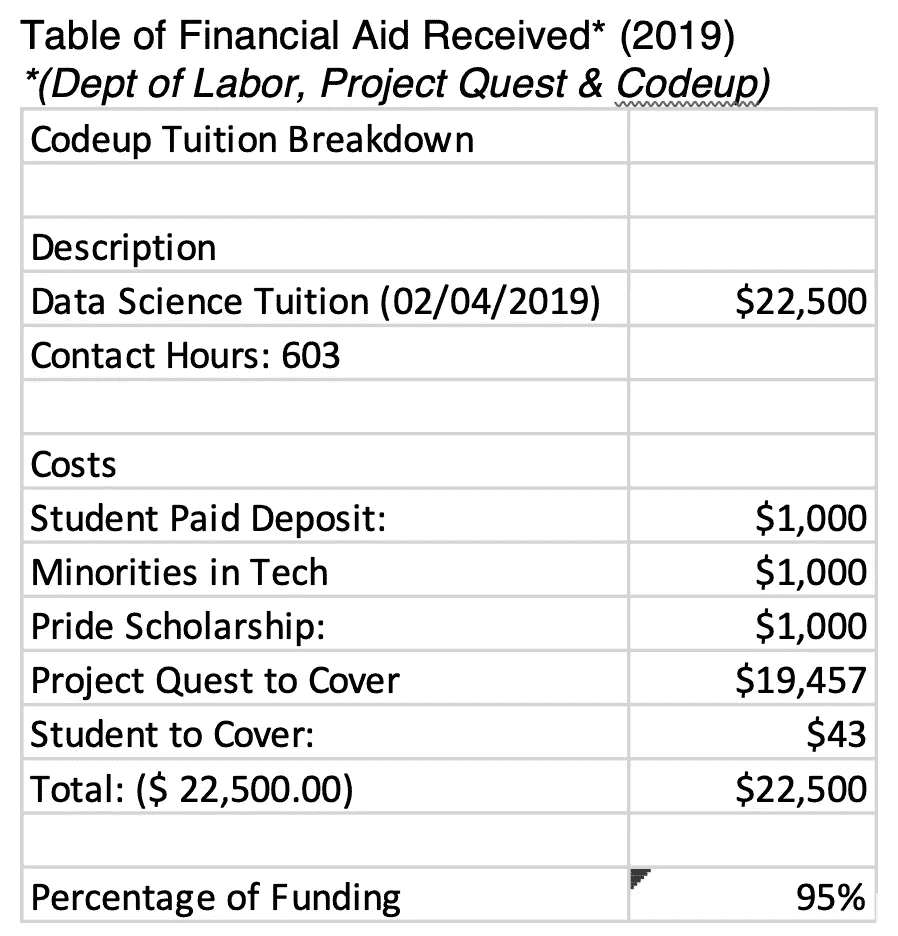

# 选择和资助数据科学训练营的技巧

> 原文：<https://towardsdatascience.com/tips-for-choosing-and-funding-a-coding-bootcamp-617ff97340c2?source=collection_archive---------26----------------------->

## 资源和我的经验与自学，新兵训练营和财政援助

阿诺·弗朗西斯卡在 [Unsplash](https://unsplash.com?utm_source=medium&utm_medium=referral) 上的照片

新兵训练营或职业加速器项目是旨在帮助你学习新技能和找工作的短期教育项目。我向那些从不同领域转入科技行业的有经验的人推荐训练营。新兵训练营的真正价值是他们提供的职业安置帮助。但是新兵训练营并不适合每个人，所以我建议在考虑参加之前做大量的研究。

我将分享一些在美国寻找新兵训练营的技巧，我如何选择参加德克萨斯州圣安东尼奥 Codeup 的故事，以及我如何获得参加的资金。我选择参加数据科学训练营，但我相信我的建议也适用于其他学科，如 UX/UI、web 开发和其他技术领域。

***免责声明:*** *我为新兵训练营寻找资助的经历并不典型。我非常幸运。我不想植入一个错误的想法，以为为新兵训练营找到全额或 100%的经济资助是容易或可能的。大多数人不得不为新兵训练营贷款。然而，我相信至少找到一些资金是可能的。*

我的第一个建议是至少花几个月到一年的时间研究你想学习的主题和现有的训练营。网上有大量学习编程的资源。我将在下面提供一个我参加的课程的详细列表，其中大部分是免费的。在你学习基础知识的时候，开始了解教授这门课程的训练营，通读训练营的课程，记下学费和开学日期，并注意他们是否提供奖学金。这第一步对于弄清楚这个话题是否是你真正感兴趣的至关重要。

其次，当你开始研究训练营时，你会发现学费可能会很高。最好的策略是同时寻找资金和训练营。首先在当地寻找，根据就业不足、失业或在该领域代表性不足(少数民族)的情况，寻求当地和联邦政府的资助。我只能找到资金，因为我遇到了当地的职业培训计划，使我能够获得当地和劳工部的资金。如果你不符合就业不足、失业或在该领域代表性不足的标准，那么不要担心！还有其他的奖学金和贷款。

**警告！只有当你对自己的编程基本技能(或任何你想学的东西)感到满意，并且你决心参加的时候，才开始接触新兵训练营。新兵训练营的招生人员会积极地寻找你。他们想让你参加他们的节目。你要有明确的意图，你想做什么，你想花多少钱，你有多擅长编程。只要对你交谈的人诚实说出你的情况。这是一个过程，慢慢来。如果你被新兵训练营拒绝，你仍然可以在以后重新申请。**

最后，总有贷款公司专门为训练营贷款。如果学费仍然令人望而却步，你可以考虑贷款作为你的最后选择。在大多数情况下，这些贷款可以很容易地用你毕业后得到的工作来偿还。如果你没有找到工作，一些训练营会提供退款(有条件的),还有一些训练营提供延期学费，在你找到第一份工作之前不用支付任何费用。

虽然我没有为新兵训练营贷款，但我是这样考虑贷款的:如果你申请了一笔贷款，并需要在找到第一份工作后偿还，你唯一真正做出的牺牲可能是每月几百美元。所以，在你职业生涯的最初几年，也许你不会得到一套豪华公寓，而是一些更便宜的东西。如果你真的致力于科技行业，这并不是什么牺牲。

根据我的经验，我在网上了解了数据科学，并花了 10 个月的时间研究这个主题和训练营。我在网上上了一堆课程学习基础，下面分享一下。然后我开始申请训练营。最终，我在家乡找到了 Codeup。我参观了他们的校园，并与他们的招生代表讨论了资金问题。我喜欢这所学校在我的家乡，所以它是一个全日制项目的实际选择。我也喜欢我遇到的老师和招生人员。招生人员告诉我他们的资助选项，并让我参加当地的职业培训计划，这让我了解到在网上不容易获得的地方和联邦拨款。参与这个本地项目是漫长、乏味和不确定的(他们非常没有组织性)，但我坚持了下来。我能够通过他们获得资助的真正原因是，我多年来一直处于失业状态，我已经用完了我所有的积蓄，我和家人住在家里，而且在我申请资助时我是失业的。我选择 Codeup 是因为我能够找到资金，它在我的家乡，我真心喜欢我在那里遇到的人。

我将分享一张我在下面得到的确切资助金额的表格。这可能不会成为常态，因为我在资金方面非常幸运。每个人的情况、背景、经济状况都会有很大的差异。我尽可能透明地分享我的经历，来说明参加新兵训练营的一条途径。肯定会有很多不同的路径！所以，如果你的情况看起来很糟糕或者与我的不同，不要气馁。

总而言之，这整个过程是危险的，可怕的，艰难的。你应该给自己足够的时间去研究和了解训练营和你想学习的科目。编码训练营不是快速致富的方法！如果你需要任何建议，请直接联系我。如果这有帮助，请把它发给你认为会从中受益的人。

*最后*，如果您正在考虑参加 Codeup 或任何其他训练营，如果您有其他问题，请随时联系我，如果您参加 Codeup，请用我的名字作为推荐人。我总是和别人分享我的推荐奖金。祝你好运和最美好的祝愿！

**以下是我个人在参加训练营之前用来自学数据科学的所有资源。**

***研究新兵训练营资源列表***

[https://www.switchup.org/](https://www.switchup.org/)

[https://www.coursereport.com/best-coding-bootcamps](https://www.coursereport.com/best-coding-bootcamps)

***我带笔记的课程清单(自学，按我上课的顺序)***

***1。数据科学&分析职业道路&认证:Jungwoo Ryoo*** 的第一步

注意:* *需要登录。通过使用本地图书馆访问权限或您所在大学的访问权限来绕过，即“使用您组织的门户网站登录”

困难/我的评论和经验:容易

课程链接:Lynda.com(登录后搜索标题)

***2。埃迪·达维拉*** 统计学基础

注:同上

难度/我的评论和经验:简单/中等

课程链接:Lynda.com(登录后搜索标题)

***3。Excel 2016 必备培训用*** [***丹尼斯泰勒***](https://www.lynda.com/Dennis-Taylor/574677-1.html)

注:同上

难度/我的评论和体验:简单，以 2 倍的速度浏览视频

课程链接:Lynda.com(登录后搜索标题)

***4。使用 Python 编程的简明介绍***

注:利用了 Python 2。需要在计算机上设置 Python 环境。

难度/我的评论和经验:中等，节奏非常快。学习 Python 2 不是一个好主意。中途停止航向

链接到课程:[麻省理工学院 6.189 开放式课程](https://ocw.mit.edu/courses/electrical-engineering-and-computer-science/6-189-a-gentle-introduction-to-programming-using-python-january-iap-2011/index.htm)

***5。学习路径:成为用户体验设计师***

注意:这是一组旨在教授 UX 的课程。* *需要登录。通过使用本地图书馆访问权限或您所在大学的访问权限，即“登录您组织的门户”

难度/我的评论和经验:中等。主要是讲座。

课程链接:Lynda.com(登录后搜索标题)

***6。Python 教程***

备注:花了几天时间完成。免费报名；不需要在您的计算机上设置环境

困难/我的评论和经验:最简单的简短练习。

课程链接:[模式分析](https://mode.com/python-tutorial/)

***7。学习 Python 2***

注:免费报名；大量的练习；不需要在您的计算机上设置环境。

难度/我的评论&经验:容易/中等；花了大约一周的时间完成

课程链接: [Codecademy Python](https://www.codecademy.com/learn/learn-python)

***8。数据结构基础***

注意:在 EdX 上免费注册，自定进度

难度/我的评论&经验:中/难；大部分都没看懂；中途停了。

课程链接: [EdX UCSD 数据结构基础](https://www.edx.org/course/data-structures-fundamentals-uc-san-diegox-algs201x)

***9。算法介绍 MITX***

注:免费报名。视频讲座和硬件作业

困难/我的评论和经验:困难。5 节课下来就停了。

链接到课程:[麻省理工学院 6.006 开放式课程](https://ocw.mit.edu/courses/electrical-engineering-and-computer-science/6-006-introduction-to-algorithms-fall-2011/)

***10。统计与概率汗学院***

注意:免费加入。非常强大的网站，有测验和视频讲座。

难度/我的评论&经验:容易/中等；花了大约 4 个星期，慢慢地。我的最爱之一。网站。

链接到课程:[可汗学院统计和概率](https://www.khanacademy.org/math/statistics-probability)

***11。*线性代数汗学院**

注意:免费加入。非常强大的网站，有测验和视频讲座。

难度/我的评论&经验:容易/中等；花了大约两个星期，慢慢地。

课程链接:[可汗学院线性代数](https://www.khanacademy.org/math/linear-algebra)

***12。JavaScript 简介:绘图与动画***

注意:免费加入。非常强大的网站，有测验和视频讲座。

难度/我的评论&经验:容易/中等；花了大约两个星期，慢慢地。

课程链接:[可汗学院 JS 简介](https://www.khanacademy.org/computing/computer-programming/programming)

***13。杜克大学*数据科学数学技能**

注意:免费加入。免费的审计课程。有时，当他们要求你付费以提交测验时，你可能会被卡住。如果这种情况发生在你身上，只需跳过测验或注册“免费试用”并在收费前取消。

困难/我的评论和经验:容易，慢慢做练习。花了大约一周的时间。

课程链接: [Coursera，数据科学数学技能，杜克大学](https://www.coursera.org/learn/datasciencemathskills)

**14*。用于机器学习的线性代数，伦敦帝国学院***

注:同上

难度/我的评论&经验:容易/中等；花了大约两个星期。因为付费墙，没有学会页面排名赋值。

课程链接: [Coursera，用于机器学习的线性代数，伦敦帝国学院](https://www.coursera.org/learn/linear-algebra-machine-learning)

***15。阿姆斯特丹大学基础统计***

注:同上

难度/我的评论&经验:容易/中等；花了大约两个星期。创建了一个新帐户，这样我就可以获得“免费试用”来提交测验。慢慢地做了所有的工作。

课程链接:[阿姆斯特丹大学基础统计学 Coursera](https://www.coursera.org/learn/basic-statistics?)

***我涉猎的其他课程及其他资源:***

基本的 HTML 和 HTML5 和 CSS，[FreeCodeCamp.org](http://freecodecamp.org)

这位开源数据科学大师，由克莱尔·科特希尔、**[http://datasciencemasters.org/](http://datasciencemasters.org/)创立**

**5 天数据挑战列表，Kaggle，[https://www.kaggle.com/rtatman/list-of-5-day-challenges/](https://www.kaggle.com/rtatman/list-of-5-day-challenges/)**

**Siraj Raval，Github 和 Youtube 上的 How-To 视频和课程，[https://Github . com/llSourcell/Learn _ Data _ Science _ in _ 3 _ Months](https://github.com/llSourcell/Learn_Data_Science_in_3_Months)**

*****助学金汇总:*****

****

*****更新:*** 截至 2019 年 10 月，我了解到 Project Quest 不再有来自劳工部的资金，而这是我的大部分资金。请直接联系 [Project Quest](https://www.questsa.org/) 了解他们目前提供的资源的更多信息。**