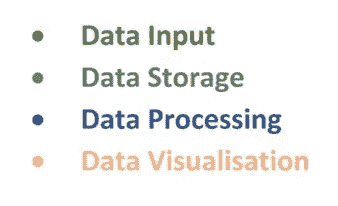
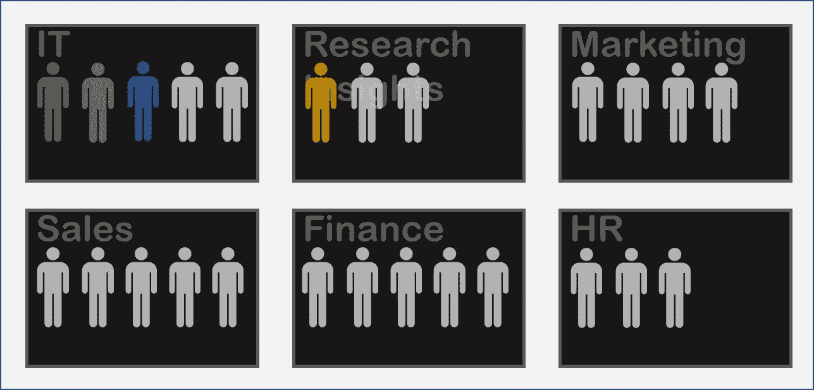
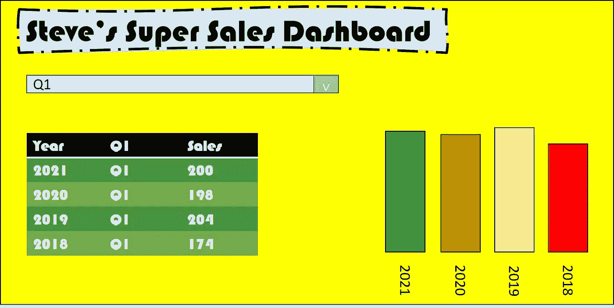
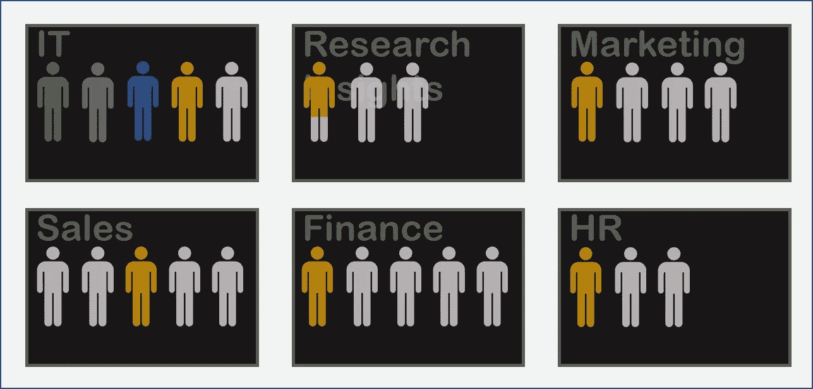
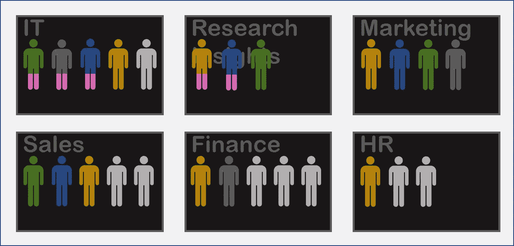

# 创建数据文化的提示

> 原文：<https://towardsdatascience.com/tips-for-creating-a-data-culture-df0eb745a1bf?source=collection_archive---------29----------------------->

## 我的公司有数据文化吗？

这篇文章旨在通过提供一些关于如何到达那里的提示来帮助你回答这个问题。

在我们谈到数据文化之前，我们必须先看看系统。为了创造数据文化，系统是绝对必要的。系统使世界运转，一个好的系统可以使一个组织发生巨大的变化。但是我们不仅仅想要一个 IT 系统，我们还想要一个信息系统。

> 信息系统是所有员工都可以访问的数据的集中。

一个组织可能从 IT 系统开始，但最终目标是实现一个信息系统，使组织中的每个人都能够访问他们的相关信息。

所以，我们先来回答一个重要的问题。

**我的系统是 IT 系统还是信息系统？**

我假设你有一个 IT 系统。但它是一个信息系统吗？这并不容易定义，问自己这些问题:

你是否每天都有问题，而你却不容易找到答案？

你必须亲自打电话、发邮件或拜访另一位员工才能得到答案吗？

如果是，那么很可能你没有信息系统。别担心，信息系统并不像你想象的那么普通。让我们更深入地分析一下信息系统，以便有所帮助。这将直接导致创建或改进您的数据文化。

# **信息系统的组成**

信息系统有 4 个主要组成部分；数据输入、数据存储、数据处理和数据可视化。让我们给这些标上颜色:

作者图片

谁与系统交互？

这是一个关键问题。让我们看看下面的公司结构:

完美的公司结构。作者图片

希望你的公司类似于上述情况，只是省略了与你公司相关的部门。澄清一下，橙色的人是数据可视化专家，蓝色的人是数据处理专家。

如果你想说你的公司有数据文化，上面的结构是最基本的。这基本上就是说，你的研究团队中的一个人创建报告，然后 IT 部门的一个人管理数据捕获，另一个人管理存储，另一个人管理处理。公司里的其他人只是依靠这四个人来获得他们的洞察力。如果这是你的结构，拍拍自己的背，这是一个完美的信息系统，给自己一个坚实的 C 级。为了获得 B 甚至 A 的成绩，我们需要回答以下问题:

**我的系统能自给自足吗？**

首先，我们要问什么是自给自足？评估自给自足最简单的方法是通过运行几个场景。

让我们看看下面:

作者图片

这是一个常见的场景。在这种情况下，市场部的 Mike 得到了一个文件，这是他经常收到的文件。从 Mike 的角度来看，他希望将其包含在报告中，他对集中式数据库一无所知，也不想知道，他只是希望对其进行分类。IT 部门的伊莎贝尔像往常一样，拿走了文件，并确保它被输入中央数据库。对许多人来说，这是一个显而易见的问题，但毕竟是个小问题，只需要几分钟就能解决。然而，解决这个问题鼓励了营销是数据驱动的观念。让这一过程只发生在营销部门传达了一个信息，即数据并不可怕，应该被接受。Mike 自己应该有一个放文件的地方，之后它会自动出现在他的报告中。

让我们看另一个场景:

作者图片

这个场景听起来熟悉吗？如果是这样，那么你可能无法自给自足。从直觉上来说，研究部门的 Rachel 为销售部门的 Steve 可视化一份报告是有意义的，毕竟她是可视化专家，而 Steve 是销售专家。但是这种“坚持自己的路线”的观念通常会适得其反。瑞秋对销售知之甚少，史蒂夫甚至不知道他想看什么。让我们看一个更好的场景。

作者图片

现在好多了。史蒂夫自己能够知道他想看什么。他可能会在构建报告的探索阶段有所发现，而这是瑞秋永远不会发现的。他会做出与最佳实践相反的设计决策，但能让他更快地得到答案。如果他分享这种观想，几乎肯定会比瑞秋更华丽但不太实用的观想用得更多。

虽然它看起来真的很糟糕，但通过这次尝试，史蒂夫已经表明他显然想尝试色彩和设计。此外，Rachel 了解到，Steve 最关心的是逐年单独查看宿舍。作者图片

史蒂夫是如何从要求瑞秋为他写一份报告变成简单地要求她帮助他写自己的报告的？Mike 是如何从要求 Isabel 将一个文件放入一个集中的数据库到自己做这件事的？这是两个不同的问题；我们将首先向迈克提问。

# **自动化系统**

然而，这对于许多人来说应该是显而易见的，有时(经常！)人都懒。这里真正的目的是赶走这种懒惰。如果有一种(相对)简单的方法来自动化一个过程，那么就需要完成它。将责任推给 Mike，让他对自己的数据负责，并立即让营销走上数据驱动的道路。我应该提到的是，虽然营销部门将拥有他们数据存储的部分所有权，但围绕存储的大部分繁重工作可能将由 IT 部门来完成。

> 一般来说，任何角色与公司核心职能直接相关的员工都应该能够轻松地捕捉数据。

而将文件移动到合适的位置属于**数据存储**的范畴。它很好地适应了**数据输入**。我的意思是，营销人员应该以一种易于分析和处理的方式获取他们自己的数据。有许多方法可以做到这一点，包括将信息放入一个共享的 Excel 文件中(尽管如果可能的话，我会避免这种方法)。这样做的目的是为了避免营销人员通过电子邮件将信息添加到系统中。有许多工具可以做到这一点，根据公司的情况，可能有一个完全内置的系统来允许每个员工都应该能够访问的数据捕获。一般来说，任何角色与公司核心职能直接相关的员工都应该能够轻松地捕捉数据。一些示例可能包括电话应用*、共享列表(类似于 excel 文件，但比 excel 文件更强大)或在线表单。在一个拥有良好数据文化的公司中，这种数据采集方法将会很常见。

**手机应用可能是由第三方构建的公司专用应用，也可能是使用微软 PowerApp 等工具在内部开发的应用*

***脚注:*** 在这种情况下，我指的是数据捕捉是一个人自己捕捉数据，这与我对数据可视化的定义并不一致，我把它描述为一个人*创造*可视化。虽然人们很有可能创建自己的数据采集方法/系统，但这通常不是必需的，因为通常只需要少量的数据采集方法。

让员工自己进行**数据存储**和**数据输入**看起来令人望而生畏，但实际上是相对简单的，如果高级管理层参与其中，那么他们可以强制他们的部门正确存储/捕获他们的数据。建立一个良好的数据采集系统可能意味着高级管理层别无选择，只能参与其中。当我们试图让员工做自己的**数据可视化**时，真正的挑战就来了。我们怎么做呢？

# **培训**

需要明确的是，培训并不一定意味着派员工去参加研讨会或让外部人员参加。这种方法可以是一个很好的开端，让员工很好地了解数据世界和/或研究团队正在使用的工具，但我们需要更可持续的东西。在这种情况下，我们指的是史蒂夫和他的可视化，所以我说的工具可能是 PowerBI，Tableau，Qlik 等之一。如果这些单词对你来说听起来像 jibberish，那么我强烈建议你去查一下。

谁是培训师？

第一步是确定谁将培训其他员工。这几乎肯定是研究部门的 Rachel，但另一个部门可能有数据专家。是时候介绍数据系统的另一个关键能力了:

作者图片

为了真正有效，我们需要改变 Rachel 的角色。

Rachel 的角色需要包括培训方面。作者图片

培训应该占 Rachel 适当培训 Steve 和其他人的时间的大约 10-20%。这种培训是整个数据文化的基础，在这方面缺乏承诺将会看到任何进行中的数据文化倒退到旧的方式。20%可能听起来很多；那是瑞秋一周的 8 小时！我应该说，我使用培训有点松散。

> 最好的培训对象是那些最愿意学习的人

正式的培训应该每周进行一次，在史蒂夫学习的时候，雷切尔每周抽出一两个小时陪他。其他 6 或 7 个小时可能会分配给其他人进行正式培训，但大部分时间只是“Rachel 的可用时间”。我的意思是瑞秋应该每周花几个小时帮助人们(不仅仅是史蒂夫)解决数据问题。为了说明在给定的一周内，Rachel 的训练应该这样展开:

销售人员 Steve 的正式培训:1 小时

来自 HR 的 Harry 的正式培训:1 小时

数据小时:1 小时

其他问题可用时间:5 小时

受训者是谁？

这可能是你需要问自己的最重要的问题。根据经验，每个团队至少有一个“数据人”是个好主意。你如何识别这些人？查看你现在的员工以前的经历和现在的工作可能是一个开始，但实际上最好的培训对象是那些最愿意学习的人。如果你有一个计算机技能一般，但对挖掘他们的数据有浓厚兴趣的人，那么他们可能会比一个不感兴趣的计算机高手更进一步推动你的数据文化。

> 社交是一种屡试不爽的方法，尽管对一些人来说很难，但它是数据文化机器中必要的一环。

诚然，这很难做到。从雷切尔的角度来看，如果她不得不确定要训练的人，最好的方法是尽可能多地认识人。社交是一种屡试不爽的方法，尽管对一些人来说很难，但它是数据文化机器中必要的一环。这件事的责任不应该只落在雷切尔身上。在这种情况下，高级管理层可以参与进来，鼓励 Rachel 和其他员工会面。外部培训是让人们一开始就参与进来的有效方式。一封全公司范围的电子邮件，内容如下

“PowerBI/Tableau/Qlik 是一款可视化工具……* yadda yadda yadda *……[外部公司]将在下周提供培训，如果您有兴趣参加，请告诉我。”

当然，获得外部培训可能会有成本，但通常相对便宜(有时甚至是免费的！)而且永远物有所值。我建议让员工的培训尽可能简单(在大楼里或网上)。不出差或下班后等)。对与会人员的跟进会议将很快让你知道谁对学习数据可视化感兴趣。选择培训最终不感兴趣的人可能会感觉非常耗时，因此谨慎选择培训对象非常重要，但同样，如果有人感兴趣，即使看起来他们没有技能或你怀疑他们可能会放弃，也要鼓励他们。时间投资总是值得的，数据人员越多越好

# 然后呢？

确定教员和学员后，培训开始。不同的人总是处于不同的阶段，一些人会很快学会一种工具，另一些人会挣扎，这很好。如果 Rachel 分配了足够的时间给学员，那么只要他们保持兴趣，他们最终都会到达那里。最终我们会有一个这样的公司:

稳固的 B 级公司结构。作者图片

如果 HR 需要一个问题的答案，他们会去找他们的数据人员 Harry，他会把他们的问题翻译成可视化，如果他需要一些建议，那么 Rachel 可以提供帮助。不仅瑞秋可以帮忙，销售部的史蒂夫也可以帮忙。事实上，我们现在有 5 个人可以帮助哈利。我们如何确保哈利得到他想要的帮助？数据小时。

# 数据小时

这个想法基于敏捷开发周期。这是 It 公司常用的开发方法，通过这种方法，一个团队将在每天早上召开几分钟的“scrum”会议，这样每个成员都可以更新他们昨天的工作进展和今天的计划。此外，他们将在更长的时间内每周会面一次，通常约一小时，这就像一份进度报告，它允许并鼓励想法分享。这是一种非常有效的工作方式，你几乎可以保证在会议的某个时刻，用“我以前做过那个”或“你试过这个吗？”。这种方法是数据文化的关键。

**数据团队**

这是我们已经确定并训练出来的 6 个橙色个体。其中包括研究部的瑞秋、销售部的史蒂夫、人力资源部的哈里、市场部的梅、It 部的伊恩和财务部的弗兰克。这些都是不同层次的数据可视化能力，但没关系，他们仍然可以互相学习。一天见一次面可能太多了，毕竟他们的日常工作可能根本没有重叠。但是一周一小时就够了。在这一小时里，哈利可以利用其他 5 名成员的广泛技能来获得灵感。几个月后，弗兰克将在一份报告中处理一些复杂的事情，他会记得哈利已经实现了他想要的，这样就节省了他自己解决所有问题的时间。拥有一个数据小时的唯一真正的负面影响是，它占用了每个人一周的一个小时的时间，并且通常看起来好像什么都没学到，但这很少是真的，从长远来看，你的数据团队(以及每个成员各自的团队)将节省时间。当团队成员积极构建报告时，数据小时工作得最好，当然也可能发生没有人构建任何东西的情况。在这些情况下，仍然值得讨论该工具的发展，或者观看网上研讨会。至少这是保持不同团队联系的好方法。

你可能会注意到，尽管提到了信息系统的更多组件，我还是倾向于关注**数据可视化**。原因是可视化是让人们对数据感兴趣的最容易接近的途径。没有人会对这种说法感到兴奋:

“让我们创造一种数据文化，这样我们就可以自己填充中央数据系统！”

然而你可能会因为以下原因而兴奋:

“让我们创造一种数据文化，这样我们就可以可视化我们的数据！”

(记住兴奋是相对的)

# 关于数据处理的简要说明

**数据处理**在这篇文章中有明显的缺失，这是有原因的。为了澄清(和过于简化)，**数据处理**是数据捕获和数据可视化之间的中间位。这是最难在整个公司传播的技能。它通常涉及大量的编码工作，这是大多数人在大学四年中学习的技能。然而，让“数据人”负责他们自己的数据处理是绝对可能的，但这将涉及公司中实现的某种形式的低代码或无代码解决方案。这将有助于加速因以下情况而出现的路障。

作者图片

如果市场部的 May 或 Mike 能够自己处理数据，那么他们可以完全独立地从数据采集到可视化。这是一个相当大的对话，有点超出了本文的范围，所以让我们相信我的话，实现这种公司结构是非常可能的。

A+公司结构。作者图片

如果你有上述结构，那么给自己一个金星，这就是数据文化。