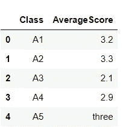
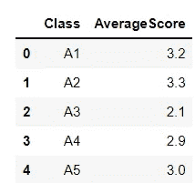
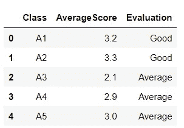
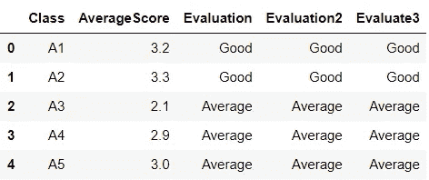
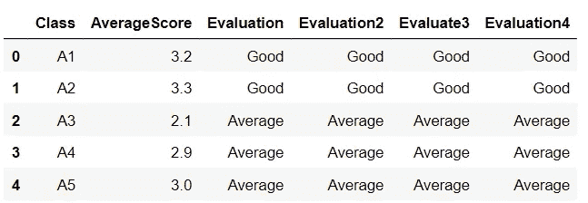

# 使用 Pandas 和 NumPy 进行数据映射和替换的技巧

> 原文：<https://towardsdatascience.com/tips-for-data-mapping-and-replacing-with-pandas-and-numpy-f1e4e789ae80?source=collection_archive---------15----------------------->

## 转换数据有助于您处理数据集、理解数据集并收集尽可能多的见解。


雄心勃勃的创意公司 Rick Barrett 在 Unsplash 上的照片

# 介绍

为了总结主要特征、发现异常并可视化信息，您应该知道如何重新排列和转换数据集。换句话说，转换数据有助于您处理数据集，理解数据集，并收集尽可能多的见解。在本文中，我将向您展示一些我常用的处理数据的方法，希望这对您有所帮助。

# 资料组

我将创建一个简单的分数数据集，其中包含不同班级的分数信息。

```
***Input:*** info = {'Class':['A1', 'A2', 'A3', 'A4','A5'],
        'AverageScore':[3.2, 3.3, 2.1, 2.9, 'three']}data = pd.DataFrame(info)
```

***输出:***



图 1:数据帧

# 替换列中的值

由于我们数据中 A5 类的平均分数是一个字符串对象，我想用一个相应的数字来替换它，以便于数据操作。将“三”替换为“3”的步骤如下:

```
***Input:*** data['AverageScore'] = data['AverageScore'].replace(['three'],'3')
data['AverageScore'] = data['AverageScore'].astype('float')
```



图 2:替换后的数据

上面是在特定列中用另一个值替换一个值的简单例子。更多参考，下面是一些更多的例子:

*   如果要用多个新值替换特定列的多个值，请使用:

```
data['column name'] = data['column name'].replace(['1st old value','2nd old value',...],['1st new value','2nd new value',...])
```

*   如果要用新值替换特定列的多个值:

```
data['column name'] = data['column name'].replace(['1st old value','2nd old value',...],'new value')
```

# 映射数据列

假设我想添加一个评估分数好坏的列，我将写下每个分数到相应评估意见的映射。这可以通过使用`bins`、熊猫`cut()`功能、`np.digitize()`功能、`np.select()`或您自己的`if`功能以 4 种不同的方式完成。让我们看看我是如何处理每种方法的。

## 熊猫. cut()

您只需要定义您的限制和类别名称，然后使用`pandas.cut()`将它们应用到数字列。在这种情况下，我将定义三个区间，对应于四个 bin 限制，以评估每个类的分数。详细来说:

*   0 < AverageScore ≤2: Below average
*   2 < AverageScore ≤ 3.1: Average
*   3.1 < AverageScore ≤5: Good

```
***Input:*** bins = [0, 2, 3.1, 5]
comment = ['Below Average', 'Average', 'Good']
data['Evaluation'] = pd.cut(data['AverageScore'], bins, labels=comment)
```

***输出:***



图 3:使用 panda.cut()映射数据

## Numpy.digitize()

`Numpy.digitize()`的想法是获得每个值所属的仓的索引。类似地，在这种情况下，您也可以像使用`pd.cut()`一样定义您的 bin 边界和类别名称。区别在于创建一个额外的字典，并使用该字典来映射类别名称。

```
***Input:*** bins = [0, 2, 3.1, 5]
comment = ['Below Average', 'Average', 'Good']dictionary = dict(enumerate(comment, 1))data['Evaluation2'] = np.vectorize(dictionary.get)(np.digitize(data['AverageScore'], bins))
```

***输出:***


图 4:使用 Numpy.digitize()

## `Numpy.select()`

`Numpy.select(condition list, choice list)`方法根据列表中的条件，返回从选择列表中的元素中提取的数组。因此，我们可以很容易地通过陈述评估条件来获得所需的值，评估条件是三个有限制的区间，以及相应的选择列表值。参见下面的代码以供参考。

```
***Input:*** evaluate = [data['AverageScore'].between(0,2), data['AverageScore'].between(2,3.1), data['AverageScore'].between(3.1,5)]values = ['Below Average', 'Average', 'Good']data['Evaluate3'] = np.select(evaluate, values, 0)
```

***输出*** :



图 5:使用 Numpy.select()进行映射

## `Writing your function`

你甚至可以编写自己的函数来应用。逻辑其实很简单，正如你所见:

```
***Input:*** def evaluate(values):
    if values >=0 and values <=2:
        return 'Below Average'
    elif values >2 and values <= 3.1:
        return 'Average'
    else: 
        return 'Good'#Applying function
data['Evaluation4'] = data['AverageScore'].apply(lambda x: evaluate(x))
```

***输出:***



图 6:编写自己的函数

如您所见，所有四种解决方案都产生了相同的结果。我只想为您提供解决这个问题的不同方法，以便将来您可以在不同的场景中灵活地应用这些数据操作。

# 结论

以上是我的一些映射和替换数据的技巧。我想在这里传达的是，在某些情况下，当你做探索性数据分析时，你可能必须处理多种意想不到的情况，因此用多种方法解决问题是有用的。希望有一天我的文章能帮到你。祝你好运！