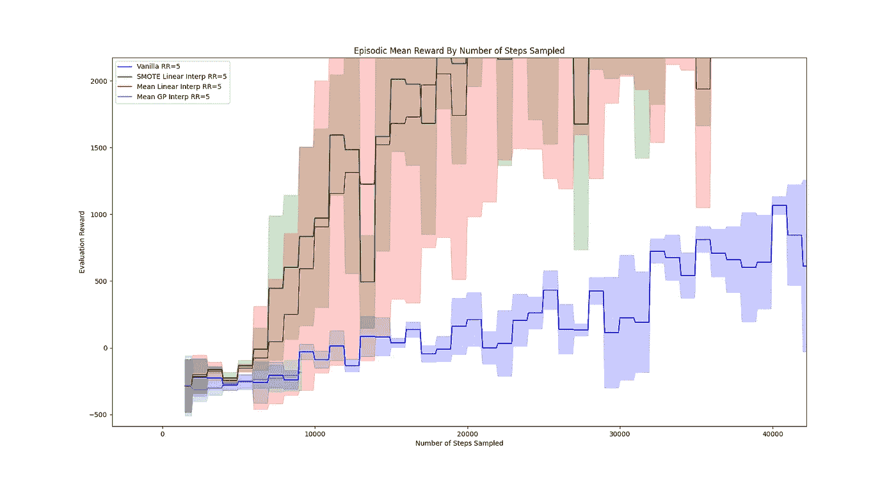
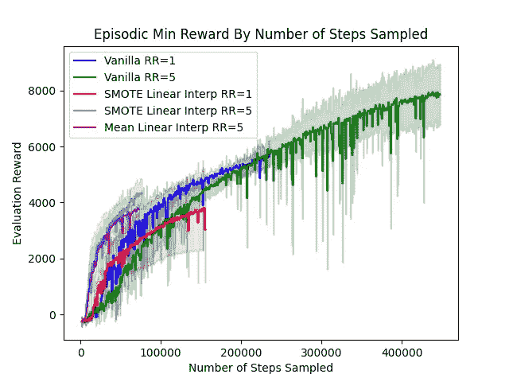
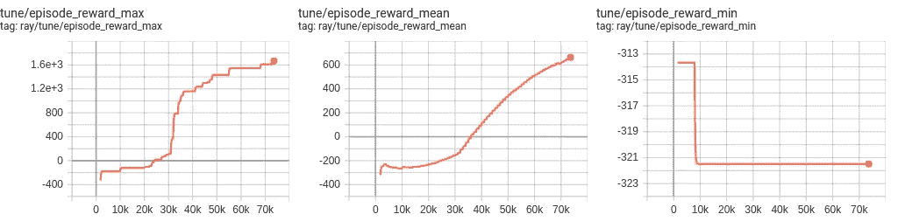
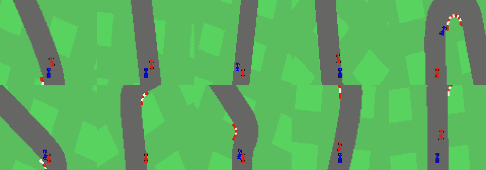
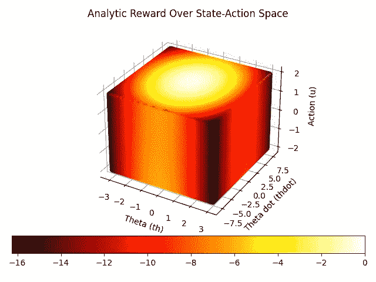
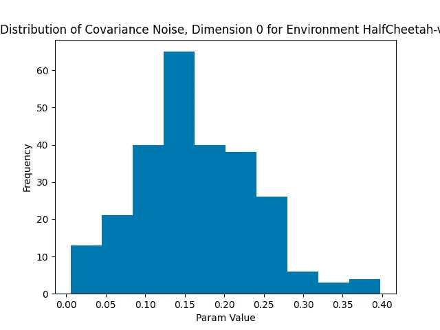
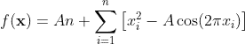
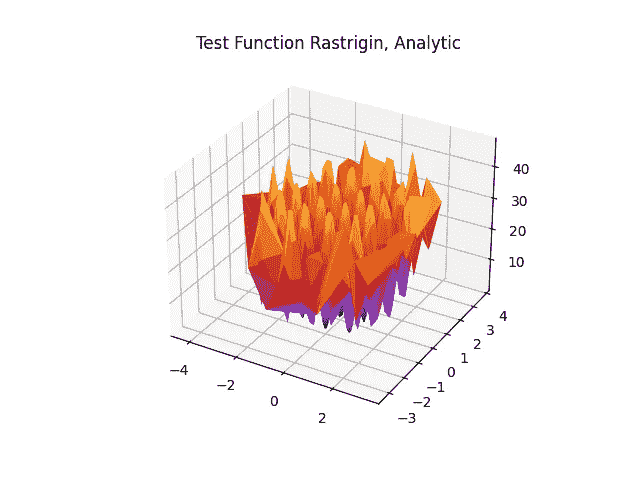
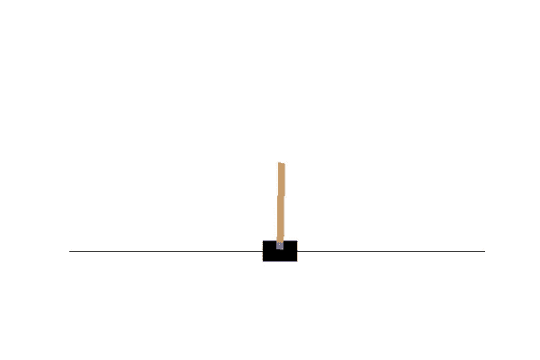

# 运行高保真深度强化学习实验的技巧

> 原文：<https://towardsdatascience.com/tips-for-running-high-fidelity-deep-reinforcement-learning-experiments-387af4c6f0a6?source=collection_archive---------21----------------------->

## [理解大数据](https://towardsdatascience.com/tagged/making-sense-of-big-data)


[梁杰森](https://unsplash.com/@ninjason?utm_source=medium&utm_medium=referral)在 [Unsplash](https://unsplash.com?utm_source=medium&utm_medium=referral) 上的照片

尽管最近在该领域取得了令人难以置信的算法进步，深度强化学习(DRL)仍然因**计算昂贵**、**容易出现“沉默的错误”**、**难以调整超参数**而臭名昭著。这些现象使得运行高保真、科学严谨的强化学习实验至关重要。

在这篇文章中，我将讨论我在 DRL 学到的一些技巧和教训，以减轻这些困难的影响——这些技巧是我在强化学习课上永远学不到的。谢天谢地，我有机会与一些了不起的研究导师一起工作，他们向我展示了如何，更重要的是为什么，以下是进行 RL 实验的真正重要的技术:

1.  **设定(所有)你的种子**
2.  运行你的种子
3.  **消融和基线**
4.  **想象一切**
5.  **开始解析，然后开始简单**
6.  当你有疑问时，看看(GitHub)的星星

我敢肯定还有很多来自经验丰富的强化学习实践者的技巧和诀窍，所以上面的列表绝不是详尽的。事实上，如果你有自己的建议和窍门想分享，请在下面评论它们！

我们开始吧！

# 1.播种(所有的)种子


[布雷特·乔丹](https://unsplash.com/@brett_jordan?utm_source=medium&utm_medium=referral)在 [Unsplash](https://unsplash.com?utm_source=medium&utm_medium=referral) 上的照片

能够重现您的实验对于发布您的工作、验证原型、部署您的框架以及保持您的理智是至关重要的。许多强化学习算法都内置了某种程度的**随机性/随机性**，例如:

1.  你的神经网络是如何初始化的。这会影响您的价值神经网络的初始*值估计*和您的策略神经网络选择的*动作*。
2.  您的代理的初始状态。这会影响代理经历的*转换*和*展开*。
3.  如果你的策略是随机的，那么你的代理选择*行动*。这会影响您采样的*过渡*，甚至整个*展开*！
4.  如果您的代理所处的环境也是随机的，这也会影响您的代理采样的*转换*和*展开*。

从以上几点你可能已经猜到，确保可重复性的一个方法是控制你实验的随机性。这并不意味着让你的环境具有确定性并且完全没有随机性，而是为你的**随机数生成器(RNG)设置**种子**。**对于您使用的所有使用概率函数的包都应该这样做——例如，如果我们使用 Python 包`torch`、`gpytorch`、`numpy`和`random`中的随机函数，我们可以使用以下函数为所有这些包设置**随机种子**:

```
def set_seeds(seed):torch.manual_seed(seed)  # Sets seed for PyTorch RNG
    torch.cuda.manual_seed_all(seed)  # Sets seeds of GPU RNG
    np.random.seed(seed=seed)  # Set seed for NumPy RNG
    random.seed(seed)  # Set seed for random RNG
```

自己尝试一下——如果您设置了所有向 RL 实验添加随机成分的种子，您应该会看到来自同一种子的结果是相同的！这是设置 RL 实验的良好开端。

# 2.运行(一些)你的种子

在验证您的 RL 框架时，在**多个种子**上测试您的代理和算法是至关重要的。一些种子会产生比其他种子更好的结果，如果只靠一颗种子运行，你可能只是运气好或者运气不好。特别是在 RL 文献中，在一个实验中运行 4-10 个随机种子是很常见的。

我们如何解释这些多种子结果？您可以通过计算指标的**均值**和**置信区间**来实现，例如奖励或网络损失，如下图所示。这让你对两者都有一个概念:

I .您的代理在 seeds 中的平均表现(通过**平均值**)。

二。您的代理在不同种子中的表现变化(通过**置信区间**)。



显示不同组随机种子的**平均值**性能(实线)和**置信区间**(彩条)的示例图(在这种情况下，对应于不同的实验)。图片来源:作者。

# 3.消融和基线


安妮·尼加德在 [Unsplash](https://unsplash.com?utm_source=medium&utm_medium=referral) 上拍摄的照片

**消融**是指移除系统组件。如何最好地测试强化学习系统中某个组件的效果？嗯，一种方法是尝试运行没有这个组件的强化学习算法，使用**消融研究。**这里，为了比较结果，使用相同的种子运行这些不同的配置至关重要。带着相同的种子运行，这让我们能够在框架之间进行“苹果对苹果”的比较。

一种类似但不一定等同的思考你的 RL 实验过程的方式是使用**基线**——你的算法所基于的可验证正确的算法或例程。运行一个基线测试来回答这个问题:*“我的算法在已经完成的基础上改进了多少？”*



不同实验的消融研究示例。图片来源:作者。

# **4。可视化一切**

强化学习可能很难调试，因为有时错误不仅仅表现为错误——您的算法可能会运行，但代理的性能可能不是最佳的，因为一些量没有正确计算，网络的权重没有更新，等等。为了有效地调试，一个策略是做人类擅长的事情: ***可视化*** ！考虑可视化的一些有用的可视化工具和数量包括:

**a.**



来自 Tensorboard 的一些图的例子。图片来源:作者。



你不仅仅局限于使用 Tensorboard 生成图！查看附录中的代码，您可以使用这些代码从图像数据中生成 gif！图片来源【3】。

**b .奖励面**:如果您的状态和动作空间是低维的，或者如果您想要可视化您的状态和动作空间中的维度子集，并且您有一个封闭形式的函数来计算奖励，您可以可视化由**动作**和**状态**参数化的**奖励面**。



OpenAI Gym Pendulum 环境中参数化状态和动作的奖励表面示例。有关如何生成该图的代码，请参见附录。

**c .参数的分布/直方图:**如果您的参数随时间变化，或者如果您在多个实验中重新运行您的参数集，可视化您的参数分布以了解您的 RL 模型的性能也可能是有帮助的。以下是高斯过程回归的超参数可视化示例。



高斯过程回归的参数/超参数分布示例。图片来源:作者。

# 5.开始分析，然后开始简单

## 5a。开始分析

在你在动态环境中评估你的算法之前，问问你自己:有没有一个分析函数可以让我评估它？这对于那些没有给你提供基本事实值的任务来说尤其有价值。有许多可以使用的测试函数，其复杂程度从简单的元素级**正弦**函数到用于优化的[测试函数](https://en.wikipedia.org/wiki/Test_functions_for_optimization)【4】。

下面是一个可用于优化的 **Rastrigin** 测试函数的例子:



一个**光栅测试函数的例子。图片来源:作者。**

一旦你确信你的模型可以适合复杂的分析形式，比如上面的 **Rastrigin** 测试函数，你就可以开始在真实的强化学习环境中测试它了。运行这些分析测试可以确保您的**模型能够逼近复杂的函数**。

## 5b。从简单开始

您现在已经准备好将您的 RL 模型转换到一个环境中了！但是在你评估复杂环境下的模型之前，例如，一个 17 维的状态空间[1]，也许在一个只有 4 维的环境中开始你的评估过程会更好？

这是本技巧的第二个建议:从评估模型的简单环境开始，原因如下:

(I)它们将(通常)运行得更快，并且需要更少的计算资源。

(ii)他们(通常)不太容易受到“维数灾难”的影响[2]。



OpenAI Gym **CartPole-v1** 环境就是一个好的启动环境的例子，因为它的**状态空间**只有 **4 维**，它的**动作空间**只有 **1 维。**图片来源:作者。

# **6。当你有疑问时，看看(GitHub)星星**


照片由 [Astrid Lingnau](https://unsplash.com/@astrialuv?utm_source=medium&utm_medium=referral) 在 [Unsplash](https://unsplash.com?utm_source=medium&utm_medium=referral) 上拍摄

我们都经历过。我们的 RL 代码不工作，我们不清楚为什么，尽管无数小时的调试和评估。一个可能的原因是超参数设置不当，这可能会对代理性能产生深远的影响——有时是以非常微妙的方式。

当有疑问时，看看以前的工作，看看你的 RL 配置，特别是超参数配置，如何与你的 RL 同事发现的经过试验和测试的配置进行比较。以下是一些可能有助于完成此任务的基准资源:

1.  [**【open ai】**](https://spinningup.openai.com/en/latest/)
2.  [**OpenAI 基线**](https://github.com/openai/baselines)
3.  [**射线/RL lib RL-实验**](https://github.com/ray-project/rl-experiments)
4.  [**稳定基线**](https://stable-baselines.readthedocs.io/en/master/)
5.  [**TensorFlow-Agents 基准**](https://github.com/tensorflow/agents/tree/master/tf_agents/benchmark)

此外，如果你正在使用强化学习包，比如 [RLlib](https://docs.ray.io/en/master/rllib.html) 或 [TensorFlow-Agents](https://github.com/tensorflow/agents) ，你的 RL 类中的许多默认参数都是有原因的！除非您有很强的理由更改默认参数，否则选择这些默认参数可能有助于您构建一个只需少量修改的成功模型:)

# 摘要


照片由[亚当·卢科姆斯基](https://unsplash.com/@anilinverse?utm_source=medium&utm_medium=referral)在 [Unsplash](https://unsplash.com?utm_source=medium&utm_medium=referral) 上拍摄

恭喜你，你成功了，非常感谢你的阅读！在这篇文章中，我们谈到了在深度强化学习中运行高保真、科学严谨的实验的重要性，以及我们可以实现这一点的一些方法。为运行更高保真、更可重复、更可解释的 RL 实验干杯！

同样，如果你有自己的建议和窍门想分享，请在下面评论！

# 感谢

特别感谢我在麻省理工学院分布式机器人实验室的导师们教给我这些技巧。学习这些技术真的非常有价值，让我成为了一名更好的研究者。

感谢阅读:)请关注我，获取更多关于强化学习、计算机视觉、编程和优化的文章！

# 参考

[1]布罗克曼，格雷格，等。“开放的健身房。” *arXiv 预印本 arXiv:1606.01540* (2016)。

[2]基奥·e .，穆恩·a .(2017)维度的诅咒。在:萨姆特 c，韦伯 G.I .(编辑)机器学习和数据挖掘百科全书。马萨诸塞州波士顿斯普林格。https://doi.org/10.1007/978-1-4899-7687-1_192[。](https://doi.org/10.1007/978-1-4899-7687-1_192)

[3] Wilko Schwarting、Tim Seyde、Igor Gilitschenski、Lucas Liebenwein、Ryan Sander、Sertac Karaman 和 Daniela Rus。深层潜在竞争:学习在潜在空间使用视觉控制策略进行竞赛。11 2020.

[4]测试函数优化，[https://en . Wikipedia . org/wiki/Test _ Functions _ for _ Optimization](https://en.wikipedia.org/wiki/Test_functions_for_optimization)。

# 附录

## 生成分析奖励函数