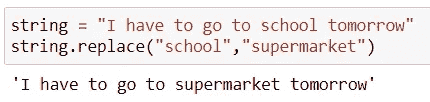
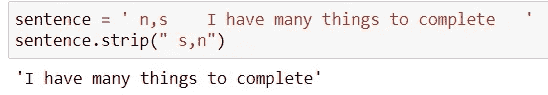
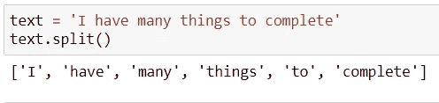
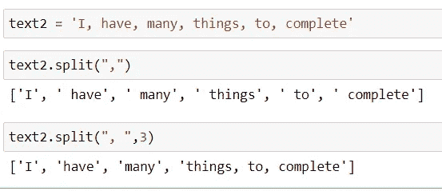
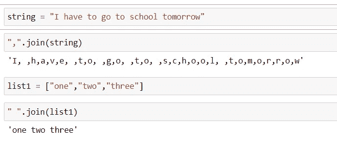
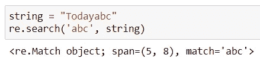
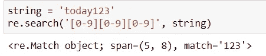
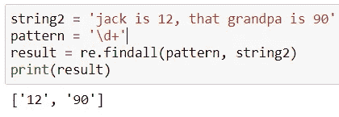
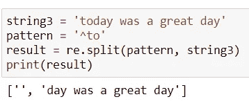
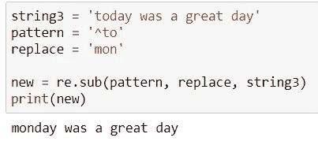

# Python 中字符串操作的技巧

> 原文：<https://towardsdatascience.com/tips-for-string-manipulation-in-python-92b1fc3f4d9f?source=collection_archive---------13----------------------->


马库斯·斯皮斯克在 [Unsplash](https://unsplash.com?utm_source=medium&utm_medium=referral) 上的照片

# 介绍

在我以前的工作中，我不得不处理与清理大量移动数据相关的任务。不幸的是，由于一些技术原因，移动数据没有正确格式化，结果一切都变得一团糟。有不同种类的符号(例如:+、/等。，)和数据中包含的怪异排列。我的职责是分析这些乱七八糟的东西，并将所有的手机号码转换成统一的格式。

起初，当我做清洁时，我发现很难按照我想要的方式操纵绳子。原因之一是我不熟悉处理文本的方法和语法。我不得不一遍又一遍地在 Google 和 StackOverFlow 上搜索我需要的东西，这浪费了我很多时间。所以在今天这篇文章里，我会和大家分享一些我常用的方法，包括 Python 内置的 string 方法和正则表达式，来处理字符串问题。我希望他们能以某种方式支持你的工作。

# Python 内置的字符串方法

这一部分有很多功能，但是我会指出一些我经常使用的命令供你参考。

## 替换

用另一个短语替换出现的内容。

***语法:***

```
string.replace(old, new, count) 
```

*   旧:要替换的值
*   new:替换旧值的新值
*   count(可选):要替换的值的个数。如果不指定任何内容，所有出现的内容都将被替换

***举例:***



图 1:将“超市”替换为“学校”

## 剥夺

修剪字符串开头和结尾的字符。

***语法:***

```
string.strip(characters)
```

***举例:***



图 2:去除开头和结尾的空格和其他字符

同样，我们也有 ***lstrip()*** 来删除字符串开头的字符，还有 ***rstrip()*** 来修剪末尾不需要的值。

## 裂开

***split()*** 函数从识别出的分隔符中分离出字符串，并返回一个列表中所有的碎片。

***语法:***

```
string.split(separator, maxsplit)
```

*   分隔符:字符串在指定的分隔符处拆分
*   maxsplit(可选):指示要执行多少次拆分。

***例如:***



图 3:所有的字符串在默认的空白字符处分开

现在，让我们看看图 4 中的例子，看看*是如何工作的。*

**

*图 4:不同 maxsplit 值的结果*

## *加入*

*使用字符串作为分隔符连接一系列字符串元素。*

****语法:****

```
*string.join(seq)*
```

*   *seq:要连接的字符串元素序列*

****举例:****

**

*图 5:使用 **Join()** 的例子*

*还有许多其他 Python 的字符串方法，但是在本文的范围内，我将只提到一些常用的方法。作为进一步的参考，您可以查看下面的必备功能列表:*

***大写():**将第一个字符转换成大写*

***Casefold()/Lower():** 将字符串转换成小写*

***Count():** 统计一个值在字符串中出现的次数*

***Endswith():** 如果字符串以特定值结尾，则返回 TRUE*

***Startswith():** 如果字符串以特定值开头，则返回 TRUE*

***Index():** 返回一个值的位置*

# *正则表达式*

*想象一下，你有一个电子邮件列表，包括一些格式错误的电子邮件。你想找到所有格式正确的邮件，这些邮件以特定的方式存储，包含一些特定的字符。这时正则表达式就来拯救了。*

*正则表达式( *regex* )是一种用于搜索字符串模式的常用方法。在 Python 中，我们有一个内置的包叫做 ***re，*** 里面包含了很多处理正则表达式的函数。在研究一些必要的函数之前，让我们先了解一下元字符，元字符是正则表达式引擎的控制字符，以一种特殊的方式解释。*

****^*:****检查字符串是否以特定值开始***

****$:** *检查字符串是否以特定值结束***

****。:** *句点匹配任何单个字符，除了新行***

*****:****

****[…]:** *一个括号匹配括号中的任意一个字符。***

****【^…]:***匹配任何不在括号内的单个字符***

****{…}:** *精确匹配出现次数***

****(…):** *用于分组子模式***

****+:** *加号匹配一个或多个事件***

****|:** *匹配任一值***

****\:** *转义特殊字符。在你不确定是否有特殊含义的字符前划一条斜线***

**在我们了解了一些基本的正则表达式之后，让我们来看看 ***re*** 模块，它包含了很多使用正则表达式的有用函数。为了使用它，我们需要首先导入模块:**

```
**import re**
```

**总体而言，该模块可以分为 3 类，即模式匹配，替代和分裂。**

## **重新搜索()**

**扫描匹配模式的字符串，然后返回模式匹配的位置。**

*****举例:*****

****

**图 6:使用 re.search()的示例**

****

**图 7:示例 2**

**在示例 2 中(图 7)返回 match = "123 ",因为我们阐明了表达式`[0-9][0-9][0-9]`匹配任何三个十进制数字字符的序列。**

## **re.findall()**

**返回包含所有匹配的列表。**

*****举例:*****

****

**图 8**

**图 8 中的例子返回从具有特殊模式 ***/d*** 和 ***findall()的字符串中找到的所有十进制数字。*****

## **重新拆分()**

**将字符串分成出现模式的部分，并返回字符串列表。**

*****举例:*****

****

**图 9**

**图 9 显示了 ***“至”*** 及其余部分的划分列表。**

## ****re()****

**返回一个字符串，其中匹配的字符被替换为新的指定值。**

*****举例:*****

****

**图 10**

**图 10 显示了我们如何将字符串中的 ***"替换为******【mon】***。**

# **结论**

**关于字符串操作的话题，尤其是正则表达式，实际上是一个很难的话题。如果你有兴趣，想更深入的挖掘，建议你看看下面的参考:**

 **[## 正则表达式 HOWTO - Python 3.9.7 文档

### 正则表达式(称为 REs，或正则表达式，或正则表达式模式)本质上是一种微小的、高度专门化的编程…

docs.python.org](https://docs.python.org/3/howto/regex.html)** 

**希望我的文章和一些常用的命令可以帮助你了解字符串操作是如何工作的。祝你深造顺利！**