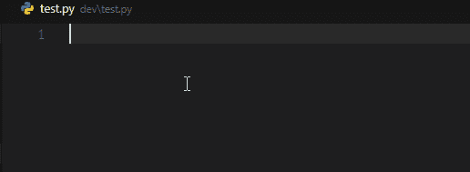
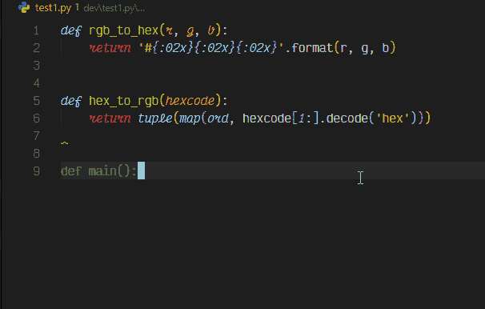
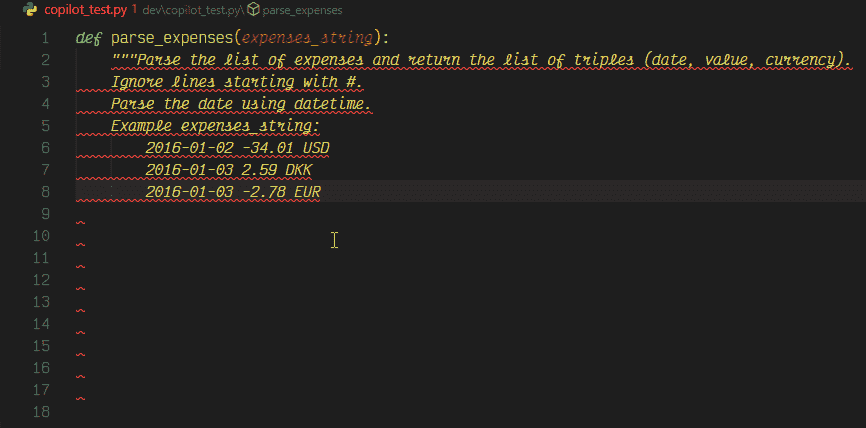
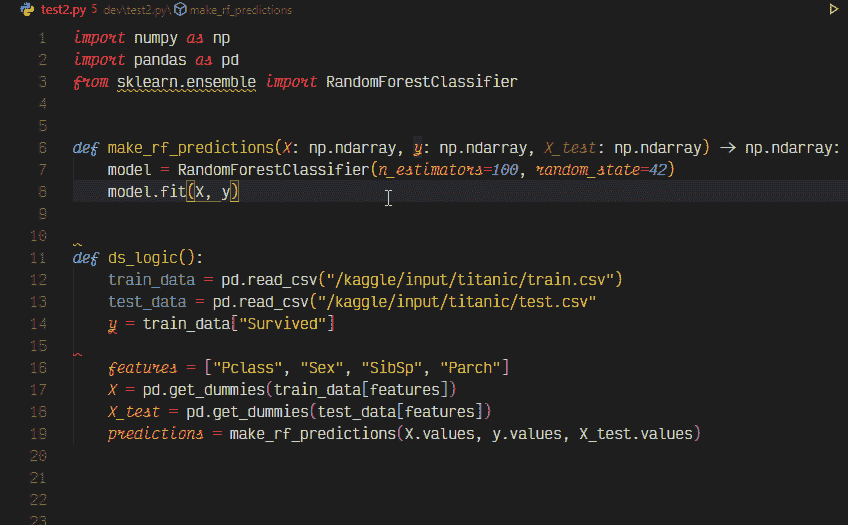
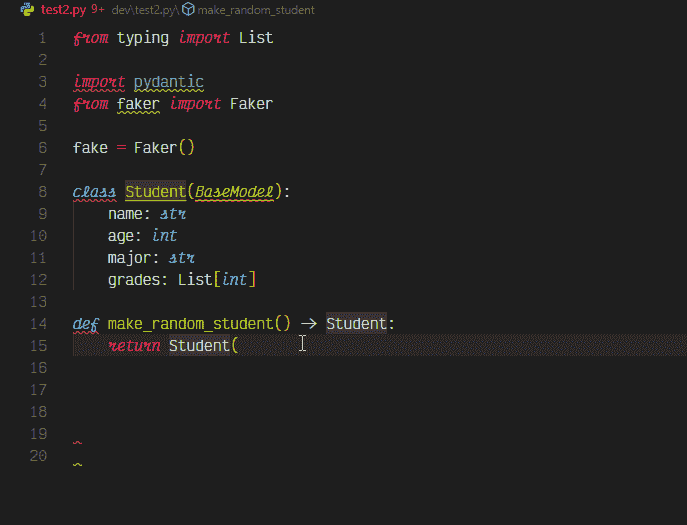

# GitHub copilot 能为数据科学家做些什么？

> 原文：<https://towardsdatascience.com/tips-for-using-github-copilot-in-everyday-python-programming-8ef9e91a9b47?source=collection_archive---------14----------------------->

## 生产力

## 没有废话指南使用副驾驶今天

在 [Unsplash](https://unsplash.com/s/photos/cockpit?utm_source=unsplash&utm_medium=referral&utm_content=creditCopyText) 上 [NeONBRAND](https://unsplash.com/@neonbrand?utm_source=unsplash&utm_medium=referral&utm_content=creditCopyText) 拍摄的照片

除非你生活在岩石下，否则传说你会从你的新闻订阅中看到 Github copilot 的一篇文章。这不是另一个解释什么是[副驾驶员](https://copilot.github.com/)的帖子，或者讨论副驾驶员的[法律问题，或者它如何可能是编码员的末日。这是一个实用的指南，告诉你如何开始使用 copilot 进行 python 编程。](https://changelog.com/jsparty/188)

此时，副驾驶仅可通过关闭的 [beta](https://github.com/features/copilot/signup) 使用，并可使用 VSCode [扩展](https://marketplace.visualstudio.com/items?itemName=GitHub.copilot)访问。

> Github 副驾驶 ✈️ *是一个与 AI tech 爱恨交加的绝佳例子。*

它之所以受人喜爱，是因为它可以提供出色的建议，但令人讨厌的是，它使用了整个开源代码库来实现这一点。综上所述，典型的 AI 工具。

## 技巧 1:让你的代码可读📙

使用不言自明的函数和参数名称。适当的命名提高了代码的可读性，对人和机器都是如此。这种方法单独影响所提供建议的质量。

功能与自我解释的名称和参数，帮助副驾驶。作者 GIF。

## 技巧二:语境，💡语境，语境

使用类型提示。这为作用域中的所有变量、函数和返回类型提供了额外的上下文，其副作用是帮助您捕捉林挺的错误。

基于返回类型提示自动完成复杂的数据结构。作者 GIF。

## 技巧 3:回顾过去🍔向前看

Copilot 是双向上下文感知的。如果您的代码被夹在两个函数之间，copilot 仍然可以使用完成前后的上下文自动完成。

根据作者当前作用域 GIF 前后的函数自动完成。

## 技巧四:如果不喜欢，试试接下来的[⏭️](https://emojipedia.org/next-track-button/)

在 VS 代码中，一旦你启用了 copilot，当你输入的时候，建议会以灰色显示。如果您不喜欢该建议，您可以使用`alt + [`循环查看建议，获得下一个建议。

使用 Alt+[快捷键在建议中循环。作者 GIF

## 技巧 5:避免使用注释来自动完成函数。这不实际，🧪

几乎所有你在网上看到的例子，包括来自 [Github](https://copilot.github.com/) 的例子，注释都被用来生成代码。虽然这很有效， ***使用注释来自动完成你的功能是使用 copilot*** 最糟糕的方式。开发人员不会用简单的英语写出他们希望他们的功能做什么。AI 应该为我们工作，而不是相反。

基于注释的 Copilot 自动完成代码。摘自 Github 的示例。作者 GIF。

## 技巧 6:外部📚图书馆

Python 的多功能性来自于它的库。你可以期望副驾驶知道对象方法和最常用的参数。

Copilot 在像 sklearn 和 pandas 这样的 DS 库上提供了完整的。作者 GIF。

## 技巧 7:模式匹配

copilot 可以匹配涉及多个参数和数据类型的复杂模式。

Copilot 通过使用数据类型和上下文自动填充模式匹配类参数。作者 GIF。

## 更多提示

这不是一个详尽的列表，而是一个不断增长的列表。如果你觉得更多的技巧可以添加到这个列表中，请在下面留下评论，我可以把它添加到文章中。

## 将来的

考虑到模型的灵活性和性能，下一个合乎逻辑的问题是“未来会有付费服务吗？”。根据 Github 的说法，

> [会有付费版本吗？](https://copilot.github.com/#faq-will-there-be-a-paid-version)
> 
> 如果技术预览成功，我们的计划是在未来建立一个商业版本的 GitHub Copilot。我们希望通过预览来了解人们如何使用 GitHub Copilot，以及如何大规模操作它。

如果你对 gif 上的字体设置感兴趣，可以看看我下面的文章，看看如何设置类似的样式。

 [## 让你的 Python 代码看起来很漂亮

### 为什么 JavaScript 开发者应该享受所有的乐趣？

python .平原英语. io](https://python.plainenglish.io/make-your-python-code-look-pretty-c65dc2ff2bfa)