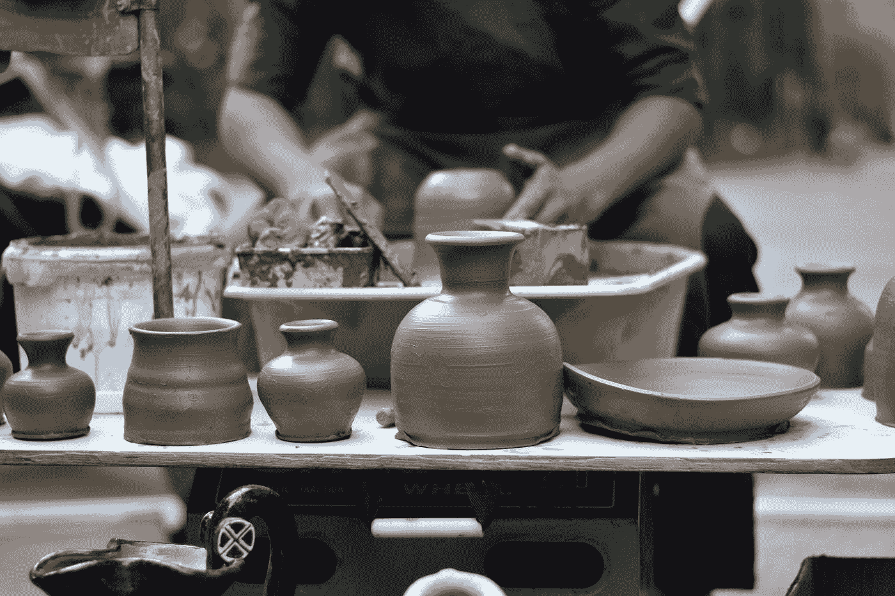

# 交易的技巧、诀窍和工具:你应该阅读的 7 个热门帖子

> 原文：<https://towardsdatascience.com/tips-tricks-and-tools-of-the-trade-7-popular-posts-you-should-read-6853d9fefa09?source=collection_archive---------20----------------------->

## 我们最近的一些阅读量最大的文章关注如何让您的数据科学之旅更加轻松顺畅。

罗曼·海因克斯在 [Unsplash](https://unsplash.com?utm_source=medium&utm_medium=referral) 上拍摄的照片

八月应该是一个缓慢、懒散的月份——夏天的三伏天等等——但你不会仅仅通过查看上个月 TDS 读者最有共鸣的帖子就知道这一点。有抱负和经验丰富的数据科学家似乎都专注于实用性和效率，并希望提高他们的技能，因此他们找到了提供可行想法和见解的文章。从 Python 包和可视化工具到有用的实践数据集，让我们深入了解一些阅读量最大的最新帖子。

## [《如何在 6 个月内从非程序员成长为数据科学家》](/how-to-grow-from-non-coder-to-data-scientist-in-6-months-197f465dfa9f)

莎兰·库马尔·拉文德兰提供的这份全面而简洁的指南在 8 月份获得了巨大的成功，他将自己给早期职业数据科学家的建议提炼为一个循序渐进的蓝图，帮助你获得成功。成为一名数据科学家还需要付出很多努力吗？当然可以。但是莎兰的指南可能会帮助你做出更明智的选择，并节省时间。

</how-to-grow-from-non-coder-to-data-scientist-in-6-months-197f465dfa9f>  

## [“Python 中的可视化和交互式仪表板”](/visualization-and-interactive-dashboard-in-python-c2f2a88b2ba3)

口碑往往是发现新餐馆和秘密徒步旅行路线的最佳方式，可视化工具也是如此——在 Sophia Yang 关于 HoloViz 的帖子中，她解释了这个鲜为人知的 Python 生态系统(包含七个库)如何一次又一次地帮助她简化了工作流程。

</visualization-and-interactive-dashboard-in-python-c2f2a88b2ba3>  

## [“一天可以学完的 5 门在线数据科学课程”](/5-online-data-science-courses-you-can-finish-in-1-day-5b60f353fa8e)

对于许多进入数据科学的人来说，时间是一种宝贵的商品——他们可能会在一份全职工作、一堆副业、家庭责任或者只是 2021 年生活的普遍压力中疲于奔命。Sara A. Metwalli 专门为那些没有空闲时间的人收集了几门在线课程，包括几个你可以在几个小时内完成的选项。

</5-online-data-science-courses-you-can-finish-in-1-day-5b60f353fa8e>  

## [“我希望在读机器学习博士之前掌握的九个工具”](/nine-tools-i-wish-i-mastered-before-my-phd-in-machine-learning-708c6dcb2fb0)

另一个人的后见之明可以成为你节省时间的路线图——当然，前提是前者与你分享他们的见解。幸运的是， [Aliaksei Mikhailiuk](https://medium.com/u/30bef13bba71?source=post_page-----6853d9fefa09--------------------------------) 非常慷慨地讨论了几种工具和方法，这些工具和方法可能会让他作为机器学习博士生的生活变得更容易——而且仍然可以让*你的*生活更容易，无论你是在学术界还是在工业界。

</nine-tools-i-wish-i-mastered-before-my-phd-in-machine-learning-708c6dcb2fb0>  

## [“如果我必须重新开始，我将如何学习数据科学的 Python”](/how-i-would-learn-python-for-data-science-if-i-had-to-start-over-83fc40ab93ba)

就像在 Aliaksei 的帖子中一样，回溯智慧也是尼古拉斯为即将开始学习 Python 的人收集的技巧中的游戏名称。他涵盖了几个关键领域，从理解 CRUD 的概念到在项目工作中取得领先。

</how-i-would-learn-python-for-data-science-if-i-had-to-start-over-83fc40ab93ba>  

## [“练习数据科学技能和制作优秀作品集所需的所有数据集”](/all-the-datasets-you-need-to-practice-data-science-skills-and-make-a-great-portfolio-74f2eb53b38a)

如果你偶尔陷入困境，不知道在哪里找到合适的练习数据集来磨练某项技能或解决一个棘手的概念， [Rashida Nasrin Sucky](https://medium.com/u/8a36b941a136?source=post_page-----6853d9fefa09--------------------------------) 会帮你解决。她的收藏深刻、广泛，涵盖了各种各样的主题和问题。

</all-the-datasets-you-need-to-practice-data-science-skills-and-make-a-great-portfolio-74f2eb53b38a>  

## [“7 个很酷的 Python 包，卡格勒正在瞒着你使用”](/7-cool-python-packages-kagglers-are-using-without-telling-you-e83298781cf4)

谁不喜欢发现一个秘密的(或者，好吧，不常用的)Python 包，它可能正好解决您在工作中一直在努力解决的棘手问题呢？ [Bex T.](https://medium.com/u/39db050c2ac2?source=post_page-----6853d9fefa09--------------------------------) 从 Lazypredict 到 Rapids cuDF，为你整理了不少于 7 个这样的网站。

</7-cool-python-packages-kagglers-are-using-without-telling-you-e83298781cf4>  

你是否读过(或写过)一篇可能对其他数据科学家的工作有所帮助的文章？分享到评论里吧！