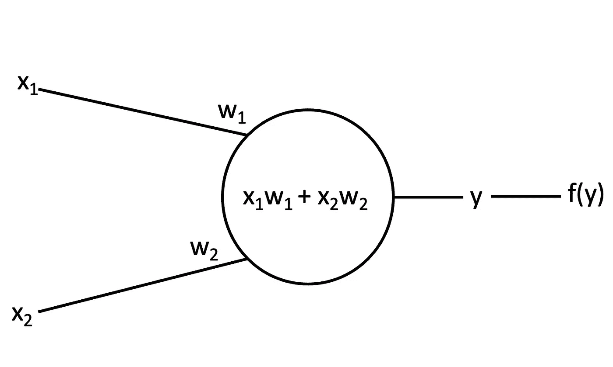
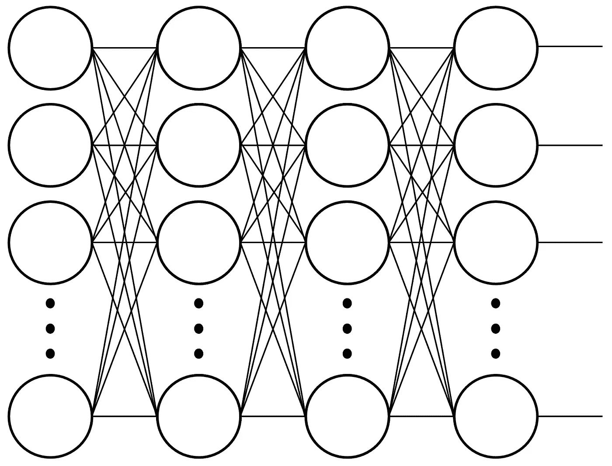
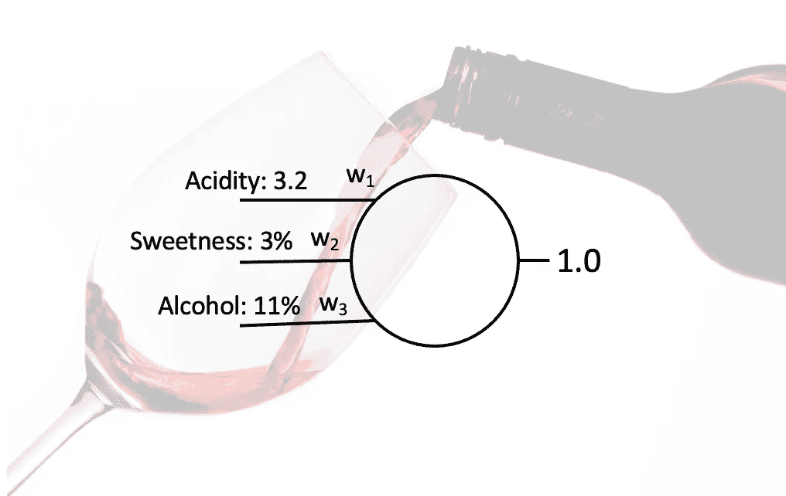
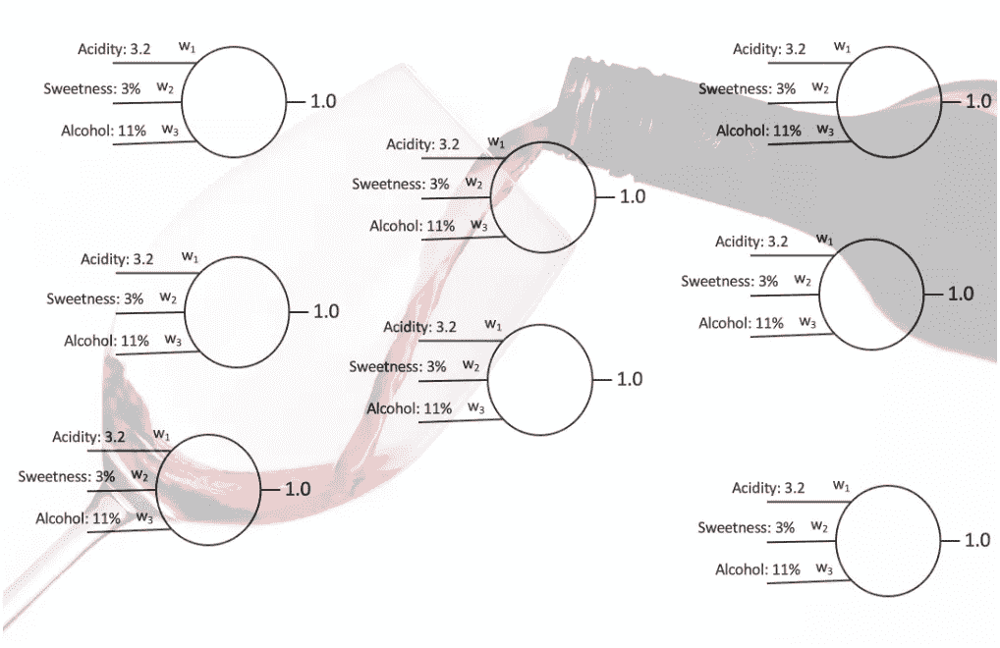
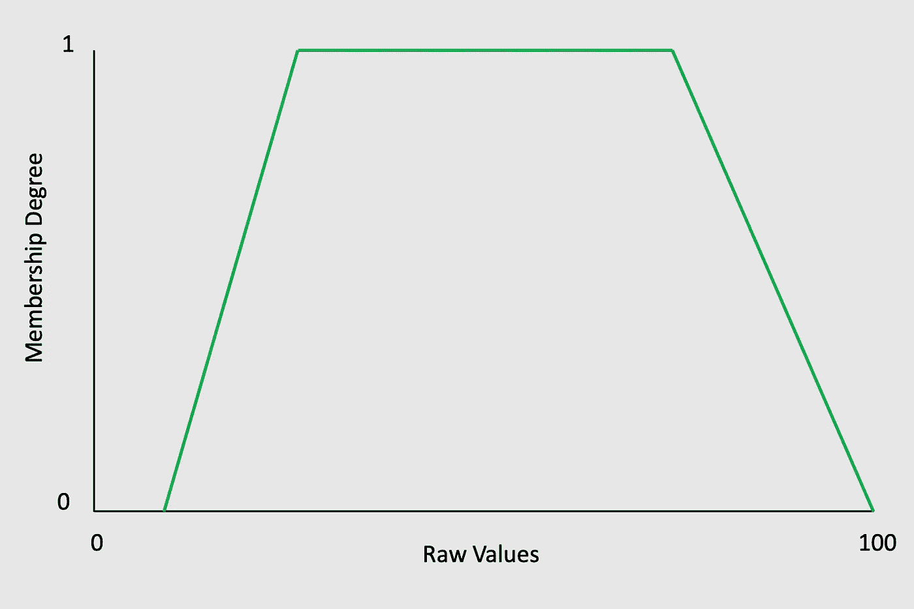
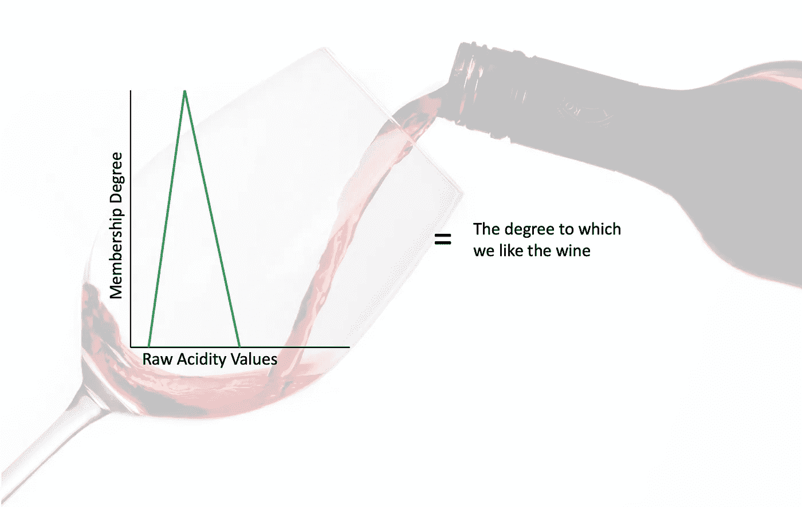

# 厌倦了 AI？再说说 CI。

> 原文：<https://towardsdatascience.com/tired-of-ai-lets-talk-about-ci-eb54f7a2d393?source=collection_archive---------2----------------------->

人工智能无处不在。它已经慢慢偏离了它最初的定义，并成为大多数自动化算法的流行语。在这篇文章中，我不会争论人工智能是什么或者不是什么——在这一点上，这是一个非常主观的争论。然而，我想强调计算智能——一个定义明确的主题。

由[迈克尔·泽兹奇](https://unsplash.com/@lazycreekimages?utm_source=medium&utm_medium=referral)在 [Unsplash](https://unsplash.com?utm_source=medium&utm_medium=referral) 上拍摄的照片

# 动机

**什么是人工智能？谁知道呢。定义什么是或不是人工智能是一个不断变化的目标。**所以，我想深入一门更具体的科学——*计算智能* (CI)。竞争情报是一个三分支的理论集及其设计和应用。它们在数学上更加严谨，可以通过添加到您的数据科学工具箱中来将您与众不同。你可能熟悉这些分支— — **神经网络**、**进化计算**和**模糊系统**。深入到 CI，我们可以讨论解决更复杂问题的复杂算法。

CI 内部存在一个大型社区。具体来说，在 IEEE 内部，有一个庞大的 CI 社区，每个分支都有一个年度会议。在过去的几年里，我在 FUZZ-IEEE 会议上发表过论文/做志愿者，这总是一个学习新兴数学和算法的绝佳机会。每个社区都推动竞争情报领域的创新，这种创新从学术界渗透到工业界。许多 CI 方法始于学术界，并演变成现实世界的应用。

**在谈论 CI 时，我收到的最常见的问题之一是，“每个分支都解决什么问题？”虽然我能理解这个问题，但是这些分支并不是按照它们解决的问题来划分的。
理论的灵感分割树枝。所以，不可能细分成他们的应用。"但是布莱斯，什么是竞争情报理论？"简而言之，每一个理论都是从一个数学表达式开始，然后实现成一个算法(计算机可以做的事情)。就其本身而言，每个分支都值得许多文章。在这篇文章中，我给出了一个高层次的概述和每个分支合作解决问题的例子。当你读到这里的时候，请记住，对于每个分支中包含的方法，除了浅尝辄止是不可能的。我将会写一些关于这些分支的具体实例的更深入的文章，但是**我想在高层次上描述每一个分支，这样你就能体会到什么是可能的。****

# 神经网络

乔希·里默尔在 [Unsplash](https://unsplash.com?utm_source=medium&utm_medium=referral) 上的照片

> 灵感:“使用人脑作为灵感的来源，人工神经网络(NNs)是大规模并行分布式网络，具有从示例中学习和归纳的能力。”[1]

**每个 NN 由神经元组成，它们的组织定义了它们的架构。**NNs 的宽度和深度决定了它们的架构；这就是“深度学习”的起源——通过深度神经网络。在自然语言处理(NLP)领域，GPT-4 体系结构备受关注。对于计算机视觉(CV)，我一直是 GoogleNet 架构的粉丝。没有一种架构适合所有情况，这就是为什么有这么多不同的架构。

神经元是神经网络的组成部分，所以首先要了解神经元。神经元的可视化如下:

单个神经元的例子。我创建的图像:)

计算每个神经元的数学需要两个基本步骤。

1.  点积——乘法和加法(圆圈内)
2.  预定义的数学函数(“f(y)”)

乘法是简单的；在重量(w)上点上输入值(x)。一旦你有了答案，你就把它输入到数学函数 f(y)中。每一步都是从数据中学习的巧妙技巧。乘法是线性方程，所以只能学习线性关系。大多数时候，数据不是线性的。因此，我们需要给神经网络学习更复杂模式的自由。预定义的非线性函数(激活函数)允许 NN 学习非线性关系。

在之前的图像中，我们观察了单个神经元，但为了创建更深的网络，我们可能会有类似这样的东西。

全连接网络的示例。图片由我:)

每个神经元的结构都变得越来越复杂。我建议调查一下 GPT-4 有多少参数；).现在，您可以想象一下，在无限多的配置中，您可以拥有多少种不同的架构。当然，硬件限制了我们的架构规模，但 NVIDIA(和其他公司)正在以令人印象深刻的速度扩展硬件。

到目前为止，我们只检查了在网络内部发生的具有既定权重的计算。找到合适的权重是一项艰巨的任务，但幸运的是，有数学技巧可以优化它们。如果你对细节感兴趣，我鼓励你去看看反向传播。反向传播利用链式法则(来自微积分)来优化权重。对于这篇文章来说，理解权重是如何学习的并不重要，但是知道反向传播做得很好是必要的。但是，它也不是没有警告。随着神经网络的学习，它们相对于数据优化所有的权重。然而，必须首先定义权重——它们必须有一定的值。这就引出了一个问题，我们从哪里开始？我们通常给权重分配随机值。不幸的是，糟糕的初始化可能导致次优的解决方案。因此，通常的做法依赖于用不同的初始化多次训练神经网络，希望找到最好的。这个问题是使用反向传播的直接结果——找到局部最优解并不意味着我们有最佳解。这一段中有大量的关键词可以去谷歌进行更深入的搜索。

重点是，神经网络是一个数学框架，代表受大脑神经结构启发的复杂功能。神经网络学习许多函数，但最常见的是回归(分类在技术上是回归的一种——想想看)。在以后的文章中，我将更深入地研究复杂的架构及其用例。但是，考虑一个例子，一个网络将葡萄酒分为好坏。葡萄酒的示例特征(输入)是它的甜度、酸度和酒精浓度(有更多可能的输入，但让我们将其限制为三个)。我们也把这个问题限制在单个神经元上。给定足够的好酒和坏酒的数据样本(相对于这些输入)，神经网络可以从这些特征中学习将酒分类为好酒或坏酒。

葡萄酒特征输入和输出的例子。背景由[阿波罗摄影师](https://unsplash.com/@apolophotographer)

还记得我们的问题是什么吗？随机初始化。幸运的是，进化计算提供了一个解决方案(注意:我正在关注这个问题，以便我可以将所有三个分支联系在一起)。为了更深入地了解 NNs，我推荐[这篇文章](/a-beginners-guide-to-neural-networks-d5cf7e369a13)。

# [进化计算](/a-hidden-gem-of-ci-evolutionary-computation-ef8d5e815344)

照片由[国家癌症研究所](https://unsplash.com/@nci?utm_source=medium&utm_medium=referral)在 [Unsplash](https://unsplash.com?utm_source=medium&utm_medium=referral) 上拍摄

> 灵感:“使用生物进化作为灵感的来源，进化计算(EC)通过生成、评估和修改一群可能的解决方案来解决优化问题。”[1]

遗传算法(GAs)可能是最流行的算法。粒子群优化、蚁群优化、遗传规划(等等)也属于进化计算，但我们将把范围限制到气体。

*   进化过程激发了气体的产生。气体模拟许多代的问题，以找到最佳解决方案。像神经网络一样，遗传算法试图优化一个成本函数，但在遗传算法中，它被称为适应度函数。适应度函数可以灵活地建模，但它们都有相同的组成部分——染色体和基因。每条染色体的组成部分是基因。类似于神经网络，基因是遗传算法优化的权重。该算法的步骤如下，

1.  生成 N 条染色体(随机)
2.  评估每个染色体的适应度(适应度函数)
3.  为下一代选择亲代染色体(选择)
4.  从最适合的父代创建子代染色体(交叉)
5.  改变基因吗？(突变)
6.  从第 2 步开始重复，直到满意为止(收敛)

更深入的解释，请查看[这篇文章](/introduction-to-genetic-algorithms-including-example-code-e396e98d8bf3)。遗传算法有能力找到比神经网络更好的解决方案，但这并不保证他们会。其中一个参数可能接近完美解，但它无法识别。不存在完美的优化算法，这就是为什么有这么多。然而，如果使用得当，GAs 可以找到很好的答案。考虑我们之前的葡萄酒例子。我们可以同时使用遗传算法和神经网络。在这种情况下，GA 可以首先识别初始权重集(每个集合将是一个染色体)，然后 NN 可以使用反向传播进行优化。没有必要一起使用这些算法(因为我们可以用其中任何一个找到一个*好的*解决方案)，但是我想强调我们如何一起使用这些算法来解决同一个问题。

GA 中整个群体的葡萄酒特征输入和输出示例。背景由[阿波罗摄影师](https://unsplash.com/@apolophotographer)

# 模糊系统

照片由[melethri](https://unsplash.com/@melethril?utm_source=medium&utm_medium=referral)在 [Unsplash](https://unsplash.com?utm_source=medium&utm_medium=referral) 上拍摄

> 灵感:“使用人类语言作为灵感的来源，模糊系统(FS)对语言的不精确性进行建模，并基于传统逻辑的概括来解决不确定的问题，这使我们能够进行近似推理。”[1]

完全公开——我偏向于模糊系统，所以我会尽量坚持事实。有很多方法可以解释这个话题，但我喜欢从模糊集开始。传统集合论强迫元素属于一个集合或另一个集合。例如，一匹马属于哺乳动物，一只青蛙属于两栖动物。这个框架(又名清晰集合理论)适用于精确分割的情况；然而，世界并没有这么精确。考虑用灰色来表示。什么时候属于白集？什么时候属于黑集？在清晰集合理论中，我们必须决定哪一个。但是，在模糊集理论中，它可以属于两者，隶属度为*。隶属函数(或特征函数)计算隶属度。隶属度的大小就是一个元素属于一个集合的多少。下面的例子显示了当我们绘制完整范围的值时，隶属函数可能是什么样子。我们可以看看下面的图，估计原始值 50 的隶属度为 1；但是，随着原始值接近 100，隶属度很快接近 0。*

**

***许多不同的函数可以表示隶属函数；我刚刚展示了一个例子。这些函数构成了理论的基础，因为我们开始用它们来描述世界。一旦定义了这些，我们就开始开发更复杂的表示，比如模糊规则。***

*模糊规则类似于传统的逻辑规则；然而，它们是模糊的。让我们考虑以下关于葡萄酒中酒精含量的规则(我知道这种语言并不完美，但请坚持使用我的语言):*

> *如果是酸性的，那么我们会喜欢它。*

*利用清晰的逻辑，我们定义了一个阈值。这一界限划定了我们认为是酒精还是非酒精的界限。如果我们在酸度水平为 4 时画这条线，低于 4 的所有东西都变得不是酸性的(包括 3.99)。我们知道这说不通。如果是 3.99 美元，我们可能会喜欢。*

*进入模糊逻辑。将模糊逻辑应用于这个规则，我们使用一个隶属函数来捕捉“酸性”和我们喜欢它的程度。没有硬门槛，我们能够用更像人类的直觉来解释这种说法。数学输出可能如下所示:*

**

*模糊规则的例子。背景由[阿波罗摄影师](https://unsplash.com/@apolophotographer)*

*在这个例子中，我们假设只有一个特征很重要——酸度。但是，随着我们添加其他条件，规则变得复杂，我们必须聚合成员值。例如，如果我们只喜欢甜的、酸的葡萄酒呢？然后，我们必须创建一个规则来模拟两个特性，而不是一个。为了更深入地了解模糊逻辑系统，请查看这篇文章。*

# *结论*

*AI 无处不在。这个词充斥了我们的生活，已经失去了它的味道。但是，作为一名数据科学家/ ML 工程师/ AI 工程师(无论你如何称呼自己)，我们可以让社区达到更高的标准。我们可以对我们的算法进行具体说明，因此展示我们的工作不仅仅是一系列预定义的 if-then 语句。当然，我知道在这个框架之外还有*智能*算法，但这是一种讨论我们的工作并突出我们方法的独特性的现实方式(如果你正在使用这些的话)。如果你是 CI 的新手，我鼓励你寻找应用程序，扩展理论，并成为 CI 社区的一员(我会第一个欢迎你；) ).*

*参考资料:【https://cis.ieee.org/about/what-is-ci】* 

*ryce Murray 博士是 [Two Story](https://twostory.com/) 的一名应用人工智能科学家，他在那里构建算法来实现新兴技术和规模人员分析。他在可解释的人工智能数据融合方面的工作已经发表在 *IEEE 计算智能新兴主题汇刊*和其他地方。布莱斯的专业领域包括数据融合、深度学习、机器学习和模糊逻辑。他在密苏里大学获得了电子和计算机工程博士学位。*