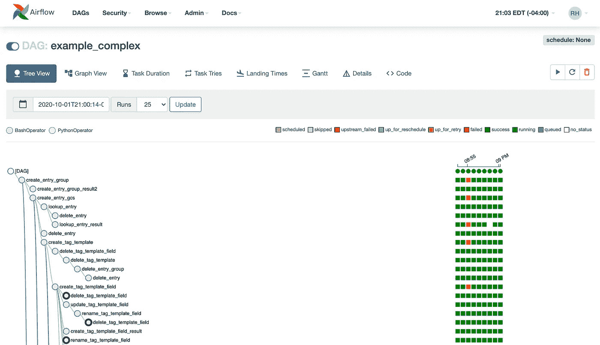
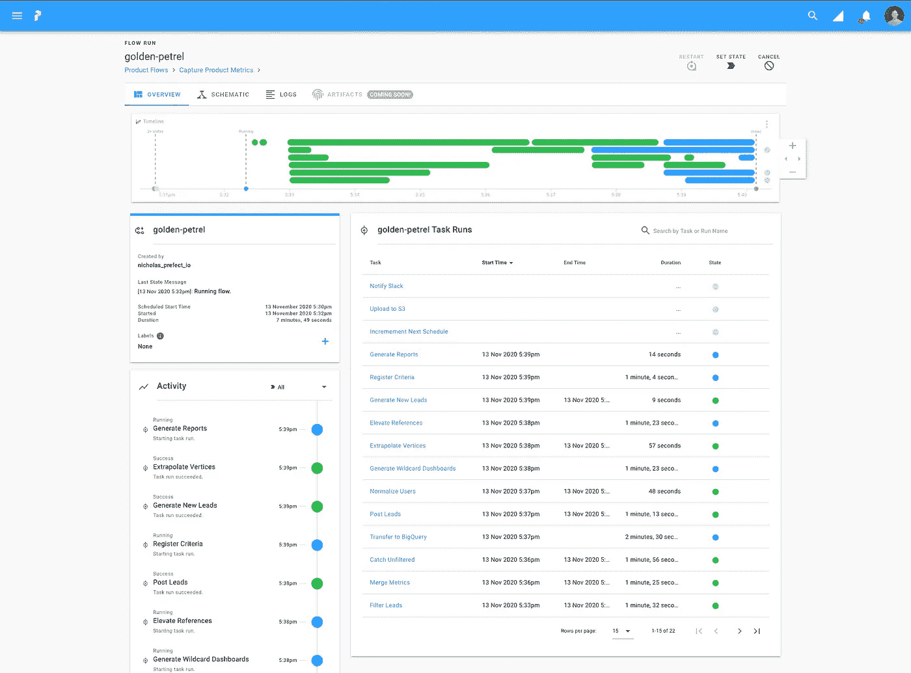

# 厌倦了气流？试试这个。

> 原文：<https://towardsdatascience.com/tired-of-airflow-try-this-c51ec26cd29d?source=collection_archive---------9----------------------->

## 一个新的工具，做气流做的，但更好

Daria Nepriakhina 在 [Unsplash](https://unsplash.com/s/photos/schedule?utm_source=unsplash&utm_medium=referral&utm_content=creditCopyText) 上拍摄的照片

当我第一次加入目前的公司时，我的第一个主要项目是决定我们要用于分析的数据堆栈。我研究了摄取、仓储、转换和编排的最佳解决方案。所有其他的都相当简单，但编排部分难倒了我。

当然，如果你有一整个团队致力于气流，气流可能会很棒。然而，对于一个小的创业公司，你有一个工程师负责数据堆栈的所有方面。那个工程师就是我。

我不想花时间去监控和维护一个复杂的气流数据管道，而这并不是我们所需要的。我们想要一种既能完成工作又尽可能少维护的东西。毕竟，我还有其他问题要解决！

就在那时，我发现了一个更新的编排解决方案，叫做[提督](https://docs.prefect.io/core/)。

提督的哲学围绕着负面工程的思想，意思是当出现问题时它是有帮助的。它认为自己是一个风险管理工具。您不应该担心它，除非您的管道没有按预期工作，那么它是非常有用的。

## 什么是提督？

提督认为自己是一个工作流引擎。它帮助您构建、运行和监控您的数据管道。或者，如果您从数据堆栈的角度考虑，它是堆栈中的最后一个工具——编排工具。

完美的管道是使用任务和流用 Python 编写的。如果你知道如何编写一个 Python 函数，你可以很容易地使用 Prefect 构建一个数据管道。

任务是完成一个工作单元的单个作业。在我的数据管道中，这通常是同步 Fivetran 数据或运行 dbt 模型的步骤。

流程是由一堆相互依赖的更小的任务或工作单元组成的功能。在我的例子中，我的数据管道是一个由运行 Fivetran syncs 和 dbt 模型的任务组成的流。

然后，这些流由您选择设置的任何类型的[代理](https://docs.prefect.io/orchestration/agents/overview.html#agent-types)进行调度和运行。一些选项包括 local、Docker 或 Kubernetes。代理将获取流量，并根据您制定的时间表运行它们。

## 为什么提督超过气流？

就我个人而言，我只是认为 Prefect 在用户界面方面更容易使用，也更复杂。是只有我，还是气流难看，只是在讲述你的管道的故事没有那么有用？

作为一个有数据工程背景但没有使用 Airflow 经验的人，我在尝试设置它时感到非常困惑。我想用天文学家来设置它，但即使这样也很复杂。每次我试图启动应用程序时，都有太多的屏幕弹出来，但没有一个给我需要的信息。

更不用说天文学家的支持团队几乎不存在，而 Prefect 有一个松散的社区，你可以在几分钟内得到所有问题的答案。Slack 社区是我最喜欢的关于 [dbt](/what-is-dbt-a0d91109f7d0) 的部分之一，所以这对我来说是一个巨大的加分。

总的来说，设置气流 vs 提督的时间对我来说是一个巨大的因素。作为一家斗志昂扬的初创企业，我希望通过改进我们的数据模型来迅速起步。我不想花几个月的时间让气流工作。提督花了我大约两个星期的时间来得到它的全部工作，从那以后我没有遇到任何问题。

我做出决定的另一个重要因素是用户界面。有了气流，我不得不真正挖掘出为什么会出错的问题的答案。用户界面很难阅读，也没有很好地传达失败/成功。我是说，你自己看看。

图片来自[气流文件](https://airflow.apache.org/docs/apache-airflow/stable/ui.html)

这对你来说简单吗？对我来说，不是。我如何知道哪个任务失败了，何时失败的？追溯红色小故障盒并不容易。

图片来自[提督文档](https://docs.prefect.io/orchestration/ui/flow-run.html)

现在来看看提督的 UI。您可以很容易地看到较大流程中的每个任务，以及它是成功、失败还是仍在队列中。我可以很容易地扫描它，点击失败的镜头，阅读日志，然后重新运行它。一些需要我几分钟才能完成的事情可能需要我一个小时才能完成。一个小时是宝贵的时间。

## 结论

如果您正在为您的分析数据堆栈决定一个编排解决方案，我强烈建议考虑 Prefect。虽然每个人的用例不同，但对于希望尽可能少维护的分析工程师来说，Prefect 是完美的自主调度程序。

我简单地设置了一个 Slack webhook，每当任务失败时通知我，这是我唯一需要检查的时候。我知道如果我没有收到失败消息，我的数据是可靠的。这种感觉棒极了！开始一天的工作时，又少了一件需要担心的事情。

让我知道你的想法，如果你有兴趣听到更多关于我如何使用和我如何设置它。文档有时会有点混乱，但对我来说，这比使用气流要简单得多。低维护和可靠性绝对值得设置。

[通过订阅我的电子邮件列表，了解更多关于其他流行的现代数据堆栈工具的信息。](https://mailchi.mp/e04817c8e57e/learn-analytics-engineering)