# 厌倦了 JupyterLab？试试 DataSpell——一个全新的数据科学集成开发环境

> 原文：<https://towardsdatascience.com/tired-of-jupyterlab-try-dataspell-a-new-amazing-ide-for-data-science-fb7cbc1280d4?source=collection_archive---------2----------------------->

## 如果朱皮特拉和皮查姆有了孩子

维多利亚诺·伊斯基耶多在 [Unsplash](https://unsplash.com/?utm_source=unsplash&utm_medium=referral&utm_content=creditCopyText) 上的照片

***免责声明*** *:这不是一篇赞助文章。我和 DataSpell 或者它的创造者没有任何关系。本文对 IDE 进行了公正的概述，旨在使数据科学工具能够为更多的人所使用。*

数据科学 IDE 市场并没有完全饱和。一方面，Jupyter 提供了最大的交互性，另一方面，PyCharm 提供了专业的环境。你也可以使用文本编辑器，比如 VSCode，但是我觉得这有点烦人。

有一个新的产品上市了— **Dataspell** —一个专门为数据科学家开发的 IDE。这是一个预览版本，但是你可以在这里注册。我等了几个星期，直到他们发给我链接。希望你的等待时间会短一些。

今天，您将看到这个 IDE 提供了什么。我们将回顾基本介绍，创建您的第一个笔记本，智能代码辅助，数据库支持，降价，等等。

*剧透预警*:太棒了。

# 什么是 Dataspell？

[Dataspell](https://www.jetbrains.com/dataspell/) 是专门为数据科学家打造的 IDE(集成开发环境)。它是由 IntelliJ Idea 和 PyCharm 背后的公司 [Jetbrains](https://www.jetbrains.com/) 开发的，所以不需要进一步介绍。

IDE 还没有正式发布。你必须[注册](https://www.jetbrains.com/dataspell/)的预览版，然后等着获得下载链接。支持所有主流操作系统平台，包括 ARM(M1)MAC。

下面是 IDE 提供的功能( [source](https://www.jetbrains.com/dataspell/) ):

*   **原生笔记本体验** —如果和 Jupyter 合作过，会有宾至如归的感觉。
*   **智能编码辅助** —有点像 Jupyter 和 PyCharm 生了个宝宝。
*   **Markdown 和 JavaScript** —随心所欲地设计笔记本，并嵌入数据可视化。
*   **交互外壳** — REPL 控制台+语法检查。
*   **SQL 数据库支持** —连接数据库、可视化检查数据、导入/导出数据等。

而且这个东西还在积极开发中！

但是废话说够了。让我们看看这个东西是什么样子的:

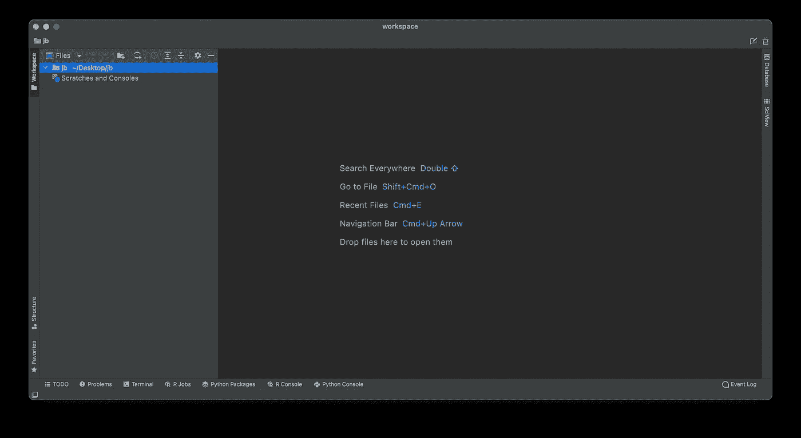

图片 1 — Dataspell IDE(图片由作者提供)

如果您在 PyCharm 中做过任何事情，它看起来和感觉起来都很熟悉。

综上所述，这东西在纸面上真的很有能力，看起来很神奇。接下来让我们看看如何开始使用笔记本。

# 创建您的第一个笔记本

这一过程几乎与任何其他 Jetbrains 产品相同。点击根目录，进入*新— Jupyter 笔记本*:

图 2 —创建 Jupyter 笔记本

我给我的取名为`first_notebook.ipynb`。你不必写扩展。

它看起来是这样的:

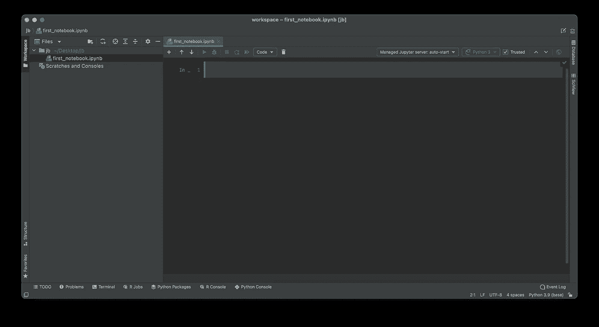

图 Dataspell 中的 Jupyter 笔记本(图片由作者提供)

风格是个人喜好的事情，但你不能说设计不是一流的。

在创建笔记本时，您可能已经看到了创建 R 脚本和 markdown 文件的选项。一旦 Python 工作顺利，Dataspell 将同时支持 R 和 Julia。

现在让我们探索一下基本的 Python 和数据科学库是如何工作的。下图显示了 Numpy 数组和 Pandas 数据帧:

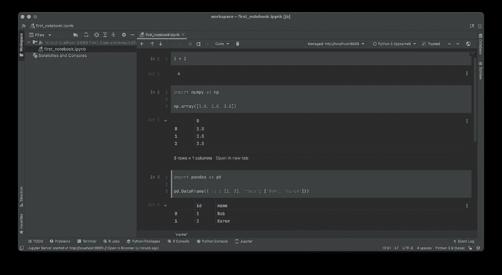

图 4——Numpy 和熊猫与 Dataspell(图片由作者提供)

果然不出所料。我喜欢 Numpy 数组被打印成熊猫系列的样子，但这只是个人喜好。

【Matplotlib 呢？这里有一个真正简单的散点图:

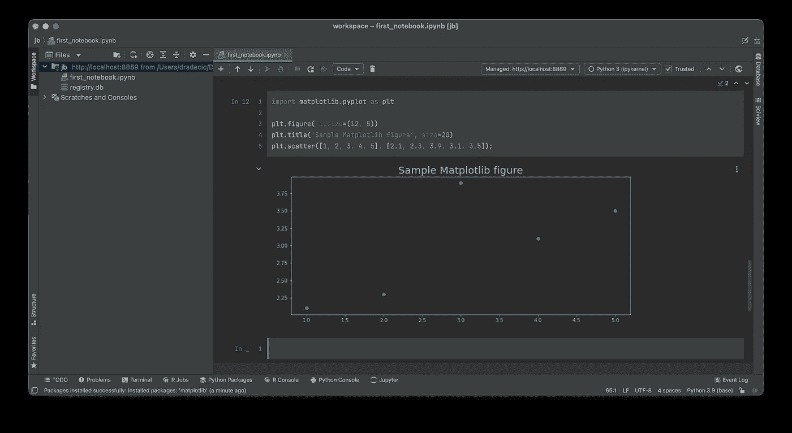

图 5 —带有 Dataspell 的 Matplotlib(图片由作者提供)

这就是 JupyterLab 和黑暗主题总是困扰我的事情。可视化效果保持白色。明确地说，我更喜欢出版物可视化的白色背景，但在晚上工作时无法忍受它们。干得好，Dataspell。

接下来，让我们探索一个每个 IDE 都必须具备的特性——智能编码辅助。

# 智能编码辅助

我不喜欢 JupyterLab 的地方是缺少编码辅助。当然，也有插件，但它们的帮助远不及专业的 ide。我不喜欢 ide 的地方是缺乏交互性。希望 Dataspell 能两全其美。

让我们尝试导入 Numpy，看看会发生什么:

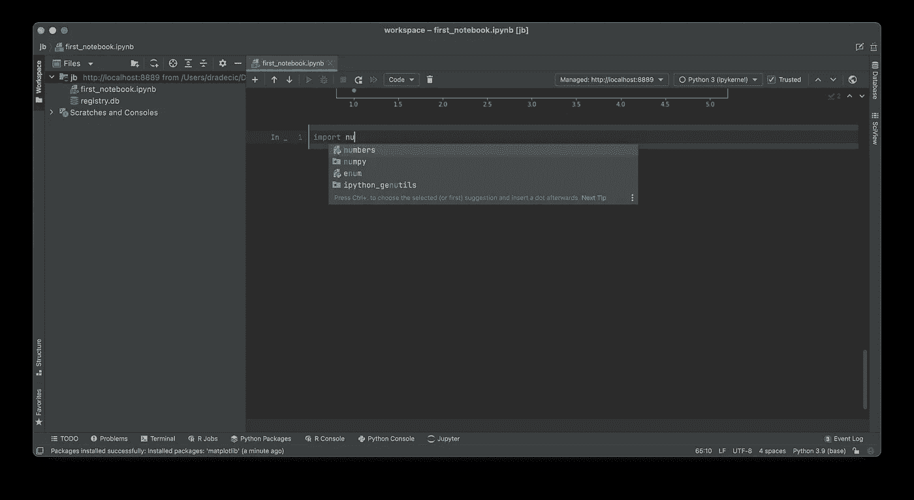

图片 6—Dataspell(1)的编码帮助(图片由作者提供)

这是第一点——自动完成——它工作得非常完美。下一位是代码写得不正确时的警告/错误。

这里有一个例子——`add_integers`函数应该返回一个整数，但是它故意返回一个浮点数:

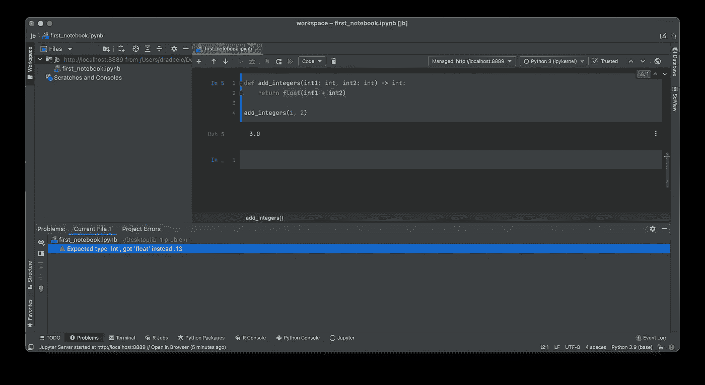

图 Dataspell 的编码帮助(2)(图片由作者提供)

像宣传的那样工作！

接下来，让我们来探索 markdown——一种让你的笔记本更容易被人阅读的方法。

# 降价支持

Dataspell 没有忘记 Markdown。首先，将鼠标悬停在单元格上方，点击*添加降价单元格*:

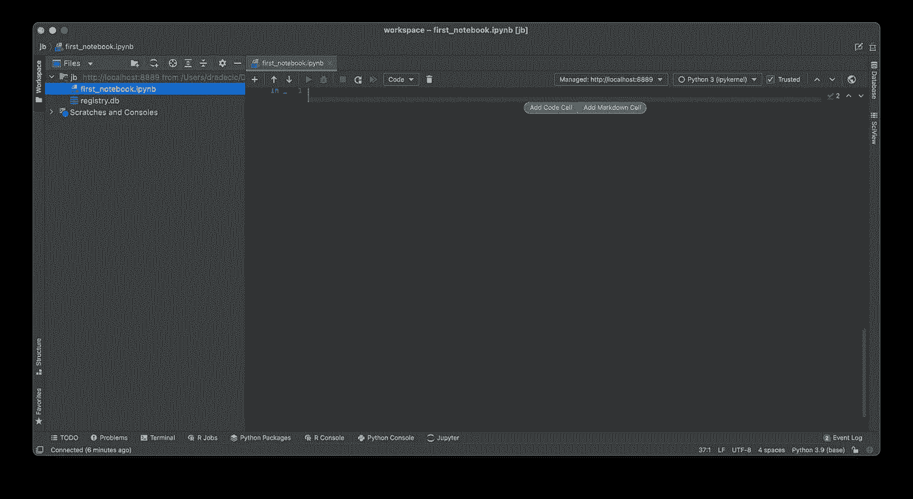

图 8 —使用 Dataspell (1)进行降价(图片由作者提供)

另一种方法是点击*代码*下拉菜单，将单元格类型切换为降价。

这里有一些 Markdown 代码供您尝试:

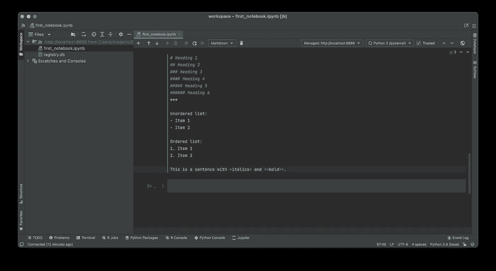

图 9 —使用 Dataspell (2)进行降价(图片由作者提供)

这是你运行细胞时的样子:

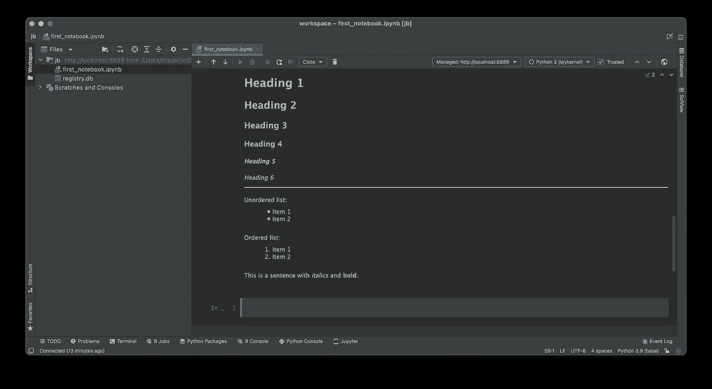

图 10 —使用 Dataspell (3)进行降价(图片由作者提供)

总结一下——大多数事情都像预期的那样工作。然而，我写数学方程有困难，因为它们的工作方式和 JupyterLab 不一样。如果你知道解决方案，请随时发表评论。

最后，让我们探索数据科学的另一个重要功能—数据库。

# 数据库支持

作为一名数据科学家，您几乎每天都要建立和管理数据库连接。当 SQL 被写成字符串时，调试长的 SQL 行并不容易。Dataspell 有一个解决方案。

以下是如何使用`sqlite3`包建立连接、创建数据库和表的方法:

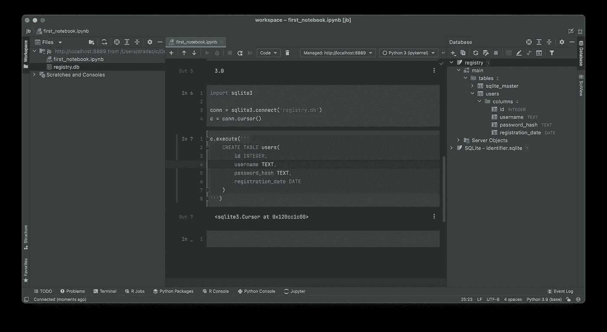

图 Dataspell 的数据库支持(1)(图片由作者提供)

现在，您可以像往常一样插入数据:

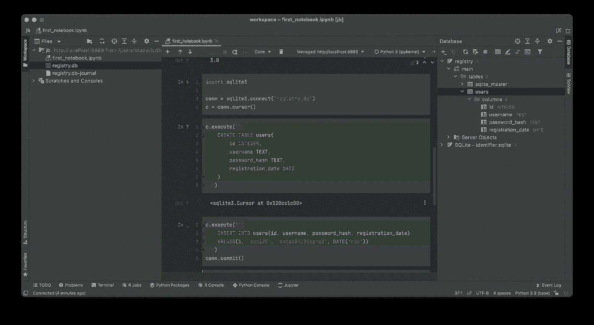

图 Dataspell 的数据库支持(2)(图片由作者提供)

Dataspell 的特别之处在于，它可以在不离开 IDE 或编写不必要的查询的情况下探索数据库。只需双击数据库，就会打开一个新的侧窗口。

从那里，您可以轻松地单击任何感兴趣的表，在单独的选项卡中浏览它:

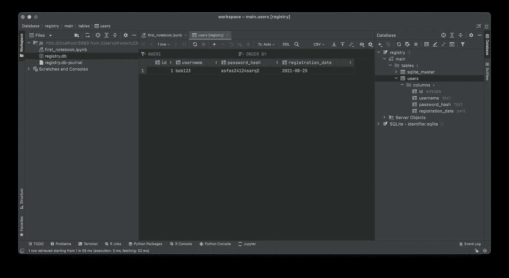

图 Dataspell 的数据库支持(3)(图片由作者提供)

*牛逼吧？这个特性在专业版的 PyCharm 中是默认的，所以它可能不会让很多人感到惊讶。*

问题依然存在— *你应该使用 Dataspell 吗？这个 IDE 的缺点是什么？*继续阅读了解。

# 判决

Dataspell 是一个即将推出的非常棒的 IDE，适合任何数据科学领域的人。但是它是适合你的工具吗？看情况。

数据科学职位因公司而异。如果你做的更多的是编码而不是数据科学，那么 PyCharm 可能是更好的选择。另一方面，如果你所做的大部分是纯粹的数据科学，那就不要再看 Dataspell 了。

我认为 Dataspell 的唯一缺点是定价。**不会，不会是免费产品。**您可以期待与 Jetbrains 其他产品类似的报价——€按年计费 89.00 英镑，€按月计费 8.90 英镑。

这又是一份没人要的订阅。我不明白为什么没有一次性购买选项，因为我更喜欢它而不是基于订阅的模式。

*你对 Dataspell IDE 有什么想法？它会取代你的 JupyterLab 吗，还是订阅会成为一个障碍？请在下面的评论区告诉我。*

以下是一些有用的链接，可以帮助您了解更多关于 Dataspell 的信息:

*   [官网](https://www.jetbrains.com/dataspell/)
*   [最近 Q &一届](https://blog.jetbrains.com/blog/2021/03/30/announcing-the-eap-for-jetbrains-dataspell-our-new-data-science-ide/)

*喜欢这篇文章吗？成为* [*中等会员*](https://medium.com/@radecicdario/membership) *继续无限制学习。如果您使用以下链接，我将收取您的部分会员费，无需您支付额外费用:*

 [## 通过我的推荐链接加入 Medium-Dario rade ci

### 作为一个媒体会员，你的会员费的一部分会给你阅读的作家，你可以完全接触到每一个故事…

medium.com](https://medium.com/@radecicdario/membership) 

# 保持联系

*   在[媒体](https://medium.com/@radecicdario)上关注我，了解更多类似的故事
*   注册我的[简讯](https://mailchi.mp/46a3d2989d9b/bdssubscribe)
*   在 [LinkedIn](https://www.linkedin.com/in/darioradecic/) 上连接