# Python 中的特征工程和建模

> 原文：<https://towardsdatascience.com/titanic-feature-engineering-modeling-in-python-6749e6e87bf4?source=collection_archive---------20----------------------->

## 如何预测泰坦尼克号乘客中的生存状态？

马克西米利安·魏斯贝克尔在 [Unsplash](https://unsplash.com?utm_source=medium&utm_medium=referral) 上的照片

在本文中，我将介绍如何用 Python 构建模型来预测泰坦尼克号乘客的生存状态。这里使用的方法也可以应用于其他类似的用例。

要了解更多内容，您可以参考上一篇文章，Python 中的[探索性数据分析&可视化](/exploratory-data-analysis-visualization-in-python-1bf7a817bc01)，阅读更多关于 Python 中的大量数据探索和可视化的内容。

泰坦尼克号的数据可以从 Kaggle 网站下载。

1.  **处理缺失数据**

有 4 个包含缺失数据的预测因子——年龄、票价、客舱和登机。

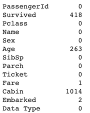

缺失值计数

**年龄**

对于年龄中缺失的数据，我们可以(1)用平均值或中值重新填充 n/a 值，或者(2)将 n/a 值归类为单独的类别。我选择了第二个选项，因为“不适用”类别可能有预测生存状态的有用信息。

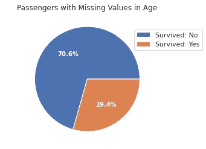

在[上一篇文章](/exploratory-data-analysis-visualization-in-python-1bf7a817bc01)中分析过

年龄中缺失的数据被归为一类。对于剩余的非缺失值，对它们进行分类的一种方法是手动定义年龄区间的数量和区间大小。

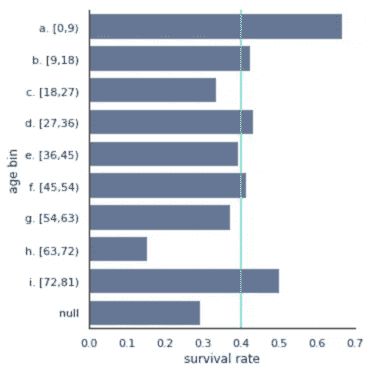

按年龄分类的存活率

在上图中，非缺失年龄值被分为 9 个年龄组。很容易在 categorize _ age 函数中更改 age_bin_size 输入，以测试不同数量的年龄箱，并查看哪一个有意义。这种方法有点武断。我更喜欢用另一种方法来选择年龄区间——使用 K-Means 聚类方法。

对非缺失年龄数据应用 K 均值聚类。

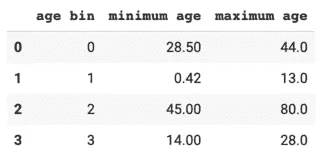

由 k 均值定义的每个年龄层的年龄范围

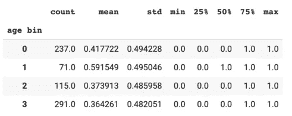

按年龄段分列的存活率

如输出表所示，与其他年龄组相比，儿童(年龄范围为 0 至 13 岁的 1 号年龄组)的存活率最高。

基于上面的年龄区间和区间大小，我创建了一个名为“年龄区间”的新变量。

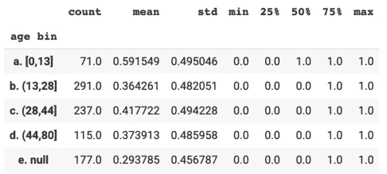

按年龄分类的存活率

**票价**

只有一名乘客没有票价数据。

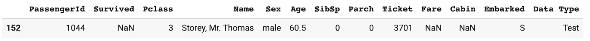

没有票价数据的乘客

这位乘客有一张三等票。我用三等票的平均票价重新填写了票价数据。

接下来，使用 K-Means 聚类方法创建票价箱。在上一篇文章中，我发现有补票的乘客存活率非常低。所以我把$0 票价编码成一个单独的类别。

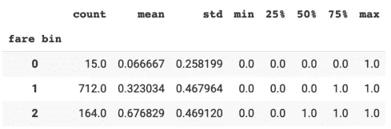

按费用箱列出的存活率

**船舱**

客舱中缺少太多值。我决定放弃这个专栏。

**登船**

两名乘客没有登机数据，他们都有头等舱机票。

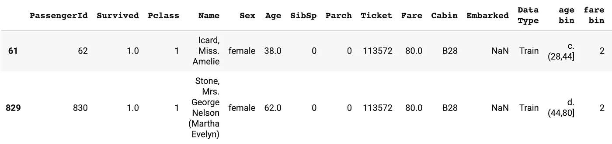

没有登机数据的乘客

我们可以通过 Pclass 检查已装船的中间值。

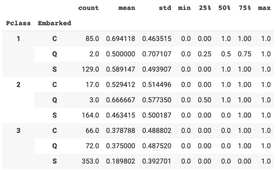

按装载度量分类

Pclass = 1 中的装载数据的中值为 s。用 s 重新填充缺失的装载数据。

**2。工程新特性**

**旅游团队规模**

按票号分组会很有趣。

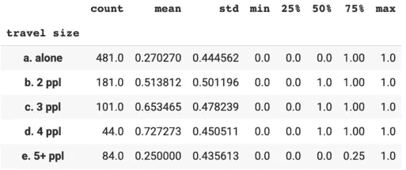

按旅行规模分列的存活率

注意，除了 5 人以上的旅行组，存活率随着旅行规模的增加而增加。

接下来，使用 SibSp 和 Parch 再次检查行程大小变量是否定义正确。

一起旅行的人数(旅行团体规模)应≥船上兄弟姐妹/配偶人数(SibSp) + 1。这里我们可以看到，对于少数乘客来说，情况并非如此。这表明一些乘客作为一个家庭一起旅行，但他们没有购买相同的机票号码。

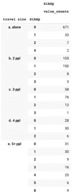

根据 SibSp 更新行程大小。

我用同样的方法更新了基于 Parch 的行程尺寸。

**旅游团体类型**

我创建了一个新变量来指定乘客是独自旅行，还是与家人或朋友一起旅行。

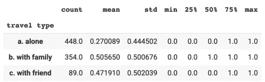

按旅行类型分列的存活率

**标题**

名称变量中可能有一些信息。我从 Name 中提取了标题，并创建了一个名为“title”的新变量。

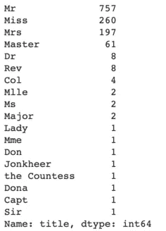

按标题划分的乘客人数

将除前 4 名之外的所有其他标题归入“其他”类别。

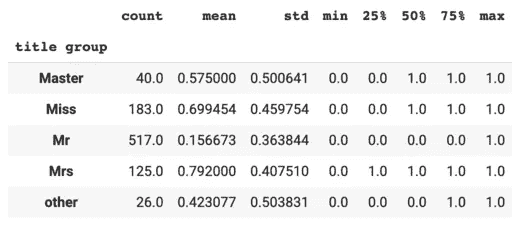

按职称组分列的存活率

标题组变量可能与性别和年龄高度相关。

**3。一键编码**

一键编码用于将包含标签值(如男性、女性)的分类变量转换为数值(0 或 1)。

首先，让我们删除建模中不会用到的列。我放弃了 SibSp 和 Parch，因为它们可能与旅行规模高度相关。

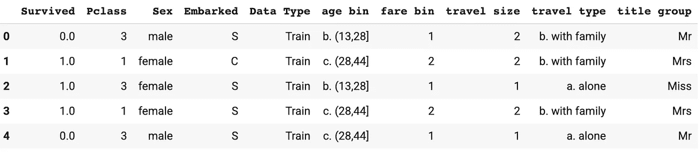

df_model 中的示例数据

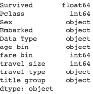

数据类型

接下来，对具有对象类型的列应用独热编码。

我删除了一些列，以防止数据中的高度相关性。以性别为例，只保留性别为女性就足够了——如果性别为女性= 0，则表明性别为男性。

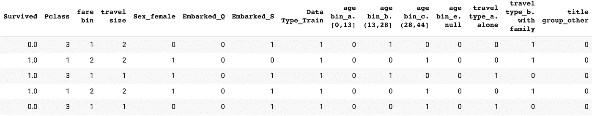

data_dummies 中的示例数据

**4。相关性**

我使用了克莱姆的 V 相关性，因为变量要么是名义变量，要么是序数变量。

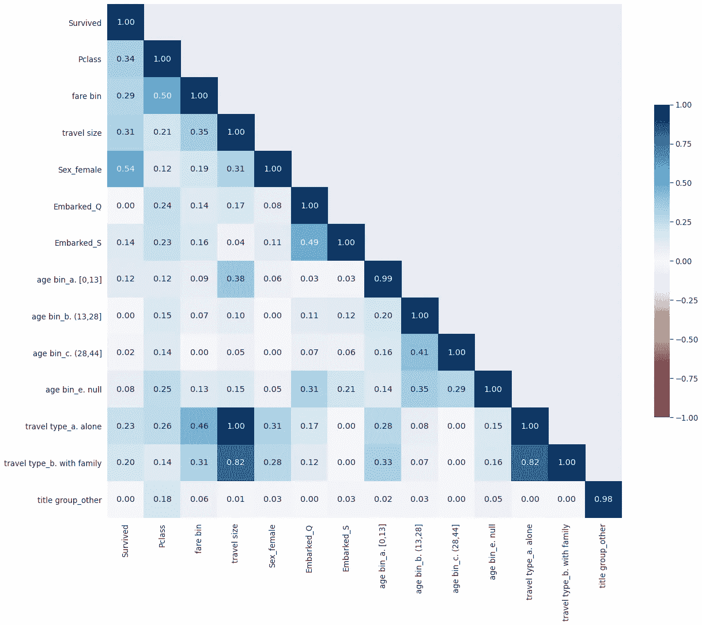

相关热图

毫不奇怪，旅行类型和旅行规模变量高度相关。我决定放弃旅行类型变量。

**5。建模**

最后，数据为建模做好了准备！

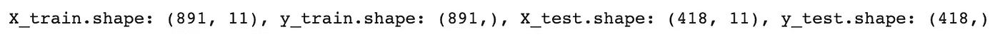

用于训练和测试数据的数据形状

为选定的模型列表拟合定型数据。使用交叉验证来计算准确度分数。

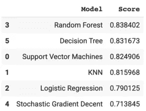

模型准确度分数

随机森林给出了最高的准确度分数——大约 84%。

使用逻辑回归模型可视化特征系数，以了解模型的工作原理。

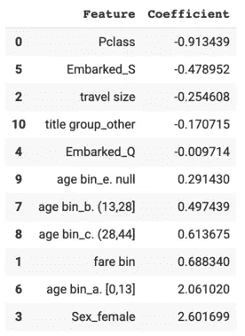

逻辑回归模型中的特征系数

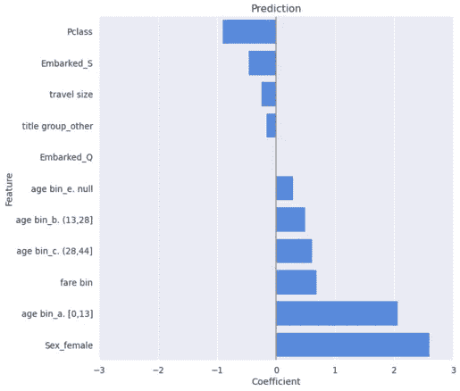

预测生存状态的特征系数

至于特征系数，与男性乘客相比，女性乘客更有可能幸存，与其他年龄组相比，儿童更有可能幸存。另一方面，与其他乘客相比，机票等级较低的乘客生还的可能性较小。这验证了从[探索性分析](/exploratory-data-analysis-visualization-in-python-1bf7a817bc01)中形成的假设。

感谢阅读！欢迎发表评论，让我知道你的想法。