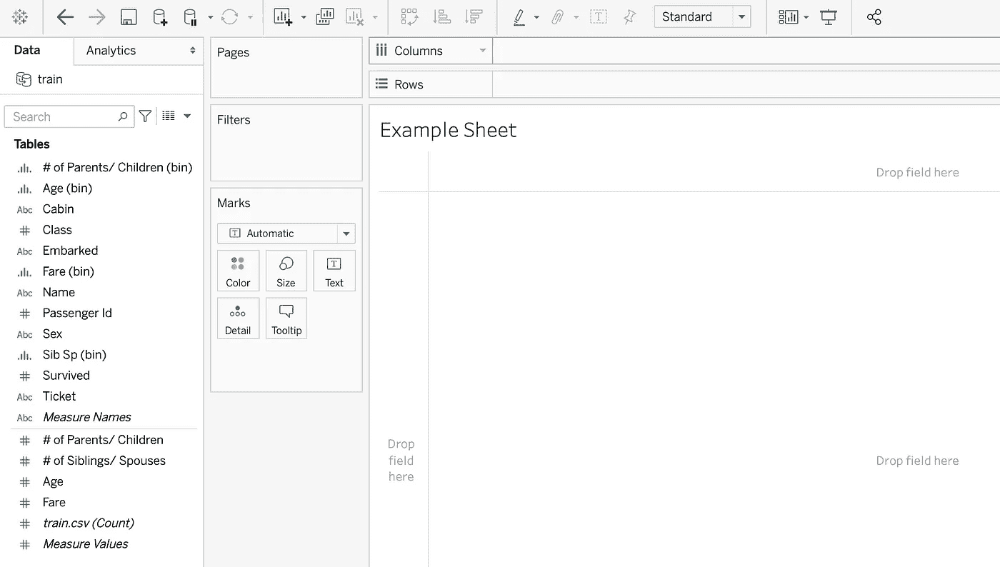
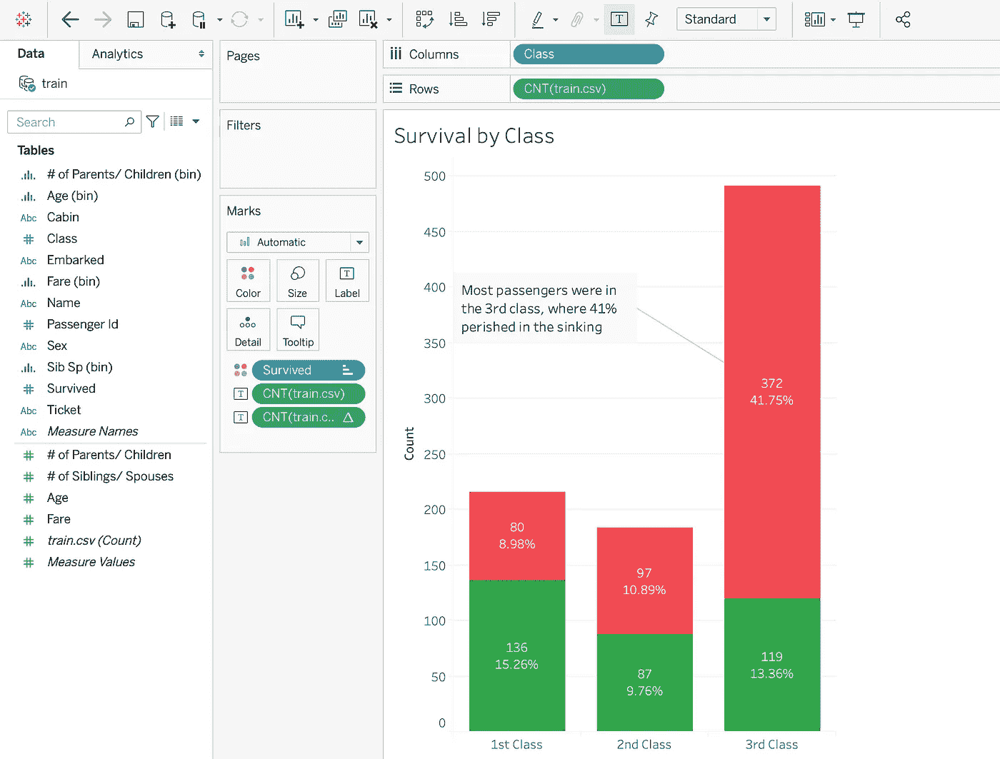
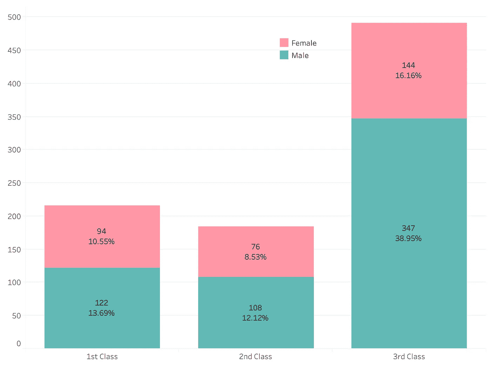
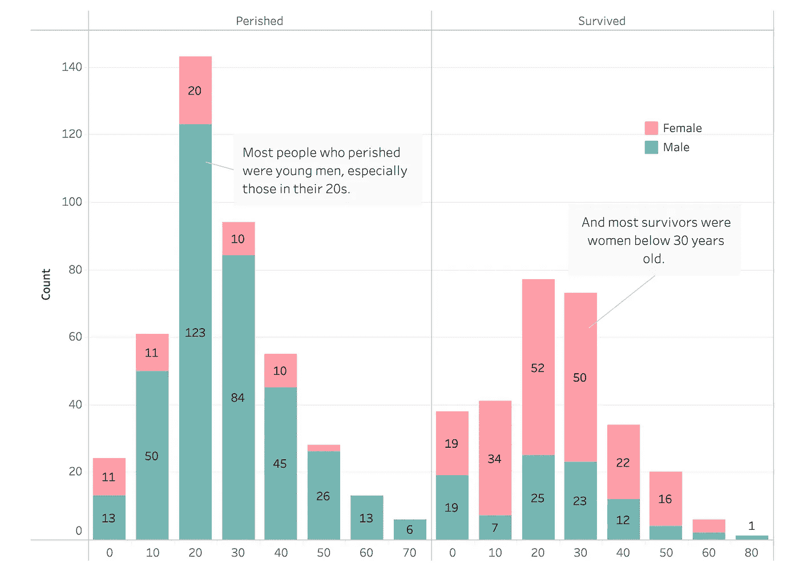
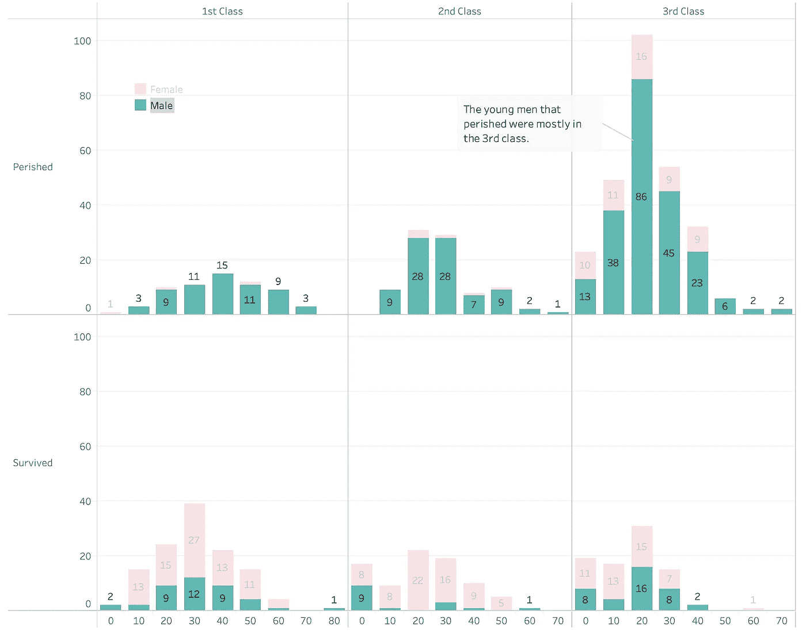
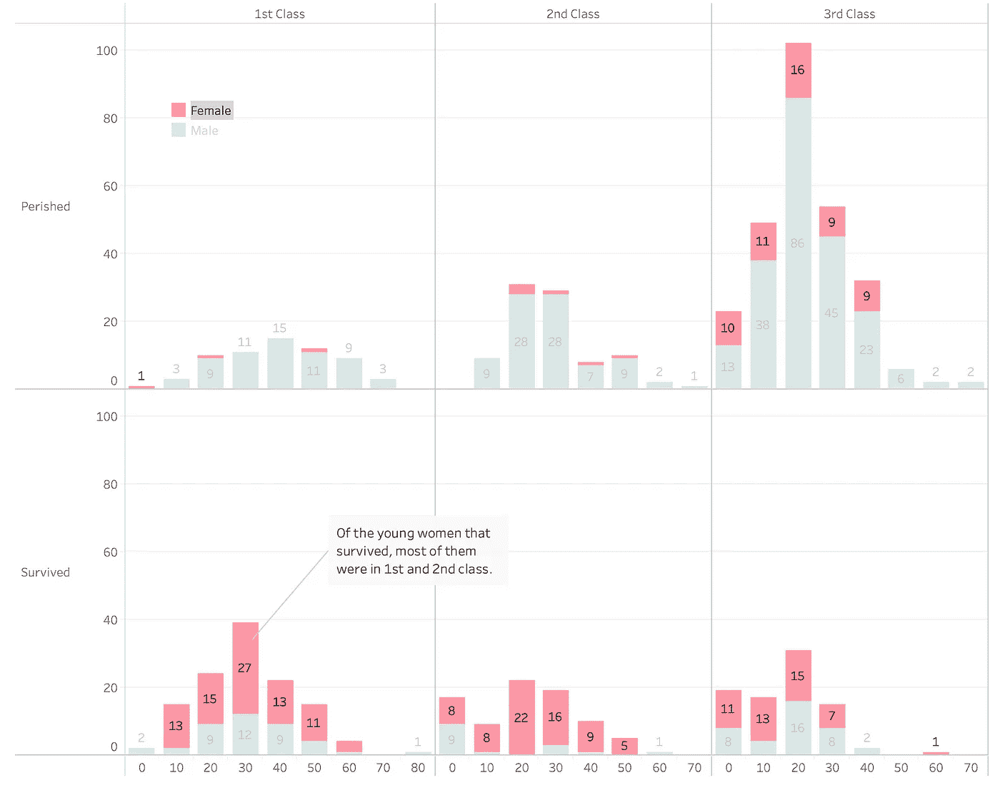
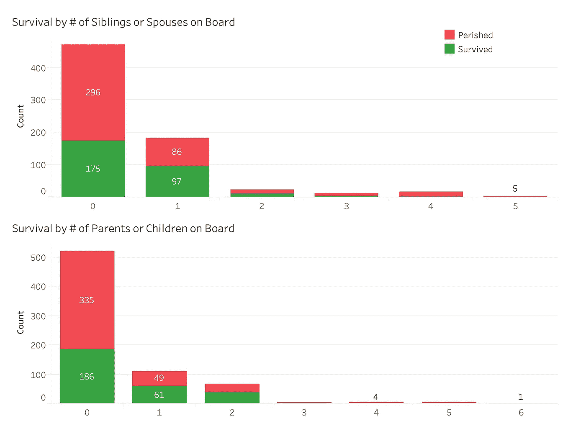
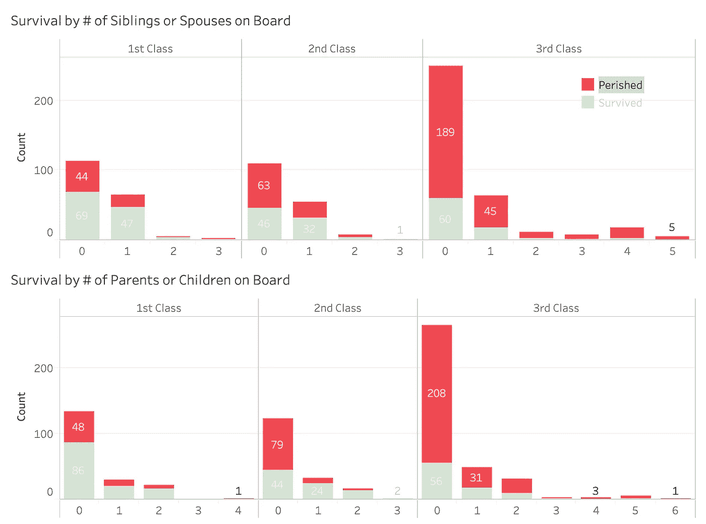
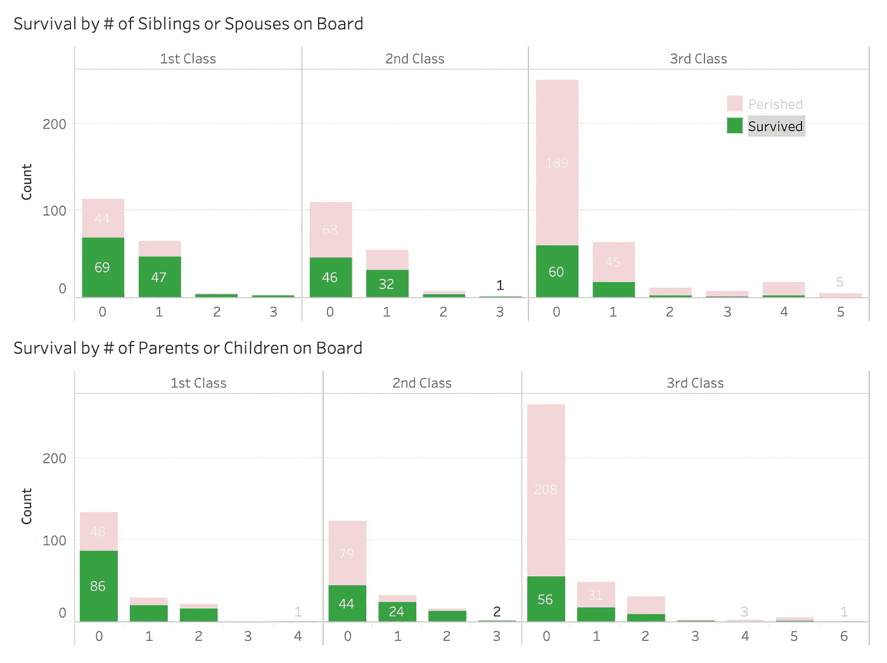

# 泰坦尼克号生存分析 Tableau 介绍

> 原文：<https://towardsdatascience.com/titanic-survival-analysis-an-introduction-to-tableau-ce642ce07ebb?source=collection_archive---------13----------------------->

## 根据乘客的级别、票价、年龄等，识别指示乘客是否能够幸存的属性。

[安妮·斯普拉特](https://unsplash.com/@anniespratt)上 [Unsplash](https://unsplash.com/photos/Tno1Zd3T6yY)

对于数据科学，学习任何新技术的关键总是在项目中直接实践。为了学习 Tableau，我对泰坦尼克号的存活率进行了分析。完整的项目可以在[这里](https://public.tableau.com/profile/sidney.kung#!/vizhome/TitanicDataset_16119594904410/TitanicSurvivalAnalysis)找到，在 **Tableau 公共**上主持。

# **数据来源**

任何熟悉数据科学和机器学习数据集资源 [**Kaggle**](https://www.kaggle.com/) 的人，可能都已经认出了 [**泰坦尼克号数据集**](https://www.kaggle.com/c/titanic) 。该数据集提供了对泰坦尼克号上每位乘客及其生存结果的观察。出于本项目的目的，仅使用了来自**训练集**的 **871 个观察值**。最终，船上 2435 名乘客中，只有 38%的人在沉船事故中幸存。这种分析的目的是**查明能够表明乘客是否能够幸存**的属性，给出他们的**等级、性别、票价、年龄、船上兄弟姐妹或配偶的数量、船上父母或子女的数量**以及其他因素。

# **什么是 Tableau？**

[**Tableau**](https://www.tableau.com/) 是一个可视化分析平台，允许**甚至非技术用户**在几分钟内**创建交互式的实时可视化**。只需几次点击，任何人都可以组合数据源，添加过滤器，并深入到特定的信息。

# **将数据导入 Tableau**

有几十个 Tableau 教程，所以我不打算深入细节。但是我将简要介绍一下，这样我们就可以对这个平台的工作原理有一个大致的了解。

当您在 Tableau 上打开一个新工作簿并加载到您的数据集中时，您将在左侧看到一个窗格，其中包含您的数据的所有列。这被称为**数据面板**。将**卡片**拖放到**架子**中是整个画面的起点。从那里开始，可能性是无限的。接下来，我们来看一个例子。

# **按阶层分列的存活率**

在这里，您可以看到我简单地将**类**卡拖到**列**架中，并在训练集中创建了一个总乘客数的**聚合，以拖到**行**架中。从那里，我只是**定制了**带有生存分类颜色协调的可视化，并将计数和百分比添加到每个条形的部分。**

这是我们可以在 Tableau 中实现的可视化类型的一个基本例子。从这里开始，我不会展示我创建每个可视化的方式。我只是在回顾我的发现。从这个图像中，我们可以清楚地看到，大多数遇难者属于第三类。让我们更深入地看看每个阶层的人口统计数据。

# **班级的性别分类**

在此之前，让我们快速浏览一下整个训练集的性别分类。

在三等舱中，大多数乘客是男性。这给了我们一个线索，关于那些幸存或死亡的人可能的性别分类。

然而，我们在这里看不到存活率。为了更多地了解生存课程中的人口统计数据，我们可以看看按性别和年龄划分的存活率。

# **按性别分列的存活率&年龄**

为了使这一形象化，我以 10 年为间隔对年龄进行分类。这让我们对年龄的划分有了更好的理解。如果我们看两列`Perished`和`Survived`，我们可以清楚地看到**大多数遇难者是年轻人**。尤其是 20 多岁的年轻男性。此外，**大多数幸存者是 30 岁以下的女性**。

我仍然对这些人口统计数据的阶层划分很好奇。接下来，让我们**翻转这个可视化的轴**，并为三个类中的每一个创建**列。**

# 死亡人数最多的是哪个阶层？

Tableau 的**仪表盘**提供的一个很棒的功能是**能够在视觉上隔离不同的滤镜**。让我们来看看男性的阶层划分。

我们可以清楚地看到，在死去的人当中，大多数是三等兵。这让我们对泰坦尼克号上的**社会经济差异**有了进一步的了解。

# **幸存下来的大多数人属于哪个阶层？**

对于那些幸存者来说，这个图像显示出大多数幸存者是一年级和二年级的女性。这与那些在先前的视觉化中死去的人正好相反。在死亡的女性中，大多数也属于第三阶级。

最后，我们可以看一看基于船上可能有多少家庭成员的存活率分类。

# **船上家庭生存**

大多数遇难者都没有家人在船上。即使有，也大多只有一两个人。这可能并没有增加他们生存的机会。我们可能只是在看他们是否有能力让其他人加入。最后，我们再来看一下针对这个的班级细分。

# **遇难者家属在船上**

不出所料，大多数没有家人的乘客都在三等舱。这可能是因为他们买不起额外的票。**因此，我们并不能真的得出结论，三等孤独的人更容易灭亡。**

# **幸存者的家人在船上**

此外，大多数一等舱和二等舱的幸存者也没有家人在船上。所以这些特征对一个人是否能活下来并没有太大的影响。

# **经验教训**

总的来说，一个人的生存机会取决于他们的性别、年龄和阶级。阶级的影响表明了 1912 年间不平衡的社会经济等级。此外，人们在船上的家庭成员数量与他们的生存机会没有直接关系。

这个项目的工作远未结束。你可能已经注意到，我创建的所有可视化都是条形图。我们可以尝试**之外的**其他可视化类型，以从该数据集中获得其他见解。当然，紧接着的下一步将是**检查其他特征**，如票价和装载港，以供进一步分析。****

**Tableau 的乐趣才刚刚开始，**我鼓励每一个有抱负的数据科学家**注册免费试用，导入一个数据集并开始试用这个软件。**