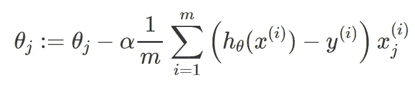
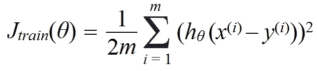
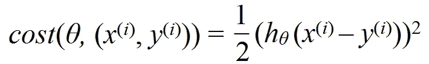
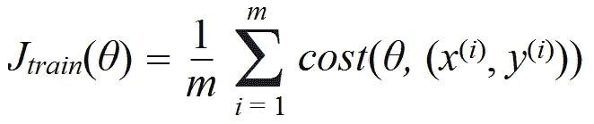
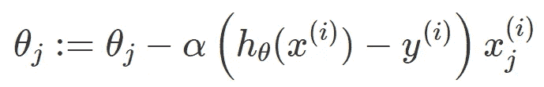
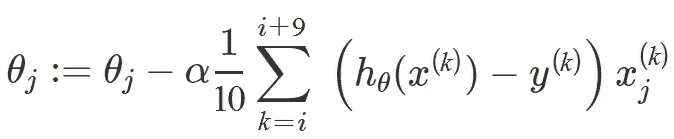
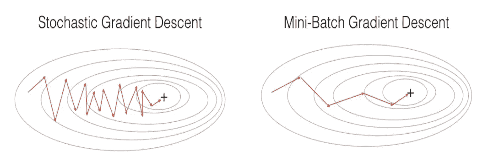
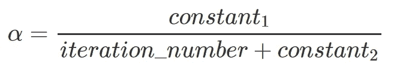

# 处理大型数据集:目前的难题

> 原文：<https://towardsdatascience.com/title-86a91890b5c6?source=collection_archive---------23----------------------->

## 随机梯度下降和数据并行性导论。

随着今天机器学习算法的能力不断增长，不可否认的是，与时间相关的一些东西促成了这一革命性的变化。这是因为随着时间的推移，有更多的数据可供学习算法学习。

这很好。越多越开心。换句话说，拥有大型数据集减少了做出不准确预测的机会，而这些预测可能仅仅基于发现数据中的弱模式。

然而，存储和处理大量数据的想法给这些智能算法的世界带来了挑战。

在今天的文章中，我们将讨论如何做到这一点:

处理大型数据集。

复杂，但可以简单理解。—来源:因陀罗·乌塔马在 [Unsplash](https://unsplash.com?utm_source=medium&utm_medium=referral) 上拍摄的照片

涵盖的主题:

1.  [创意【简介】](#1214)
    [1.1 为什么要大数据集？](#d8d7)
    [1.2 问题](#d702)
2.  [随机梯度下降](#4a78)
    [2.1 代价函数更新](#d431)
    [2.2 算法](#9520)
    [2.3 小批量梯度下降](#bbfd)
    [2.4 收敛](#710c)
    [2.5 在线学习](#e6fa)
3.  [贴图减少](#b227)
    [3.1 定义](#b13c)
    [3.2 工作原理](#a2e6)

# 1.介绍:想法

## 1.1 为什么选择大型数据集？

假设我们拥有的数据是相关的并且质量很好，拥有大量的数据可能是一个好主意。尤其是涉及到高方差问题的时候。

有了更多的数据供算法学习，我们的模型就不太可能仅仅为了在考试中取得好成绩而简单地记住答案。就像学校一样，对于学生来说，通过理解和发现他们学习中的某些模式来真正学习会更有效。这样，他们就能在考试中回答以前从未见过的问题*。*

*打个比方，当算法简单地使用模型*精确地*将训练数据拟合到*看不见的*数据*上时，它将不再被称为“学习”。*这叫 [*过拟合*](https://azumiekyu.blogspot.com/2021/05/when-being-too-perfect-is-dangerous.html) *。**

*在这种情况下，添加更多的数据可能会非常有帮助。*

## *1.2 问题*

**关于数据收集的问题超出了本文的范围。**

*让我们先来看看典型的梯度下降算法如何处理大型数据集——用于最小化成本函数的*:**

**

*也称为“批量梯度下降”。*

*假设训练集大小为 100，000，000。你需要对一亿多项求和来计算它的导数，所有这些都是在梯度下降的一个步骤中完成的。这样做了之后，你需要为下一次迭代重复整个过程，等等——毕竟这是一个“批量”梯度下降。*

*这可能计算量大且耗时。*

*在本文中，我们将通过两个著名的数学解决方案来更有效地计算这些导数，从而更好地处理处理大量数据时出现的问题:*

*随机梯度下降和地图简化。*

# *2.随机梯度下降*

## *2.1 成本函数更新*

*与在单次迭代中查看所有训练示例相反，我们希望每个时期只查看一个训练示例。这样迭代的次数就等于批次的次数。*

*为此，我们将从修改现有的批次梯度下降公式开始。回想一下，成本函数由下式定义:*

**

*复制粘贴:*Jtrain*(*θ*)= 1/*m**m*σ*I*= 1(*hθ*(*x*(*I*)–*y*(*I*))*

*其中 *m* 为训练样本数。为了一次只迭代一个训练示例，我们需要去掉以前允许它在每个时期训练整个训练数据的 *m* 求和:*

**

*复制粘贴:*成本* ( *θ，* ( *x* ( *i* )，*y*(*I*)= 1/2(*hθ*(*x*(*I*)–*y*(*I*)*

*通过简单地将成本定义为误差平方的一半，我们能够测量假设在一个训练示例上的准确性。然后，我们可以将该度量应用于原始的 *J* 列车方程式:*

**

*复制粘贴:*Jtrain*(*θ*)= 1/m*m*σ*I*= 1*成本* ( *θ，* ( *x* ( *i* )， *y* ( *i* ))*

*其计算关于该特定训练示例的假设的平均成本。有了这个更新版本的成本函数，我们现在可以研究随机梯度下降是如何工作的。*

## *2.2 算法*

*在我们开始将成本函数应用到算法中之前，重要的是随机打乱数据集中所有的 *m* 训练示例，以避免陷入局部最优的危险——毕竟 *it* ***是*** *【随机】，意思是“随机”*。*

*之后，我们可以修改批量梯度下降规则，如下所示:*

**

*复制-粘贴:θj:=θjα(hθ(x(I))-y(I))x(I)j*

*其中(*hθ*(*x*(*I*)—*y*(*I*)*x*(*I*)*j*等价于成本函数 *cost* ( *θ，* ( *x* ()*

*随机梯度下降算法通过为每个训练示例 *i* 直接更新 theta *θ* 参数来工作，而不是在进行梯度下降的下一步之前必须等待整个求和完成。*

*整个过程可以总结如下:*

1.  *随机打乱训练示例的顺序*
2.  *重复{
    for *i* = 1，…，*m*{
    *θj*:=*θj*-*α*(*hθ*(*x*(*I*)-*y**

*— *注意:如果训练集的规模足够大，可以找到一个好的假设，那么就没有必要重复重复循环。通常，您会发现对于包含数百万个训练示例的数据集来说，只需经历一次这个过程就足够了。**

*尽管这个过程可能看起来不像原始梯度下降算法那样准确，特别是考虑到它不会*精确地*达到全局最小值的事实，它的参数仍然收敛得足够接近，可以被认为是一个相当好的假设。*

*此外，与批量梯度下降相反，随机梯度下降也有助于加速收敛过程。*

*这解决了前一节中提到的“计算量大且耗时”的问题。因此，通过实现这种算法，我们能够更好地将学习算法扩展到大型数据集。*

## *2.3 小批量梯度下降*

*现在，考虑一下:如果有随机初始化的数据点，允许参数在许多不同的方向上，或远或远，避开可能落在局部最小值上的可能性，那就太好了。更不用说有趣的是，整个数据集需要无数的循环，保护自己不被再次感染，停留在局部收缩的最小值上。*

*但是，值得等待吗？*

*这就是小批量梯度下降的用武之地。*

*顾名思义，这种类型的梯度下降在每次梯度更新时只考虑几个训练样本(来自整个批次)，作为批次和随机梯度下降之间的权衡。*

*加入一些小符号，我们将有 *b* 作为这个小批量梯度下降求和的训练样本的数量。因此，我们可以将原始梯度下降公式修改如下:*

**

*复制粘贴:θj:=θjα1/b I+(b-1)∑k = I(hθ(x(k))—y(k))x(k)j*

*为了更好地理解算法，下面是我们如何应用这个表达式:*

*比如说 *b* = 10，m = 1000 的训练例子。*

*对于 *i* = 1，11，21，31，41，…，991 {,重复{* 

**

*复制粘贴:θj:=θjα1/10 I+9∑k = I(hθ(x(k))—y(k))x(k)j*

*(对于每一个 *j* = 0，…， *n* )
}
}*

*这样，我们可以通过在每个步骤中查看 10 个例子来开始更新我们的参数，而不是一次只查看 1 个或所有例子。*

*如果我们把它画出来，你可以看到，与随机梯度下降相比，我们最终会有更少的振荡。*

**

*来源:[https://www . I2 tutorials . com/explain-brief-about-mini-batch-gradient-descent/](https://www.i2tutorials.com/explain-brief-about-mini-batch-gradient-descent/)*

*此外，它允许在计算梯度项时使用矢量化实现，否则使用随机梯度下降算法将无法有效地实现这一点。换句话说，这有助于在数量为 *b* 的示例上并行化梯度计算。*

*简而言之，我们会满足于小批量梯度下降，因为它比随机和批量梯度下降收敛得快得多。*

## *2.4 趋同性:学习率(α)*

*说到快速收敛，难道没有其他的数学公式来帮助实现这一点吗，比如说，随机梯度下降？随着时间的推移，数学公式也在发展。当然，我们有。*

*首先，我们先从衔接的思路说起。*

*通过绘制迭代次数的成本函数，我们可以看到我们的算法是否确实收敛。简单。*

*然而，这如何应用于在每个*随机初始化的*数据点之后更新其参数的算法？*

*假设*m*= 300000000。在这种情况下，我们将只绘制平均成本，比如说，每 1000 次迭代中的最后 1000 个示例— *这不要与前一千个***训练示例混淆。***

**这使我们能够获得我们算法的整体性能的近似值，从它是否真的收敛良好来看，特别是在最后 1000 个训练样本上。**

**接下来，收敛的速度。**

**如果你回头看看当前的随机梯度下降公式，你会发现术语 *α* 用于“调整”我们算法的学习速率，或其所谓的“步骤”。通过研究这个术语，我们通常可以改变参数收敛的快慢。**

**为了更好地优化这一过程，我们尝试了 *α* 的小值和大值，有一种方法可以逐渐改变它的值，使它最终收敛到全局最小值。**

**与像大多数梯度下降算法实现那样保持学习速率 *α* 不变相反，在每次迭代之后逐渐减小 *α* 可能实际上更好。这可以通过以下方式实现:**

****

**复制-粘贴:α =常数 1 /(迭代次数+常数 2)**

**虽然主要是快速的，但缓慢但肯定的是，该算法很高兴地为达到全局最优铺平了道路。**

## **2.5 在线学习[设置]**

**回到处理大规模项目的想法，实现梯度下降算法还有一个方面，特别有利于在线相关系统。**

**问题是，随着越来越多的用户进来说，你的网站，大量的训练数据不断产生，没有必要实际存储所有这些数据供算法学习。**

**如果你实现了一个在线学习系统。**

**这是如何工作的？**

**像任何其他普及的系统一样，我们将从一个我们已经知道的算法开始:随机梯度下降。**

**该算法只需从每个用户的一个训练示例中学习，而不是扫描固定的训练集，即集中存储的数据集(如前几节所述)。**

**因此，如果我们修改算法的原始实现，**

1.  ****(不需要随机洗牌训练例子)****
2.  **重复**永远** {
    **Get ( *x* ， *y* )每个用户
    更新θ*使用( *x* ，*y*)****{
    θ*j*:=θ*j*-*α*(*h*θ(***

****—变化在* ***加粗*** *。删除了固定数据集(x(i)，y(i))的符号。****

**可以看到，在线学习系统仅基于一个训练示例 *x* 来更新其参数，去除它，并继续前进。**

**因此，由于其从最新数据集学习的能力，它能够适应用户偏好的新变化。**

***最后，处理大型数据集的第二项技术:***

# **3.地图缩小**

## **3.1 定义**

**简单地说，这种方法实现了将给定的数据集分成不同的子集，并让多台机器同时处理每一个子集的思想。然后，结果被送到一个集中的*主*服务器，并结合起来形成总成本。**

**换句话说，我们称之为对训练集进行了“并行化”。**

## **3.2 其工作原理**

**每台机器将只计算数据集的一定数量的训练样本。**

**因此，我们首先需要将数据集 *m* 分成不同的子集 *n* 。比如将训练集分成对应于要使用的系统数量的多个组。**

**例如，如果 *m* = 100，000，000，将数据集分成 5 个子集将允许每台计算机对超过 20，000，000 个训练示例进行求和( *n* ) — *，而不是在每次迭代中对超过 1 亿个示例进行求和。***

**接下来，给定批量梯度下降公式，**

****

**我们可以创建计算成本的临时变量，*n*σ*I*= 1(*hθ*(*x-y*)*x—注意，我们不再对 m 个* *示例求和，而是对* ***n* 示例求和有了这些临时变量，每个计算机系统可以同时计算数据集的一部分。****

**最后，所有这些*从*变量将由它们的*主*编译，添加回原始公式。因此，允许算法计算整体偏导数并更新其θ参数。**

**通过这种方式，我们不仅可以将它们扩展到大型数据集，还可以将算法的速度提高到 n 倍(给定 n 个系统)。但是，这不适用于网络延迟过高的情况。相反，使用多个处理核心在单个计算机上执行并行性实际上可以抵消这个问题，因为与前一种实现方式相比，所有通信工作都是在单个机器上完成的。**

**这一切都由所谓的 ***数据并行*** *实现。***

**正如吴恩达在 Coursera[Coursera](https://www.coursera.org/learn/machine-learning)上的机器学习课程中所解释的，这是关于处理大型数据集的，同时使用了随机梯度下降和 Map Reduce。**

***再见。***