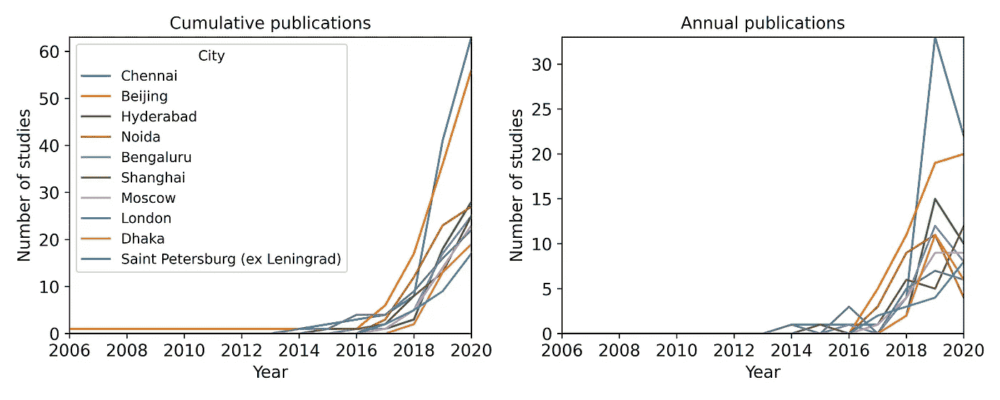

# 使用 Python 处理日常任务

> 原文：<https://towardsdatascience.com/title-using-python-for-everyday-tasks-an-example-of-retrieving-metadata-from-scopus-database-4339610a86f2?source=collection_archive---------30----------------------->

## **从 Scopus 数据库检索元数据的示例**

应用一般的编程和分析可以帮助我们解决日常生活中的许多问题，但这仍然是一项被低估的技能。


摄影:[迈克尔·康斯坦丁 P](https://unsplash.com/@mmgphotograph) 在 [Unsplash](https://unsplash.com/photos/KPUmjXOwIzs)

出于我们都熟悉的几个原因，编程语言知识已经成为许多数据科学相关任务的基本要求。然而，我发现许多人仍然认为编码/编程/数据分析是一个神秘的领域，最好留给专家去解决。虽然我们需要专家来开发复杂的人工智能算法，但同样重要的是，我们必须专注于应用发现的知识来解决个人或社会问题。

回顾现有的研究是任何研究工作的基本步骤。年前开始读博的时候，我一点编程知识都没有。于是，我不仅在网上搜索了使用相关关键词的重要研究文章，还手动下载或解析了数据文件(pdf/excel)。这个过程既乏味又耗时，我希望我当时就知道 Python。我花了几个月的时间来搜索所有的文章并获取数据，这是一个编程脚本现在可以在几分钟内完成的任务。

这篇博客展示了如何使用常见的 Python 技巧从 Scopus 收集研究文章的元数据，Scopus 是研究学者中最受欢迎的数据库之一，用于搜索某个专业的已发表研究[1]。研究人员经常使用这些信息来进行文献计量，以报告其利基领域的研究状态。

# 问题是

假设我们想要搜索所有使用 Python 进行数据分析或机器学习的研究文章，并且这些文章是在过去 30 年中发表的。例如，我们想知道学习 Python 进行机器学习是否值得，以及哪些国家/地区在领导这项研究。

# 存储数据

有几种方法可以存储收集到的信息。在只有少量迭代和小数据集的情况下，将所有信息保存在内存中直到循环完成。然而，在脚本运行时将所有数据保存在 Jupyter notebook 的内存中有一个很大的缺点。每当脚本遇到任何错误，您可能会丢失进度，并将不得不重新开始工作。因此，我建议将每次迭代后的细节保存到 SQL 数据库中，以确保在出现任何错误的情况下不会重复工作(我使用了 sqlite3 包)。

# 个案研究

根据 Scopus 网站[2]，我为 request 制定了如下所述的适当查询(请注意，您需要注册才能获得 API)。该脚本只显示了重要的步骤，而不是整个代码。

```
base_url = '[http://api.elsevier.com/content/search/scopus?'](http://api.elsevier.com/content/search/scopus?')# search in title, abstract, and key
scope    = 'TITLE-ABS-KEY'# formulating the query structure
terms1   = '({python})'
terms2   = '({machine learning} OR {big data} OR {artificial intelligence})'
terms    = '({} AND {})'.format(terms1, terms2)# insert your personal key (it is free and available on [https://dev.elsevier.com/)](https://dev.elsevier.com/)apiKey   = '&apiKey=INSERT YOUR KEY' 
date     = '&date=1990-2020'# it is the maximum number of results per query for a free account
count    = '&count=25' 
sort     = '&sort=citedby-count'
view     = '&view=standard'
```

搜索参数包括所有主题代码，以检查所有可能在我们感兴趣的主题上发表了一些文章的字段。代码遍历所有主题区域，并相应地定制查询。对于每个查询，免费版每页只显示 25 个结果，这意味着如果一个查询返回超过 25 个搜索结果。因此，我在主循环中使用了另一个循环来逐步收集同一主题的后续页面的结果。该练习返回了 2524 个已发表的研究(包括研究文章、会议记录等)。)，其中 25%是开放存取文章。在实践中，这些论文中的许多可能不包含与我们相关的信息，因此，需要人工干预来进一步过滤掉不相关的信息。虽然这是标准的研究过程，我们可以考虑目前任务的所有初步调查结果。下面的代码块是遍历所有主题的主循环:

```
# this function sends a request and returns the total articles, the #starting position of the first article, and the metadata of each #article.def search_scopus(url):

    res = requests.get(url)
    if res.status_code ==200:
        content  = json.loads(res.content)['search-results']
        total    = content['opensearch:totalResults']
        start    = content['opensearch:startIndex']
        metadata = content['entry']
        return int(total), int(start), metadata

    else:
        error = json.loads(res.content)['service-error']['status']          
        print(res.status_code, error['statusText'])# list of all subjects in Scopus database
subjects = ['AGRI', 'ARTS', 'BIOC', 'BUSI', 'CENG', 'CHEM', 'COMP', 'DECI', 'DENT', 'EART', 'ECON', 'ENER', 'ENGI', 'ENVI', 'HEAL', 'IMMU', 'MATE', 'MATH', 'MEDI', 'NEUR', 'NURS', 'PHAR', 'PHYS', 'PSYC', 'SOCI', 'VETE', 'MULT']for sub in subjects: while True:   

    # starting index of the results for display
    # starting index refers to number position of not pages
    start_index  = 0

    start    = '&start={}'.format(start_index) 
    subj     = '&subj={}'.format(sub)
    query    = 'query=' + scope + terms + date + start + count +  
               sort + subj + apiKey + view url  = base_url + query # total results per subject, starting index of first result in 
    #each query and data
    total, start_index, metadata = search_scopus(url) # save metadata now in SQL (not shown here) # check how many results need to be retrieved
    remain = total - start_index - len(metadata) if remain>0:
        start_index+=25 # to search next 25 results
    else:
        break # breaking from while loop
```

**免责声明:**在展示结果之前，我想明确指出，这只是一个“自己动手”的学习博客，而不是一篇同行评审的研究文章。因此，调查结果应被解释为指示性的，而非权威性的。

图 1 显示了自 20 世纪 90 年代以来每年发表的研究总数，显示了自 2012 年以来的指数增长趋势，这并不奇怪。因为我们限制了将“python”作为强制词的研究，所以研究工作的数量很少，尽管该领域在过去十年中受到了极大的关注。第二个子图显示了同一时期所有研究的总引用次数和质量(每项研究的引用次数)。虽然研究数量有所增加，但总引用量和出版物质量并没有明显的趋势。低质量的原因之一可能是研究的新近性。随着未来更多研究的进行，最近的论文将会被更多的引用。


图 Scopus 数据库中的年度学术出版物和引文。注意:图表仅显示了与使用 Python 的数据科学相关的文章的摘要、标题或关键词，还应该提到的是，结果对选择的数据库很敏感，因为不是所有的研究都由不同的研究目录统一表示[1]。

各国的记录如图 2 所示。正如预期的那样，美国在累积研究产出方面领先，印度似乎超过了所有人，在年度出版物中占据了首位。中国不是最大的生产国，这是违反直觉的，也许是因为许多中国出版物被列入 Scopus 数据库。


根据 Scopus 数据库，基于第一作者隶属关系的学术出版物。注:仅显示排名前十的国家；该图仅显示了在摘要、标题或关键词中使用 Python 的与数据科学相关的文章；免费帐户只返回第一作者的名字，所以我假设 Scopus 显示第一作者的从属关系。

尽管印度和中国在论文数量上明显领先于世界研究中心，但在研究质量上却没有明显的这种模式。图 3 显示了前十个国家在总出版物方面的研究质量。前十篇高被引论文被视为异常值，被排除在外。


根据 Scopus 数据库，基于第一作者隶属关系的学术出版物。注意:该图仅显示了在摘要、标题或关键词中使用 Python 的与数据科学相关的文章；免费帐户只返回第一作者的名字，所以我假设 Scopus 显示第一作者的从属关系。

图 4 描述了研究生产率的城市级图形分布。印度和中国的城市占据了报纸的相当大一部分，钦奈是第一大城市，其次是北京。



根据 Scopus 数据库，基于第一作者隶属关系的学术出版物。注:只显示前十名城市；该图仅显示了在摘要、标题或关键词中使用 Python 的与数据科学相关的文章；免费帐户只返回第一作者的名字，所以我假设 Scopus 显示第一作者的从属关系。

图 5 是一个有趣的图表，显示了该领域中发表的前十篇最受欢迎的论文。许多声誉很高的论文介绍了 Python 包或机器学习算法。Scikit-learn 论文是迄今为止发表的最受欢迎的论文，其次是提出卷积学习的论文。


Scopus 中被引用最多的十种出版物。注意:该图仅显示了在摘要、标题或关键词中使用 Python 的与数据科学相关的文章。Scopus 引文基本上不同于你在谷歌学术[1]上看到的。

出版物的主题分布非常不均衡。可以理解的是，计算机科学领域占了研究的绝大部分(> 75%)，其次是工程和生物化学领域(见图 6)。此外，大多数文章仍然是付费的，只有 30%的文章属于开放获取类，不需要读者订阅或支付信息(见图 7)。


根据 Scopus 数据库，基于第一作者的隶属关系，按主题对出版物进行分类。注意:仅显示排名前五的主题，以及在摘要、标题或关键词中使用 Python 的与数据科学相关的文章。


图 7 每个 Scopus 数据库的开放存取文章数量。注意:在摘要、标题或关键词中只显示与使用 Python 的数据科学相关的文章。

# 结论

近年来，Python 及其在机器学习中的应用在全球范围内呈指数级增长，没有一个国家在该领域占据主导地位。美国附属研究人员的贡献最大，但印度和中国正在迅速赶上，如果不是在质量上，至少在数量上。

这篇博客文章还表明，编码的基本知识可能足以解决我们日常大学或工作生活中的许多问题。虽然大部分数据科学讨论继续关注管理和“拟合”大规模数据集的复杂而有吸引力的领域，但编程和机器学习知识的应用不一定仅限于解决复杂的问题。我们还必须不断探索如何部署这些简单、直接的编程技能来解决我们日常生活中遇到的“微观”问题。

我相信，对于在这个领域工作的大多数人来说，数据科学和编程知识的优势不在于知道所有的事情，而在于应用你所知道的一切来解决你所热衷的领域的问题。“足够好”的知识可能没有直接的商业价值，但定期应用这些基本技能最终会让你长期受益，也会给你带来巨大的个人满足感。

**参考文献**

[1] A. Martín-Martín、E. Orduna-Malea、M. Thelwall 和 E. Delgado López-Cózar，“谷歌学术、科学网和 Scopus:252 个学科类别中引文的系统比较”， *J. Informetr。*，第 12 卷第 4 期，第 1160–1177 页，2018 年。

[2]爱思唯尔，“Scopus 搜索 API”，2020 年。【在线】。可用:[https://dev . Elsevier . com/documentation/scopussearch API . wadl .](https://dev.elsevier.com/documentation/ScopusSearchAPI.wadl.)【访问时间:2021 年 1 月 28 日】。