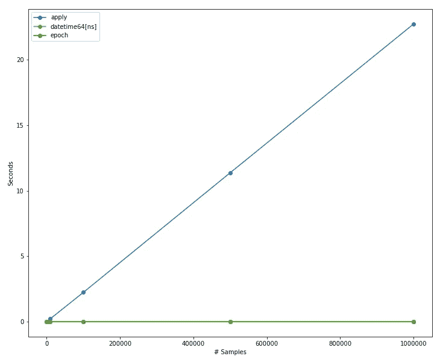
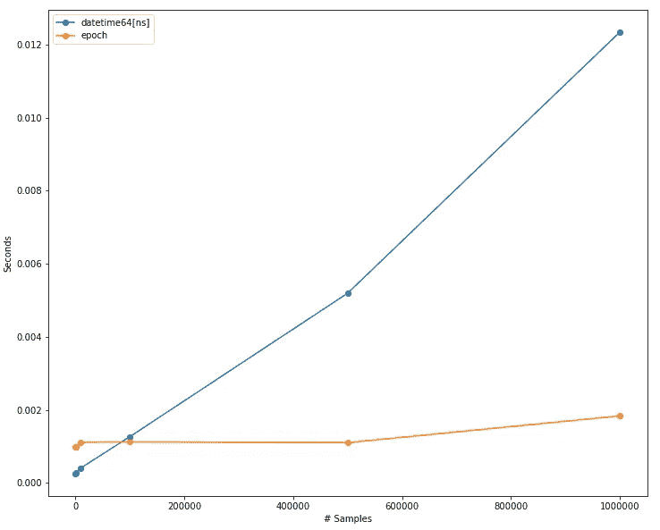

# 敬。适用或不适用。应用

> 原文：<https://towardsdatascience.com/to-apply-or-not-to-apply-8525dccf8767?source=collection_archive---------16----------------------->

## 在这篇文章中，我们将向你展示如何将你的熊猫代码的日期相关计算速度提高 10，000 倍以上！

*这篇文章是与* [*山姆·穆拉德*](https://medium.com/u/229e8aa5bbbe?source=post_page-----8525dccf8767--------------------------------) 合作的

> *熊猫烂透了*
> 
> *如果没有正确使用*
> 
> 这是一百万美元
> 
> *比宾利还值钱*

# 介绍

我们不是在谈论[这些](https://nationalzoo.si.edu/animals/news/pandastory-bubble-bath-wrestling-match)熊猫(可爱),而是 [python 库](https://pandas.pydata.org/)我们所有的数据科学家每天都在使用它来做任何与数据相关的事情。

来自不同背景的新用户对熊猫很熟悉。

如果你是一个 Excel 用户，在 pandas 中可以通过调用`DataFrame.sum`或`DataFrame.cumsum`方法来完成[操作，比如](/intro-to-pandas-for-excel-super-users-dac1b38f12b0)计算一个数组中所有列的总和或累计总和。

```
import pandas as pd
df = pd.DataFrame({"a": [1,2,3], "b": [4,5,6]})
print(df.sum())
print(df.cumsum())
```

如果你是 SQL 用户，像 select 或 join 语句这样的[操作可以通过调用`DataFrame.query`或`DataFrame.merge`方法来完成。](https://pandas.pydata.org/docs/getting_started/comparison/comparison_with_sql.html)

```
import pandas as pd
df = pd.DataFrame({"a": [1,2,3], "b": [4,5,6]})
bf = pd.DataFrame({"a": [6,5,4], "b": [3,2,1]})
print(df.query("a == 1"))
print(df.merge(bf, how="inner", left_on='a', right_on='b'))
```

如果您是 R、Stata、SAS、SPSS 或其他统计语言的用户，可以通过调用`DataFrame.corr`、`DataFrame.std`或`DataFrame.ewm`方法来完成寻找相关性、标准差甚至指数加权函数等操作。

```
import pandas as pd
df = pd.DataFrame({"a": [1,2,3], "b": [4,5,6]})
print(df.ewm(com=0.8))
```

最后但同样重要的是，矩阵乘法可以通过使用`[DataFrame.dot](<http://DataFrame.dot>)`方法来完成。

```
import pandas as pd
df = pd.DataFrame({"a": [1,2], "b": [3,4]})
bf = pd.DataFrame({"a": [5,6], "b": [7,8]})
print(df.dot(bf.T))
```

或者真的任何一个 [NumPy 的通用函数](https://numpy.org/doc/stable/reference/ufuncs.html)又名 *ufunc* 都可以被熊猫用来尽可能多地*利用矢量化运算*。

尽管你运气很好，什么事都想用熊猫。

# 例如日期-时间操作

一个常见的操作是计算两个日期之间的间隔，比如说以年为单位。首先，让我们创建一个简单的函数和一些全局变量:

```
import pandas as pd
from datetime import date, timedeltadef calc_age_function(start_date: date, end_date: date):
		"""Calculate difference between 2 dates in years."""
		return (end_date - start_date)/timedelta(days=365.25)
```

现在，让我们定义一些示例日期，并计算它们之间的年龄:

```
[In]:
start = date(
    year=1930,
    day=10,
    month=5
)
end = date(
    year=2020,
    day=10,
    month=8
)
print(calc_age_function(start, end))[Out]: 90.2532511978097
```

然而在实践中，很可能你有不止一个日期需要做这个操作。让我们用上面列出的例子数量创建一个系列，用于计时，以及一个`DataFrame`:

```
from datetime import datetime, timedelta
from random import randint, seedimport pandas as pdseed(42)
N_SAMPLES = 1_000_000
start_date_list = [
	datetime.fromisoformat("2019-01-01") + timedelta(days=randint(0,365))
	for _ in range(N_SAMPLES )
]
end_date_list = [
	datetime.fromisoformat("2020-01-01") + timedelta(days=randint(0,365))
	for _ in range(N_SAMPLES )
]
start_dates = pd.Series(start_date_list, name="start", dtype="datetime64[ns]")
end_dates = pd.Series(end_date_list, name="end", dtype="datetime64[ns]")age_df = pd.DataFrame(
  {
    "start_date":start_dates,
    "end_date": end_dates
	}
)
```

现在，让我们使用 lambda 函数(非最佳)对数据帧中的列使用我们的函数来计算年龄

```
%%timeit
# slow, for loop apply
age_df["age"] = age_df.apply(
	lambda x: calc_age_function(x["start_date"], x["end_date"]),
	axis=1,
)20.6 s ± 63.7 ms per loop (mean ± std. dev. of 7 runs, 1 loop each)
```

作为一个 python 新手，*应用*可能是一件容易上手的事情。你需要记住的只是一个 *apply* 方法以及如何编写一个 python 函数。

这是可行的，尽管对我们来说还不够快。

有了 pandas，我们可以在序列对象上使用算术运算，这比循环要快得多(通常 apply 会这样做，例外情况我们稍后会谈到)。

如果我们通过我们的函数来传递这个序列呢？

```
%%timeit
# with date series, vectorized
ages = calc_age_function(start_dates, end_dates)10.3 ms ± 104 µs per loop (mean ± std. dev. of 7 runs, 100 loops each)
```

直接在序列上运行计算使这个操作**快了 2000 倍**！

但是我们能让它更快吗？

在上面的代码片段中，我们使用 pandas 日期-时间操作来获取两个日期之间的天数，并将其除以一个代表一年中天数的`timedelta`对象。

如果我们尝试使用整数运算进行相同的计算，将开始和结束日期表示为 [epoch](https://en.wikipedia.org/wiki/Epoch_(computing)) 整数，而不是 DateTime 对象，会怎么样？

```
%%timeit
SECONDS_TO_YEARS = 60*60*24*365.25*1_000_000_000
(end_dates.astype(int) - start_dates.astype(int))/SECONDS_TO_YEARS2.22 ms ± 32.6 µs per loop (mean ± std. dev. of 7 runs, 100 loops each)
```

这是否使我们的计算速度比 apply 快了 10，000 倍？

没错。

# 压力测试

使用样本大小:100，1000，10000，100000，500000，1000000



作者图片

令人惊讶的是 apply 方法的性能相对于数据大小的线性程度，在上图中显示为 O(n)。此外，它比 datetime64[ns]和 epoch 矢量化计算的规模大得多。我们无法真正比较所有三种计算的性能。让我们在这里放大到 datetime64[ns]和 epoch(矢量化)计算:



作者图片

使用历元的好处确实在 100k 左右的样本中显现，因为 datetime64[ns]性能是 O(log n ),而历元计算几乎是*O(1)。*

# 关于用日期时间数据类型进行序列实例化的说明

```
%%timeit
# format series WITHOUT numpy dates
start_dates = pd.Series([start]*N_SAMPLES, name="start")
end_dates = pd.Series([end]*N_SAMPLES, name="end")1.59 s ± 6.91 ms per loop (mean ± std. dev. of 7 runs, 1 loop each)
```

通过指定 Numpy datetime64:

```
%%timeit
# format series WITH numpy datetime
start_dates = pd.Series([start]*N_SAMPLES, name="start", dtype="datetime64[ns]")
end_dates = pd.Series([end]*N_SAMPLES, name="end", dtype="datetime64[ns]")1.73 s ± 4.04 ms per loop (mean ± std. dev. of 7 runs, 1 loop each)
```

相差 140 ms，但是如果您要对这些色谱柱进行多次操作，这些成本是非常值得的。

如果你愿意，也可以使用熊猫内置的`to_datetime`功能，性能差不多:

```
%%timeit
# format series WITH pandas datetime
start_dates = pd.to_datetime(pd.Series([start]*N_SAMPLES, name="start"))
end_dates = pd.to_datetime(pd.Series([end]*N_SAMPLES, name="end"))1.76 s ± 4.57 ms per loop (mean ± std. dev. of 7 runs, 1 loop each)
```

# 结论

1.  在 pandas 系列(或数据帧)上运行算术运算利用了 pandas 中可用的矢量化功能，并且比按行应用相同的运算要快得多
2.  使用 pandas 本地 dtypes(在本例中是 datetime64[ns])可以使您的操作速度大大加快
3.  对纪元日期时间的算术运算比 DateTime 对象开销小
4.  对于 1，000，000 个数据点的情况也是如此。增益并不与数据点的数量成线性比例，所以不要期望它们会这样。Travis Oliphant 在与 Lex Friedman 的播客中指出，pandas 矢量化操作的性能增益始于 10，000 点
5.  熊猫的收获并不局限于它的表现。数据管道的易用性是使用 pandas 的一个巨大优势。如果性能对于您的生产过程不是非常重要，那么使用任何容量的 pandas 都可以为您节省数天或数周的数据管道开发、分析或操作时间

# 下一步是什么

敬请期待我们下一篇熊猫的博文。我们将更深入地研究 NumPy 的 *ufunc* ，并分析 Andrej Karpathy 的[关于 NumPy 的 *sqrt* 函数的臭名昭著的 tweet](https://twitter.com/karpathy/status/1430316576016793600?ref_src=twsrc%5Etfw%7Ctwcamp%5Etweetembed&ref_url=https%3A%2F%2Fwww.notion.so%2Fprestonventures%2FProjects-54ba0256df63447cbc9f7de5821da879%3Fp%3D0fc8f1ed6b1b41d0ad22ae229529ad3a) ！