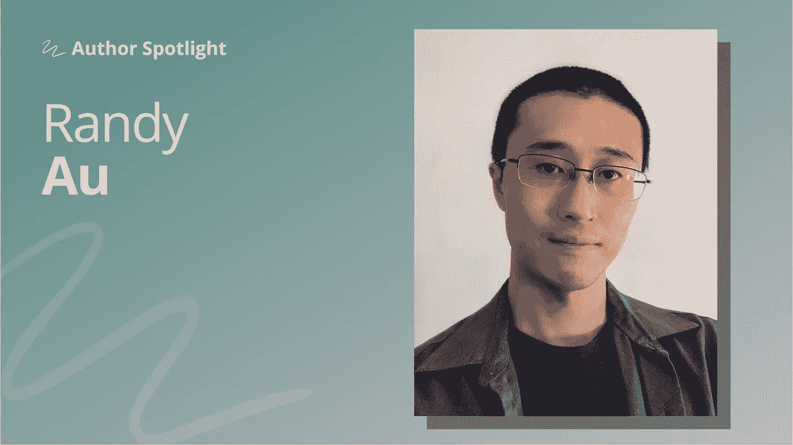

# 要做伟大的数据科学，拥抱领域知识

> 原文：<https://towardsdatascience.com/to-do-great-data-science-embrace-domain-knowledge-167cb83dc050?source=collection_archive---------19----------------------->

## [作者聚焦](https://towardsdatascience.com/tagged/author-spotlights)

## 即使细节混乱、不确定、难以自动化，也不会浪费精力

*在 Author Spotlight 系列中，TDS 编辑与我们社区的成员谈论他们在数据科学领域的职业道路、他们的写作以及他们的灵感来源。今天，我们很荣幸地邀请到埃利奥特·冈恩***与兰迪·奥**进行对话。****

**

*照片由 Randy Au 提供*

*Randy Au 目前是谷歌的一名定量用户体验研究员，使用数据科学和传统的研究方法来更好地了解用户，并帮助创造更好的产品。在此之前，他花了十多年的时间为纽约地区的各种科技初创公司做数据工作。他每周写一份时事通讯，统计数据，强调数据科学平凡但仍然重要的方面。他目前的兴趣包括用各种 SQL 方言做令人不舒服的事情，以及追求许多奇怪的爱好，例如:烹饪、摄影和宝石切割。*

## ***你在数据科学领域有一个独特的职位/工作范围，还有一个非常有趣的教育背景(本科阶段是大陆哲学！).你是如何成为谷歌高级定量 UX 研究员的？***

*是的，我有一个古怪的背景，主要是因为做了当时看起来有趣的事情。正式来说，我本科学习的是工商管理和哲学，主要是因为我最终出于兴趣选修了这两个专业的大部分课程。教授们都很好，我在两个系都做了大量的本科研究工作。后来，我修读了传播学硕士课程，在那里我学到了社会科学、科学哲学和研究方法。在得知学术出版生活不适合我之后，我去了一家精品室内设计咨询公司，帮助他们做调查分析和 Excel/Powerpoint 自动化。我最终在工作中学会了 SQL，在作为一名数据分析师完全进入技术领域之前，我在一个广告-技术职位的生产实践中学习。*

*在我职业生涯的大部分时间里，我只是纽约小型科技初创公司的一名“数据分析师”。“数据科学”作为一个术语在那个时期才开始成为一种事物。这些都是小组织，总是<150 people, often <100\. Most of the time I was the only data person on the team, tasked with making everyone else smarter and more effective with data. That meant I got to work with literally everyone in the company, top to bottom. It was a hyper-broad experience and I got exposed to lots of viewpoints, problems, and people.*

*Quant UX research is a pretty obscure job title in industry, with only a few companies officially having the role. I had been looking for work and a friend within Google was helping me search through positions, the usual data science/analyst stuff, and happened to find this for me. It fit all the product work I had been doing for years so perfectly, I applied, and, to my surprise, got hired. If you have a data science and research skill set, but find yourself always drawn to learning about users, QuantUXR might be for you.*

## ***什么是你最喜欢的项目，或者你特别自豪的项目？***

*可能我接手的最重要的项目甚至没有被正式称为工作“项目”——它是与以前从未有过定量研究支持的团队和人员一起工作，并与他们一起工作，直到他们真正理解使用数据来构建。与他们合作，了解什么样的问题最好用数据来回答，如何形成可以测试的假设，学习理解所有的成本和收益，检测产品和设置指标、报告和监控的来龙去脉。有一些过程需要到位和发展，新的习惯需要形成。它总是非常复杂，每次都不一样。每做一次，我就多学一点。*

*这种工作需要惊人的长时间，几个月，有时几年，但最终结果是值得骄傲的。一个团队将从不知道如何处理给他们的数据，转变为产生假设，找出测量和测试事物的方法，并积极寻找研究和数据来帮助他们做出最佳决策。他们不会是这方面的专家，有时会需要指导，但他们会明白何时需要专家的帮助。这些人有一天会转移到其他团队和组织，并与他们分享经验。仅此一点就让我为这项工作感到骄傲。*

## ***你已经写了许多帖子，为新进者和更有经验的分析师提供建议，从** [**展示作为支持数据科学家的价值**](https://counting.substack.com/p/showing-value-as-a-support-data-scientist) **，到** [**提升自己**](https://counting.substack.com/p/scaling-yourself) **，以及** [**作为一名新的独立数据科学家**](https://counting.substack.com/p/staying-afloat-as-a-new-ish-solo) **。对希望追随你脚步的读者有什么建议吗？***

*拥抱领域知识！*

*它很混乱，令人困惑，而且通常很难(或者完全不可能)自动化，所以没有人喜欢学习它。这意味着向背景完全不同、说着不同语言的专家学习。但是，许多好的数据科学都依赖于这些知识，从知道收集什么数据和如何收集数据，到知道提出什么问题，到最终以最佳方式传达您的结果。在关于数据科学的讨论中，领域知识往往没有得到足够的重视，因为复杂的细节意味着答案总是“视情况而定”，但这永远不会白费力气。*

## *除了你的工作和个人责任之外，你是如何做到写得如此一致的？你是怎么找到文章灵感的？*

*我坚持每周写一次，因为我非常了解自己，知道如果我允许自己“就这一次”滑倒和变懒，我会很快被我正在做的所有其他事情分心并变懒。我对自己发誓，我会每周拿出一个，我会尽我所能不让自己失望。有鼓点至少让我保持诚实，并且有一种令人欣慰的节奏，知道当周五到来时，我需要开始起草一些东西，以便在周一晚上出门。*

*如果你打算稳定地写作，想出点子总是一个挑战。幸运的是，生活充满了灵感。我从我一直在做的工作、我周围发生的事情、我一天中看到的关于数据的推文和模因、读者的问题中汲取灵感。如果这是我正在努力解决的事情，或者我看到其他人也在努力解决的事情，这是一个好的开始去寻找一些可以写的东西。这项工作是在采取种子，可以很小，并分析它一点，直到你可以拉一篇文章出来。*

*保留一个笔记本或者一个打开的文件会有所帮助，当你遇到一些想法的时候，可以把它们扔进去。这样你就有了一大堆材料可以开始，而不仅仅是一张白纸。*

## *您希望更多地看到 DS/ML 中的哪种写作？*

*如今，针对该领域新进入者的内容层出不穷。你不可能一天都找不到另一篇“如何成为一个 DS”的文章发表在某个地方。它吸引了眼球和指标，因为该领域目前非常热门，但作为一个实践社区，我们需要为我们从业者提供更多内容。我们需要更多的人来制作内容，让有经验的人能够继续学习、分享和成长。*

*这意味着分享经验、技术、成功和失败，以及构成数据科学的所有工具和经验。我们可以使用更多的帖子，将最新的学术成果翻译成通俗易懂的语言，介绍不太常见的技术，或者揭示极其常见的技术中的怪癖和陷阱。它也不必是最前沿的“我创建了一个新的 ML 框架并解决了世界和平”类型的内容。即使你写的是 150 年前发明的你最信赖、最喜欢的方法，也有很多人不熟悉它，他们可以从你的实践知识中受益。我相信有很大的空间让人们来写他们的经历，并加入数据科学作家的社区。*

## ***你对未来几个月/几年的 DS 社区有什么希望？***

*随着世界非常缓慢地从新冠肺炎封锁中解冻，一些国家的速度更快，不幸的是，另一些国家的速度更慢，我希望数据社区继续像以前一样令人敬畏。我们很快就能在会议和活动中再次见面。最重要的是，我希望我们已经了解了一两件关于运行令人敬畏的在线数据事件的事情，并希望其中一些能够保留下来，因为它们很有趣，很棒，并且可以非常包容。*

*想了解更多关于 Randy 的工作和数据科学兴趣的信息吗？你会在[的媒体简介](https://randy-au.medium.com/)上，在他的子堆栈[统计数据](https://counting.substack.com/)上，以及在[他的推特账户](https://twitter.com/Randy_Au)上找到他的文章。以下是我们最近最喜欢的一些。*

*   *[数据清理是分析，而不是繁重的工作](/data-cleaning-is-analysis-not-grunt-work-edb386f9429d) ( *TDS* ，2021 年 4 月):Randy 探讨了“清理”是如何对数据进行价值、判断和解释的一种分析形式，并且不应该被认为是真正的数据科学工作的一部分。*
*   *[日期、时间、日历——数据科学创伤的普遍来源](/dates-times-calendars-the-universal-source-of-data-science-trauma-92a887fdedd1) ( *TDS、**2019 年 9 月):深入全面地潜入数据科学家的一大痛点。**
*   **[做自己:你在公共场合看到的数据科学家不具有代表性](/be-yourself-the-data-scientists-you-see-in-public-are-not-representative-9de29f3316bf) ( *TDS，*2019 年 12 月):兰迪提醒我们，如果你从事数据工作，你的工作就在数据科学的范围之内。不要被看门人吓倒。**

**请继续关注我们即将推出的下一位专题作者。如果你对你想在这个空间看到的人有建议，请在评论中给我们留言！**