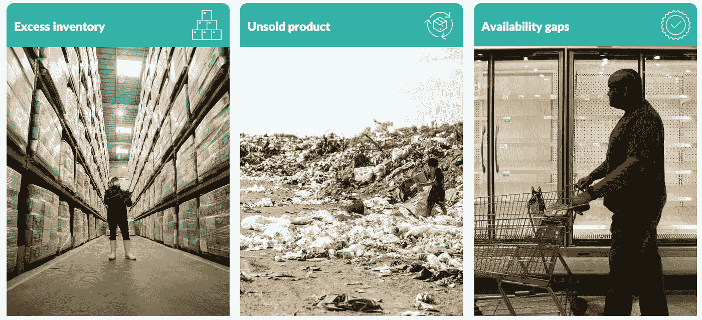
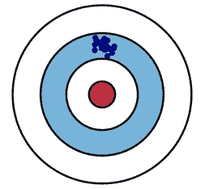
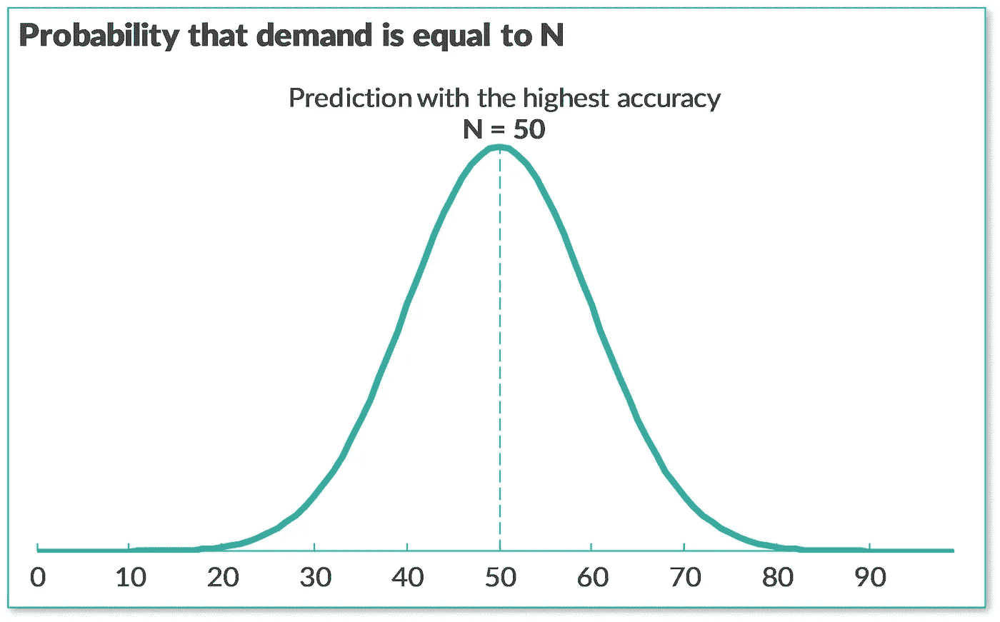
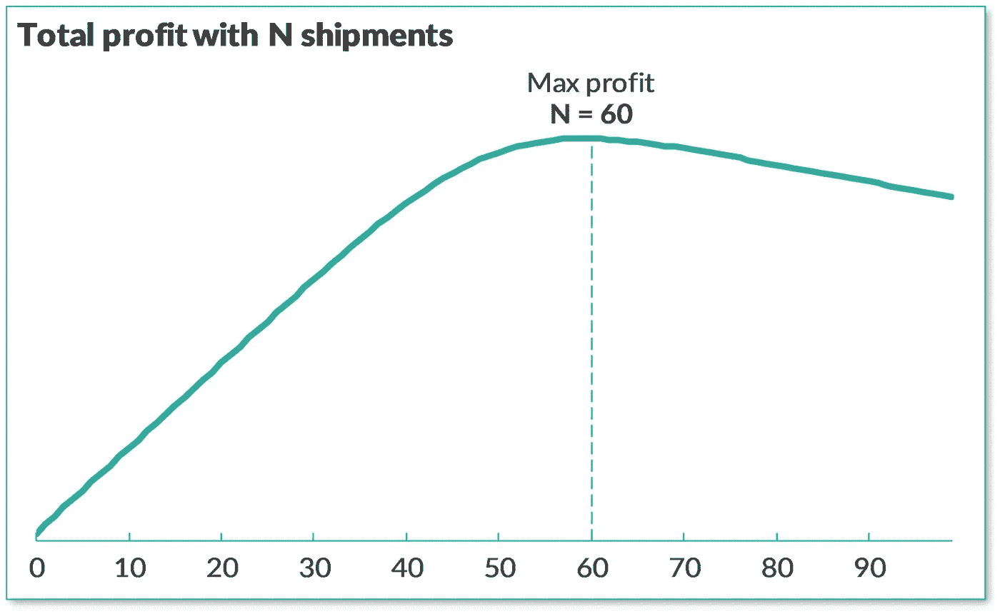
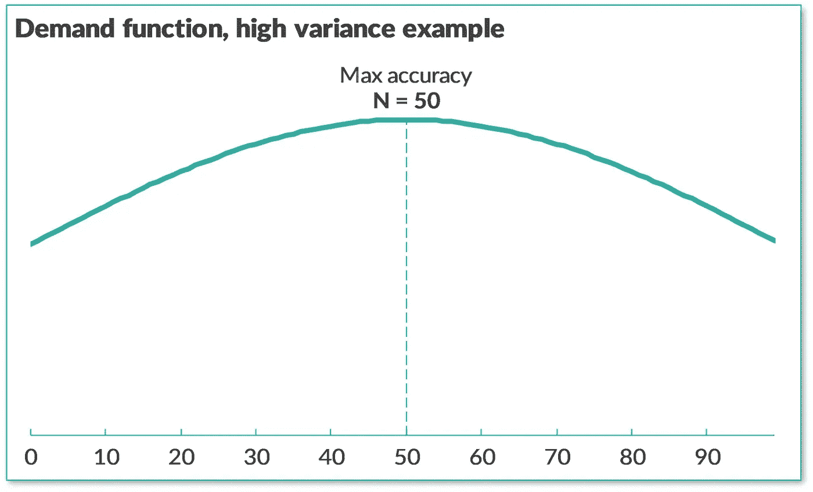
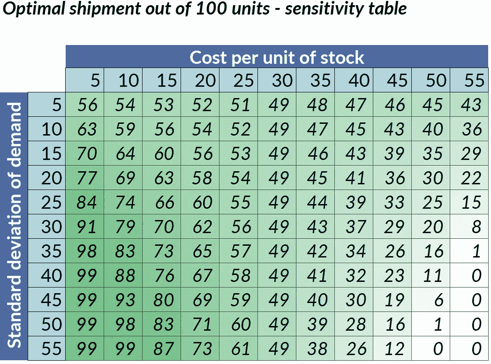

# 预测还是不预测，这是供应链的问题

> 原文：<https://towardsdatascience.com/to-forecast-or-not-to-forecast-that-is-the-supply-chain-question-439e0eb47b61?source=collection_archive---------8----------------------->

## [商业科学](https://medium.com/tag/business-science)

## 解决利润而不是准确性的 5 个秘密因素


**数据有更好的想法**由[弗兰基·查马基](https://unsplash.com/@franki?utm_source=medium&utm_medium=referral)在 [Unsplash](https://unsplash.com?utm_source=medium&utm_medium=referral)

> 顾客是不可预测的。几乎没有任何关于它们的事情是可以正确预测的。也许改变方法？

预测错误无处不在。在过去的 15 年里，我与 1000 多名经理会面并共事，帮助他们每天做出更好的决策。首先，在麦肯锡担任管理顾问的时候；然后，在 [Evo Pricing](https://evopricing.com/) 开发 B2B 技术产品，担任研究员。

在整个经历中，我感觉到预测我们人类系统共享的未来的基本需要:感觉到更多的控制。

然而，放弃狭隘预测的冲动会产生非凡的结果！

拥抱**[**指令式人工智能**](https://en.wikipedia.org/wiki/Prescriptive_analytics) 的快速响应方法，转变性能，释放浪费的资源。例如，当应用于供应链时。**

> **即使一个完美的销售预测本身也不能导致最佳的利润驱动决策。**

> **例如，如果您的完美需求预测= 50 件，您会希望您的供应链发运 50 件吗？事实上，我将展示最优装运量如何可能是=0 或=100，这取决于其他因素。**

# **1 个展示以评估挑战**

**从根本上说，预测销售是根据过去和现在的数据对未来销售做出预测的过程。**

**这种活动可能会遭受粒度的*诅咒*(或者，更专业地说，维度的[诅咒](https://en.wikipedia.org/wiki/Curse_of_dimensionality)):在**高**级别的聚合中，例如预算总销售额，可以进行估计；但是到了更低层次的细节，事情变得令人毛骨悚然:太多的事情同时发生了。**

**不幸的是，日常管理决策必须精确地发生在那些较低的粒度级别，在那里预测是模糊和低效的。例如:**

*   **向客户收取什么价格？**
*   **仓库里要储存多少产品？**
*   **为获得和/或更新向哪些客户投资？**

**喜欢摄影:从远处看，打印的照片有意义。仔细看，你看到的都是 [*混乱的圆圈*](https://en.wikipedia.org/wiki/Circle_of_confusion) 。即使是最大的全球领导者在他们自己的领域也很难预测低的个位数错误率。**

****

****预测误差无处不在**。图片来源:[作者](https://www.linkedin.com/in/fabrizio-fantini/)来自 [Evo 定价](https://evopricing.com/) (CC 带归属)**

**在 2021 年，这似乎令人惊讶。然而，这是由于问题的内在特征。为了便于处理，让我专门关注一下供应链。**

# **供应链预测的挑战**

**当过于颗粒化时，就不可能做出准确的预测。如果你甚至不知道你自己的配偶在某些情况下会有什么行为，你怎么能预测一个完全陌生的人的反应呢？类比比较直接。**

> **供应链经理的决策需要精细的预测，这造成了物理和经济上的浪费。**

**一些公司调整了衡量标准，以掩盖潜在的预测效率低下，例如，通过报告广泛的总量、平均值或更糟的数据。哎哟！当然，这解决不了任何问题。**

**更广泛的销售预测艺术和科学是有缺陷的。几个世纪以来，预测未来的欲望一直是人类的天性。毕竟:很难改变！**

# **我们的星球饱受供应链预测错误之苦**

****

**我们的星球饱受各种预测误差的折磨。图片来源:[作者](https://www.linkedin.com/in/fabrizio-fantini/)来自 [Evo 定价](https://evopricing.com/) (CC 带归属)**

**仅在美国，就有超过 2 万亿美元的存货。年销售额每 1 美元产生 1.43 美元的库存: ***今天**此时*的库存，比今年***全年销售的所有产品多 43%。***

***面对增加生产还是减少销售的选择，任何经理都会很容易选择第一个选项，多生产多销售。但是我们的星球会发生什么呢？***

> ***我们每天都在浪费巨大的资源。***

***根据联合国的说法，浪费是巨大的。多大？***

*   ***全世界每年产生 5000 万吨电子垃圾，比所有商用飞机制造的电子垃圾还要重。只有 20%被回收。***
*   ***全世界每年浪费 13**亿**吨粮食，占总量的三分之一，**[(资料来源:联合国](https://news.un.org/en/story/2013/09/448652))。*****
*   *******每个**欧洲人每年浪费**179 公斤食物，**根据[瑞典食品与生物技术研究所](https://www.reutersevents.com/sustainability/environment/analysis-food-waste-crumbs-comfort)。*****

*****虽然 45%的 5 岁以下儿童死于营养不良(来源:[世界卫生组织](https://www.who.int/news-room/fact-sheets/detail/malnutrition))，但我们的供应链每天浪费三分之一的粮食。*****

> *****我们能更好地匹配供需吗？*****

*****如果我们能以某种方式防止预测错误造成的差距，那么**对地球**、经济乃至最终每个人的好处都将是巨大的。*****

# *****开发成功的规范解决方案*****

> *****为了避免预测错误，**解决影响，而不是准确性**；让数据和机器自己找到答案。*****

> *****在无法预测的情况下，专注于快速响应。*****

*****行动/反应/反馈理论专注于因果*行动/反应*——可能在某处有一个脚注说[反馈](https://en.wikipedia.org/wiki/Feedback)很重要。由于反馈是不可预测的，经典理论倾向于忽略或研究不足。让职业学习变得更容易预测[因果](https://en.wikipedia.org/wiki/Causality)联系。*****

*****一个基于反馈的供应链系统，一个规定的系统，是面向持续学习和发现的:一个反馈优先的机器。*****

*******为了建造一台供应链学习机器，**让我们用 5 种*不那么秘密的*原料精心烹制一份美味的食谱。*****

# *****成分 1:目标有效性，而不是准确性*****

*****对于许多人来说，这是一个深刻的文化转变，他们的整个工作职责就是构建精确的系统。*****

*****至少在预测系统的传统定义中，[准确性](https://en.wikipedia.org/wiki/Accuracy_and_precision)是以*观察到的需求与*预测的需求来衡量的，这与规定系统不太相关。一个**规定性的**系统实际上是一种特定类型的[学习机](https://en.wikipedia.org/wiki/Machine_learning)，它有效地为其目标瞄准最佳结果。如果你通过问错误的问题设定了一个不准确的目标，那么你将会得到错误的结果。*****

*****不仅仅是错了，而是*非常高效地错了*，甚至！*****

**********

*******错题准确回答**。图片来源:[作者](https://www.linkedin.com/in/fabrizio-fantini/)来自 [Evo 定价](https://evopricing.com/) (CC 带归属)*****

*****以下是一些传统准确性在业务方面效率低下的例子:*****

*   *******业务成果以**美元衡量。想象一下，预测你将卖出 10 件，然后卖出 20 件——这意味着你需要更快地补货。这将是一个 100%不准确的预测:以 10 为基线，误差为 10。但也是 100%的商业收益！为什么要对 100%的收益进行惩罚？原则上，这是可以理解的，但从商业角度来看，这是错误的。仔细想想，这真的毫无意义。*****
*   *******风险成本。不是所有的错误都有相同的代价。前面的例子显示了库存不足的一种情况(销售超过预期)；如果相反，你最终库存过剩怎么办？假设你有两个产品 A 和 B，通常是快销品和滞销品，每周分别销售 100 和 10 件。你做了一个广告，预测每种产品的销量是 300，但是他们每种产品只卖了 200。这两个预测误差都是 50%，但是准确性度量并没有告诉你 A(仅 1 周的常规销售)与 B (10 周的销售)多留 100 件的风险。).糟糕的度量。*******
*   *******顾客跨产品替代。**测量粒度精度假设不同产品的销售是独立的，这是不正确的。例如，你有两个产品，A 和 B，并估计销售 10 个 A 和 10 个 B。那么对于实际是 5 & 15(替代)或 5 & 5(比例相同但总体较少)的情况，你有相同的 50%平均误差( [MAPE](https://en.wikipedia.org/wiki/Mean_absolute_percentage_error) )。在第一种情况下，20 的总估计是 100%正确的，但在另一种情况下，它是 50%错误的。准确性告诉你关于替代的任何有价值的东西。*****
*   *****概率与现实。预期销售额是一个先验的概率分布*，没有好的方法从观察到的结果*后验的*评估实际的概率分布，而不增加噪音和失真。你以曲线(预期)开始，以数字(销售)结束；如何将两者相对比？******
*   ********需求与销售。**你只能直接观察销量，不能观察底层需求。因此，即使在概念层面上，您也无法测量*需求准确性*，这将是正确的度量。为此，您需要对销售进行逆向工程调整，以接近需求，但是这样做，您实际上是在创建自己的数据，而且这种方法是不可靠的。******

******所有这些点都是暗示相同事情的例子:准确性并不是一个相关的商业度量标准，特别是，它不应该被用来建立或度量一个规定的系统。******

> ******与其提高准确性，不如改变视角:通过直接瞄准利润来克服结构性限制。******

******学习系统的美妙之处在于，它们直接针对你设定的任何业务成果。[利润](https://en.wikipedia.org/wiki/Profit)比准确性更关乎商业。******

# ******成分 2:将需求计划与物流相结合******

******如果你和我一样:在这一点上，还没有被说服！数据在哪里？证据在哪里？******

> ******将预测输入物流系统会破坏价值。神奇的“秘密”配方:混合成本和收入在一起！******

******不幸的是，如今公司的经理们被次优地分割成 T2 的筒仓。我的一个客户昨天解释了他们的*预测*如何反馈给*订单*系统，而订单系统又反馈给*发货*系统。**三步之遥**远离客户和市场。******

******每一步都将问题分解成可管理的子块，从管理的角度来看，这些子块可能是有意义的，但会分散信息，因此最终会造成浪费。**从股东的角度破坏价值**。******

******这是为什么，用数字表示。使用一个简单但相关的例子。******

******让我们假设你是一家销售香蕉的杂货零售商的供应链经理。你需要决定今天运送多少香蕉到你的商店。类似的逻辑适用于任何类型的产品或服务以及任何时间范围，但是为了便于讨论，让我们把事情简单化。******

******让我们假设你对香蕉的真实预期**需求函数**是经典正态分布，均值/众数/平均需求为 50，标准差为 10。可以使用任何其他概率分布，或者甚至只是暗示，但是让我们保持这个例子非常简单。******

******传统系统根据点估计来思考；你可能需要稍微思考一下*看*这个概率分布的例子。******

************

********示例需求函数**。图片来源:[作者](https://www.linkedin.com/in/fabrizio-fantini/)来自 [Evo 定价](https://evopricing.com/) (CC 带归属)******

******现在，如果有人问你香蕉的*预测需求*是多少，假设你想保住你的工作，你可能会回答*最少错误*，或者*最准确*，值 50。******

******您可能会认为实际销售额的误差在 10%左右(为简单起见，假设标准偏差为 1)，误差率为 20%，但是，嘿，如果您按照上面的开盘价基准，这实际上是一个相当不错的估计！所以一切都好。还是没有？******

************

********最准确的预测？**图片来源:[作者](https://www.linkedin.com/in/fabrizio-fantini/)来自 [Evo 定价](https://evopricing.com/) (CC 带归属)******

******你的误差测量将事后的销售*与事前*的预期需求*进行比较，这在概念上是错误的，因为它们是不同的。但是，让我们接受这个错误:需求不是直接可见的，只有销售是可见的。因此，没有传统的方法可以用来直接衡量你的需求估计。好吧，让我们继续。*******

******然而，还有一个更大的问题。******

> ******在预测/订单/运输过程中，每天都会发生巨大的系统性使用错误，即使有完美的预测也是如此。******

******如果我是物流经理，收到您的预估 50 件，让我们假设我完成了所有任务，那么我会高效地将您的预测件传递给商店。接下来会发生什么？******

********每一次运输都有效地用今天的保底成本换取明天可能的利润。********

*   ********今天**，我直接把钱花在库存、物流、财务、损耗(运输途中丢失的产品)和间接费用的**保证成本**上，甚至没有考虑不把库存留在仓库的机会成本。******
*   ********明天**，我将从售出的已发货产品中产生**潜在利润**，以及未售出产品的浪费和退货产生的额外成本。******

******根据成本和利润的确切值，**最佳装运可能与预测完全不同，**即使是零误差。******

******例如，假设每单位出货的总成本为 40，每单位销售的预期毛利为 60(假设定价为 100，产品成本为 40)，标准差为 35，则基于出货次数 N 的预期利润曲线如下:******

************

********最佳装运与预测不同。**图片来源:[作者](https://www.linkedin.com/in/fabrizio-fantini/)来自 [Evo 定价](https://evopricing.com/) (CC 带归属)******

******然而，如果不是假设每装运单位的总成本为 10，原始标准偏差为 10，那么基于装运次数 N 的预期利润曲线变化如下:******

************

******最佳装运可以是任何东西。图片来源:[作者](https://www.linkedin.com/in/fabrizio-fantini/)来自 [Evo 定价](https://evopricing.com/) (CC 带归属)******

*******注:* [*附录*](https://fab-evo.medium.com/appendix-to-forecast-or-not-to-forecast-3374a039eaf) *中的全部工作原理。*******

******在这个例子中，通过运输 50 个单位，你将**保证一个系统的利润错误，即使有一个正确的预测。**对利润的直接负面影响。通过*切断预测和物流之间所有有价值的需求信息*，使用单点估计作为你的单独物流系统的需求输入，你将有系统地破坏价值。******

******物流系统将无法对最优装运做出任何明智的评估，更不用说更复杂的跨产品估计，如替代。它只是试图满足需求的点估计。******

> ******传统的预测与客户的观点不一致，因此通过自己的设计破坏了商业价值。******

******有趣的是，上面简化但现实的预期利润曲线显示了*强烈的偏斜*。由于最优解右边的预期利润要高得多，**经理们本能地倾向于过量出货**，造成系统性的浪费(参见上面关于*我们的星球*的章节)，而不是冒着错过有价值销售的风险。******

******听说过**安全库存** *系统地添加在估计值*之上吗？******

******你不相信自己的预测，所以你保持安全边际。所以你一直在浪费自己的库存，错过销售机会。******

# ******成分 3:将风险视为机遇******

******根据需求的标准偏差，即*市场的波动性*和不可预测性，以及物流成本，**最佳发货可能是 0 到 100+之间的任何值，预测需求仍然是 50。********

******在现代世界中，需求终究会变得越来越不可预测，这使得传统预测更加过时。所以这是一个常见的场景。但是**风险也可以是上升的机会**！******

******风险在技术上是需求差异:当需求变得更加不稳定和不可预测时会发生什么，即使同样预测为 50。******

************

********高方差需求函数示例。**图片来源:[作者](https://www.linkedin.com/in/fabrizio-fantini/)来自 [Evo 定价](https://evopricing.com/) (CC 带归属)******

******在本例中，标准差不是 10，而是 5 倍，因此标准差也是 50。******

************

********高得多的盈利机会。**图片来源:[作者](https://www.linkedin.com/in/fabrizio-fantini/)来自 [Evo 定价](https://evopricing.com/) (CC 带归属)******

******在这种情况下，最佳出货量将不再是 60，而是 98。大体上是 50 年预测的 2 倍。通过使用传统的预测，你会引入一个**巨大的系统利润误差**，将出货量限制在 50。******

******你也不会变得更聪明，因为你会继续出货 50 件，并且通过卖出全部 50 件产品而成为接近 100%准确的*。*******

*******平均卖 50。这有时意味着*而不是*缺货，使得错过机会的检测变得棘手。如此反复重复同样的错误，直到需求函数发生变化——例如，竞争对手得到了你错过的香蕉销售，并感谢你给他们带来了新客户。*******

> ******商机一去不复返，但却几乎 100%准确。******

******有钱好还是权利好？******

# ******成分#4:装运范围=频率+提前期+风险+约束******

******根据成本和差异，**最佳出货量可以是 0 到 100，即使预测需求始终是 50。********

************

********最佳装运可以是从 0 到最大约束条件(本例中为 99)之间的任何数字，即使预测需求为 50。**图片来源:[作者](https://www.linkedin.com/in/fabrizio-fantini/)来自 [Evo 定价](https://evopricing.com/) (CC 带归属)******

******这个简化的例子假设你今天要运送香蕉，明天送到商店。在其他情况下，发货频率可能较低，发货提前期(订单和收货之间的时间)较长。预测系统会预测未来的销售，从而使误差变得更大。******

******另一方面，规定系统将这些参数作为输入:交付周期越长，运输频率越慢，需求的不确定性就越大，传统预测系统和流程的系统误差就越大。******

******那么**约束**呢？******

******例如，如果我没有仓库限制(和偷偷吃一根香蕉的胃口),上表的左下角可能会显示比 99 更高的数字。).约束有一个简单的影响:*限制规定系统操作的自由*。******

> ******每一个约束都只能恶化预期利润，而永远不能改善预期利润。所以越少越好。******

******例如，为什么要强制实施最小货架数量？还是在运输利润已经最大化的情况下的最小出货量？没必要，真的。******

******更多细节请见我的另一件中型作品:******

******[](/supply-chain-optimization-worth-it-or-not-20ae4c6e635) [## 供应链优化:值得还是不值得？

### 数学最优化的悖论

towardsdatascience.com](/supply-chain-optimization-worth-it-or-not-20ae4c6e635) 

# 成分 5:从快速反应中获得灵感

如何实现快速响应系统？

说明性分析是管理有效性的新领域，但它们也带来了重大问题:

*   需求函数怎么确定？
*   如何让系统推荐有意义？
*   如果准确性不是正确的衡量标准，如何验证结果？

我每天都看到常规系统**比传统预测系统的库存效率高出 20–30%**:用更少的库存实现更多的销售。有时候少可以多。

与此同时，我*感到*出现了认知失调。与我共事的经理的真实语录:

*   我们多年来一直致力于将精确度提高 1 到 2 个百分点。20–30%的改进怎么可能实现呢？[ *这实际上经常是一天 1* 的改善]
*   在 A/B 测试之后，相对于其他可变业务因素，如何衡量长期改进？[ *通过选择正确的目标 KPI*
*   我们会有正确的数据来完美地估计需求吗？[现有的*数据在使用外部数据源时通常是可以的；越多越好，然而完美是不可能的*

最终**规范的系统只能通过测试来衡量**，这是一个自我递归的循环:**只有当人们相信它们是无法解决的挑战的解决方案时，它们才能工作**。

# 类比示例

最初，包含上述所有复杂点可能会很困难。因此，让我们从其他快速反应系统的类比中得到启发:

## 类比:客户需求和天气


**天气测量。**马克·柯尼希在 [Unsplash](https://unsplash.com?utm_source=medium&utm_medium=referral) 拍摄的照片

天气*预报*其实就是:快速*观测—模式识别—更新*。由于这个问题是出了名的难，就像客户需求一样，科学家依靠先进的技术来收集大数据并实时调整估计。

根据美国国家海洋和大气管理局的说法，相对于传统方法的改进是显著的:把握地球的脉搏，处理大量的数据，为客户提供更好的服务。

快速响应供应链所需的完全相同的步骤。

## 类比:客户需求和股票市场


马克西姆·霍普曼在 [Unsplash](https://unsplash.com?utm_source=medium&utm_medium=referral) 上的照片

股票市场与其说是一个预测引擎，不如说是一个快速反应系统。从长期来看，它接近公司资产的[估计值](https://www.investopedia.com/terms/b/business-valuation.asp)(总的来说，你也可以预测客户需求)，但是，从日常来看，它是最有效的引擎，可以在新信息出现时快速吸收。

股票价格由供求平衡实时决定。一个[持续发现](https://www.producttalk.org/continuous-discovery/)引擎，每天可以相当高效地分配数万亿美元的实际资金。或者，至少，还没有人能想出一个更有效的机制！

为什么**不采用同样的方法来匹配实物供给和需求**，在日常供应链决策中分配数万亿美元的库存？

# 反应迅速，钱就来了

从业务目标开始，每天释放巨大的商业价值。这样做，比许多可持续发展项目更能帮助我们的星球。

快速响应保证了任何错误的自我纠正，那么风险是什么呢？

要建立一个快速反应系统，你需要两个要素:

*   **机器学习**根据尽可能大的数据集来估计预期需求
*   **利润优化**规定决策，使用经典的运筹学技术，但规模较大。

在之前的一篇文章中，我提倡*三文鱼策略*:从你想要的影响开始，然后向后努力。从这个角度来看是相对合理的。

[](/data-science-is-dead-long-live-business-science-a3059fe84e6c) [## 数据科学已经死了。商业科学万岁！

### 任何人都可以从不起眼的鲑鱼身上学到的 5 课

towardsdatascience.com](/data-science-is-dead-long-live-business-science-a3059fe84e6c) 

就像中国谚语所说的:

> 千里之行始于足下

预测-订单-发货的准确性驱动的传统预测流程被打破。在我们这个日益复杂的世界里，拥抱规范的力量是最终实现供需平衡的合乎逻辑的第一步。

*快乐快速回复！*

*[*附录*](https://fab-evo.medium.com/appendix-to-forecast-or-not-to-forecast-3374a039eaf) *中的全部工作方式，还包括可下载的说明性源文件，用于详细查看示例。**

*PS 我定期写[商业科学](https://medium.com/tag/business-science)。推荐后续阅读:*

*[](/94-perfect-the-surprising-solution-to-the-200-billion-inventory-problem-b6ba0bc1417a) [## 94%完美:2000 亿美元库存问题的惊人解决方案

### 机器学习和人类经理一起修复供应链

towardsdatascience.com](/94-perfect-the-surprising-solution-to-the-200-billion-inventory-problem-b6ba0bc1417a) [](/fashion-is-broken-science-is-fixing-it-b771b1ab5b59) [## 时尚被打破了。科学正在修复它

### 转变 5 个核心时尚流程

towardsdatascience.com](/fashion-is-broken-science-is-fixing-it-b771b1ab5b59) 

```
Monthly Business Science in your inbox, new software, and University-level learning:[**Free access**](https://evouser.com/register)Questions? Please reach out on [Linkedin](https://www.linkedin.com/in/fabrizio-fantini/)
```