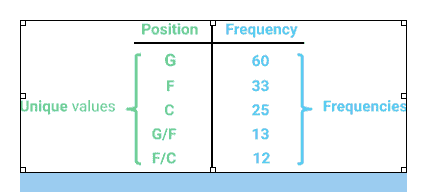
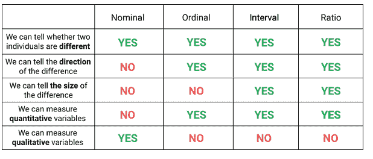
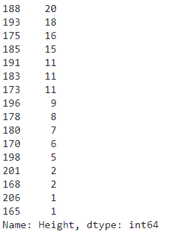
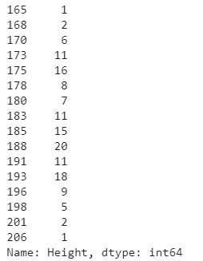
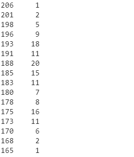
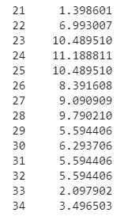
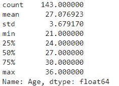
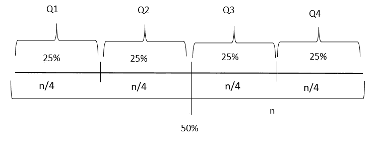
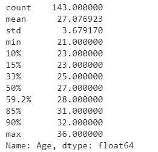
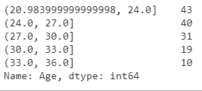

# 为了增加数据分析能力，你必须知道频率分布(Stat-04)

> 原文：<https://towardsdatascience.com/to-increase-data-analysing-power-you-must-know-frequency-distribution-afa438c3e7a4?source=collection_archive---------9----------------------->

## 在 7 分钟内找到频率分布的所有基础知识


约翰·博耶在 [Unsplash](https://unsplash.com?utm_source=medium&utm_medium=referral) 上的照片

数据在每个组织中都扮演着关键角色，因为它帮助企业领导者根据事实、统计数字和趋势做出合适的决策。由于数据范围的不断扩大，数据科学成为一个多学科领域。在数据科学中，数据分析是最重要的部分。为了清楚地理解数据，我们必须了解统计的频率分布知识。

数据分析的主要目的是从数据中获取信息，以便我们可以为我们的系统、组织或任何问题做出更好的决策。你脑子里在想什么？。我们可以很容易地通过查看表格格式来分析数据。耶！当数据集很小时，我们可以。如果是大数据集呢！！！假设您有一个 1000 行 50 列的数据集。你能仅仅通过观察来分析这个数据集吗？为了分析这种类型的大型数据集，首先，我们必须简化它。频率分布是分析数据的重要技术之一。

**目录:**

1.  什么是频率分布？
2.  用真实世界的例子算出频率表。
3.  序数、间隔或比率标度变量频率表。
4.  什么是相对频率和百分比频率。
5.  如何制作分组频数分布表？
6.  连续变量的频率分布。
7.  最后的话。

**什么是频率分布？**

频率分布是一种图形或表格形式的表示，显示给定时间间隔或类别内的观察次数。有时，它也被称为频率分布表。



作者照片

让我们看看这张桌子。它有两列。一列记录唯一变量的名称。另一列记录每个唯一值的观察次数或出现次数。

通过本文，我们使用的是 [*wnba.csv*](https://dsserver-prod-resources-1.s3.amazonaws.com/283/wnba.csv?versionId=IRtAhA_HXkTG.u7ly_AYF8_iv61yieDK) 数据集。它有 143 行和 32 列。下面给出了数据集的完整概述。请随意观察数据集。

是时候尝试新的东西了。我们将使用 python 创建一个频率表。我们可以用 `Series.value_counts() [method](https://www.geeksforgeeks.org/python-pandas-series-value_counts/#:~:text=value_counts()%20function%20return%20a,Excludes%20NA%20values%20by%20default.)`。我们将尝试在我们的数据集中制作一个`pos(position)` 列的频率表。

```
import pandas as pd
wnba = pd.read_csv(‘wnba.csv’)
freq_dis_pos = wnba[‘Pos’].value_counts()
freq_dis_pos
```

输出:


我们还可以使用相同类型的代码获得其他列的频率表。但是请记住，它只对分类变量有效。

在我们的输出中，我们看到值以降序排列。这个顺序有助于我们知道哪个频率值最大。如果我们有一个名义变量的情况，这个顺序对我们有帮助。如果你的变量是用序数、区间或比率尺度来衡量的，那么分析起来就会变得更加困难。为了理解这个变量，你可以看看我们之前关于变量的帖子。

[](/get-familiar-with-the-most-important-weapon-of-data-science-variables-48cc7cd85dc5) [## 熟悉数据科学最重要的武器~变量

### 变量类型的基本概念、测量级别和不同的 python 表示技术

towardsdatascience.com](/get-familiar-with-the-most-important-weapon-of-data-science-variables-48cc7cd85dc5) 

总之，这个表将帮助你找到变量类型。



作者照片(序数、间隔或比例变量的频率表)

现在我们试着找到高度列的频率表。

```
freq_dis_height = wnba[‘Height’].value_counts()
freq_dis_height
```

输出:



有时候，你会遇到麻烦。要解决这个问题，您可能需要根据索引值对表进行排序。然后你可以使用`Series.sort_index() [method](https://pandas.pydata.org/pandas-docs/stable/reference/api/pandas.Series.sort_index.html)`。

```
freq_dis_height = wnba[‘Height’].value_counts().sort_index()
freq_dis_height
```

输出:



有时您需要按升序转换数据。为了以升序表示数据，我们可以将 ascending 参数设置为 false。

```
freq_dis_height =wnba[‘Height’].value_counts().sort_index(ascending= False)freq_dis_height
```

输出:



*你能按顺序制作上表吗？是的，你可以。首先，把整个身高范围分成若干区间。例如，在给定的数据集中，身高范围从 165 厘米到 206 厘米。假设，总范围是 45 厘米。现在，把它分成 5 类，每类间隔 9 厘米。并给每个音程起一个分类名称，如高、短或第一、第二等。然后计算频率。*

**什么是相对频率和百分比频率？**

上面讨论的频率被称为某个变量的绝对频率。

*(一)相对频率:*

通过将频率(f)除以观察次数(n)可以得到特定观察值或类间隔的相对频率。

`***Relative frequency = frequency ÷ number of observations***`

*(二)百分比频率:*

百分比频率是相对频率乘以 100 得到的。

`***Percentage frequency = relative frequency X 100***`

*在熊猫库*中，我们可以用每个频率除以实例总数，一次性计算出所有的比例。下面是一个关于`*Women’s National Basketball Association (wnba.csv)*` 数据集*的例子。*

`wnba[‘Age’].value_counts() / len(wnba))`

但是通过将`Series.value_counts()` normalize 值设置为 True，速度稍微快了一些。然后简单地将输出乘以 100。

```
percentages_pos = wnba[‘Age’].value_counts(normalize=True).sort_index() * 100percentages_pos
```

输出:



这个百分比将帮助我们找到我们需要的重要信息。

**百分位数排名**

分数的百分位数等级是分数在其分布中所占的百分比，并且低于它。为了找到百分位数排名，我们可以使用 python 中的一个名为`scipy.stats.percentileofscore` 的库。

如果我们想找到指数 25 的百分位数。我们只需编写如下代码。

```
from scipy.stats import percentileofscorepercentile_of_25 = percentileofscore(wnba[‘Age’], 25, kind = ‘weak’)percentile_of_25
```

输出:

40.55944055944056

你会非常惊讶地发现，我们只要写一行代码就可以很容易地找到百分位数。熊猫`Series.describe()`方法帮助我们找到百分位数。

`persecntiles = wnba[‘Age’].describe()`

输出:



我们对前三行的值不感兴趣。默认情况下返回第 25、50 和 75 名，分数将分布分成四个相等的部分。也称为四分位数。第一个四分位数(也称为下四分位数)是 24(注意，24 也是第 25 个百分位数)。这意味着总数据的 25%在 0 到 24 年之间。第二个四分位数(也称为中间四分位数)是 27(注意，27 也是第 50 个百分位数)。第三个四分位数(也称为上四分位数)是 30(注意 30 也是第 75 个百分位数)。



作者照片(四分位数概念图形可视化)

我们可能有兴趣找到 25%、50%或 75%以外的百分比的百分位数。为此，我们可以使用 pandas `Series.describe()`的百分点参数。这个方法需要传递 0 到 1 之间的百分比。

```
persecntiles = wnba[‘Age’].describe(percentiles = [.1, .15, .33, .5, .592, .85, .9])persecntiles
```

输出:



**如何制作分组频数分布表？**

有时频率分布表组织得不好。然后我们必须找到分组频率分布表。我们通过改变 pandas `series.value_counts()`方法中的 bin 参数来设置分组值的限制。

```
grouped_freq = wnba[‘Age’].value_counts(bins = 5).sort_index()grouped_freq
```

输出:



有时，这个间隔不会给出更好的输出。为了获得更好的输出，我们必须创建自定义间隔。给我们创造定制系列的机会。

```
ntervals = pd.interval_range(start = 0, end = 600, freq = 100)intervals
```

输出:

`IntervalIndex([(0, 100], (100, 200], (200, 300], (300, 400], (400, 500], (500, 600]], closed=’right’, dtype=’interval[int64]’)`

*在这里，我们必须提供三个参数。起始参数给出了我们范围的起始点。End 参数给出自定义范围的终点，Freq 值给出每个频率的数值。*

**连续变量的频率分布**

对于一个连续变量，如果我们为变量的每个不同值取一个类，类的数量将变得过大，从而使列表的目的落空。

当表格中使用连续变量时，**它们的值通常被分成几类。在这里，我们可以使用之前学过的音程的概念。**

***最后，***

在整篇文章中，我们必须学习如何使用频率分布表来组织数据。要知道频数分布表有多厉害！频数分布表有助于我们深入理解数据。然而，是时候知道如何可视化这些组织好数据了。要了解它，请和我呆在一起。我很快会带着必要的可视化技术回来。

***数据科学统计全系列文章***

1.  [*少即是多；取样的‘艺术’(Stat-01)*](/less-is-more-the-art-of-sampling-dda8b59d399?source=your_stories_page-------------------------------------)
2.  [*熟悉数据科学最重要的武器~变量(Stat-02)*](/get-familiar-with-the-most-important-weapon-of-data-science-variables-48cc7cd85dc5?source=your_stories_page-------------------------------------)
3.  [*要增加数据分析能力，你必须知道频率分布(Stat-03)*](/to-increase-data-analysing-power-you-must-know-frequency-distribution-afa438c3e7a4?source=your_stories_page-------------------------------------)
4.  [*通过可视化频率分布找到数据集的模式(Stat-04)*](/find-the-patterns-of-a-dataset-by-visualizing-frequency-distribution-c5718ab1f2c2?source=your_stories_page-------------------------------------)
5.  [*比较多个频率分布，从数据集中提取有价值的信息(Stat-05)*](/compare-multiple-frequency-distributions-to-extract-valuable-information-from-a-dataset-10cba801f07b?source=your_stories_page-------------------------------------)
6.  [*用简短的讨论消除你对均值的误解(Stat-06)*](https://medium.datadriveninvestor.com/eliminate-your-misconception-about-mean-with-a-brief-discussion-a9fed67d4b08?source=your_stories_page-------------------------------------)
7.  [*通过规范化提高您的数据科学模型效率(Stat-07)*](https://medium.datadriveninvestor.com/increase-your-data-science-model-efficiency-with-normalization-918484b4626f?source=your_stories_page-------------------------------------)
8.  [*数据科学的基本概率概念(Stat-08)*](/basic-probability-concepts-for-data-science-eb8e08c9ad92?source=your_stories_page-------------------------------------)
9.  [*从朴素贝叶斯定理到朴素贝叶斯分类器的路线图(Stat-09)*](/road-map-from-naive-bayes-theorem-to-naive-bayes-classifier-6395fc6d5d2a?source=your_stories_page-------------------------------------)
10.  [*数据科学爱好者需要知道的假设检验(Stat-10)*](https://medium.datadriveninvestor.com/all-you-need-to-know-about-hypothesis-testing-for-data-science-enthusiasts-30cfe1dce028?source=your_stories_page-------------------------------------)
11.  [*用 ANOVA (Stat-11)*](/statistical-comparison-among-multiple-groups-with-anova-d4ac27f6e59e?source=your_stories_page-------------------------------------) 进行多组间的统计比较
12.  [*用卡方检验比较分类变量的相关性(Stat-12)*](/compare-dependency-of-categorical-variables-with-chi-square-test-982baff64e81?source=your_stories_page-------------------------------------)