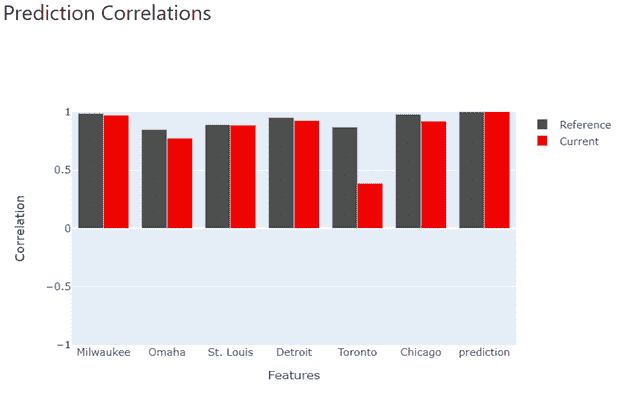
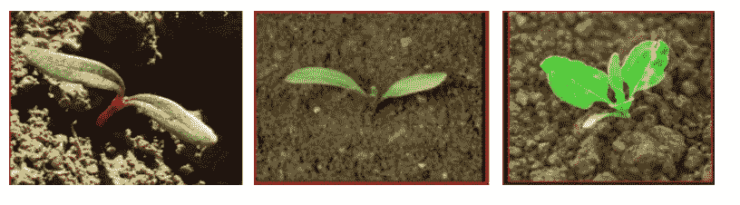
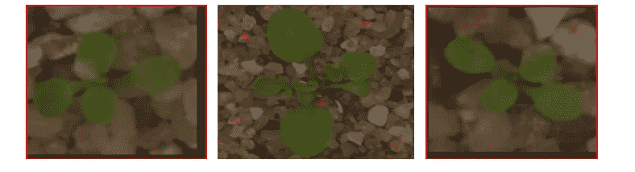
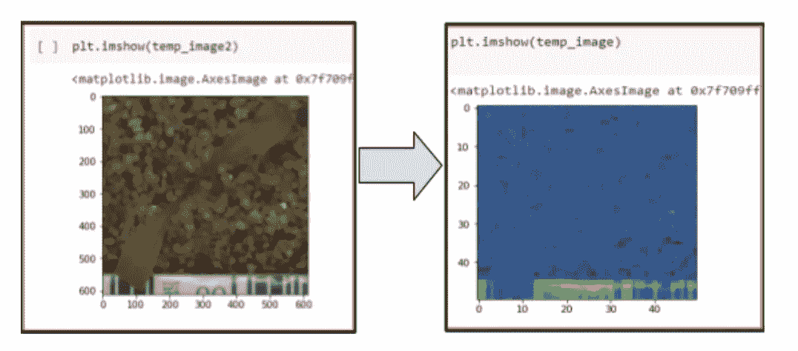

# 监控还是不监控一个模型——有问题吗？

> 原文：<https://towardsdatascience.com/to-monitor-or-not-to-monitor-a-model-is-there-a-question-c0e312e19d03?source=collection_archive---------13----------------------->

## [行业注释](https://towardsdatascience.com/tagged/notes-from-industry)《模型监控指南》

## 这是模型监控系列博客的第一部分。本文概述了监控模型的需要，并用一个名为 appeally AI 的开源库演示了两个例子。

[德万西·维尔马](https://www.linkedin.com/in/devanshiverma/) *、[马修·弗利吉尔](https://www.linkedin.com/in/matthew-fligiel-090a16a8/) *、[鲁帕·戈什](https://www.linkedin.com/in/rupaghosh29/) *、[阿纳·博斯博士](https://www.linkedin.com/in/arnab-bose-phd-6369531/)

*对本书有同等贡献，姓名按字母顺序排列。

# 什么是模型监控，我们为什么要关注它？

所以你终于完成了它——你已经找到了完美的超参数，建立了你的管道，做了大量的测试，并把你的机器学习模型投入生产！过程结束了，是时候停止思考你的模型了吧？要是有那么简单就好了…

由机器学习模型指导的业务操作依赖于这样的假设，即模型下面的数据分布不是漂移的(数据分布在训练和推断之间是相同的)，以便模型保持与训练后一样有效。为了验证这一点，需要监控生产中的机器学习模型，以使它们的性能(准确性/内存使用/CPU 使用)在训练和测试期间设置的预期范围内。

当一个模型开始漂移时，它可能会被发现，直到它对业务运营产生负面影响。例如，在医疗保健领域，疾病预测的准确性可能会开始下降，以至于预防措施(基于预测)变得无效。在零售领域，发送给预期使用优惠券的客户(基于模型预测)的优惠券仍未使用。所有这些都会影响业务运营和收入。图 1 示出了分布偏移的一个例子。

图 1:分布转移。(*图片作者*)

# 如何监控模型？

有多种方法用于监测模型——一些关键技术，如先验概率转移和协变量转移在[1]中进行了概述。此外，模型监控方法有多种开源和商业软件实现。在本文中，我们走过一个开源模型监控库，显然是 AI [2]。

# 显然是艾

显然，AI 是一个开源的 python 包，它允许创建仪表板来比较训练和生产数据集。它很容易集成到 python 代码中来检测数据漂移。我们想调查它的模型监控能力，因为成本(免费！)和易于安装(来自 PyPi)使它成为有吸引力的候选产品。

## 人工智能是如何工作的

显然，人工智能是通过分析训练和生产数据集来工作的。它将数据从训练数据中的要素映射到生产数据中的对应要素。例如，在本文后面提到的天气模型中，将圣路易斯的培训数据映射到圣路易斯的生产数据。此后，它根据输入运行不同的统计测试。显然，AI 然后基于 plotly python 库创建图形，你可以在他们的开源 GitHub 库中阅读更多关于代码的信息。

对于二进制分类要素，它对比例差异执行简单的 Z 检验，以验证定型数据和生产数据具有二进制变量的两个值之一的频率是否存在统计上的显著差异。对于多元分类特征，它执行卡方检验，旨在查看生产数据中变量的分布是否可能基于定型数据中的分布。最后，对于数字要素，它会执行双样本 Kolmogorov-Smirnov 拟合优度测试，该测试评估培训和生产数据中要素的分布，以查看它们是否可能是相同的分布，或者它们是否彼此有显著差异。

在所有上述情况中，显然 AI 标记了统计上显著的结果。此标志表示训练数据和用于在现实世界中进行预测的推断数据之间的分布发生了变化。

## 我们的例子

在这篇文章中，我们用两个不同复杂度的例子展示了人工智能是如何工作的。在第一个示例中，一个模型使用附近 5 个城市(底特律、密尔沃基、奥马哈、多伦多和圣路易斯)的温度来预测芝加哥的天气。这是一个在表格数字数据中搜索数据移位的简单示例。在这种情况下，该模型是一个支持向量机-为了简单起见，该模型不是从时间序列的角度来处理的(其想法是，它可以根据其他城市的温度来实时预测芝加哥的温度)。这种情况考虑到了漂移的可能性(随着天气的季节性变化)，以及整体的变化。

在另一个例子中，植物幼苗的图像通过卷积神经网络(CNN)模型运行，目的是将甜菜植物与其他类似的幼苗区分开。这里，漂移是通过在生产中使用不同的数据集来演示的。这是一个重要的例子，其中被监视的数据不容易用表格格式表示。

# 人工智能中的表格数据移位检测

说明数据转移的一个变化是将数据从多伦多切换到亚利桑那州的菲尼克斯。正如所料，这两个城市的温度分布(以摄氏度计)有很大不同，特别是在本例中使用的日期(从 3 月到 6 月初)。图 2 是数据被修改前的一个例子。

图 2:原始天气数据。(*图片作者*)

更改后的相同数据如图 3 所示。请注意“多伦多”的值明显高于其他城市，因为它的值已经更改为凤凰城的值！

图 3:极移后的天气数据。(*图片作者*)

显然，人工智能被用来监控模型——它的输入是原始训练数据的数据框架和生产数据的数据框架，它创建了一个分析仪表板，突出显示差异(如果有的话)。

它识别每个数据集中的输入变量(这里 df_old 对应于原始训练数据，df 对应于模型当前预测的数据)。显然，人工智能会匹配数据集之间的变量，并生成一份报告，突出显示差异。生成的仪表板的快照如图 4 所示。

图 EvidentlyAI 中的漂移仪表板。(*图片作者*)

很明显,“多伦多”的分布有漂移，因为现在有更高的值。有趣的是，底特律也出现了变化，但没有被篡改。这说明了为什么总有可能出现错误的结果——尽管我们没有改变这里的数据，但这表明我们应该关注这个特性。

显然，人工智能也有能力监测结果变量的漂移。这是为了了解模型的预测是否偏离了训练期间所看到的情况。这种模型输出漂移被称为目标漂移，或者更普遍地称为先验概率漂移。这时输入数据分布不变，但目标变量分布发生变化。例如，我们可以在信用卡违约者的上下文中使用它。人口的特征可能随时间而变化。总日客户的比例也可能有所不同。因此，由于这一变化，去年使用的模式在今天可能不再有效。例如，先前的概率可能是 20%的违约者和 80%的还债者，而现在可能是 30%的违约者和 70%的还债者。这种所谓的“目标转移”可能会对生产中的模型产生严重的业务影响，因此应该密切监控。下面的图 5 显示了一个例子。

图 5:预测漂移又称目标偏移。(*图片作者*)

可以看出，在当前数据集中，分布发生了变化。还提供了进一步的分析，显示了预测如何与每个特征相关联。这有助于通过观察我们的变量和结果之间的关系是否发生了显著变化来监控数据漂移。如果是，该模型可能不再适合生产。这为我们提供了另一种方法来评估我们的模型是否需要重新训练，如图 6 所示。

图 6:预测相关性。(*图片作者*)

显然，AI 也展示了预测值和预测行为的特征，如下图 7 所示。

图 7:按特征的预测行为。(*图片作者*)

注意坐标轴的移动——多伦多的参考(训练)值(实际上对应于多伦多的天气)的范围是从 0 到 30，而新的(测试/生产)值(菲尼克斯)的范围是从 0 到 40。

# 明显人工智能中的图像数据偏移检测

在第二个例子中，我们研究图像数据中的数据漂移。我们的模型是一个多类图像分类模型，它接受幼苗图片的输入，并将它们分类到 12 个可用类中的一个[3]。该监控检测生产数据何时漂移，并包括不在 12 类中的幼苗的图像。这种数据漂移监控是通过将生产数据与模型训练数据进行比较来完成的。

想象一下这样的场景，我们的训练数据由甜菜的图像组成，但是测试/生产数据接收不同类型的幼苗的图像，比如荠菜。下图显示了这一点；在图 8a 中，我们有培训数据图像，在图 8b 中，我们有荠菜的测试/生产数据图像。很明显，训练数据集和生产数据集是不同的。我们的目标是使用明显的人工智能来检测两个样本之间特征的数据漂移。

图 8(a):甜菜图像训练数据。(图片来自植物幼苗数据集[3])

图 8(b):荠菜图像测试/生产数据。(图片来自植物幼苗数据集[3])

## 具有明显人工智能的图像数据管理方法；

正如前面的例子中提到的，显然 AI 评估了训练和生产数据中的特征分布，以查看它们是否可能是相同的分布，或者它们是否彼此显著不同。因此，我们需要将图像数据转换成一种格式，以便人工智能比较特征。

下面是将数据加载到 appeally AI 中的步骤顺序的简要描述。这如图 9 所示。

**加载数据并准备处理:**

1.  读入一组用于训练 ML 模型的图像。
2.  从当前生产中读入一组图像。
3.  根据所需的粒度，将两个集合的大小调整为适当的数组大小。数组大小为 n 乘 n，其中 n 是图像的像素数，也是图像的特征数。

**特色工程:**

4.根据像素值创建一个要素数组(n * n)。如上所述，像素代表图像的特征。

加载证据，运行数据漂移模块，并生成数据漂移仪表板。

图 9:检查图像数据漂移的步骤。(*图片作者*)

下面的图 10 显示了一个甜菜幼苗的原始图像的例子，随后是同一图像的 50 乘 50 大小的表示。

图 10:原始图像和调整大小的图像。(*图片作者*)

**决定这些图像特征数量的“n”的合适值是多少？**我们需要确定适合我们正在处理的图像类型的特征数量。我们实验了一些不同大小的数组，对于这个特定的例子，我们发现虽然将图像的大小调整到 5 乘 5 的大小对于人工智能来说是足够的，但是这并没有直观地说明图像的特征。因此，对于这个例子，我们选择将大小调整为 50 乘 50，这样我们可以直观地看到特征。

EvidentlyAI 比较每个特征的分布，并显示带有 p 值的结果，以指示统计显著性。小于 0.05 的 p 值被认为是统计上显著的漂移，并用于确定模型再训练。

# 使用显式人工智能检测数据漂移

虽然显然人工智能可以告诉我们哪些特征已经漂移，但这些特征的名称在很大程度上是任意的，并且来自为显然人工智能准备图像数据的过程。那么，我们如何*直观地*评估哪些特征/像素出现了漂移？幸运的是，显然 AI 有用的 Github 知识库有相关代码来识别(特征矩阵中)检测到数据漂移的特征。如图 11 所示，漂移不是真就是假。

图 11:特性漂移矩阵报告。(*图片作者*)

为了使用上面的真/假值重新创建一个图像，我们简单地将它转换为一个 NumPy 数组，重新整形为原始的 n 乘 n 大小，并显示图像。这一步对于确定漂移在哪里以及这种类型的漂移对我们的模型有什么意义是必要的。

在实验 1 中，我们将训练中的甜菜图像与测试/生产中的甜菜图像进行比较，并期望偏差最小。在这里，这是通常的情况-存在数据漂移，但它只发生在 2.5%的特征中。下图显示了检测到漂移的像素。总的来说，它们似乎在图像中随机分布，没有指向任何更广泛的模式。这在图 12 中可以看到。

图 12:可视化实验 1 中漂移=真的特征。(*图片作者*)

在实验 2 中，我们比较了测试/生产中的甜菜图像和荠菜图像，并期望看到大量像素的漂移(就像这些幼苗中的叶子形状非常不同)。果然不出我们所料，这是我们检测到漂移的 907 像素的曲线图！此外，看起来特征偏移广泛分布在整个图像中，图像的大块出现显著偏移。这在图 13 中可以看到。

图 13:可视化实验 2 中漂移=真的特征。(*图片作者*)

绘制上面的图向我们展示了漂移的范围，以帮助我们确定这是否重要，以及是否应该重新训练模型。

# 显然，人工智能数据漂移仪表板输出

显然，AI 提供了第二种形式，在一个整洁的仪表板中表示数据漂移，说明如何在两个训练和当前/生产数据集中比较所有功能，如图 14 所示。

图 14:实验 1 的数据漂移仪表板片段。(*图片作者*)

深入研究其中一个没有检测到漂移的特性，我们可以看到图 15 中的数据分布如下。

图 15:从特性 1607 的数据漂移仪表板向下钻取。(*图片作者*)

在接下来的两组图像中，我们将甜菜的图像与荠菜的图像进行比较，我们看到，显然 AI 在 2500 个特征中的 907 个特征中检测到了数据漂移，如图 16 所示，高达 36%的特征！我们可以立即看出这些图像与训练中使用的图像有很大的不同。

图 16:实验 2 的数据漂移仪表板片段。(*图片作者*)

针对每个要素的分布比较，显示了相应的 p 值。深入研究数据分布显示了检测到数据漂移的每个功能的以下内容。这可以在图 17 中看到。

图 17:实验 2 的数据漂移仪表板中的特性 1373 的下钻。(*图片作者*)

# 分类目标漂移(先验概率漂移)

为了评估我们的分类目标变量的先验概率转移，显然 AI 使用了卡方检验(如上所述),用于评估变量是否来自类似的分布。以下是如何在显然人工智能中创建它们:

图 18:目标在当前(测试/生产)和参考(训练)数据集中的分布。(*图片作者*)

正如您在图 18 中所看到的，仪表板的输出包含测试的 p 值，以及参考(训练)和当前(测试/生产)数据集的比例，当您将鼠标悬停在图形上时，目标漂移。一些关键驱动因素似乎是训练数据集和生产数据集之间玉米和切割刀比例的巨大差异。

# 模型性能

显然，AI 也有一个分类模型性能特性，支持二进制和多类分类。要运行此报告，我们需要具有实际和预测目标变量的输入要素。该工具目前支持表格数据，该团队打算为其添加更多功能。该团队还计划扩展对图像和文本数据的支持。下面是如何在 appeally AI 中创建这样的报告:

以下是图像数据的部分输出示例:

图 19:参考(训练)和当前(测试/生产)数据集的性能指标。(*图片作者*)

正如您在图 19 中看到的，为了评估模型质量，EvidentlyAI dashboard 显示了宏观平均指标，如 F1 得分、精度/召回率和准确性，这对多类问题很有帮助。

图 20:参考(训练)和当前(测试/生产)数据中的类别分布(绝对数量)。(*图片作者*)

图 21:参考(训练)和当前(测试/生产)数据的混淆矩阵。(*图片作者*)

图 22:参考(培训)和当前(测试/生产)数据的质量度量。(*图片作者*)

如图 20、21 和 22 所示，显然 AI 也为我们提供了数据集内类别分布、混淆矩阵和每个类别的质量度量的可视化表示。与上面的情况类似，交互式仪表板是使用 plotly 创建的。像这样的报告对于分析模型运行、运行 A/B 测试、调试以及为可能的再培训确定适当的阈值非常有帮助。

# 结论

总之，显然人工智能的输出可以用来识别所有表明数据漂移的特征。我们是否需要基于这些特征重新训练 ML 模型完全取决于业务用例以及这些特征对模型的预测或分类有多重要。

至于人工智能本身——鉴于它是一个开源平台，它出色地履行了自己的职责。在调查的两个例子中，它能够识别数据漂移的情况。然而，它更多地是为数据漂移的抽查分析而设计的，而不是为持续的监控系统而设计的。显然，人工智能对于可能不会持续产生产出的模型，或者对于生产中只有很少模型的团队非常有用。

我们计划在以后的博客中提出的一个注意事项是*概念转变，*一种更难通过标准模型监控技术捕捉的漂移。概念转变是模型设计或目标变量假设的转变，或因变量和自变量之间基本关系的转变。例如，当模型的预测对业务不再重要或不再相关时，或者如果有一个新的可用的重要自变量，而该模型没有考虑到。虽然人工智能显然没有捕捉到这些类型的问题，但没有模型监控平台真的可以，因为概念转变通常必须由业务所有者识别，这取决于模型在业务中扮演的角色。

你可以在 https://github.com/thisisdevanshi/MLOps-Blog 的[查看完整代码。](https://github.com/thisisdevanshi/MLOps-Blog)

# 参考

[1][https://www . kdnugges . com/2021/01/mlops-model-monitoring-101 . html](https://www.kdnuggets.com/2021/01/mlops-model-monitoring-101.html)

[2][https://evidentlyai.com/](https://evidentlyai.com/)

[3]Giselsson 等人，[植物幼苗分类算法基准的公共图像数据库](https://arxiv.org/abs/1711.05458) (2017)，可从 arXiv 预印本<arxiv.org/abs/1711.05458>获得。